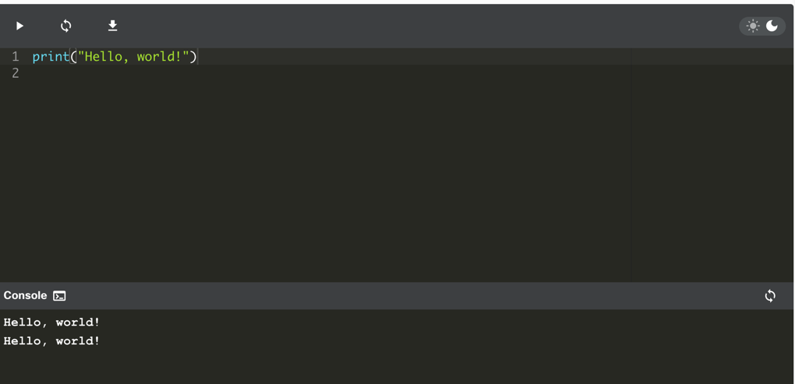
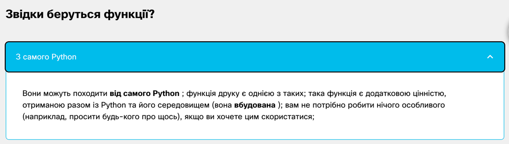
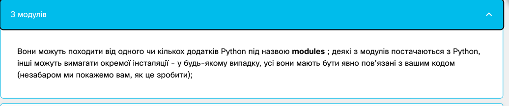
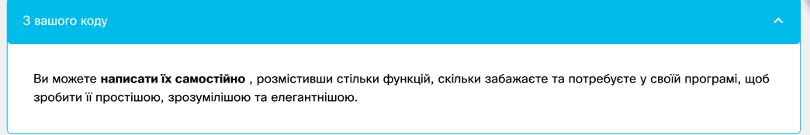

2.1. Розділ 1 – "Hello, World!" програма
2.1.1 Ваша перша програма
Настав час почати писати справжній робочий код Python . Поки що це буде дуже просто.

Оскільки ми збираємося показати вам деякі фундаментальні концепції та терміни, ці фрагменти коду не будуть такими серйозними чи складними.

Запустіть код у вікні редактора. Якщо тут все буде добре, ви побачите рядок тексту у вікні консолі.

Крім того, запустіть IDLE, створіть новий вихідний файл Python, заповніть його цим кодом, назвіть файл і збережіть його. Тепер запустіть його. Якщо все піде добре, ви побачите текст у лапках у вікні консолі IDLE. Код, який ви запустили, має виглядати знайомим. Ви побачили щось дуже схоже, коли ми проводили вас через налаштування середовища IDLE.


Зараз ми витратимо деякий час на те, щоб показати і пояснити вам, що ви насправді бачите і чому це виглядає саме так.

Як бачите, перша програма складається з наступних частин:

слово print;
відкриваюча дужка;
лапка;
рядок тексту: Hello, World!;
інша лапка;
закриваюча дужка.
Кожне з перерахованого вище відіграє дуже важливу роль у коді.

2.1.2 Функція print().
Подивіться на рядок коду нижче:

```print("Hello, World!")```

Слово print , яке ви можете побачити тут, є назвою функції . Це не означає, що де б не з’явилося слово, це завжди назва функції. Значення слова походить від контексту, у якому це слово було використано.

Ви, мабуть, неодноразово зустрічали термін функція на уроках математики. Ймовірно, ви також можете перелічити кілька назв математичних функцій, наприклад синус або логарифм.

Проте функції Python є більш гнучкими та можуть містити більше вмісту, ніж їхні математичні побратими.

Функція (у цьому контексті) — це окрема частина комп’ютерного коду, здатна:

викликати певний ефект (наприклад, надіслати текст на термінал, створити файл, намалювати зображення, відтворити звук тощо); це щось зовсім нечуване у світі математики;
обчислювати значення (наприклад, квадратний корінь із значення або довжину заданого тексту) і повертати його як результат функції ; це те, що робить функції Python родичами математичних понять.
Крім того, багато функцій Python можуть виконувати дві вищевказані речі разом.




Ім'я функції має бути значущим (ім'я функції друку зрозуміле саме собою).

Звичайно, якщо ви збираєтеся використовувати будь-яку вже існуючу функцію, ви не маєте впливу на її назву, але коли ви починаєте писати свої власні функції, вам слід уважно поставитися до вибору імен.

2.1.3 Аргументи функції
Як ми вже говорили раніше, функція може мати:

ефект ;

результат .

Є ще третя, дуже важлива, функціональна складова – аргумент (и).

Математичні функції зазвичай приймають один аргумент. Наприклад, sin(x) приймає x, який є мірою кута.

Функції Python, з іншого боку, більш універсальні. Залежно від індивідуальних потреб, вони можуть прийняти будь-яку кількість аргументів – стільки, скільки необхідно для виконання своїх завдань. Примітка. Коли ми говоримо будь-яке число , яке включає нуль, деякі функції Python не потребують аргументів.

```print("Hello, World!")```

Незважаючи на кількість необхідних/наданих аргументів, функції Python настійно вимагають наявності пари круглих дужок – відкриваючої та закриваючої, відповідно.

Якщо ви хочете передати функції один або кілька аргументів, ви розміщуєте їх у круглих дужках . Якщо ви збираєтеся використовувати функцію, яка не приймає жодних аргументів, вам все одно потрібно мати дужки.

Примітка: щоб відрізнити звичайні слова від імен функцій, помістіть пару порожніх дужок після їхніх імен, навіть якщо відповідна функція потребує одного або кількох аргументів. Це стандартна домовленість.

Функція, про яку ми тут говоримо, це print().

Чи print()має функція в нашому прикладі аргументи?

Звичайно, так, але які вони?
Рядок як аргумент функції print().
Єдиним аргументом, що надається функції print()в цьому прикладі, є рядок :

print("Hello, World!")

Як бачите, рядок розділено лапками – насправді лапки утворюють рядок – вони вирізають частину коду та присвоюють йому інше значення.

Ви можете собі уявити, що цитати говорять щось на зразок: текст між нами не є кодом. Він не призначений для виконання, і ви повинні сприймати його як є.

Майже все, що ви поміщаєте в лапки, сприйматиметься буквально, не як код, а як дані . Спробуйте пограти з цим конкретним рядком – змініть його, введіть новий вміст, видаліть частину наявного вмісту.

Існує більше одного способу вказати рядок у коді Python, але наразі цього достатньо.

Наразі ви дізналися про дві важливі частини коду: функцію та рядок. Ми говорили про них з точки зору синтаксису, але тепер настав час обговорити їх з точки зору семантики.
2.1.4 Виклик функції
Ім’я функції ( у цьому випадку друкується ) разом із дужками й аргументом(ами) формує виклик функції .


```print("Hello, World!")```
 
Незабаром ми обговоримо це докладніше, але давайте просто проллємо трохи світла прямо зараз.

Що відбувається, коли Python стикається з таким викликом, як наведений нижче?
```function_name(argument)```
Давайте подивимося:

Спочатку Python перевіряє, чи вказана назва є законною (він переглядає свої внутрішні дані, щоб знайти існуючу функцію імені; якщо цей пошук не вдається, Python перериває код)
по-друге, Python перевіряє, чи вимоги функції щодо кількості аргументів дозволяють вам викликати функцію таким чином (наприклад, якщо певна функція вимагає рівно два аргументи, будь-який виклик, який надає лише один аргумент, вважатиметься помилковим і призведе до переривання коду виконання)
по-третє, Python на мить залишає ваш код і переходить до функції, яку ви хочете викликати; звичайно, він також приймає ваш аргумент(и) і передає його/їх у функцію;
по-четверте, функція виконує свій код , викликає бажаний ефект (якщо такий є), оцінює бажаний результат(и) (якщо такий є) і завершує своє завдання;
нарешті, Python повертається до вашого коду (на місце одразу після виклику) і відновлює його виконання.


2.1.6 Функція print() та її ефект, аргументи та значення, що повертаються
Треба якнайшвидше відповісти на три важливі питання:

1. Який ефект робить print() причина функції?

Ефект дуже корисний і дуже ефектний. Функція:

- приймає свої аргументи (він може приймати більше ніж один аргумент, а також може приймати менше одного аргументу)
- перетворює їх у зрозумілу людині форму, якщо це необхідно (як ви можете підозрювати, рядки не потребують цієї дії, оскільки рядок уже читається)
і відправляє отримані дані на пристрій виведення (зазвичай на консоль); іншими словами, все, що ви вкладаєте вдрукувати()на екрані з’явиться функція.
Тож не дивно, що відтепер ви будете використовувати print() дуже інтенсивно, щоб побачити результати ваших операцій і оцінок.

2. Які аргументи робить print() очікувати?

Будь-який. Ми скоро вам це покажемо print() може працювати практично з усіма типами даних, які пропонує Python. Рядки, числа, символи, логічні значення, об’єкти ‒ будь-який із них можна успішно передатидрукувати().

3. Яке значення має друкувати() повернення функції?

Жодного. Його ефекту достатньо.

