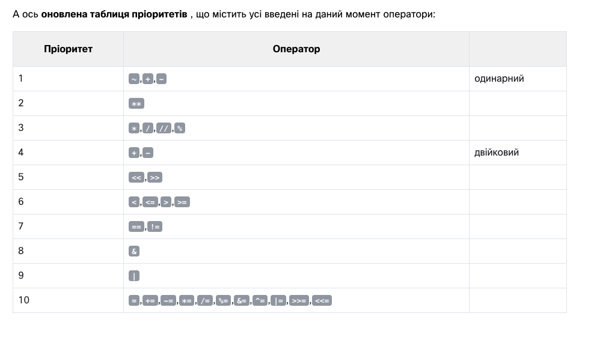

3.1. Section 1 – Making decisions in Python
Ласкаво просимо до третього модуля! У першому розділі ми дізнаємося про умовні оператори та як їх використовувати для прийняття рішень у Python.
3.1.1 Запитання та відповіді

Програміст пише програму, а програма задає запитання .

Комп'ютер виконує програму і дає відповіді . Програма повинна вміти реагувати відповідно до отриманих відповідей .

На щастя, комп’ютери знають лише два типи відповідей:

так, це правда;
ні, це неправда.
Ви ніколи не отримаєте відповідь на кшталт « Дайте мені подумати....» , «Я не знаю » або «Напевно так», але я не знаю напевно» .

Щоб ставити запитання, Python використовує набір дуже спеціальних операторів . Давайте переглянемо їх один за одним, проілюструвавши їх вплив на кількох простих прикладах.
3.1.2 Порівняння: оператор рівності
Запитання: чи рівні дві величини ?

Щоб поставити це запитання, ви використовуєте==(рівно рівно) оператор.

Не забувайте про цю важливу відмінність:

=є оператором присвоювання , наприклад, a = bприсвоює aзі значенням b;
==питання, чи рівні ці значення? тому a == b порівнює a і b.
Це бінарний оператор із лівостороннім зв’язуванням . Він потребує двох аргументів і перевіряє, чи вони рівні .
Лівостороннє та Правостороннє Зв'язування
Лівостороннє зв'язування (Left-Associative) означає, що операції виконуються зліва направо. Якщо кілька операторів з однаковим пріоритетом знаходяться поруч, вони обробляються зліва направо.

Правостороннє зв'язування (Right-Associative) означає, що операції виконуються справа наліво. Оператори з однаковим пріоритетом обробляються справа наліво.

Приклади Лівостороннього Зв'язування
Більшість операторів у Python мають лівостороннє зв'язування. Розглянемо приклад з оператором додавання:

python
Копіювати код
5 - 3 + 2
Тут операції будуть виконуватись зліва направо:

Спочатку виконується 5 - 3, результатом буде 2.
Потім виконується 2 + 2, результатом буде 4.
Тобто, вираз 5 - 3 + 2 інтерпретується як (5 - 3) + 2.

Приклади Правостороннього Зв'язування
Деякі оператори, такі як оператор присвоєння та оператор піднесення до степеня, мають правостороннє зв'язування. Розглянемо приклад з оператором піднесення до степеня:

python
Копіювати код
2 ** 3 ** 2
Тут операції будуть виконуватись справа наліво:

Спочатку виконується 3 ** 2, результатом буде 9.
Потім виконується 2 ** 9, результатом буде 512.
Тобто, вираз 2 ** 3 ** 2 інтерпретується як 2 ** (3 ** 2).

Лівостороннє Зв'язування в Операторах Присвоєння
Розглянемо приклад з операторами присвоєння:

python
Копіювати код
a = b = c = 1
Тут операції виконуються справа наліво:

Спочатку виконується c = 1.
Потім виконується b = c, де c вже має значення 1.
Нарешті, виконується a = b, де b вже має значення 1.
Таблиця Пріоритетів Операторів у Python
Для кращого розуміння, наведемо спрощену таблицю пріоритетів операторів у Python з урахуванням зв'язування:

Оператор	Опис	Пріоритет	Зв'язування
**	Піднесення до степеня	Високий	Правостороннє
*, /, //, %	Множення, ділення, модуль	Середній	Лівостороннє
+, -	Додавання, віднімання	Середній	Лівостороннє
<<, >>	Зсув	Середній	Лівостороннє
<, <=, >, >=	Порівняння	Низький	Лівостороннє
==, !=	Рівність, нерівність	Низький	Лівостороннє
=	Присвоєння	Низький	Правостороннє
+=, -=, *=, /=, **=	Присвоєння з операцією	Низький	Правостороннє
Висновок
Лівостороннє зв'язування означає, що операції виконуються зліва направо. Приклад: 5 - 3 + 2.
Правостороннє зв'язування означає, що операції виконуються справа наліво. Приклад: 2 ** 3 ** 2.
Знання про зв'язування операторів є важливим для розуміння та правильного використання виразів у Python, особливо коли вирази стають складними.

3.1.3 Вправи
А тепер задамо кілька запитань. Спробуйте вгадати відповіді.

Питання №1 : Який результат наступного порівняння?

2 == 2

Перевірте
Правда- звичайно, 2 дорівнює 2. Python відповістьПравда(запам'ятайте цю пару попередньо визначених літералів,Правдаіпомилковий- це також ключові слова Python).

Запитання №2 : Який результат наступного порівняння?

2 == 2.

Перевірте
Це питання не таке просте, як перше. На щастя, Python може перетворити ціле число в його дійсний еквівалент, і, отже, відповідь така:Правда.

Запитання №3 : Який результат наступного порівняння?

1 == 2

Перевірте
Це повинно бути легко. Відповідь буде (вірніше, завжди)помилковий.

3.1.4 Оператори
Рівність: оператор дорівнює ( == )
The==Оператор (дорівнює) порівнює значення двох операндів. Якщо вони рівні, результат порівняння єПравда. Якщо вони не рівні, результат порівняння єпомилковий.

Подивіться на порівняння рівності нижче – який результат цієї операції?

var == 0
 
Зауважте, що ми не можемо знайти відповідь, якщо не знаємо, яке значення наразі зберігається у зміннійвар.

Якщо змінна змінювалася багато разів під час виконання вашої програми або її початкове значення вводиться з консолі, відповідь на це питання може дати тільки Python і тільки під час виконання.

А тепер уявіть програміста, який страждає від безсоння, і йому доводиться окремо рахувати чорних і білих овець, якщо чорних овець рівно вдвічі більше, ніж білих.

Питання буде наступним:

black_sheep == 2 * white_sheep
 
Через низький пріоритет==оператор, питання розглядається як еквівалентне цьому:

black_sheep == (2 * white_sheep)
 
Отже, давайте попрактикуємося у вашому розумінні==оператор зараз – чи можете ви вгадати результат коду нижче?

play_arrow
sync
download
light_mode
dark_mode

Console 
terminal
sync
True
False
Запустіть код і перевірте, чи ви маєте рацію.

Нерівність: оператор не дорівнює ( != )
The!=Оператор (не дорівнює) також порівнює значення двох операндів. Ось різниця: якщо вони рівні, результат порівняння єПомилковий. Якщо вони не рівні, результат порівняння єПравда.

Тепер подивіться на порівняння нерівностей нижче – чи можете ви вгадати результат цієї операції?

var = 0  # Assigning 0 to var
print(var != 0)
 
var = 1  # Assigning 1 to var
print(var != 0)
 
Запустіть код і перевірте, чи ви маєте рацію.

Оператори порівняння: більше
Ви також можете задати порівняльне запитання за допомогою>(більше ніж) оператор.

Якщо ви хочете дізнатися, чи чорних овець більше, ніж білих, ви можете написати це так:

black_sheep > white_sheep  # Greater than
 
Правдапідтверджує це;помилковийзаперечує це.

Оператори порівняння: більше або дорівнює
Оператор більше має ще один спеціальний, нестрогий варіант, але він позначається інакше, ніж у класичній арифметичній нотації:>=(більше або дорівнює).

Є дві наступні ознаки, а не одна.

Обидва ці оператори (суворий і нестрогий), а також два інших, розглянуті в наступному розділі, є двійковими операторами з лівостороннім прив’язуванням , і їхній пріоритет більший, ніж показаний==і!=.

Якщо ми хочемо дізнатися, чи потрібно нам носити теплу шапку, ми задаємося наступним питанням:

centigrade_outside >= 0.0  # Greater than or equal to
 
Оператори порівняння: менше/менше або дорівнює
Як ви, напевно, вже здогадалися, у цьому випадку використовуються такі оператори: the<(менше) оператор і його нестрогий брат:<=(менше або дорівнює).

Подивіться на цей простий приклад:

current_velocity_mph < 85  # Less than
current_velocity_mph <= 85  # Less than or equal to
 
Перевіримо, чи є ризик бути оштрафованим ДАІ (перше питання суворе, друге – ні).

3.1.5 Використання відповідей
Що можна зробити з відповіддю (тобто результатом операції порівняння), отриманою з комп’ютера?

Є принаймні дві можливості: по-перше, ви можете запам’ятати його ( зберегти в змінній ) і використати пізніше. Як ти це робиш? Ну, ви використовуєте довільну змінну так:

answer = number_of_lions >= number_of_lionesses
 
Вміст змінної підкаже відповідь на поставлене запитання.

Другий варіант більш зручний і набагато поширеніший: ви можете використовувати отриману відповідь, щоб прийняти рішення про майбутнє програми .

Для цього потрібна спеціальна інструкція, і ми її обговоримо найближчим часом.

Тепер нам потрібно оновити нашу таблицю пріоритетів і додати в неї всі нові оператори. Тепер це виглядає так:

3.1.7 Умови та умовне виконання
Ви вже знаєте, як задавати питання Python, але все ще не знаєте, як розумно використовувати відповіді. Ви повинні мати механізм, який дозволить вам щось робити, якщо умова виконується, і не робити цього, якщо вона не виконана .

Це так само, як у реальному житті: ви робите певні речі або ні, коли певна умова виконується чи ні, наприклад, ви йдете гуляти, якщо погода гарна, або залишаєтеся вдома, якщо сиро й холодно.

Для прийняття таких рішень Python пропонує спеціальну інструкцію. Через свою природу та застосування її називають умовною інструкцією (або умовним оператором).

Існує кілька його варіантів. Ми почнемо з найпростішого, поступово збільшуючи складність.

Перша форма умовного висловлення, яку ви можете побачити нижче, написана дуже неформально, але образно:

if true_or_not:
    do_this_if_true
 
Цей умовний оператор складається з наступних, суворо необхідних, елементів лише в такому порядку:

вякщоключове слово;
один або кілька пробілів;
вираз (запитання чи відповідь), значення якого буде інтерпретовано виключно в термінахправда(коли його значення відмінне від нуля) іпомилковий(коли він дорівнює нулю);
двокрапка , після якої йде новий рядок;
інструкція з відступом або набір інструкцій (принаймні одна інструкція є обов’язковою); відступ може бути досягнутий двома способами – вставленням певної кількості пробілів (рекомендовано використовувати чотири пробіли відступу ) або за допомогою символу табуляції ; примітка: якщо в частині з відступом більше однієї вказівки, відступ повинен бути однаковим у всіх рядках; незважаючи на те, що це може виглядати однаково, якщо ви використовуєте табуляції з пробілами, важливо зробити всі відступи абсолютно однаковими – Python 3 не дозволяє змішувати пробіли та табуляції для відступів.
Як це твердження працює?

Якщоправда_чи_нівираз представляє істину (тобто його значення не дорівнює нулю), оператор(и) з відступом буде виконано ;
якщоправда_чи_нівираз не представляє істини (тобто його значення дорівнює нулю), оператор(и) з відступом буде пропущено (ігноровано), а наступна виконана інструкція буде тією, що буде наступною за початковим рівнем відступу.

У реальному житті ми часто висловлюємо бажання:

якщо буде гарна погода, підемо гуляти

тоді будемо обідати

Як бачите, обід не є умовним заняттям і не залежить від погоди.

Знаючи, які умови впливають на нашу поведінку, і припускаючи, що у нас є функції без параметріввийти на прогулянку()іобідати(), ми можемо написати такий фрагмент:

if the_weather_is_good:
    go_for_a_walk()
have_lunch()
 
Умовне виконання: оператор if
Якщо певний безсонний розробник Python засинає, коли він або вона нараховує 120 овець, то процедура викликання сну може бути реалізована як спеціальна функція під назвоюсон_і_мрія(), весь код має таку форму:

if sheep_counter >= 120: # Evaluate a test expression
    sleep_and_dream() # Execute if test expression is True
 
Ви можете прочитати це як: якщоsheep_counterбільше або дорівнює120, потім заснути і мріяти (тобто виконуватисон_і_мріяфункція.)

Ми вже говорили, що оператори, що виконуються умовно, мають мати відступ . Це створює дуже розбірливу структуру, яка чітко демонструє всі можливі шляхи виконання в коді.

Подивіться на наступний код:

if sheep_counter >= 120:
    make_a_bed()
    take_a_shower()
    sleep_and_dream()
feed_the_sheepdogs()
 
Як бачите, стелити ліжко, приймати душ, засинати і мріяти все виконується умовно – колиsheep_counterдосягає бажаної межі.

Однак годування вівчарок проводиться завжди (тобтоfeed_the_sheepdogs()функція не має відступу і не належить доякщоблок, що означає, що він завжди виконується.)

Тепер ми обговоримо інший варіант умовного оператора, який також дозволяє виконувати додаткову дію, коли умова не виконується.

Умовне виконання: оператор if-else
Ми почали з простої фрази: « Якщо буде хороша погода, ми підемо гуляти» .

Примітка: немає жодного слова про те, що буде, якщо погода погана. Знаємо лише, що на вулицю виходити не будемо, а чим би могли зайнятися, невідомо. Можливо, ми також захочемо щось спланувати на випадок поганої погоди.

Ми можемо сказати, наприклад: якщо хороша погода, ми підемо гуляти, інакше ми підемо в театр .

Тепер ми знаємо, що ми будемо робити, якщо умови будуть виконані , і ми знаємо, що ми будемо робити, якщо не все піде як слід . Іншими словами, у нас є «план Б».

Python дозволяє нам виражати такі альтернативні плани. Це робиться за допомогою другої, трохи складнішої форми умовного оператора, оператора if-else :

if true_or_false_condition:
    perform_if_condition_true
else:
    perform_if_condition_false
 
Таким чином, є нове слово:інше– це ключове слово .

Частина коду, яка починається зіншеговорить, що робити, якщо умова, зазначена дляякщоне зустрічається (зверніть увагу на двокрапку після слова).

Виконання if-else виглядає наступним чином:

якщо умова має значення True (її значення не дорівнює нулю), товиконати_якщо_умова_істинаоператор виконується, а умовний оператор закінчується;
якщо умова має значення False (вона дорівнює нулю), товиконати_якщо_умова_хибнаоператор виконується, і умовний оператор закінчується.
Інструкція if-else : більш умовне виконання
Використовуючи цю форму умовного твердження, ми можемо описати наші плани наступним чином:

if the_weather_is_good:
    go_for_a_walk()
else:
    go_to_a_theater()
have_lunch()
 
Якщо буде гарна погода, підемо гуляти. Інакше ми підемо в театр. Незалежно від того, хороша чи погана погода, ми обідаємо потім (після прогулянки або після походу в театр).

Усе, що ми сказали про відступи , працює так само всередині гілки else :

if the_weather_is_good:
    go_for_a_walk()
    have_fun()
else:
    go_to_a_theater()
    enjoy_the_movie()
have_lunch()
 
Вкладені оператори if-else
Тепер давайте обговоримо два особливих випадки умовного оператора.

Спочатку розглянемо випадок, коли вказівка ​​розміщена післяякщоє іншимякщо.

Читайте, що ми запланували на цю неділю. Якщо буде гарна погода, підемо гуляти. Якщо ми знайдемо хороший ресторан, ми там пообідаємо. Інакше з’їмо бутерброд. Якщо погода погана, ми підемо в театр. Якщо квитків немає, підемо за покупками в найближчий торговий центр.

Напишемо те саме на Python. Уважно розгляньте код тут:

if the_weather_is_good:
    if nice_restaurant_is_found:
        have_lunch()
    else:
        eat_a_sandwich()
else:
    if tickets_are_available:
        go_to_the_theater()
    else:
        go_shopping()
Ось два важливі моменти:

це використанняякщооператор відомий як вкладення ; пам'ятайте, що коженіншевідноситься доякщоякий лежить на одному рівні відступу ; вам потрібно це знати, щоб визначити, як поєднуються if і else s;
подумайте про те, як відступ покращує читабельність і робить код легшим для розуміння та відстеження.
Заява elif​
Другий окремий випадок представляє ще одне нове ключове слово Python: elif . Як ви, напевно, підозрюєте, це коротша форма else if .

elifвикористовується для перевірки більш ніж однієї умови та для зупинки , коли знайдено перше твердження, яке є істинним.

Наш наступний приклад нагадує вкладення, але подібності дуже незначні. Знову ж таки, ми змінимо свої плани і висловимо їх так: якщо погода хороша, ми підемо гуляти, інакше, якщо отримаємо квитки, ми підемо в театр, інакше, якщо є вільні столики в ресторан, підемо обідати; якщо нічого не допоможе, ми залишимося вдома і пограємо в шахи.

Ви помітили, скільки разів ми використали слово інакше ? Це етап, на якомуelifключове слово відіграє свою роль.

Давайте напишемо той самий сценарій за допомогою Python:

if the_weather_is_good:
    go_for_a_walk()
elif tickets_are_available:
    go_to_the_theater()
elif table_is_available:
    go_for_lunch()
else:
    play_chess_at_home()
 
Спосіб складання наступних операторів if-elif-else іноді називають каскадом .

Зверніть увагу ще раз, як відступи покращують читабельність коду.

У цьому випадку слід приділити деяку додаткову увагу:

ви не повинні використовуватиіншебез попередньогоякщо;
іншезавжди є останньою гілкою каскаду , незалежно від того, чи використовували виelifчи ні;
іншеє необов'язковою частиною каскаду, і її можна опустити;
якщо єіншегілка в каскаді, виконується тільки одна з усіх гілок;
якщо немаєіншегілка, можливо, жодна з доступних гілок не виконується.
Це може здатися трохи дивним, але, сподіваюся, кілька простих прикладів допоможуть пролити більше світла.

3.1.8 Аналіз зразків коду
Зараз ми покажемо вам кілька простих, але повних програм. Ми не пояснюватимемо їх докладно, оскільки вважаємо коментарі (і назви змінних) усередині коду достатніми посібниками.

Усі програми вирішують одну й ту саму задачу – знаходять найбільше з кількох чисел і виводять його на друк .

приклад 1:

Ми почнемо з найпростішого випадку – як визначити більше з двох чисел :

# Read two numbers
number1 = int(input("Enter the first number: "))
number2 = int(input("Enter the second number: "))
 
# Choose the larger number
if number1 > number2:
    larger_number = number1
else:
    larger_number = number2
 
# Print the result
print("The larger number is:", larger_number)
 
Наведений вище фрагмент має бути зрозумілим – він читає два цілих значення, порівнює їх і знаходить, яке з них більше.

приклад 2:

Зараз ми покажемо вам один цікавий факт. У Python є цікава функція – подивіться на код нижче:

# Read two numbers
number1 = int(input("Enter the first number: "))
number2 = int(input("Enter the second number: "))
 
# Choose the larger number
if number1 > number2: larger_number = number1
else: larger_number = number2
 
# Print the result
print("The larger number is:", larger_number)
 
Примітка: якщо будь-яка з гілок if-elif-else містить лише одну інструкцію, ви можете закодувати її в більш вичерпній формі (вам не потрібно робити відступ після ключового слова, а просто продовжити рядок після двокрапки) .

Однак цей стиль може вводити в оману, і ми не збираємося використовувати його в наших майбутніх програмах, але це точно варто знати, якщо ви хочете читати та розуміти чиїсь програми.

Інших відмінностей в коді немає.

приклад 3:

Настав час ускладнити код – давайте знайдемо найбільше з трьох чисел. Чи збільшить це код? Трохи.

Вважаємо, що перше значення найбільше. Потім ми перевіряємо цю гіпотезу двома значеннями, що залишилися.

Подивіться на код нижче:

# Read three numbers
number1 = int(input("Enter the first number: "))
number2 = int(input("Enter the second number: "))
number3 = int(input("Enter the third number: "))
 
# We temporarily assume that the first number
# is the largest one.
# We will verify this soon.
largest_number = number1
 
# We check if the second number is larger than the current largest_number
# and update the largest_number if needed.
if number2 > largest_number:
    largest_number = number2
 
# We check if the third number is larger than the current largest_number
# and update the largest_number if needed.
if number3 > largest_number:
    largest_number = number3
 
# Print the result
print("The largest number is:", largest_number)
 
Цей метод значно простіший, ніж спроба знайти найбільше число відразу шляхом порівняння всіх можливих пар чисел (тобто перше з другим, друге з третім, третє з першим). Спробуйте перебудувати код для себе.

play_arrow
синхронізація
завантажити
light_mode
темний_режим
Консоль 
термінал
синхронізація

3.1.13 РЕЗЮМЕ РОЗДІЛУ
1. Оператори порівняння (інакше відомі як реляційні ) використовуються для порівняння значень. У наведеній нижче таблиці показано, як працюють оператори порівняння, припускаючи, що x = 0, y = 1та z = 0:

2. Якщо ви хочете виконати певний код лише за умови виконання певної умови, ви можете використати умовний оператор :

Одинокийякщозаява, наприклад:

x = 10
 
if x == 10: # condition
    print("x is equal to 10")  # Executed if the condition is True.
 
серіяякщозаяви, наприклад:

x = 10
 
if x > 5: # condition one
    print("x is greater than 5")  # Executed if condition one is True.
 
if x < 10: # condition two
    print("x is less than 10")  # Executed if condition two is True.
 
if x == 10: # condition three
    print("x is equal to 10")  # Executed if condition three is True.
 
    Коженякщотвердження перевіряється окремо.

анякщо-інакшезаява, наприклад:

x = 10
 
if x < 10: # condition
    print("x is less than 10")  # Executed if the condition is True.
 
else:
    print("x is greater than or equal to 10")  # Executed if the condition is False.
 
серіяякщозаяви, за якими йде anінше, наприклад:

x = 10
 
if x > 5: # condition one
    print("x is greater than 5")  # Executed if condition one is True.
 
if x < 10: # condition two
    print("x is less than 10")  # Executed if condition two is True.
 
if x == 10: # condition three
     print("x is equal to 10")  # Executed if condition three is True.
 
    Коженякщотестується окремо. Тілоіншевиконується, якщо останнійякщоєпомилковий.

Theякщо-еліф-іншезаява, наприклад:

x = 10
 
if x == 10: # True
    print("x == 10")
 
if x > 15: # False
    print("x > 15")
 
elif x > 10: # False
    print("x > 10")
 
elif x > 5: # True
    print("x > 5")
 
else:
    print("else will not be executed")
 
    Якщо умова дляякщоєпомилковий, програма перевіряє умови подальшогоelifблоки - першelifблок, тобтоправдавиконується. Якщо всі умови єпомилковий,іншеблок буде виконано.

Вкладені умовні оператори, наприклад:

x = 10
 
if x > 5: # True
    if x == 6: # False
        print("nested: x == 6")
    elif x == 10: # True
        print("nested: x == 10")
    else:
        print("nested: else")
else:
    print("else")
 

3.2. Section 2 – Loops in Python

3.2.1 Зациклення вашого коду за допомогою while

Чи згодні ви з поданим нижче твердженням?

while there is something to do
    do it
 
Зауважте, що цей запис також заявляє, що якщо нічого не робити, нічого не станеться.

Загалом, у Python цикл можна представити так:

while
    instruction
 
Якщо ви помітили деякі схожості з інструкцією if , це цілком нормально. Дійсно, синтаксична різниця лише в одному: ви використовуєте словопокизамість словаякщо.

Семантична різниця більш важлива: коли умова виконується, if виконує свої оператори лише один раз ; while повторює виконання до тих пір, поки умова оцінюється якправда.

Примітка: тут також застосовуються всі правила щодо відступів . Незабаром ми вам це покажемо.

Подивіться на алгоритм нижче:

while conditional_expression:
    instruction_one
    instruction_two
    instruction_three
    :
    :
    instruction_n
 
Тепер важливо пам’ятати, що:

якщо ви хочете виконати більше одного оператора в одномупокиloop , ви повинні (як зякщо) однакові відступи для всіх інструкцій;
інструкція або набір інструкцій, які виконуються всерединіпокицикл називається тілом циклу ;
якщо умова єпомилковий(дорівнює нулю) як тільки воно тестується вперше, тіло не виконується жодного разу (зверніть увагу на аналогію, коли нічого не потрібно робити, якщо нічого робити);
тіло повинно мати можливість змінити значення умови, оскільки якщо умова єправдана початку тіло може працювати безперервно до нескінченності – зауважте, що виконання певної справи зазвичай зменшує кількість справ, які потрібно зробити).
3.2.2 Нескінченний цикл
Нескінченний цикл, також званий нескінченним циклом , — це послідовність інструкцій у програмі, які повторюються нескінченно (нескінченно).

Ось приклад циклу, який не може завершити своє виконання:

while True:
    print("I'm stuck inside a loop.")
 
Цей цикл друкуватиме нескінченно«Я застряг у петлі».на екрані.

  Примітка  
Якщо ви хочете отримати найкращий досвід навчання, спостерігаючи, як поводиться нескінченний цикл, запустіть IDLE, створіть новий файл, скопіюйте та вставте наведений вище код, збережіть свій файл і запустіть програму. Ви побачите нескінченну послідовність«Я застряг у петлі».рядки, надруковані у вікні консолі Python. Щоб завершити програму, просто натисніть Ctrl-C (або Ctrl-Break на деяких комп’ютерах). Це спричинить aKeyboardInterruptі дозвольте вашій програмі вийти з циклу. Ми поговоримо про це пізніше в курсі.

Давайте повернемося до ескізу алгоритму, який ми вам нещодавно показали. Ми збираємося показати вам, як використовувати цей нещодавно вивчений цикл, щоб знайти найбільше число з великого набору введених даних.

Уважно проаналізуйте програму. Подивіться, де починається цикл (рядок 8). Знайдіть тіло циклу та дізнайтеся, як з нього виходить :

# Store the current largest number here.
largest_number = -999999999
 
# Input the first value.
number = int(input("Enter a number or type -1 to stop: "))
 
# If the number is not equal to -1, continue.
while number != -1:
    # Is number larger than largest_number?
    if number > largest_number:
        # Yes, update largest_number.
        largest_number = number
    # Input the next number.
    number = int(input("Enter a number or type -1 to stop: "))
 
# Print the largest number.
print("The largest number is:", largest_number)
 
Перевірте, як цей код реалізує алгоритм, який ми показали вам раніше.

3.2.3 Цикл while : більше прикладів
Давайте розглянемо інший приклад використанняпокипетля. Слідкуйте за коментарями, щоб дізнатися ідею та рішення.

# A program that reads a sequence of numbers
# and counts how many numbers are even and how many are odd.
# The program terminates when zero is entered.
 
odd_numbers = 0
even_numbers = 0
 
# Read the first number.
number = int(input("Enter a number or type 0 to stop: "))
 
# 0 terminates execution.
while number != 0:
    # Check if the number is odd.
    if number % 2 == 1:
        # Increase the odd_numbers counter.
        odd_numbers += 1
    else:
        # Increase the even_numbers counter.
        even_numbers += 1
    # Read the next number.
    number = int(input("Enter a number or type 0 to stop: "))
 
# Print results.
print("Odd numbers count:", odd_numbers)
print("Even numbers count:", even_numbers)
 
Деякі вирази можна спростити, не змінюючи поведінку програми.

Спробуйте пригадати, як Python інтерпретує істинність умови, і зауважте, що ці дві форми еквівалентні:

а число != 0:іа число:.

Умову, яка перевіряє, чи є число непарним, також можна закодувати в цих еквівалентних формах:

якщо число % 2 == 1:іякщо число % 2:.

Використання змінної лічильника для виходу з циклу
Подивіться на фрагмент нижче:

counter = 5
while counter != 0:
    print("Inside the loop.", counter)
    counter -= 1
print("Outside the loop.", counter)
 
Цей код призначений для друку рядка«Всередині петлі».і значення, що зберігається влічильникзмінна протягом певного циклу рівно п’ять разів. Якщо умова не виконана (лічильникзмінна досягла0), цикл вийшов, і повідомлення«Поза петлею».а також значення, що зберігається влічильникдрукується.

Але є одне, що можна написати стисло – це станпокипетля.

Ви бачите різницю?

counter = 5
while counter:
    print("Inside the loop.", counter)
    counter -= 1
print("Outside the loop.", counter)
 
Він більш компактний, ніж раніше? Трохи. Це більш розбірливо? Це спірно.

  ПАМ'ЯТАЙТЕ  
Не вважайте себе зобов’язаним кодувати свої програми так, щоб вони завжди були найкоротшими та найкомпактнішими. Читабельність може бути більш важливим фактором. Тримайте свій код напоготові для нового програміста.

3.2.5 Зациклення коду за допомогою for
Інший тип циклу, доступний у Python, походить із спостереження, що іноді важливіше підрахувати «обороти» циклу, ніж перевіряти умови.

Уявіть, що тіло циклу потрібно виконати рівно сто разів. Якщо ви хочете використовуватипокицикл, щоб це зробити, це може виглядати так:

i = 0
while i < 100:
    # do_something()
    i += 1
 
Було б чудово, якби хтось міг зробити цей нудний підрахунок за вас. Чи це можливо?

Звичайно, є спеціальний цикл для таких завдань, і він називаєтьсядля.

Насправді,дляцикл призначений для виконання більш складних завдань – він може «переглядати» великі колекції даних по елементах . Незабаром ми покажемо вам, як це зробити, а зараз ми представимо більш простий варіант його застосування.

Подивіться на фрагмент:

for i in range(100):
    # do_something()
    pass
 
Є деякі нові елементи. Розповімо вам про них:

ключове слово for відкриваєдляпетля; примітка – після неї немає умови; вам не потрібно думати про умови, оскільки вони перевіряються внутрішньо, без стороннього втручання;
будь-яка змінна після ключового слова for є керуючою змінною циклу; він підраховує оберти петлі, і робить це автоматично;
ключове слово in вводить елемент синтаксису, що описує діапазон можливих значень, що призначаються керуючій змінній;
вдіапазон()функція (це дуже особлива функція) відповідає за генерування всіх бажаних значень керуючої змінної; у нашому прикладі функція створить (можна навіть сказати, що заповнить цикл ) наступні значення з наступного набору: 0, 1, 2 .. 97, 98, 99; Примітка: у цьому випадку,діапазон()функція починає свою роботу з 0 і закінчує її за крок (одне ціле число) до значення свого аргументу;
зверніть увагу на ключове слово pass всередині тіла циклу – воно взагалі нічого не робить; це порожня інструкція – ми розмістили її тут, тому щодлясинтаксис циклу вимагає принаймні однієї інструкції всередині тіла (до речі –якщо,elif,іншеіпокивисловити те саме)
Наші наступні приклади будуть трохи скромнішими за кількістю повторів циклу.

Подивіться на фрагмент нижче. Чи можете ви передбачити його вихід?

play_arrow
sync
download
light_mode
dark_mode
Console 
terminal
sync
Запустіть код, щоб перевірити, чи ви мали рацію.

Примітка:

цикл було виконано десять разів (цедіапазон()аргумент функції)
останнє значення контрольної змінної9(ні10, як це починається з0, а не з1)
Theдіапазон()виклик функції може мати два аргументи, а не один:

for i in range(2, 8):
    print("The value of i is currently", i)
 
У цьому випадку перший аргумент визначає початкове (перше) значення керуючої змінної.

Останній аргумент показує перше значення, яке не буде присвоєно керуючій змінній.

Примітка:діапазон()функція приймає лише цілі числа як аргументи та генерує послідовності цілих чисел.

Чи можете ви вгадати результат програми? Запустіть його, щоб перевірити, чи ви були правильні зараз.

Перше показано значення2(взято здіапазон()перший аргумент.)

Останнє є7(хочадіапазон()другий аргумент8).

3.2.6 Докладніше про цикл for і функцію range() із трьома аргументами
Theдіапазон()функція також може приймати три аргументи – подивіться на код у редакторі.

play_arrow
sync
download
light_mode
dark_mode
Console 
terminal
sync
Третій аргумент — приріст — це значення, яке додається для керування змінною при кожному повороті циклу (як ви можете підозрювати, значення за замовчуванням приросту дорівнює 1 ).

Чи можете ви сказати нам, скільки рядків з’явиться в консолі та які значення вони будуть містити?

Запустіть програму, щоб дізнатися, чи ви праві.

Ви повинні побачити такі рядки у вікні консолі:
The value of i is currently 2
The value of i is currently 5
Вихід
Ти знаєш чому? Перший аргумент перейшов додіапазон()функція повідомляє нам, що таке початковий номер послідовності (отже2на виході). Другий аргумент повідомляє функції, де зупинити послідовність (функція генерує числа до числа, зазначеного другим аргументом, але не включає його). Нарешті, третій аргумент вказує на крок , який насправді означає різницю між кожним числом у послідовності чисел, згенерованих функцією.

2(стартовий номер) →5(2збільшити на 3 рівних5– число в діапазоні від 2 до 8) →8(5збільшити на 3 рівних8– число не входить у діапазон від 2 до 8, оскільки параметр stop не входить до послідовності чисел, згенерованих функцією.)

Примітка: якщо набір, створений за допомогоюдіапазон()функція порожня, цикл взагалі не виконуватиме своє тіло.

Так само як тут – виводу не буде:

for i in range(1, 1):
    print("The value of i is currently", i)
 
Примітка: набір, створений за допомогоюдіапазон()потрібно відсортувати в порядку зростання . Немає способу змуситидіапазон()щоб створити набір в іншій формі, колидіапазон()функція приймає рівно два аргументи. Це означає, щодіапазон()другий аргумент має бути більшим за перший.

Таким чином, тут також не буде виводу:

for i in range(2, 1):
    print("The value of i is currently", i)
 
Давайте подивимося на коротку програму, завдання якої — написати кілька перших ступенів двійки:

play_arrow
sync
download
light_mode
dark_mode
Console 
terminal
sync
Theекспозмінна використовується як керуюча змінна для циклу та вказує на поточне значення експоненти . Саме піднесення до степеня замінюється множенням на два. Оскільки 2 0 дорівнює 1, то 2 × 1 дорівнює 2 1 , 2 × 2 1 дорівнює 2 2 і так далі. Який найбільший показник степеня, для якого наша програма все ще друкує результат?

Запустіть код і перевірте, чи результат відповідає вашим очікуванням.

3.2.8 Оператори break і continue
Досі ми розглядали тіло циклу як неподільну та нерозривну послідовність інструкцій, які повністю виконуються на кожному повороті циклу. Однак, як розробник, ви можете зіткнутися з такими виборами:

здається, що немає необхідності продовжувати цикл в цілому; слід утриматися від подальшого виконання тіла циклу і піти далі;
виявляється, що вам потрібно почати наступний хід циклу, не завершуючи виконання поточного.
Python надає дві спеціальні інструкції для реалізації обох цих завдань. Скажімо для точності, що їх існування в мові не є обов’язковим – досвідчений програміст здатний закодувати будь-який алгоритм без цих інструкцій. Такі доповнення, які не покращують виразну силу мови, а лише спрощують роботу розробника, іноді називають синтаксичною цукеркою або синтаксичним цукром.

Ці дві інструкції:

перерва– негайно виходить із циклу та безумовно завершує роботу циклу; програма починає виконувати найближчу інструкцію після тіла циклу;
продовжувати– поводиться так, ніби програма раптово досягла кінця тіла; починається наступний хід і негайно перевіряється вираз умови.
Обидва ці слова є ключовими .

Зараз ми покажемо вам два простих приклади, щоб проілюструвати, як працюють дві інструкції. Подивіться на код у редакторі. Запустіть програму та проаналізуйте результат. Змініть код і експериментуйте.

play_arrow
синхронізація
завантажити
light_mode
темний_режим
# break - example

Консоль 
термінал
синхронізація
Інструкції break і continue : більше прикладів
Повернемося до нашої програми, яка розпізнає найбільше серед введених чисел. Ми перетворимо його двічі, використовуючиперерваіпродовжуватиінструкції.

Проаналізуйте код і вирішіть, чи будете ви використовувати будь-який із них і як.

Theперерваваріант йде тут:

play_arrow
синхронізація
завантажити
light_mode
темний_режим
Консоль 
термінал
синхронізація
Запустіть, перевірте та експериментуйте з ним.

А теперпродовжувативаріант:

play_arrow
синхронізація
завантажити
light_mode
темний_режим
Консоль 
термінал
синхронізація
Подивіться уважно, користувач вводить перше число перед тим, як програма введепокипетля. Наступне число вводиться, коли програма вже знаходиться в циклі .

Знову ж таки – запустіть програму, протестуйте її та експериментуйте з нею.

3.2.12 The while loop and the else branch
Обидві петлі,покиідля, мають одну цікаву (і рідко використовувану) особливість.

Ми покажемо вам, як це працює – спробуйте самі оцінити, чи можна ним користуватися та чи можете ви жити без нього чи ні.

Іншими словами, спробуйте переконати себе, чи функція є цінною та корисною, чи це просто синтаксичний цукор.

Подивіться на фрагмент у редакторі. Наприкінці є щось дивне –іншеключове слово.

Як ви могли підозрювати, петлі можуть матиіншегілка теж, якякщоs .

Петляіншегілка завжди виконується один раз, незалежно від того, увійшов цикл у її тіло чи ні .

Чи можете ви вгадати результат? Запустіть програму, щоб перевірити, чи ви мали рацію.

play_arrow
синхронізація
завантажити
light_mode
темний_режим
Консоль 
термінал
синхронізація
Трохи змініть фрагмент, щоб цикл не мав жодного шансу виконати своє тіло навіть один раз:

play_arrow
синхронізація
завантажити
light_mode
темний_режим
Консоль 
термінал
синхронізація
Theпокистан єпомилковийна початку – бачиш?

Запустіть і протестуйте програму та перевірте, чи єіншегілка була виконана чи ні.

3.2.16 РЕЗЮМЕ РОЗДІЛУ
1. У Python існує два типи циклів:покиідля:

впокицикл виконує інструкцію або набір інструкцій до тих пір, поки вказана булева умова істинна, наприклад:

# Example 1
while True:
    print("Stuck in an infinite loop.")
 
# Example 2
counter = 5
while counter > 2:
    print(counter)
    counter -= 1
 
вдляцикл виконує набір операторів багато разів; він використовується для повторення послідовності (наприклад, списку, словника, кортежу або набору – ви дізнаєтесь про них незабаром) або інших ітерованих об’єктів (наприклад, рядків). Ви можете використовуватидляцикл для повторення послідовності чисел за допомогою вбудованогодіапазонфункція. Подивіться на приклади нижче:

# Example 1
word = "Python"
for letter in word:
    print(letter, end="*")
 
# Example 2
for i in range(1, 10):
    if i % 2 == 0:
        print(i)
 
2. Ви можете використовуватиперерваіпродовжуватиоператори для зміни потоку циклу:

Ти використовуєшперерващоб вийти з циклу, наприклад:

text = "OpenEDG Python Institute"
for letter in text:
    if letter == "P":
        break
    print(letter, end="")
 
Ти використовуєшпродовжуватищоб пропустити поточну ітерацію та продовжити наступну ітерацію, наприклад:

text = "pyxpyxpyx
for letter in text:
    if letter == "x":
        continue
    print(letter, end="")
 
3. Theпокиідляпетлі також можуть мати аніншепункт у Python. Theіншепункт виконується після завершення виконання циклу, доки його не було припиненоперерва, наприклад:

n = 0
 
while n != 3:
    print(n)
    n += 1
else:
    print(n, "else")
 
print()
 
for i in range(0, 3):
    print(i)
else:
    print(i, "else")
 
4. Theдіапазон()функція генерує послідовність чисел. Він приймає цілі числа та повертає об’єкти діапазону. Синтаксисдіапазон()виглядає наступним чином:діапазон (початок, зупинка, крок), де:

початокє необов'язковим параметром, який визначає початковий номер послідовності ( за умовчанням 0 )
СТІЙє необов'язковим параметром, що визначає кінець згенерованої послідовності (він не включений),
ікрокє необов’язковим параметром, який визначає різницю між числами в послідовності ( 1 за замовчуванням.)
Приклад коду:

for i in range(3):
    print(i, end=" ")  # Outputs: 0 1 2
 
for i in range(6, 1, -2):
    print(i, end=" ")  # Outputs: 6, 4, 2
 

3.3. Section 3 – Logic and bit operations in Python

3.3.1 Комп'ютерна логіка

Ви помітили, що умови, які ми використовували досі, були дуже простими, щоб не сказати, досить примітивними? Умови, які ми використовуємо в реальному житті, набагато складніші. Давайте подивимося на це речення:

Якщо у нас буде вільний час,іпогода хороша, підемо гуляти.

Ми використали сполучникі, а це означає, що вихід на прогулянку залежить від одночасного виконання цих двох умов. Мовою логіки такий зв'язок умов називається кон'юнкцією . А тепер інший приклад:

Якщо ви в торговому центріабоЯ в торговому центрі, хтось із нас купить мамі подарунок.

Поява словаабоозначає, що покупка залежить принаймні від однієї з цих умов. У логіці така сполука називається диз'юнкцією .

Зрозуміло, що Python повинен мати оператори для побудови кон’юнкції та диз’юнкції. Без них виражальна сила мови була б істотно ослаблена. Вони називаються логічними операторами .

Оператор and​
Одним з логічних операторів кон’юнкції в Python є слово and . Це бінарний оператор із пріоритетом, нижчим за той, який виражають оператори порівняння . Це дозволяє нам кодувати складні умови без використання таких дужок, як ця:

counter > 0 and value == 100
 
Результат, наданийіоператор можна визначити на основі таблиці істинності .

Якщо розглядати кон'юнкціюАіБмножина можливих значень аргументів і відповідних значень кон'юнкції виглядає наступним чином:

Оператор або​
Оператор диз'юнкції - це словоабо. Це бінарний оператор із нижчим пріоритетом ніжі(так як+у порівнянні з*). Його таблиця істинності виглядає наступним чином:

Оператор not​
Крім того, є ще один оператор, який можна застосувати до побудови умов. Це унарний оператор, який виконує логічне заперечення . Його дія проста: він перетворює правду на брехню, а брехню на правду.

Цей оператор записується як словоні, і його пріоритет дуже високий: такий самий, як і унарний+і-. Його таблиця істинності проста:

3.3.2 Логічні вирази
Давайте створимо змінну з назвоюварі призначити1до нього. Наступні умови попарно еквівалентні :

# Example 1:
print(var > 0)
print(not (var <= 0))
 
 
# Example 2:
print(var != 0)
print(not (var == 0))
 
Можливо, ви знайомі із законами Де Моргана. Вони кажуть, що:

Заперечення кон’юнкції — це диз’юнкція заперечень.

Заперечення диз'юнкції є сполученням заперечень.

Давайте напишемо те саме за допомогою Python:

not (p and q) == (not p) or (not q)
not (p or q) == (not p) and (not q)
 
Зверніть увагу на те, як дужки використовувалися для кодування виразів – ми розмістили їх там, щоб покращити читабельність.

Слід додати, що жоден із цих операторів із двома аргументами не можна використовувати у скороченій формі, відомій якop=. Цей виняток варто пам’ятати.

3.3.3 Логічні значення проти окремих бітів
Логічні оператори сприймають свої аргументи як єдине ціле незалежно від того, скільки бітів вони містять. Оператори знають лише значення: означає нуль (коли всі біти скинуто).помилковий; не нуль (якщо встановлено хоча б один біт) означаєправда.

Результатом їх діяльності є одне з таких значень:помилковийабоправда. Це означає, що цей фрагмент призначатиме значенняправдадоjзмінна ifiне дорівнює нулю; інакше будепомилковий.

i = 1
j = not not i
 
3.3.4 Порозрядні оператори
Однак є чотири оператори, які дозволяють маніпулювати окремими бітами даних . Вони називаються побітовими операторами .

Вони охоплюють усі операції, які ми згадували раніше в логічному контексті, і один додатковий оператор. Цеxor(як у виключному або ) операторі, і позначається як^(каретка).

Ось усі вони:

&(амперсанд) ‒ розрядний сполучник;
|(такт) ‒ порозрядна диз'юнкція;
~(тильда) ‒ порозрядне заперечення;
^(caret) ‒ порозрядне виключення або (xor).

Давайте зробимо це простіше:

&потрібно рівно два1s надавати1як результат;
|вимагає принаймні одного1забезпечувати1як результат;
^вимагає рівно один1забезпечувати1як результат.
Додамо важливе зауваження: аргументи цих операторів мають бути цілими ; ми не повинні використовувати поплавці тут.

Різниця в роботі логічних і бітових операторів важлива: логічні оператори не проникають на бітовий рівень свого аргументу . Їх цікавить лише кінцеве ціле число.

Побітові оператори суворіші: вони мають справу з кожним бітом окремо . Якщо ми припустимо, що ціла змінна займає 64 біти (що часто зустрічається в сучасних комп’ютерних системах), ви можете уявити собі порозрядну операцію як 64-кратну оцінку логічного оператора для кожної пари бітів аргументів. Ця аналогія, очевидно, недосконала, оскільки в реальному світі всі ці 64 операції виконуються одночасно (одночасно).

Логічні проти бітових операцій
Зараз ми покажемо вам приклад різниці в роботі між логічними та бітовими операціями. Припустимо, що виконано наступні завдання:

i = 15
j = 22
 
Якщо ми припустимо, що цілі числа зберігаються з 32 бітами, порозрядне зображення двох змінних буде таким:

i: 00000000000000000000000000001111
j: 00000000000000000000000000010110
Дається завдання:

log = i and j
 
Тут ми маємо справу з логічним сполученням. Простежимо хід розрахунків. Обидві змінніiіjне є нулями, тому буде вважатися таким, що представляєправда. Консультації з таблицею істинності дляіоператора, ми бачимо, що результат будеправда. Інші операції не виконуються.

log: True
Тепер порозрядна операція ‒ ось вона:

bit = i & j
 
The&оператор буде працювати з кожною парою відповідних бітів окремо, виробляючи значення відповідних бітів результату. Отже, результат буде таким:

Ці біти відповідають цілому числу шести.

Давайте тепер подивимося на оператори заперечення. Спочатку логічне:

logneg = not i
 
Thelognegбуде встановлено значення змінноїпомилковий‒ більше нічого робити не потрібно.

Порозрядне заперечення виглядає так:

bitneg = ~i
 
Це може бути трохи дивно:bitnegзначення змінної є-16. Це може здатися дивним, але зовсім не так. Якщо ви хочете дізнатися більше, вам слід ознайомитися з двійковою системою числення та правилами, що регулюють доповнення до двох чисел.

Кожен із цих операторів із двома аргументами можна використовувати у скороченій формі . Ось приклади їх еквівалентних позначень:

3.3.5 Як ми маємо справу з окремими бітами?
Зараз ми покажемо вам, для чого можна використовувати побітові оператори. Уявіть, що ви розробник, зобов’язаний написати важливу частину операційної системи. Вам повідомили, що вам дозволено використовувати змінну, призначену таким чином:

flag_register = 0x1234
 
Змінна зберігає інформацію про різні аспекти роботи системи. Кожен біт змінної зберігає одне значення так/ні . Вам також сказали, що тільки один із цих бітів є вашим – третій (пам’ятайте, що біти нумеруються від нуля, причому біт з номером нуль є молодшим, а старший – номером 31). Інші біти не можна змінювати, оскільки вони призначені для зберігання інших даних. Ось ваш біт, позначений літероюx:

flag_register = 0000000000000000000000000000x000
 
Ви можете зіткнутися з такими завданнями:

1. Перевірте стан свого біта ‒ ви хочете дізнатися значення свого біта; порівняння всієї змінної з нулем нічого не дасть, оскільки решта бітів можуть мати абсолютно непередбачувані значення, але ви можете використовувати наступну властивість кон’юнкції:

x & 1 = x
x & 0 = 0
 
Якщо ви застосовуєте&операція доflag_registerзмінна разом із таким бітовим зображенням:

00000000000000000000000000001000
(зверніть увагу на1у вашій позиції біта), як результат, ви отримаєте один із таких рядків бітів:

000000000000000000000000000001000якщо ваш біт було встановлено на1
000000000000000000000000000000000якщо ваш біт було скинуто на0
Така послідовність нулів і одиниць, завданням якої є захоплення значення або зміна вибраних бітів, називається бітовою маскою .

Давайте створимо бітову маску для визначення стану вашого біта. Він повинен вказувати на третій біт . Цей біт має вагу2 3 = 8. Відповідну маску можна створити за допомогою такої декларації:

the_mask = 8
 
Ви також можете створити послідовність інструкцій залежно від стану вашого біта. Ось:

if flag_register & the_mask:
    # My bit is set.
else:
    # My bit is reset.
 
2. Скиньте свій біт – ви присвоюєте нуль біту, а всі інші біти повинні залишатися незмінними; скористаємося тією ж властивістю кон’юнкції, що й раніше, але скористаємося дещо іншою маскою – точно так, як показано нижче:

11111111111111111111111111110111
 
Зверніть увагу, що маска була створена в результаті заперечення всіх бітівмасказмінна. Скидання біта просте і виглядає так (вибирайте той, який вам більше подобається):

flag_register = flag_register & ~the_mask
flag_register &= ~the_mask
 
3. Встановіть свій біт – ви призначаєте a1до вашого біта, тоді як всі інші біти повинні залишатися незмінними; використовуйте наступну властивість диз'юнкції:

x | 1 = 1
x | 0 = x
 
Тепер ви готові встановити свій біт за допомогою однієї з наведених нижче інструкцій:

flag_register = flag_register | the_mask
flag_register |= the_mask
 
4. Заперечуєте свій біт – ви замінюєте a1з0і а0з1. Можна використовувати цікаву властивістьxorоператор:

x ^ 1 = ~x
x ^ 0 = x
 
і заперечуйте свій біт за такими інструкціями:

flag_register = flag_register ^ the_mask
flag_register ^= the_mask
 
3.3.6 Двійковий зсув ліворуч і двійковий зсув праворуч
Python пропонує ще одну операцію, що стосується окремих бітів: shifting . Це застосовується лише до цілих значень, і ви не повинні використовувати числа з плаваючою точкою як аргументи для цього.

Ви вже застосовуєте цю операцію дуже часто і зовсім несвідомо. Як помножити будь-яке число на десять? Поглянь:

12345 × 10 = 123450

Як бачите, множення на десять – це фактично зсув усіх цифр вліво і заповнення отриманого пропуску нулем.

Ділення на десять? Поглянь:

12340 ÷ 10 = 1234

Ділення на десять - це не що інше, як зсув цифр вправо.

Комп’ютер виконує ту саму операцію, але з однією відмінністю: оскільки двійка є основою для двійкових чисел (а не 10), зсув значення на один біт ліворуч відповідає його множенню на два ; відповідно, зсув на один біт праворуч схожий на ділення на два (зауважте, що крайній правий біт втрачається).

Оператори зсуву в Python являють собою пару орграфів :<<і>>, чітко підказуючи, в якому напрямку буде діяти зсув.

value << bits
value >> bits
 
Лівим аргументом цих операторів є ціле число, біти якого зсунуті. Правильний аргумент визначає величину зсуву.

Це показує, що ця операція, звичайно, не є комутативною.

Пріоритет цих операторів дуже високий. Ви побачите їх в оновленій таблиці пріоритетів, яку ми покажемо вам у кінці цього розділу.

Подивіться на зрушення у вікні редактора.

play_arrow
синхронізація
завантажити
light_mode
темний_режим
Консоль 
термінал
синхронізація
Останнійдрукувати()виклик дає такий результат:

17 68 8
Вихід
Примітка:

17 >> 1→17 // 2( 17 поверхів поділити на 2 у степені 1 ) →8(зрушення вправо на один біт те саме, що ціле числове ділення на два)
17 << 2→17 * 4( 17 помножити на 2 у степені 2 ) →68(зрушення вліво на два біти те ж саме, що множення цілого числа на чотири)
А ось оновлена ​​таблиця пріоритетів , що містить усі введені на даний момент оператори:

Неповний 
3.3.7 РЕЗЮМЕ РОЗДІЛУ
3.3.7 РЕЗЮМЕ РОЗДІЛУ
1. Python підтримує такі логічні оператори:

і→ якщо обидва операнди істинні, умова істинна, наприклад,(Правда і правда)єправда,
або→ якщо будь-який з операндів є істинним, умова є істинною, наприклад,(Правда чи брехня)єправда,
ні→ повертає false, якщо результат істинний, і повертає true, якщо результат хибний, наприклад,неправдаєпомилковий.
2. Ви можете використовувати побітові оператори для маніпулювання окремими бітами даних. Наступні приклади даних:

х = 15, який0000 1111у двійковій системі,
y = 16, який0001 0000у двійковій системі.
буде використано для ілюстрації значення побітових операторів у Python. Проаналізуйте наведені нижче приклади.

&виконує побітове і , наприклад,x & y = 0, який0000 0000у двійковій системі,
|виконує побітове або , наприклад,х | y = 31, який0001 1111у двійковій системі,
˜робить порозрядно не , наприклад,˜ x = 240*, який1111 0000у двійковій системі,
^виконує порозрядний xor , наприклад,x ^ y = 31, який0001 1111у двійковій системі,
>>виконує побітовий зсув вправо , наприклад,y >> 1 = 8, який0000 1000у двійковій системі,
<<робить порозрядний зсув вліво , наприклад,y << 3 = 128, який1000 0000у двійковій системі.
*-16(десяткове число від доповнення до двійки) -- дізнайтеся більше про операцію доповнення до двійки .
> Ці логічні принципи можна пояснити простими словами за допомогою прикладів.

Заперечення кон’юнкції — це диз’юнкція заперечень
Це означає, що якщо ми маємо дві умови, скажімо, A і B, і хочемо заперечити їх одночасне виконання (кон'юнкцію A і B), то це те саме, що сказати, що принаймні одна з них не виконується (диз'юнкція заперечень A і B).

Простіше кажучи:

Кон'юнкція (AND): A і B повинні бути істинними одночасно.
Диз'юнкція (OR): Принаймні одна з умов повинна бути істинною.
Формально це виглядає так:

Заперечення кон’юнкції: NOT (A AND B)
Диз’юнкція заперечень: (NOT A) OR (NOT B)
Приклад:

A: "Я піду в кіно".
B: "Я піду в ресторан".
Кон’юнкція (A AND B): "Я піду в кіно і в ресторан".
Заперечення кон’юнкції: "Це не так, що я піду в кіно і в ресторан" (NOT (A AND B)).
Диз’юнкція заперечень: "Я не піду в кіно або я не піду в ресторан" ((NOT A) OR (NOT B)).
Отже, якщо ми заперечуємо твердження "Я піду в кіно і в ресторан", це рівнозначно тому, що ми стверджуємо "Я не піду в кіно або я не піду в ресторан".

Заперечення диз'юнкції є сполученням заперечень
Це означає, що якщо ми маємо дві умови, скажімо, A і B, і хочемо заперечити їх альтернативне виконання (диз'юнкцію A і B), то це те саме, що сказати, що обидві умови не виконуються одночасно (кон'юнкція заперечень A і B).

Простіше кажучи:

Диз’юнкція (OR): Принаймні одна з умов повинна бути істинною.
Кон'юнкція (AND): Обидві умови повинні бути істинними одночасно.
Формально це виглядає так:

Заперечення диз'юнкції: NOT (A OR B)
Кон'юнкція заперечень: (NOT A) AND (NOT B)
Приклад:

A: "Я піду в кіно".
B: "Я піду в ресторан".
Диз'юнкція (A OR B): "Я піду в кіно або в ресторан".
Заперечення диз'юнкції: "Це не так, що я піду в кіно або в ресторан" (NOT (A OR B)).
Кон'юнкція заперечень: "Я не піду в кіно і я не піду в ресторан" ((NOT A) AND (NOT B)).
Отже, якщо ми заперечуємо твердження "Я піду в кіно або в ресторан", це рівнозначно тому, що ми стверджуємо "Я не піду в кіно і я не піду в ресторан".

Таким чином, ці логічні принципи допомагають нам зрозуміти, як заперечення впливає на об'єднання та розділення умов.
Логічні оператори в Python працюють з аргументами, розглядаючи їх як істинні або хибні значення, незалежно від того, скільки бітів вони містять. Якщо значення не є нулем, воно вважається істинним; якщо значення нуль, воно вважається хибним.

Пояснення з прикладами:
i = 1

Змінна i містить значення 1, яке є істинним.
j = not i

not - це логічний оператор, який заперечує значення. Якщо i істинне (1), то not i буде хибним.
Отже, j буде False.
j = not not i

Спочатку виконується внутрішнє not i, яке перетворює 1 на False.
Потім виконується зовнішнє not, яке перетворює False на True.
Отже, j буде True.
j = not not not i

Спочатку виконується внутрішнє not i, яке перетворює 1 на False.
Потім наступне not перетворює False на True.
Нарешті, зовнішнє not перетворює True на False.
Отже, j буде False.
j = not not not not i

Спочатку виконується внутрішнє not i, яке перетворює 1 на False.
Потім наступне not перетворює False на True.
Далі наступне not перетворює True на False.
Нарешті, зовнішнє not перетворює False на True.
Отже, j буде True.
Висновок:
Логічний оператор not змінює значення на протилежне:

not True стає False
not False стає True
При додаванні кількох not одне за одним, ми просто перемикаємо значення з істинного на хибне або навпаки. Це працює так:

Кожне парне число not (наприклад, два not, чотири not) повертає нас до початкового значення.
Кожне непарне число not змінює початкове значення на протилежне.
Таким чином, ви можете використовувати подвійне not для перетворення будь-якого значення на його логічне представлення: True або False.

Логічні оператори
Логічні оператори працюють з істинністю (правда чи хибність) значень.

І (and)

Повертає True (істинне значення), якщо обидва операнди істинні.
Наприклад:
python
Копіювати код
True and True  # результат: True
True and False # результат: False
Або (or)

Повертає True (істинне значення), якщо хоча б один операнд істинний.
Наприклад:
python
Копіювати код
True or False  # результат: True
False or False # результат: False
Не (not)

Змінює значення на протилежне: True на False і навпаки.
Наприклад:
python
Копіювати код
not True  # результат: False
not False # результат: True
Побітові оператори
Побітові оператори працюють з окремими бітами чисел. Давайте розглянемо це на прикладі чисел x і y:

x = 15, що у двійковій системі виглядає як 0000 1111
y = 16, що у двійковій системі виглядає як 0001 0000
Побітове І (&)

Порівнює відповідні біти обох чисел і повертає 1 тільки там, де обидва біти рівні 1.
Наприклад:
python
Копіювати код
x & y  # результат: 0 (0000 0000 у двійковій системі)
Побітове Або (|)

Порівнює відповідні біти обох чисел і повертає 1 там, де хоча б один з бітів рівний 1.
Наприклад:
python
Копіювати код
x | y  # результат: 31 (0001 1111 у двійковій системі)
Побітове Не (~)

Змінює кожен біт на протилежний.
Наприклад:
python
Копіювати код
~x  # результат: -16 (1111 0000 у двійковій системі, що є -16 у десятковій системі)
Побітове XOR (^)

Порівнює відповідні біти обох чисел і повертає 1 тільки там, де біти різні.
Наприклад:
python
Копіювати код
x ^ y  # результат: 31 (0001 1111 у двійковій системі)
Побітовий зсув вправо (>>)

Зсуває біти вправо на вказану кількість позицій.
Наприклад:
python
Копіювати код
y >> 1  # результат: 8 (0000 1000 у двійковій системі)
Побітовий зсув вліво (<<)

Зсуває біти вліво на вказану кількість позицій.
Наприклад:
python
Копіювати код
y << 3  # результат: 128 (1000 0000 у двійковій системі)
Додаток про Доповнення до Двійки
Коли ми говоримо про ~x і отримуємо -16, це відбувається через операцію доповнення до двійки. Ось як це працює:

Інвертуємо всі біти числа x:

x = 15 (0000 1111)
Інверсія: (1111 0000)
Додаємо 1 до результату інверсії:

(1111 0000) + 1 = (1111 0001)
У десятковій системі це еквівалентно -16:

Отримуємо -16.
Висновок
Логічні оператори в Python працюють з істинними і хибними значеннями, а побітові оператори працюють безпосередньо з бітами чисел. Кожен оператор має свій спосіб обробки значень і призначений для різних типів задач.

Звісно! Давайте розглянемо кожну операцію окремо на основі чисел x = 4 і y = 1, а також виведемо результати.

Побітові оператори
1. Побітове І (&)
python
Копіювати код
a = x & y
x = 4 у двійковій системі: 0100
y = 1 у двійковій системі: 0001
Виконуємо побітове І:
markdown
Копіювати код
0100
& 0001
-----
0000
Результат: 0
2. Побітове Або (|)
python
Копіювати код
b = x | y
x = 4 у двійковій системі: 0100
y = 1 у двійковій системі: 0001
Виконуємо побітове Або:
markdown
Копіювати код
0100
| 0001
-----
0101
Результат: 5
3. Побітове Не (~)
python
Копіювати код
c = ~x  # tricky!
x = 4 у двійковій системі: 0100
Виконуємо побітове Не, інвертуємо всі біти:
yaml
Копіювати код
0100 -> 1011 (інверсія бітів)
У системі доповнення до двійки (two's complement) це:
yaml
Копіювати код
1011 = -5
Результат: -5
4. Побітове XOR (^)
python
Копіювати код
d = x ^ 5
x = 4 у двійковій системі: 0100
5 у двійковій системі: 0101
Виконуємо побітове XOR:
markdown
Копіювати код
0100
^ 0101
-----
0001
Результат: 1
5. Побітовий зсув вправо (>>)
python
Копіювати код
e = x >> 2
x = 4 у двійковій системі: 0100
Зсуваємо біти вправо на 2 позиції:
yaml
Копіювати код
0100 >> 2 = 0001
Результат: 1
6. Побітовий зсув вліво (<<)
python
Копіювати код
f = x << 2
x = 4 у двійковій системі: 0100
Зсуваємо біти вліво на 2 позиції:
bash
Копіювати код
0100 << 2 = 10000
Результат: 16
Результат виконання коду
python
Копіювати код
print(a, b, c, d, e, f)
Виведе:

Копіювати код
0 5 -5 1 1 16
Пояснення
a = x & y результат: 0 (побітове І)
b = x | y результат: 5 (побітове Або)
c = ~x результат: -5 (побітове Не, з використанням доповнення до двійки)
d = x ^ 5 результат: 1 (побітове XOR)
e = x >> 2 результат: 1 (зсув вправо)
f = x << 2 результат: 16 (зсув вліво)
Кожен з цих результатів отримано завдяки маніпуляціям з бітами чисел x і y у двійковій системі.

3.4. Розділ 4 – Списки

3.4.1 Навіщо нам потрібні списки?

Може трапитися так, що вам доведеться прочитати, зберегти, обробити і, зрештою, надрукувати десятки, а може й сотні, а може й тисячі чисел. Що потім? Вам потрібно створити окрему змінну для кожного значення? Вам доведеться витрачати довгі години на написання заяв, подібних до наведеного нижче?

var1 = int(input())
var2 = int(input())
var3 = int(input())
var4 = int(input())
var5 = int(input())
var6 = int(input())
:
:
 
Якщо вам здається, що це не складне завдання, то візьміть аркуш паперу і напишіть програму, яка:

читає п'ять чисел;
друкує їх у порядку від найменшого до найбільшого (зверніть увагу, такий вид обробки називається сортуванням ).
Ви повинні виявити, що у вас навіть не вистачає паперу, щоб виконати завдання.

Поки що ви навчилися оголошувати змінні, здатні зберігати точно одне задане значення за раз. Такі змінні іноді називають скалярами за аналогією з математикою. Усі змінні, які ви використовували досі, насправді є скалярами.

Подумайте, наскільки зручно було б оголосити змінну, яка могла б зберігати більше одного значення . Наприклад, сто, або тисяча, або навіть десять тисяч. Це все одно буде одна і та ж змінна, але дуже широка і ємна. Звучить привабливо? Можливо, але як він обробляє такий контейнер, повний різних значень? Як вибрати саме той, який вам потрібен?

Що, якби ви могли просто пронумерувати їх? А потім скажіть: дайте мені значення номер 2; присвоїти значення числа 15; збільшити значення числа 10000 .

Ми покажемо вам, як оголосити такі багатозначні змінні . Ми зробимо це на прикладі, який ми щойно запропонували. Ми напишемо програму, яка сортує послідовність чисел . Не будемо особливо амбітні – припустимо, що чисел рівно п’ять.

Давайте створимо змінну під назвоючисел; йому призначається не лише одне число, а заповнюється списком із п’яти значень (зверніть увагу: список починається відкритою квадратною дужкою та закінчується закритою квадратною дужкою ; простір між дужками заповнюється п’ятьма числами, розділеними комами ).

numbers = [10, 5, 7, 2, 1]
 
Скажемо те саме, використовуючи адекватну термінологію:чиселце список, що складається з п’яти значень, усі з яких є числами . Ми також можемо сказати, що цей оператор створює список довжиною, що дорівнює п’яти (оскільки в ньому є п’ять елементів).

Елементи всередині списку можуть мати різні типи . Деякі з них можуть бути цілими числами, інші плаваючими, а треті можуть бути списками.

Python прийняв угоду про те, що елементи в списку завжди нумеруються, починаючи з нуля . Це означає, що елемент, який зберігається на початку списку, матиме нульовий номер. Оскільки в нашому списку п'ять елементів, останньому з них присвоєно номер чотири. Не забувайте про це.

Ви скоро звикнете до цього, і це стане другою натурою.

Перш ніж продовжити нашу дискусію, ми маємо сказати наступне: наш список є набором елементів, але кожен елемент є скаляром .

3.4.2 Індексація списків
Як змінити значення вибраного елемента в списку?

Давайте призначимо нове значення111до першого елемента в списку. Ми робимо це так:

numbers = [10, 5, 7, 2, 1]
print("Original list contents:", numbers)  # Printing original list contents.
 
numbers[0] = 111
print("New list contents: ", numbers)  # Current list contents.
 
А тепер ми хочемо, щоб значення п’ятого елемента було скопійоване до другого елемента – можете здогадатися, як це зробити?

numbers = [10, 5, 7, 2, 1]
print("Original list contents:", numbers)  # Printing original list contents.
 
numbers[0] = 111
print("\nPrevious list contents:", numbers)  # Printing previous list contents.
 
numbers[1] = numbers[4]  # Copying value of the fifth element to the second.
print("New list contents:", numbers)  # Printing current list contents.
 
Значення в дужках, яке вибирає один елемент зі списку, називається індексом , а операція вибору елемента зі списку називається індексуванням .

Ми будемо використовуватидрукувати()функція для друку вмісту списку кожного разу, коли ми вносимо зміни. Це допоможе нам уважніше стежити за кожним кроком і бачити, що відбувається після певної зміни списку.

Примітка: усі індекси, що використовуються досі, є літеральними. Їх значення фіксовані під час виконання, але будь-який вираз також може бути індексом . Це відкриває багато можливостей.

3.4.3 Доступ до вмісту списку
До кожного з елементів списку можна отримати доступ окремо. Наприклад, його можна роздрукувати:

print(numbers[0]) # Accessing the list's first element.
 
Якщо припустити, що всі попередні операції виконано успішно, фрагмент буде надіслано111до консолі.

play_arrow
синхронізація
завантажити
light_mode
темний_режим
Консоль 
термінал
синхронізація
Як ви бачите в редакторі, список також може бути надрукований цілком - як тут:

print(numbers) # Printing the whole list.
 
Як ви, напевно, помічали раніше, Python прикрашає вихідні дані таким чином, що передбачає, що всі представлені значення утворюють список. Результат із наведеного вище прикладу виглядає так:

[111, 1, 7, 2, 1]
Вихід
Функція len ().
Довжина списку може змінюватися під час виконання. До списку можна додавати нові елементи, а інші – видаляти з нього. Це означає, що список є дуже динамічною сутністю.

Якщо ви хочете перевірити поточну довжину списку, ви можете скористатися функцією під назвоюlen()(його назва походить від length ).

Функція приймає ім’я списку як аргумент і повертає кількість елементів, які наразі зберігаються в списку (іншими словами – довжину списку).

Подивіться на останній рядок коду в редакторі, запустіть програму та перевірте, яке значення вона виведе на консоль. Ви можете здогадатися?

3.4.4 Видалення елементів зі списку
Будь-який з елементів списку можна видалити в будь-який момент – це робиться за допомогою інструкції з назвоюдел(видалити). Примітка: це інструкція , а не функція.

Ви повинні вказати на елемент, який потрібно видалити – він зникне зі списку, а довжина списку зменшиться на одиницю.

Подивіться на фрагмент нижче. Чи можете ви здогадатися, який результат це дасть? Запустіть програму в редакторі і перевірте.

del numbers[1]
print(len(numbers))
print(numbers)
 
Ви не можете отримати доступ до елемента, якого не існує – ви не можете ні отримати його значення, ні призначити йому значення. Обидві ці інструкції тепер спричинять помилки виконання:

print(numbers[4])
numbers[4] = 1
 
Додайте наведений вище фрагмент після останнього рядка коду в редакторі, запустіть програму та перевірте, що відбувається.

play_arrow
синхронізація
завантажити
light_mode
темний_режим
Консоль 
термінал
синхронізація
Примітка: ми видалили один із елементів списку – зараз у списку всього чотири елементи. Це означає, що елемент номер чотири не існує.

3.4.5 Від’ємні показники є допустимими
Це може здатися дивним, але негативні індекси є законними і можуть бути дуже корисними.

Елемент з індексом, рівним-1є останнім у списку .

play_arrow
синхронізація
завантажити
light_mode
темний_режим
Консоль 
термінал
синхронізація
Виведеться приклад фрагмента1. Запустіть програму і перевірте.

Аналогічно, елемент з індексом, рівним-2є передостаннім у списку .

play_arrow
синхронізація
завантажити
light_mode
темний_режим
Консоль 
термінал
синхронізація
Виведеться приклад фрагмента2.

Останній доступний елемент у нашому спискучисла[-4](перший) ‒ не намагайся йти далі!

