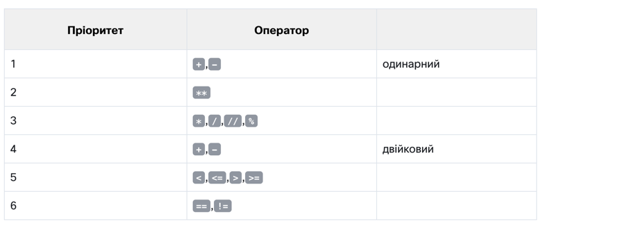
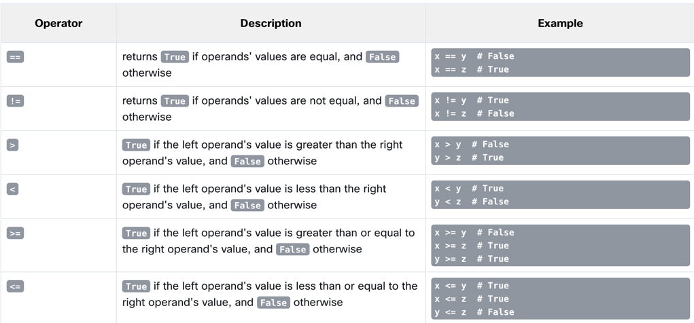

3.1. Section 1 – Making decisions in Python
Ласкаво просимо до третього модуля! У першому розділі ми дізнаємося про умовні оператори та як їх використовувати для прийняття рішень у Python.
3.1.1 Запитання та відповіді

Програміст пише програму, а програма задає запитання .

Комп'ютер виконує програму і дає відповіді . Програма повинна вміти реагувати відповідно до отриманих відповідей .

На щастя, комп’ютери знають лише два типи відповідей:

так, це правда;
ні, це неправда.
Ви ніколи не отримаєте відповідь на кшталт « Дайте мені подумати....» , «Я не знаю » або «Напевно так», але я не знаю напевно» .

Щоб ставити запитання, Python використовує набір дуже спеціальних операторів . Давайте переглянемо їх один за одним, проілюструвавши їх вплив на кількох простих прикладах.
3.1.2 Порівняння: оператор рівності
Запитання: чи рівні дві величини ?

Щоб поставити це запитання, ви використовуєте==(рівно рівно) оператор.

Не забувайте про цю важливу відмінність:

=є оператором присвоювання , наприклад, a = bприсвоює aзі значенням b;
==питання, чи рівні ці значення? тому a == b порівнює a і b.
Це бінарний оператор із лівостороннім зв’язуванням . Він потребує двох аргументів і перевіряє, чи вони рівні .
Лівостороннє та Правостороннє Зв'язування
Лівостороннє зв'язування (Left-Associative) означає, що операції виконуються зліва направо. Якщо кілька операторів з однаковим пріоритетом знаходяться поруч, вони обробляються зліва направо.

Правостороннє зв'язування (Right-Associative) означає, що операції виконуються справа наліво. Оператори з однаковим пріоритетом обробляються справа наліво.

Приклади Лівостороннього Зв'язування
Більшість операторів у Python мають лівостороннє зв'язування. Розглянемо приклад з оператором додавання:

python
Копіювати код
5 - 3 + 2
Тут операції будуть виконуватись зліва направо:

Спочатку виконується 5 - 3, результатом буде 2.
Потім виконується 2 + 2, результатом буде 4.
Тобто, вираз 5 - 3 + 2 інтерпретується як (5 - 3) + 2.

Приклади Правостороннього Зв'язування
Деякі оператори, такі як оператор присвоєння та оператор піднесення до степеня, мають правостороннє зв'язування. Розглянемо приклад з оператором піднесення до степеня:

python
Копіювати код
2 ** 3 ** 2
Тут операції будуть виконуватись справа наліво:

Спочатку виконується 3 ** 2, результатом буде 9.
Потім виконується 2 ** 9, результатом буде 512.
Тобто, вираз 2 ** 3 ** 2 інтерпретується як 2 ** (3 ** 2).

Лівостороннє Зв'язування в Операторах Присвоєння
Розглянемо приклад з операторами присвоєння:

python
Копіювати код
a = b = c = 1
Тут операції виконуються справа наліво:

Спочатку виконується c = 1.
Потім виконується b = c, де c вже має значення 1.
Нарешті, виконується a = b, де b вже має значення 1.
Таблиця Пріоритетів Операторів у Python
Для кращого розуміння, наведемо спрощену таблицю пріоритетів операторів у Python з урахуванням зв'язування:

Оператор	Опис	Пріоритет	Зв'язування
**	Піднесення до степеня	Високий	Правостороннє
*, /, //, %	Множення, ділення, модуль	Середній	Лівостороннє
+, -	Додавання, віднімання	Середній	Лівостороннє
<<, >>	Зсув	Середній	Лівостороннє
<, <=, >, >=	Порівняння	Низький	Лівостороннє
==, !=	Рівність, нерівність	Низький	Лівостороннє
=	Присвоєння	Низький	Правостороннє
+=, -=, *=, /=, **=	Присвоєння з операцією	Низький	Правостороннє
Висновок
Лівостороннє зв'язування означає, що операції виконуються зліва направо. Приклад: 5 - 3 + 2.
Правостороннє зв'язування означає, що операції виконуються справа наліво. Приклад: 2 ** 3 ** 2.
Знання про зв'язування операторів є важливим для розуміння та правильного використання виразів у Python, особливо коли вирази стають складними.

3.1.3 Вправи
А тепер задамо кілька запитань. Спробуйте вгадати відповіді.

Питання №1 : Який результат наступного порівняння?

2 == 2

Перевірте
Правда- звичайно, 2 дорівнює 2. Python відповістьПравда(запам'ятайте цю пару попередньо визначених літералів,Правдаіпомилковий- це також ключові слова Python).

Запитання №2 : Який результат наступного порівняння?

2 == 2.

Перевірте
Це питання не таке просте, як перше. На щастя, Python може перетворити ціле число в його дійсний еквівалент, і, отже, відповідь така:Правда.

Запитання №3 : Який результат наступного порівняння?

1 == 2

Перевірте
Це повинно бути легко. Відповідь буде (вірніше, завжди)помилковий.

3.1.4 Оператори
Рівність: оператор дорівнює ( == )
The==Оператор (дорівнює) порівнює значення двох операндів. Якщо вони рівні, результат порівняння єПравда. Якщо вони не рівні, результат порівняння єпомилковий.

Подивіться на порівняння рівності нижче – який результат цієї операції?

var == 0
 
Зауважте, що ми не можемо знайти відповідь, якщо не знаємо, яке значення наразі зберігається у зміннійвар.

Якщо змінна змінювалася багато разів під час виконання вашої програми або її початкове значення вводиться з консолі, відповідь на це питання може дати тільки Python і тільки під час виконання.

А тепер уявіть програміста, який страждає від безсоння, і йому доводиться окремо рахувати чорних і білих овець, якщо чорних овець рівно вдвічі більше, ніж білих.

Питання буде наступним:

black_sheep == 2 * white_sheep
 
Через низький пріоритет==оператор, питання розглядається як еквівалентне цьому:

black_sheep == (2 * white_sheep)
 
Отже, давайте попрактикуємося у вашому розумінні==оператор зараз – чи можете ви вгадати результат коду нижче?

play_arrow
sync
download
light_mode
dark_mode

Console 
terminal
sync
True
False
Запустіть код і перевірте, чи ви маєте рацію.

Нерівність: оператор не дорівнює ( != )
The!=Оператор (не дорівнює) також порівнює значення двох операндів. Ось різниця: якщо вони рівні, результат порівняння єПомилковий. Якщо вони не рівні, результат порівняння єПравда.

Тепер подивіться на порівняння нерівностей нижче – чи можете ви вгадати результат цієї операції?

var = 0  # Assigning 0 to var
print(var != 0)
 
var = 1  # Assigning 1 to var
print(var != 0)
 
Запустіть код і перевірте, чи ви маєте рацію.

Оператори порівняння: більше
Ви також можете задати порівняльне запитання за допомогою>(більше ніж) оператор.

Якщо ви хочете дізнатися, чи чорних овець більше, ніж білих, ви можете написати це так:

black_sheep > white_sheep  # Greater than
 
Правдапідтверджує це;помилковийзаперечує це.

Оператори порівняння: більше або дорівнює
Оператор більше має ще один спеціальний, нестрогий варіант, але він позначається інакше, ніж у класичній арифметичній нотації:>=(більше або дорівнює).

Є дві наступні ознаки, а не одна.

Обидва ці оператори (суворий і нестрогий), а також два інших, розглянуті в наступному розділі, є двійковими операторами з лівостороннім прив’язуванням , і їхній пріоритет більший, ніж показаний==і!=.

Якщо ми хочемо дізнатися, чи потрібно нам носити теплу шапку, ми задаємося наступним питанням:

centigrade_outside >= 0.0  # Greater than or equal to
 
Оператори порівняння: менше/менше або дорівнює
Як ви, напевно, вже здогадалися, у цьому випадку використовуються такі оператори: the<(менше) оператор і його нестрогий брат:<=(менше або дорівнює).

Подивіться на цей простий приклад:

current_velocity_mph < 85  # Less than
current_velocity_mph <= 85  # Less than or equal to
 
Перевіримо, чи є ризик бути оштрафованим ДАІ (перше питання суворе, друге – ні).

3.1.5 Використання відповідей
Що можна зробити з відповіддю (тобто результатом операції порівняння), отриманою з комп’ютера?

Є принаймні дві можливості: по-перше, ви можете запам’ятати його ( зберегти в змінній ) і використати пізніше. Як ти це робиш? Ну, ви використовуєте довільну змінну так:

answer = number_of_lions >= number_of_lionesses
 
Вміст змінної підкаже відповідь на поставлене запитання.

Другий варіант більш зручний і набагато поширеніший: ви можете використовувати отриману відповідь, щоб прийняти рішення про майбутнє програми .

Для цього потрібна спеціальна інструкція, і ми її обговоримо найближчим часом.

Тепер нам потрібно оновити нашу таблицю пріоритетів і додати в неї всі нові оператори. Тепер це виглядає так:

3.1.7 Умови та умовне виконання
Ви вже знаєте, як задавати питання Python, але все ще не знаєте, як розумно використовувати відповіді. Ви повинні мати механізм, який дозволить вам щось робити, якщо умова виконується, і не робити цього, якщо вона не виконана .

Це так само, як у реальному житті: ви робите певні речі або ні, коли певна умова виконується чи ні, наприклад, ви йдете гуляти, якщо погода гарна, або залишаєтеся вдома, якщо сиро й холодно.

Для прийняття таких рішень Python пропонує спеціальну інструкцію. Через свою природу та застосування її називають умовною інструкцією (або умовним оператором).

Існує кілька його варіантів. Ми почнемо з найпростішого, поступово збільшуючи складність.

Перша форма умовного висловлення, яку ви можете побачити нижче, написана дуже неформально, але образно:

if true_or_not:
    do_this_if_true
 
Цей умовний оператор складається з наступних, суворо необхідних, елементів лише в такому порядку:

вякщоключове слово;
один або кілька пробілів;
вираз (запитання чи відповідь), значення якого буде інтерпретовано виключно в термінахправда(коли його значення відмінне від нуля) іпомилковий(коли він дорівнює нулю);
двокрапка , після якої йде новий рядок;
інструкція з відступом або набір інструкцій (принаймні одна інструкція є обов’язковою); відступ може бути досягнутий двома способами – вставленням певної кількості пробілів (рекомендовано використовувати чотири пробіли відступу ) або за допомогою символу табуляції ; примітка: якщо в частині з відступом більше однієї вказівки, відступ повинен бути однаковим у всіх рядках; незважаючи на те, що це може виглядати однаково, якщо ви використовуєте табуляції з пробілами, важливо зробити всі відступи абсолютно однаковими – Python 3 не дозволяє змішувати пробіли та табуляції для відступів.
Як це твердження працює?

Якщоправда_чи_нівираз представляє істину (тобто його значення не дорівнює нулю), оператор(и) з відступом буде виконано ;
якщоправда_чи_нівираз не представляє істини (тобто його значення дорівнює нулю), оператор(и) з відступом буде пропущено (ігноровано), а наступна виконана інструкція буде тією, що буде наступною за початковим рівнем відступу.

У реальному житті ми часто висловлюємо бажання:

якщо буде гарна погода, підемо гуляти

тоді будемо обідати

Як бачите, обід не є умовним заняттям і не залежить від погоди.

Знаючи, які умови впливають на нашу поведінку, і припускаючи, що у нас є функції без параметріввийти на прогулянку()іобідати(), ми можемо написати такий фрагмент:

if the_weather_is_good:
    go_for_a_walk()
have_lunch()
 
Умовне виконання: оператор if
Якщо певний безсонний розробник Python засинає, коли він або вона нараховує 120 овець, то процедура викликання сну може бути реалізована як спеціальна функція під назвоюсон_і_мрія(), весь код має таку форму:

if sheep_counter >= 120: # Evaluate a test expression
    sleep_and_dream() # Execute if test expression is True
 
Ви можете прочитати це як: якщоsheep_counterбільше або дорівнює120, потім заснути і мріяти (тобто виконуватисон_і_мріяфункція.)

Ми вже говорили, що оператори, що виконуються умовно, мають мати відступ . Це створює дуже розбірливу структуру, яка чітко демонструє всі можливі шляхи виконання в коді.

Подивіться на наступний код:

if sheep_counter >= 120:
    make_a_bed()
    take_a_shower()
    sleep_and_dream()
feed_the_sheepdogs()
 
Як бачите, стелити ліжко, приймати душ, засинати і мріяти все виконується умовно – колиsheep_counterдосягає бажаної межі.

Однак годування вівчарок проводиться завжди (тобтоfeed_the_sheepdogs()функція не має відступу і не належить доякщоблок, що означає, що він завжди виконується.)

Тепер ми обговоримо інший варіант умовного оператора, який також дозволяє виконувати додаткову дію, коли умова не виконується.

Умовне виконання: оператор if-else
Ми почали з простої фрази: « Якщо буде хороша погода, ми підемо гуляти» .

Примітка: немає жодного слова про те, що буде, якщо погода погана. Знаємо лише, що на вулицю виходити не будемо, а чим би могли зайнятися, невідомо. Можливо, ми також захочемо щось спланувати на випадок поганої погоди.

Ми можемо сказати, наприклад: якщо хороша погода, ми підемо гуляти, інакше ми підемо в театр .

Тепер ми знаємо, що ми будемо робити, якщо умови будуть виконані , і ми знаємо, що ми будемо робити, якщо не все піде як слід . Іншими словами, у нас є «план Б».

Python дозволяє нам виражати такі альтернативні плани. Це робиться за допомогою другої, трохи складнішої форми умовного оператора, оператора if-else :

if true_or_false_condition:
    perform_if_condition_true
else:
    perform_if_condition_false
 
Таким чином, є нове слово:інше– це ключове слово .

Частина коду, яка починається зіншеговорить, що робити, якщо умова, зазначена дляякщоне зустрічається (зверніть увагу на двокрапку після слова).

Виконання if-else виглядає наступним чином:

якщо умова має значення True (її значення не дорівнює нулю), товиконати_якщо_умова_істинаоператор виконується, а умовний оператор закінчується;
якщо умова має значення False (вона дорівнює нулю), товиконати_якщо_умова_хибнаоператор виконується, і умовний оператор закінчується.
Інструкція if-else : більш умовне виконання
Використовуючи цю форму умовного твердження, ми можемо описати наші плани наступним чином:

if the_weather_is_good:
    go_for_a_walk()
else:
    go_to_a_theater()
have_lunch()
 
Якщо буде гарна погода, підемо гуляти. Інакше ми підемо в театр. Незалежно від того, хороша чи погана погода, ми обідаємо потім (після прогулянки або після походу в театр).

Усе, що ми сказали про відступи , працює так само всередині гілки else :

if the_weather_is_good:
    go_for_a_walk()
    have_fun()
else:
    go_to_a_theater()
    enjoy_the_movie()
have_lunch()
 
Вкладені оператори if-else
Тепер давайте обговоримо два особливих випадки умовного оператора.

Спочатку розглянемо випадок, коли вказівка ​​розміщена післяякщоє іншимякщо.

Читайте, що ми запланували на цю неділю. Якщо буде гарна погода, підемо гуляти. Якщо ми знайдемо хороший ресторан, ми там пообідаємо. Інакше з’їмо бутерброд. Якщо погода погана, ми підемо в театр. Якщо квитків немає, підемо за покупками в найближчий торговий центр.

Напишемо те саме на Python. Уважно розгляньте код тут:

if the_weather_is_good:
    if nice_restaurant_is_found:
        have_lunch()
    else:
        eat_a_sandwich()
else:
    if tickets_are_available:
        go_to_the_theater()
    else:
        go_shopping()
Ось два важливі моменти:

це використанняякщооператор відомий як вкладення ; пам'ятайте, що коженіншевідноситься доякщоякий лежить на одному рівні відступу ; вам потрібно це знати, щоб визначити, як поєднуються if і else s;
подумайте про те, як відступ покращує читабельність і робить код легшим для розуміння та відстеження.
Заява elif​
Другий окремий випадок представляє ще одне нове ключове слово Python: elif . Як ви, напевно, підозрюєте, це коротша форма else if .

elifвикористовується для перевірки більш ніж однієї умови та для зупинки , коли знайдено перше твердження, яке є істинним.

Наш наступний приклад нагадує вкладення, але подібності дуже незначні. Знову ж таки, ми змінимо свої плани і висловимо їх так: якщо погода хороша, ми підемо гуляти, інакше, якщо отримаємо квитки, ми підемо в театр, інакше, якщо є вільні столики в ресторан, підемо обідати; якщо нічого не допоможе, ми залишимося вдома і пограємо в шахи.

Ви помітили, скільки разів ми використали слово інакше ? Це етап, на якомуelifключове слово відіграє свою роль.

Давайте напишемо той самий сценарій за допомогою Python:

if the_weather_is_good:
    go_for_a_walk()
elif tickets_are_available:
    go_to_the_theater()
elif table_is_available:
    go_for_lunch()
else:
    play_chess_at_home()
 
Спосіб складання наступних операторів if-elif-else іноді називають каскадом .

Зверніть увагу ще раз, як відступи покращують читабельність коду.

У цьому випадку слід приділити деяку додаткову увагу:

ви не повинні використовуватиіншебез попередньогоякщо;
іншезавжди є останньою гілкою каскаду , незалежно від того, чи використовували виelifчи ні;
іншеє необов'язковою частиною каскаду, і її можна опустити;
якщо єіншегілка в каскаді, виконується тільки одна з усіх гілок;
якщо немаєіншегілка, можливо, жодна з доступних гілок не виконується.
Це може здатися трохи дивним, але, сподіваюся, кілька простих прикладів допоможуть пролити більше світла.

3.1.8 Аналіз зразків коду
Зараз ми покажемо вам кілька простих, але повних програм. Ми не пояснюватимемо їх докладно, оскільки вважаємо коментарі (і назви змінних) усередині коду достатніми посібниками.

Усі програми вирішують одну й ту саму задачу – знаходять найбільше з кількох чисел і виводять його на друк .

приклад 1:

Ми почнемо з найпростішого випадку – як визначити більше з двох чисел :

# Read two numbers
number1 = int(input("Enter the first number: "))
number2 = int(input("Enter the second number: "))
 
# Choose the larger number
if number1 > number2:
    larger_number = number1
else:
    larger_number = number2
 
# Print the result
print("The larger number is:", larger_number)
 
Наведений вище фрагмент має бути зрозумілим – він читає два цілих значення, порівнює їх і знаходить, яке з них більше.

приклад 2:

Зараз ми покажемо вам один цікавий факт. У Python є цікава функція – подивіться на код нижче:

# Read two numbers
number1 = int(input("Enter the first number: "))
number2 = int(input("Enter the second number: "))
 
# Choose the larger number
if number1 > number2: larger_number = number1
else: larger_number = number2
 
# Print the result
print("The larger number is:", larger_number)
 
Примітка: якщо будь-яка з гілок if-elif-else містить лише одну інструкцію, ви можете закодувати її в більш вичерпній формі (вам не потрібно робити відступ після ключового слова, а просто продовжити рядок після двокрапки) .

Однак цей стиль може вводити в оману, і ми не збираємося використовувати його в наших майбутніх програмах, але це точно варто знати, якщо ви хочете читати та розуміти чиїсь програми.

Інших відмінностей в коді немає.

приклад 3:

Настав час ускладнити код – давайте знайдемо найбільше з трьох чисел. Чи збільшить це код? Трохи.

Вважаємо, що перше значення найбільше. Потім ми перевіряємо цю гіпотезу двома значеннями, що залишилися.

Подивіться на код нижче:

# Read three numbers
number1 = int(input("Enter the first number: "))
number2 = int(input("Enter the second number: "))
number3 = int(input("Enter the third number: "))
 
# We temporarily assume that the first number
# is the largest one.
# We will verify this soon.
largest_number = number1
 
# We check if the second number is larger than the current largest_number
# and update the largest_number if needed.
if number2 > largest_number:
    largest_number = number2
 
# We check if the third number is larger than the current largest_number
# and update the largest_number if needed.
if number3 > largest_number:
    largest_number = number3
 
# Print the result
print("The largest number is:", largest_number)
 
Цей метод значно простіший, ніж спроба знайти найбільше число відразу шляхом порівняння всіх можливих пар чисел (тобто перше з другим, друге з третім, третє з першим). Спробуйте перебудувати код для себе.

play_arrow
синхронізація
завантажити
light_mode
темний_режим
Консоль 
термінал
синхронізація

3.1.13 РЕЗЮМЕ РОЗДІЛУ
1. Оператори порівняння (інакше відомі як реляційні ) використовуються для порівняння значень. У наведеній нижче таблиці показано, як працюють оператори порівняння, припускаючи, що x = 0, y = 1та z = 0:

2. Якщо ви хочете виконати певний код лише за умови виконання певної умови, ви можете використати умовний оператор :

Одинокийякщозаява, наприклад:

x = 10
 
if x == 10: # condition
    print("x is equal to 10")  # Executed if the condition is True.
 
серіяякщозаяви, наприклад:

x = 10
 
if x > 5: # condition one
    print("x is greater than 5")  # Executed if condition one is True.
 
if x < 10: # condition two
    print("x is less than 10")  # Executed if condition two is True.
 
if x == 10: # condition three
    print("x is equal to 10")  # Executed if condition three is True.
 
    Коженякщотвердження перевіряється окремо.

анякщо-інакшезаява, наприклад:

x = 10
 
if x < 10: # condition
    print("x is less than 10")  # Executed if the condition is True.
 
else:
    print("x is greater than or equal to 10")  # Executed if the condition is False.
 
серіяякщозаяви, за якими йде anінше, наприклад:

x = 10
 
if x > 5: # condition one
    print("x is greater than 5")  # Executed if condition one is True.
 
if x < 10: # condition two
    print("x is less than 10")  # Executed if condition two is True.
 
if x == 10: # condition three
     print("x is equal to 10")  # Executed if condition three is True.
 
    Коженякщотестується окремо. Тілоіншевиконується, якщо останнійякщоєпомилковий.

Theякщо-еліф-іншезаява, наприклад:

x = 10
 
if x == 10: # True
    print("x == 10")
 
if x > 15: # False
    print("x > 15")
 
elif x > 10: # False
    print("x > 10")
 
elif x > 5: # True
    print("x > 5")
 
else:
    print("else will not be executed")
 
    Якщо умова дляякщоєпомилковий, програма перевіряє умови подальшогоelifблоки - першelifблок, тобтоправдавиконується. Якщо всі умови єпомилковий,іншеблок буде виконано.

Вкладені умовні оператори, наприклад:

x = 10
 
if x > 5: # True
    if x == 6: # False
        print("nested: x == 6")
    elif x == 10: # True
        print("nested: x == 10")
    else:
        print("nested: else")
else:
    print("else")
 

3.2. Section 2 – Loops in Python

3.2.1 Зациклення вашого коду за допомогою while

Чи згодні ви з поданим нижче твердженням?

while there is something to do
    do it
 
Зауважте, що цей запис також заявляє, що якщо нічого не робити, нічого не станеться.

Загалом, у Python цикл можна представити так:

while
    instruction
 
Якщо ви помітили деякі схожості з інструкцією if , це цілком нормально. Дійсно, синтаксична різниця лише в одному: ви використовуєте словопокизамість словаякщо.

Семантична різниця більш важлива: коли умова виконується, if виконує свої оператори лише один раз ; while повторює виконання до тих пір, поки умова оцінюється якправда.

Примітка: тут також застосовуються всі правила щодо відступів . Незабаром ми вам це покажемо.

Подивіться на алгоритм нижче:

while conditional_expression:
    instruction_one
    instruction_two
    instruction_three
    :
    :
    instruction_n
 
Тепер важливо пам’ятати, що:

якщо ви хочете виконати більше одного оператора в одномупокиloop , ви повинні (як зякщо) однакові відступи для всіх інструкцій;
інструкція або набір інструкцій, які виконуються всерединіпокицикл називається тілом циклу ;
якщо умова єпомилковий(дорівнює нулю) як тільки воно тестується вперше, тіло не виконується жодного разу (зверніть увагу на аналогію, коли нічого не потрібно робити, якщо нічого робити);
тіло повинно мати можливість змінити значення умови, оскільки якщо умова єправдана початку тіло може працювати безперервно до нескінченності – зауважте, що виконання певної справи зазвичай зменшує кількість справ, які потрібно зробити).
3.2.2 Нескінченний цикл
Нескінченний цикл, також званий нескінченним циклом , — це послідовність інструкцій у програмі, які повторюються нескінченно (нескінченно).

Ось приклад циклу, який не може завершити своє виконання:

while True:
    print("I'm stuck inside a loop.")
 
Цей цикл друкуватиме нескінченно«Я застряг у петлі».на екрані.

  Примітка  
Якщо ви хочете отримати найкращий досвід навчання, спостерігаючи, як поводиться нескінченний цикл, запустіть IDLE, створіть новий файл, скопіюйте та вставте наведений вище код, збережіть свій файл і запустіть програму. Ви побачите нескінченну послідовність«Я застряг у петлі».рядки, надруковані у вікні консолі Python. Щоб завершити програму, просто натисніть Ctrl-C (або Ctrl-Break на деяких комп’ютерах). Це спричинить aKeyboardInterruptі дозвольте вашій програмі вийти з циклу. Ми поговоримо про це пізніше в курсі.

Давайте повернемося до ескізу алгоритму, який ми вам нещодавно показали. Ми збираємося показати вам, як використовувати цей нещодавно вивчений цикл, щоб знайти найбільше число з великого набору введених даних.

Уважно проаналізуйте програму. Подивіться, де починається цикл (рядок 8). Знайдіть тіло циклу та дізнайтеся, як з нього виходить :

# Store the current largest number here.
largest_number = -999999999
 
# Input the first value.
number = int(input("Enter a number or type -1 to stop: "))
 
# If the number is not equal to -1, continue.
while number != -1:
    # Is number larger than largest_number?
    if number > largest_number:
        # Yes, update largest_number.
        largest_number = number
    # Input the next number.
    number = int(input("Enter a number or type -1 to stop: "))
 
# Print the largest number.
print("The largest number is:", largest_number)
 
Перевірте, як цей код реалізує алгоритм, який ми показали вам раніше.

3.2.3 Цикл while : більше прикладів
Давайте розглянемо інший приклад використанняпокипетля. Слідкуйте за коментарями, щоб дізнатися ідею та рішення.

# A program that reads a sequence of numbers
# and counts how many numbers are even and how many are odd.
# The program terminates when zero is entered.
 
odd_numbers = 0
even_numbers = 0
 
# Read the first number.
number = int(input("Enter a number or type 0 to stop: "))
 
# 0 terminates execution.
while number != 0:
    # Check if the number is odd.
    if number % 2 == 1:
        # Increase the odd_numbers counter.
        odd_numbers += 1
    else:
        # Increase the even_numbers counter.
        even_numbers += 1
    # Read the next number.
    number = int(input("Enter a number or type 0 to stop: "))
 
# Print results.
print("Odd numbers count:", odd_numbers)
print("Even numbers count:", even_numbers)
 
Деякі вирази можна спростити, не змінюючи поведінку програми.

Спробуйте пригадати, як Python інтерпретує істинність умови, і зауважте, що ці дві форми еквівалентні:

а число != 0:іа число:.

Умову, яка перевіряє, чи є число непарним, також можна закодувати в цих еквівалентних формах:

якщо число % 2 == 1:іякщо число % 2:.

Використання змінної лічильника для виходу з циклу
Подивіться на фрагмент нижче:

counter = 5
while counter != 0:
    print("Inside the loop.", counter)
    counter -= 1
print("Outside the loop.", counter)
 
Цей код призначений для друку рядка«Всередині петлі».і значення, що зберігається влічильникзмінна протягом певного циклу рівно п’ять разів. Якщо умова не виконана (лічильникзмінна досягла0), цикл вийшов, і повідомлення«Поза петлею».а також значення, що зберігається влічильникдрукується.

Але є одне, що можна написати стисло – це станпокипетля.

Ви бачите різницю?

counter = 5
while counter:
    print("Inside the loop.", counter)
    counter -= 1
print("Outside the loop.", counter)
 
Він більш компактний, ніж раніше? Трохи. Це більш розбірливо? Це спірно.

  ПАМ'ЯТАЙТЕ  
Не вважайте себе зобов’язаним кодувати свої програми так, щоб вони завжди були найкоротшими та найкомпактнішими. Читабельність може бути більш важливим фактором. Тримайте свій код напоготові для нового програміста.

