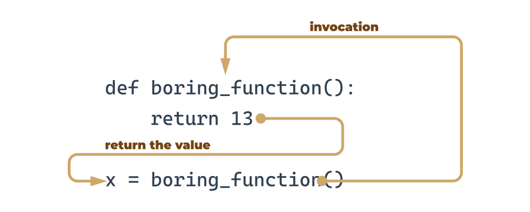

4.2.1 Параметризовані функції
Повна потужність функції розкривається, коли її можна оснастити інтерфейсом, здатним приймати дані, надані ініціатором. Такі дані можуть змінювати поведінку функції, роблячи її більш гнучкою та адаптованою до мінливих умов.

Параметр насправді є змінною, але є два важливі фактори, які роблять параметри різними та особливими:

параметри існують лише всередині функцій, у яких вони були визначені , і єдине місце, де параметр можна визначити, це пробіл між парою дужок узахзаява;
присвоєння значення параметру виконується під час виклику функції шляхом вказівки відповідного аргументу.
def function(parameter):
    ###
 
Не забувайте:

параметри живуть усередині функцій (це їх природне середовище)
аргументи існують поза функціями та є носіями значень, що передаються відповідним параметрам.
Між цими двома світами існує чітка і однозначна межа.

Давайте збагатимо наведену вище функцію лише одним параметром – ми будемо використовувати його, щоб показати користувачеві номер значення, яке запитує функція.

Ми повинні відновитизахзаява ‒ ось так вона виглядає зараз:

def message(number):
    ###
 
Визначення вказує, що наша функція працює лише з одним параметромномер. Ви можете використовувати її як звичайну змінну, але тільки всередині функції – її більше ніде не видно.

Давайте тепер покращимо тіло функції:

def message(number):
    print("Enter a number:", number)
 
Ми використали параметр. Примітка: ми не присвоїли параметру жодного значення. Це правильно?

Так.

Значення для параметра надійде з середовища функції.

Пам'ятайте: вказівка ​​одного або кількох параметрів у визначенні функції також є обов'язковою, і ви повинні виконати її під час виклику. Ви повинні надати стільки аргументів, скільки визначено параметрів .

Якщо цього не зробити, виникне помилка.

Спробуйте запустити код у редакторі.

play_arrow
синхронізація
завантажити
light_mode
темний_режим
Консоль 
термінал
синхронізація
Ось що ви побачите на консолі:

TypeError: message() missing 1 required positional argument: 'number'
Вихід
Це виглядає краще, напевно:

def message(number):
    print("Enter a number:", number)
 
message(1)
 
Крім того, він краще поводиться. Код видасть такий результат:

Enter a number: 1
Вихід
Ви бачите, як це працює? Значення аргументу, що використовується під час виклику (1) було передано у функцію, встановлюючи початкове значення названого параметраномер.

Ми повинні зробити вас чутливими до однієї важливої ​​обставини.

Це законно та можливо мати змінну з таким же іменем, як і параметр функції .

Фрагмент ілюструє це явище:

def message(number):
    print("Enter a number:", number)
 
number = 1234
message(1)
print(number)
 
Подібна ситуація активує механізм, який називається затіненням :

параметрxзатінює будь-яку змінну з таким же ім'ям, але...
... тільки всередині функції, що визначає параметр.
Названий параметрномерє абсолютно відмінною сутністю від названої змінноїномер.

Це означає, що наведений вище фрагмент дасть такий результат:

Enter a number: 1
1234
Вихід

Функція може мати скільки завгодно параметрів , але чим більше у вас параметрів, тим важче запам’ятати їх ролі та призначення.

Давайте модифікуємо функцію – тепер вона має два параметри :

def message(what, number):
    print("Enter", what, "number", number)
 
Це також означає, що для виклику функції знадобляться два аргументи .

Перший новий параметр призначений для назви потрібного значення.

Ось:

def message(what, number):
    print("Enter", what, "number", number)
 
message("telephone", 11)
message("price", 5)
message("number", "number")
 
Це результат, який ви збираєтеся побачити:

Enter telephone number 11
Enter price number 5
Enter number number number
Вихід
Запустіть код, змініть його, додайте більше параметрів і подивіться, як це вплине на результат.

4.2.2 Передача позиційних параметрів
Техніка, яка призначає i- й (перший, другий і так далі) аргумент i- му (першому, другому і так далі) параметру функції, називається позиційною передачею параметрів , тоді як аргументи, передані таким чином, називаються позиційними аргументами .

Ви вже використовували його, але Python може запропонувати набагато більше. Зараз ми вам про це розповімо.

def my_function(a, b, c):
    print(a, b, c)
 
my_function(1, 2, 3)
 
Примітка: передача позиційних параметрів інтуїтивно використовується людьми в багатьох соціальних випадках. Наприклад, може бути загальноприйнятим, що коли ми представляємося, ми згадуємо своє ім’я (імена) перед своїм прізвищем, наприклад, «Мене звати Джон Доу».

До речі, угорці роблять це у зворотному порядку.

Давайте запровадимо цю соціальну звичку в Python. Наступна функція відповідатиме за представлення когось:

def introduction(first_name, last_name):
    print("Hello, my name is", first_name, last_name)
 
introduction("Luke", "Skywalker")
introduction("Jesse", "Quick")
introduction("Clark", "Kent")
 
Чи можете ви вгадати результат? Запустіть код і дізнайтеся, чи ви праві.

А тепер уявіть, що така ж функція використовується в Угорщині. У цьому випадку код виглядатиме так:

def introduction(first_name, last_name):
    print("Hello, my name is", first_name, last_name)
 
introduction("Skywalker", "Luke")
introduction("Quick", "Jesse")
introduction("Kent", "Clark")
 
Вихід буде виглядати інакше. Ви можете вгадати це?

Запустіть код, щоб перевірити, чи ви також маєте рацію. Ви здивовані?

Чи можете ви зробити функцію більш незалежною від культури?
def introduction(first_name, last_name):
    print("Hello, my name is", first_name, last_name)
 
introduction(first_name = "James", last_name = "Bond")
introduction(last_name = "Skywalker", first_name = "Luke")
 Концепція зрозуміла – перед значеннями, що передаються параметрам, ідуть імена цільових параметрів, після яких іде=знак.

Позиція тут не має значення – значення кожного аргументу знає своє призначення на основі використаного імені.

Ви повинні мати можливість передбачити результат. Запустіть код, щоб перевірити, чи ви праві.

Звичайно, ви не повинні використовувати неіснуючу назву параметра .

Наступний фрагмент спричинить помилку виконання:

def introduction(first_name, last_name):
    print("Hello, my name is", first_name, last_name)
 
introduction(surname="Skywalker", first_name="Luke")
 
Ось що вам скаже Python:

TypeError: introduction() got an unexpected keyword argument 'surname'
Вихід
Спробуйте самі.

4.2.4 Поєднання позиційних і ключових аргументів
Ви можете змішувати обидва стилі, якщо хочете – існує лише одне непорушне правило: ви повинні поставити позиційні аргументи перед ключовими аргументами .

Якщо ви подумаєте на мить, то обов’язково здогадаєтесь чому.

Щоб показати вам, як це працює, ми використаємо таку просту функцію з трьома параметрами:

def adding(a, b, c):
    print(a, "+", b, "+", c, "=", a + b + c)
 
Його мета — оцінити та представити суму всіх своїх аргументів.

Функція, викликана таким чином:

adding(1, 2, 3)
 
виведе:

1 + 2 + 3 = 6
Вихід
Це був ‒ як ви можете підозрювати ‒ чистий приклад проходження позиційних аргументів .

Звичайно, ви можете замінити такий виклик варіантом із суто ключовим словом, наприклад:

adding(c = 1, a = 2, b = 3)
 
Наша програма виведе такий рядок:

2 + 3 + 1 = 6
Вихід
Зверніть увагу на порядок значень.

Давайте зараз спробуємо змішати обидва стилі.

Подивіться на виклик функції нижче:

adding(3, c = 1, b = 2)
 
Давайте розберемо його:

аргумент (3) дляaпараметр передається позиційним способом;
аргументи завіbвказуються як ключові.
Ось що ви побачите на консолі:

3 + 2 + 1 = 6
Вихід
Будьте уважні, остерігайтеся помилок. Якщо ви спробуєте передати більше одного значення одному аргументу, ви отримаєте лише помилку виконання.

Подивіться на виклик нижче - здається, що ми намагалися встановитиaдвічі:

adding(3, a = 1, b = 2)
 
Відповідь Python:

TypeError: adding() got multiple values for argument 'a'
Вихід
Подивіться на фрагмент нижче. Такий код є цілком правильним, але він не має особливого сенсу:

adding(4, 3, c = 2)
 
Все правильно, але залишити лише один аргумент ключового слова виглядає трохи дивно ‒ як ви думаєте?

4.2.5 Параметризовані функції – докладніше
Буває так, що значення певного параметра використовуються частіше за інші. Такі аргументи можуть мати значення за замовчуванням (попередньо визначені), якщо їх відповідні аргументи були пропущені.

Кажуть, найпопулярніше англійське прізвище Сміт . Спробуємо це врахувати.

Значення параметра за замовчуванням встановлюється з використанням чіткого та наочного синтаксису:

def introduction(first_name, last_name="Smith"):
     print("Hello, my name is", first_name, last_name)
 
Вам потрібно лише розширити назву параметра за допомогою=знак, а потім значення за замовчуванням.

Давайте викличемо функцію як зазвичай:

introduction("James", "Doe")
 
Чи можете ви вгадати результат програми? Запустіть і перевірте, чи ви праві.

і? Все виглядає так само, але коли ви викликаєте функцію таким чином, який на перший погляд виглядає трохи підозрілим, наприклад:

introduction("Henry")
 
або це:

introduction(first_name="William")
 
помилки не буде, обидва виклики завершаться успішно, а консоль покаже наступний вихід:

Hello, my name is Henry Smith
Hello, my name is William Smith
Вихід
Перевірте це.

Ви можете піти далі, якщо це корисно. Обидва параметри тепер мають значення за замовчуванням, подивіться на код нижче:

def introduction(first_name="John", last_name="Smith"):
    print("Hello, my name is", first_name, last_name)
 
Це робить наступний виклик абсолютно дійсним:

introduction()
 
І це очікуваний результат:

Hello, my name is John Smith
Вихід
Якщо ви використовуєте один аргумент ключового слова, решта матиме значення за замовчуванням:

introduction(last_name="Hopkins")
 
Результат:

Hello, my name is John Hopkins
Вихід
Перевірте це.

Вітаємо! Ви щойно навчилися деяким основним прийомам спілкування з функціями.

4.2.6 РЕЗЮМЕ РОЗДІЛУ
1. Ви можете передавати інформацію функціям за допомогою параметрів. Ваші функції можуть мати скільки завгодно параметрів.

Приклад функції з одним параметром:

def hi(name):
    print("Hi,", name)
 
hi("Greg")
 
Приклад функції з двома параметрами:

def hi_all(name_1, name_2):
    print("Hi,", name_2)
    print("Hi,", name_1)
 
hi_all("Sebastian", "Konrad")
 
Приклад функції з трьома параметрами:

def address(street, city, postal_code):
    print("Your address is:", street, "St.,", city, postal_code)
 
s = input("Street: ")
p_c = input("Postal Code: ")
c = input("City: ")
address(s, c, p_c)
 
2. Ви можете передати аргументи функції за допомогою таких прийомів:

позиційна передача аргументів , у якій порядок передачі аргументів має значення (Приклад 1)
ключове слово (іменований) передача аргументів , у якій порядок переданих аргументів не має значення (Приклад 2)
поєднання позиційної передачі аргументів і ключових слів (Приклад 3.)

Ex. 1
def subtra(a, b):
    print(a - b)
 
subtra(5, 2) # outputs: 3
subtra(2, 5) # outputs: -3
 
 
Ex. 2
def subtra(a, b):
    print(a - b)
 
subtra(a=5, b=2) # outputs: 3
subtra(b=2, a=5) # outputs: 3
 
Ex. 3
def subtra(a, b):
    print(a - b)
 
subtra(5, b=2) # outputs: 3
subtra(5, 2) # outputs: 3
 
Важливо пам’ятати, що позиційні аргументи не повинні слідувати за аргументами ключового слова . Ось чому, якщо ви спробуєте запустити наступний фрагмент:

def subtra(a, b):
    print(a - b)
 
subtra(5, b=2) # outputs: 3
subtra(a=5, 2) # Syntax Error
 
Python не дозволить вам це зробити, сигналізуючи aСинтаксична помилка.

3. Ви можете використовувати техніку передачі аргументів ключового слова, щоб попередньо визначити значення для даного аргументу:

def name(first_name, last_name="Smith"):
    print(first_name, last_name)
 
name("Andy") # outputs: Andy Smith
name("Betty", "Johnson") # outputs: Betty Johnson (the keyword argument replaced by "Johnson")
 

4.3. Розділ 3 – Повернення результату з функції
Ласкаво просимо до розділу 3! У цій частині курсу ви дізнаєтесь про ефекти та результати функцій, вираз повернення та значення None . Ви також дізнаєтеся, як передавати списки як аргументи функції, як повертати списки як результати функції та як призначати результати функції змінним. Ходімо!

4.3.1 Наслідки та результати: інструкція про повернення
Всі представлені раніше функції мають певний ефект – видають якийсь текст і відправляють його на консоль.

Звичайно, функції, як і їхні математичні побратими, можуть мати результати.

Щоб змусити функції повертати значення (але не тільки для цієї мети), ви використовуєтеповерненняінструкція.

Це слово дає вам повне уявлення про його можливості. Примітка: це ключове слово Python .

Theповерненняінструкція має два різних варіанти – розглянемо їх окремо.

повернутися без виразу
Розглянемо таку функцію:

def happy_new_year(wishes = True):
    print("Three...")
    print("Two...")
    print("One...")
    if not wishes:
        return
 
    print("Happy New Year!")
 
При виклику без жодних аргументів:

happy_new_year()
 
функція створює невеликий шум – результат виглядатиме так:

Three...
Two...
One...
Happy New Year!
Вихід
Забезпеченняпомилковийяк аргумент:

happy_new_year(False)
 
змінить поведінку функції ‒ theповерненняінструкція спричинить його завершення безпосередньо перед бажаннями ‒ це оновлений вихід:

Three...
Two...
One...
Вихід
повернутися з виразом
Другийповерненняваріант розширено виразом :

def function():
    return expression
 
Є два наслідки його використання:

викликає негайне припинення виконання функції (нічого нового порівняно з першим варіантом)
крім того, функція обчислить значення виразу та поверне його (звідси знову така назва) як результат функції .
Так, ми вже знаємо – цей приклад не дуже складний:

def boring_function():
    return 123
 
x = boring_function()
 
print("The boring_function has returned its result. It's:", x)
 
Фрагмент записує такий текст на консоль:

The boring_function has returned its result. It's: 123
Вихід
Давайте дослідимо це на деякий час.

Проаналізуйте малюнок нижче:

Theповерненняінструкція, збагачена виразом (тут вираз дуже простий), «переносить» значення виразу до місця, де була викликана функція.

Результат можна вільно використовувати тут, наприклад, для призначення змінній.

Його також можна повністю проігнорувати та втратити безслідно.

Зауважте, ми не надто ввічливі – функція повертає значення, а ми його ігноруємо (не використовуємо жодним чином):

def boring_function():
    print("'Boredom Mode' ON.")
    return 123
 
print("This lesson is interesting!")
boring_function()
print("This lesson is boring...")
Програма видає такі результати:

This lesson is interesting!
'Boredom Mode' ON.
This lesson is boring...
Вихід
Це карається? Зовсім ні.

Єдиний недолік – безповоротно втрачений результат.

Не забувайте:

вам завжди дозволено ігнорувати результат функції та бути задоволеним ефектом функції (якщо функція має такий)
якщо функція призначена для повернення корисного результату, вона повинна містити другий варіантповерненняінструкція.
Хвилинку – це означає, що є й марні результати? Так, в якомусь сенсі.

4.3.2 Кілька слів про None
Дозвольте познайомити вас із дуже цікавим значенням (чесно кажучи, жодним значенням) під назвоюЖодного.

Його дані не представляють жодної розумної цінності – насправді, це взагалі не цінність; отже, він не повинен брати участь у жодних виразах .

Наприклад, такий фрагмент:

print(None + 2)
 
спричинить помилку виконання, описану таким діагностичним повідомленням:

TypeError: unsupported operand type(s) for +: 'NoneType' and 'int'
Вихід
Примітка:Жодногоє ключовим словом .

Є лише два види обставин, колиЖодногоможна безпечно використовувати:

коли ви призначаєте його змінній (або повертаєте як результат функції )
коли ви порівнюєте його зі змінною, щоб діагностувати його внутрішній стан.
Так само як тут:

value = None
if value is None:
    print("Sorry, you don't carry any value")
 
Не забувайте про це: якщо функція не повертає певне значення за допомогою aповерненняречення виразу, передбачається, що воно неявно повертаєЖодного.

Давайте перевіримо це.

Подивіться на код у редакторі.

play_arrow
синхронізація
завантажити
light_mode
темний_режим
Консоль 
термінал
синхронізація
Очевидно, щодивна_функціяфункція повертаєправдаколи його аргумент парний.

Що повертає інакше?

Ми можемо використати такий код, щоб перевірити це:

print(strange_function(2))
print(strange_function(1))
 
Ось що ми бачимо в консолі:

True
None
Вихід
Не дивуйтеся наступного разу, коли побачитеЖодногояк результат функції – це може бути ознакою тонкої помилки всередині функції.

4.5.1 Приклади функцій: Оцінка ІМТ
Давайте почнемо з функції для оцінки індексу маси тіла (ІМТ).

Як бачите, формула отримує два значення:

вага (спочатку в кілограмах)
висота (спочатку в метрах)
Здається, ця нова функція матиме два параметри . Його назва будеІМТ, але якщо ви віддаєте перевагу будь-якому іншому імені, використовуйте його.

Давайте закодуємо функцію:

def bmi(weight, height):
    return weight / height ** 2
 
 
print(bmi(52.5, 1.65))
 
Результат виклику прикладу виглядає наступним чином:

19.283746556473833
Вихід
Функція виправдовує наші очікування, але вона трохи проста – вона передбачає, що значення обох параметрів завжди мають значення. Безумовно, варто перевірити, чи вони заслуговують довіри.

Давайте перевіримо їх обох і повернемосяЖодногоякщо хтось із них виглядає підозрілим.

Оцінка ІМТ і перетворення імперських одиниць у метричні
Подивіться на код у редакторі. Є дві речі, на які ми повинні звернути увагу.

play_arrow
синхронізація
завантажити
light_mode
темний_режим
Консоль 
термінал
синхронізація
По-перше, тестовий виклик гарантує, що захист працює належним чином – результат:

None
Вихід
По-друге, подивіться на спосіб зворотної косої риски (\) використовується символ. Якщо ви використовуєте його в коді Python і завершуєте ним рядок, це вкаже Python продовжити рядок коду в наступному рядку коду.

Це може бути особливо корисним, коли вам доводиться мати справу з довгими рядками коду, і ви хочете покращити читабельність коду.

Гаразд, але є те, що ми занадто легко пропустили – імперські вимірювання. Ця функція не дуже корисна для людей, які звикли до фунтів, футів і дюймів.

Що для них можна зробити?

Ми можемо написати дві прості функції для перетворення імперських одиниць у метричні . Почнемо з фунтів.

Загальновідомий факт, що1 фунт = 0,45359237 кг. Ми використаємо це в нашій новій функції.

Це наша допоміжна функція під назвоюlb_to_kg:

def lb_to_kg(lb):
    return lb * 0.45359237
 
 
print(lb_to_kg(1))
 
Результат тестового виклику виглядає добре:

0.45359237
Вихід
А тепер настав час футів і дюймів:1 фут = 0,3048 м, і1 дюйм = 2,54 см = 0,0254 м.

Функція, яку ми написали, названаft_and_inch_to_m:

def ft_and_inch_to_m(ft, inch):
    return ft * 0.3048 + inch * 0.0254
 
 
print(ft_and_inch_to_m(1, 1))
 
Результат швидкого тесту:

0.3302
Вихід
Виглядає так, як очікувалося.

Примітка: ми хотіли просто назвати другий параметрв, нідюйм, але ми не змогли. Ти знаєш чому?

вє ключовим словом Python – його не можна використовувати як назву.

Перетворимо шість футів у метри:

print(ft_and_inch_to_m(6, 0))
А це результат:

1.8288000000000002
Вихід
Цілком можливо, що іноді вам захочеться використовувати лише фути без дюймів. Чи допоможе вам Python? Звичайно, буде.

Ми трохи змінили код:

def ft_and_inch_to_m(ft, inch = 0.0):
    return ft * 0.3048 + inch * 0.0254
 
 
print(ft_and_inch_to_m(6))
 
Тепердюймпараметр має значення за замовчуванням рівне0,0.

Код створює наступний результат – це те, що очікується:

1.8288000000000002
Вихід
Нарешті, код може відповісти на запитання: який ІМТ людини зростом 5 футів 7 дюймів і вагою 176 фунтів?

Це код, який ми створили:

def ft_and_inch_to_m(ft, inch = 0.0):
    return ft * 0.3048 + inch * 0.0254
 
 
def lb_to_kg(lb):
    return lb * 0.4535923
 
 
def bmi(weight, height):
    if height < 1.0 or height > 2.5 or weight < 20 or weight > 200:
        return None
 
    return weight / height ** 2
 
 
print(bmi(weight = lb_to_kg(176), height = ft_and_inch_to_m(5, 7)))
 
І відповідь:

27.565214082533313
Вихід
Запустіть код і перевірте його.

4.5.2 Приклади функцій: Трикутники
Давайте зараз пограємо з трикутниками. Ми почнемо з функції, щоб перевірити, чи три сторони заданих довжин можуть побудувати трикутник.

Зі школи ми знаємо, що сума двох довільних сторін має бути довшою за третю .

Це не буде важким викликом. Функція матиме три параметри ‒ по одному для кожної сторони.

Воно повернетьсяправдаякщо зі сторін можна побудувати трикутник, апомилковийінакше. В цьому випадку,це_трикутникце гарна назва для такої функції.

Подивіться на код у редакторі. Ви можете знайти нашу функцію там. Запустіть програму.

play_arrow
синхронізація
завантажити
light_mode
темний_режим
Консоль 
термінал
синхронізація
Здається, це добре працює – ось результати:

True
False
Вихід
Чи можемо ми зробити його більш компактним? Виглядає трохи багатослівно.

Це більш компактна версія:

def is_a_triangle(a, b, c):
    if a + b <= c or b + c <= a or c + a <= b:
        return False
    return True
 
 
print(is_a_triangle(1, 1, 1))
print(is_a_triangle(1, 1, 3))
 
Чи можемо ми ущільнити його ще більше?

Так, ми можемо - подивіться:

def is_a_triangle(a, b, c):
    return a + b > c and b + c > a and c + a > b
 
 
print(is_a_triangle(1, 1, 1))
print(is_a_triangle(1, 1, 3))
 
Ми скасували умову (перевернули оператори відношення та замінилиабоs зіs, отримавши універсальний вираз для перевірки трикутників ).

Давайте встановимо функцію у більшу програму. Він запитає у користувача три значення та використає функцію.

Трикутники і теорема Піфагора
Подивіться на код у редакторі. Він запитує у користувача три значення. Тоді він використовуєце_трикутникфункція. Код готовий до запуску.

play_arrow
синхронізація
завантажити
light_mode
темний_режим
Консоль 
термінал
синхронізація
На другому кроці ми спробуємо переконатися, що певний трикутник є прямокутним .

Нам потрібно буде скористатися теоремою Піфагора :

c 2 = a 2 + b 2

Як ми розпізнаємо, яка з трьох сторін є гіпотенузою?

Гіпотенуза - це найдовша сторона .

Ось код:

def is_a_triangle(a, b, c):
    return a + b > c and b + c > a and c + a > b
 
 
def is_a_right_triangle(a, b, c):
    if not is_a_triangle(a, b, c):
        return False
    if c > a and c > b:
        return c ** 2 == a ** 2 + b ** 2 if a > b and a > c:
    if a > b and a > c:
        return a ** 2 == b ** 2 + c ** 2
print(is_a_right_triangle(5, 3, 4))
print(is_a_right_triangle(1, 3, 4))
 
Подивіться, як ми перевіряємо зв’язок між гіпотенузою та рештою сторін – ми вибираємо найдовшу сторону та застосовуємо теорему Піфагора, щоб перевірити, чи все правильно. Загалом для цього потрібно три перевірки.

Оцінка площі трикутника
Ми також можемо оцінити площу трикутника. Тут стане в нагоді формула Герона :

Ми будемо використовувати оператор піднесення до степеня, щоб знайти квадратний корінь – це може здатися дивним, але це працює:

Ось отриманий код:

def is_a_triangle(a, b, c):
    return a + b > c and b + c > a and c + a > b
 
 
def heron(a, b, c):
    p = (a + b + c) / 2
    return (p * (p - a) * (p - b) * (p - c)) ** 0.5
 
 
def area_of_triangle(a, b, c):
    if not is_a_triangle(a, b, c):
        return None
    return heron(a, b, c)
 
 
print(area_of_triangle(1., 1., 2. ** .5))
 
Спробуємо це з прямокутним трикутником у вигляді половини квадрата, одна сторона якого дорівнює 1. Це означає, що його площа повинна дорівнювати 0,5.

Це дивно – код видає такий результат:

0.49999999999999983
Вихід
Це дуже близько до 0,5, але це не зовсім 0,5. Що це означає? Це помилка?

Ні, це не так. Це специфіка обчислень із плаваючою комою . Незабаром ми розповімо вам про це більше.

4.5.3 Зразкові функції: факторіали
Ще одна функція, яку ми збираємося написати, це факторіали . Ви пам’ятаєте, як визначається факторіал?

0! = 1 (так! це правда)
1! = 1
2! = 1 * 2
3! = 1 * 2 * 3
4! = 1 * 2 * 3 * 4
:
:
n! = 1 * 2 * 3 * 4 * ... * n-1 * n

Воно позначено знаком оклику та дорівнює добутку всіх натуральних чисел від одиниці до аргументу.

Давайте напишемо наш код. Ми створимо функцію та викличемо їїфакторіальна_функція. Ось код:

def factorial_function(n):
    if n < 0:
        return None
    if n < 2:
        return 1
 
    product = 1
    for i in range(2, n + 1):
        product *= i
    return product
 
 
for n in range(1, 6): # testing
    print(n, factorial_function(n))
 
Зверніть увагу, як ми крок за кроком віддзеркалюємо математичне визначення та як використовуємодляцикл для пошуку продукту .

Ми додаємо простий тестовий код і отримуємо такі результати:

1 1
2 2
3 6
4 24
5 120
Вихід
4.5.4 Числа Фібоначчі
Чи знайомі ви з числами Фібоначчі ?

Це послідовність цілих чисел, побудована за дуже простим правилом:

перший елемент послідовності дорівнює одиниці ( Fib 1 = 1 )
другий також дорівнює одиниці ( Fib 2 = 1 )
кожне наступне число є_сумою двох попередніх чисел:( Fib i = Fib i-1 + Fib i-2 )
Ось деякі з перших чисел Фібоначчі:

fib_1 = 1 fib_2 = 1 fib_3 = 1 + 1 = 2 fib_4 = 1 + 2 = 3 fib_5 = 2 + 3 = 5 fib_6 = 3 + 5 = 8 fib_7 = 5 + 8 = 13

Що ви думаєте про реалізацію цього як функції ?

Давайте створимо свійфібфункцію та протестуйте її. Ось:

def fib(n):
    if n < 1:
        return None
    if n < 3:
        return 1
 
    elem_1 = elem_2 = 1
    the_sum = 0
    for i in range(3, n + 1):
        the_sum = elem_1 + elem_2
        elem_1, elem_2 = elem_2, the_sum
    return the_sum
 
 
for n in range(1, 10): # testing
    print(n, "->", fib(n))
 
Проаналізуйтедляобережно прокрутіть тіло петлі та з’ясуйте, як ми рухаємоelem_1іelem_2змінні через наступні числа Фібоначчі .

Тестова частина коду дає такий результат:

1 -> 1
2 -> 1
3 -> 2
4 -> 3
5 -> 5
6 -> 8
7 -> 13
8 -> 21
9 -> 34
Вихід
4.5.5 Рекурсія
Є ще одна річ, яку ми хочемо вам показати, щоб все було завершено – це рекурсія .

Цей термін може описувати багато різних концепцій, але одна з них особливо цікава – та, що відноситься до комп’ютерного програмування.

У цьому полі рекурсія — це техніка, за якої функція викликає саму себе .

Ці два випадки здаються найкращими для ілюстрації явища – факторіали та числа Фібоначчі. Особливо останнє.

Визначення чисел Фібоначчі є яскравим прикладом рекурсії . Ми вже казали вам, що:

Fib i = Fib i-1 + Fib i-2

Визначення i- го числа відноситься до числа i-1 і так далі, поки не дійдете до перших двох.

Чи можна це використовувати в коді? Так, може. Це також може зробити код коротшим і зрозумілішим.

Другий наш варіантfib()функція безпосередньо використовує це визначення:

def fib(n):
    if n < 1:
        return None
    if n < 3:
        return 1
    return fib(n - 1) + fib(n - 2)
 
Тепер код набагато зрозуміліший.

Але чи справді це безпечно? Чи несе це якийсь ризик?

Так, ризик справді невеликий. Якщо ви забудете розглянути умови, які можуть зупинити ланцюг рекурсивних викликів, програма може увійти в нескінченний цикл . Треба бути обережним.

Факториал також має другу, рекурсивну сторону. Подивіться:

n! = 1 × 2 × 3 × ... × n-1 × n

Очевидно, що:

1 × 2 × 3 × ... × n-1 = (n-1)!

Отже, нарешті, результат такий:

n! = (n-1)! × n

Це фактично готовий рецепт нашого нового рішення.
Ось:

def factorial_function(n):
    if n < 0:
        return None
    if n < 2:
        return 1
    return n * factorial_function(n - 1)
 
Це працює? Так. Спробуйте самі.

Наша коротка функціональна подорож майже закінчилася. Наступний розділ подбає про два цікаві типи даних Python: кортежі та словники.

play_arrow
синхронізація
завантажити
light_mode
темний_режим
Консоль 
термінал
синхронізація
Повний 
4.5.6 РЕЗЮМЕ РОЗДІЛУ
4.5.6 РЕЗЮМЕ РОЗДІЛУ
1. Функція може викликати інші функції або навіть сама себе. Коли функція викликає саму себе, ця ситуація відома як рекурсія , а функція, яка викликає сама себе і містить задану умову завершення (тобто базовий випадок – умова, яка не вказує функції здійснювати подальші виклики цієї функції) називається рекурсивною функцією.

2. Ви можете використовувати рекурсивні функції в Python, щоб написати чистий, елегантний код і розділити його на менші організовані фрагменти . З іншого боку, вам потрібно бути дуже обережним, оскільки можна легко зробити помилку та створити функцію, яка ніколи не закінчується . Ви також повинні пам’ятати, що рекурсивні виклики споживають багато пам’яті , а тому іноді можуть бути неефективними.

Використовуючи рекурсію, необхідно враховувати всі її переваги та недоліки.

Факторіальна функція є класичним прикладом того, як концепцію рекурсії можна застосувати на практиці:

# Recursive implementation of the factorial function.
 
def factorial(n):
    if n == 1: # The base case (termination condition.)
        return 1
    else:
        return n * factorial(n - 1)
 
 
print(factorial(4)) # 4 * 3 * 2 * 1 = 24
 

Ласкаво просимо до шостого розділу, де ви дізнаєтеся про типи послідовностей і концепцію мінливості. Ви дізнаєтеся, що таке кортежі та словники, і як ви можете використовувати їх для зберігання та обробки значень даних. Ходімо!

4.6.1 Типи послідовностей і мінливість
Перш ніж ми почнемо говорити про кортежі та словники , ми повинні представити два важливі поняття: типи послідовностей і змінність .

Тип послідовності — це тип даних у Python, який здатний зберігати більше одного значення (або менше одного, оскільки послідовність може бути порожньою), і ці значення можна переглядати послідовно (звідси назва) елемент за елементом.

Якдляцикл — це інструмент, спеціально розроблений для повторення послідовностей, ми можемо висловити визначення таким чином: послідовність — це дані, які можна сканувати за допомогоюдляпетля .

Наразі ви зустріли одну послідовність Python − список. Список є класичним прикладом послідовності Python, хоча є деякі інші послідовності, які варто згадати, і ми збираємося представити їх вам зараз.

Друге поняття — мінливість — це властивість будь-яких даних Python, яка описує їх готовність вільно змінюватися під час виконання програми. Існує два типи даних Python: змінні та незмінні .

Змінні дані можна вільно оновлювати в будь-який час – ми називаємо таку операцію in situ.

In situ - латинська фраза, яка перекладається як буквально в положенні . Наприклад, наступна інструкція змінює дані на місці:

list.append(1)
 
Незмінні дані не можуть бути змінені таким чином .

Уявіть, що список можна лише призначити та перечитати. Ви не зможете ані додати до нього елемент, ані видалити з нього будь-який елемент. Це означає, що додавання елемента в кінець списку вимагатиме повторного створення списку з нуля.

Вам доведеться створити повністю новий список, що складається з усіх елементів уже існуючого списку, а також нового елемента.

Тип даних, про який ми хочемо вам зараз розповісти, це кортеж . Кортеж — це тип незмінної послідовності . Він може вести себе як список, але його не можна змінити на місці.

4.6.2 Кортежі
Перша і найчіткіша відмінність між списками та кортежами полягає в синтаксисі, який використовується для їх створення: кортежі віддають перевагу використанню круглих дужок , тоді як списки люблять бачити дужки, хоча також можна створити кортеж просто з набору значень, розділених комами .

Подивіться на приклад:

tuple_1 = (1, 2, 4, 8)
tuple_2 = 1., .5, .25, .125
 
Є два кортежі, обидва містять чотири елементи .

Роздрукуємо їх:

tuple_1 = (1, 2, 4, 8)
tuple_2 = 1., .5, .25, .125
 
print(tuple_1)
print(tuple_2)
 
Ось що ви повинні побачити на консолі:

(1, 2, 4, 8)
(1.0, 0.5, 0.25, 0.125)
Вихід
Примітка: кожен елемент кортежу може мати різний тип (з плаваючою комою, ціле чи будь-який інший тип даних, який ще не введено).

Як створити кортеж
Можна створити порожній кортеж – тоді потрібні дужки:

empty_tuple = ()
 
Якщо ви хочете створити одноелементний кортеж , вам слід взяти до уваги той факт, що через синтаксичні причини (кортеж має відрізнятися від звичайного єдиного значення), ви повинні закінчувати значення комою:

one_element_tuple_1 = (1, )
one_element_tuple_2 = 1.,
 
Видалення ком не зіпсує програму в жодному синтаксичному сенсі, але замість цього ви отримаєте дві одиничні змінні, а не кортежі.

Як використовувати кортеж
Якщо ви хочете отримати елементи кортежу, щоб перечитати їх, ви можете використовувати ті ж угоди, до яких ви звикли під час використання списків.

Подивіться на код у редакторі.

play_arrow
sync
download
light_mode
dark_mode
Console 
terminal
sync
Програма має вивести наступний результат – запустіть її та перевірте:

1
1000
(10, 100, 1000)
(1, 10)
1
10
100
1000
Вихід
Подібність може ввести в оману – не намагайтеся змінити вміст кортежу ! Це не список!

Усі ці інструкції (крім верхньої) спричинять помилку виконання:

my_tuple = (1, 10, 100, 1000)
 
my_tuple.append(10000)
del my_tuple[0]
my_tuple[1] = -10
 
Це повідомлення, яке Python видасть вам у вікні консолі:

AttributeError: 'tuple' object has no attribute 'append'
Вихід
Що ще можуть для вас зробити кортежі?

вlen()функція приймає кортежі та повертає кількість елементів, що містяться всередині;
в+оператор може об'єднувати кортежі разом (ми вже показали вам це)
в*оператор може множити кортежі, як списки;
ввіне воператори працюють так само, як і в списках.
Фрагмент у редакторі представляє їх усіх.

play_arrow
sync
download
light_mode
dark_mode
Console 
terminal
sync
Результат має виглядати наступним чином:

9
(1, 10, 100, 1000, 10000)
(1, 10, 100, 1, 10, 100, 1, 10, 100)
True
True
Вихід
Однією з найбільш корисних властивостей кортежу є його здатність відображатися ліворуч від оператора присвоювання . Ви бачили це явище деякий час тому, коли потрібно було знайти елегантний інструмент, щоб поміняти місцями значення двох змінних.

Подивіться на фрагмент нижче:

var = 123
 
t1 = (1, )
t2 = (2, )
t3 = (3, var)
 
t1, t2, t3 = t2, t3, t1
 
print(t1, t2, t3)
 
Він показує взаємодію трьох кортежів – по суті, значення, що зберігаються в них, «циркулюють» –t1стаєt2,t2стаєt3, іt3стаєt1.

Примітка: приклад демонструє ще один важливий факт: елементами кортежу можуть бути змінні , а не лише літерали. Крім того, вони можуть бути виразами, якщо вони знаходяться в правій частині оператора присвоювання.

4.6.3 Словники
Словник — ще одна структура даних Python. Це не тип послідовності (але його можна легко адаптувати для обробки послідовності), і він змінний .

Щоб пояснити, що насправді таке словник Python, важливо розуміти, що це буквально словник.

Як зробити словник
Якщо ви хочете призначити кілька початкових пар до словника, вам слід використовувати такий синтаксис:

dictionary = {"cat": "chat", "dog": "chien", "horse": "cheval"}
phone_numbers = {'boss': 5551234567, 'Suzy': 22657854310}
empty_dictionary = {}
 
print(dictionary)
print(phone_numbers)
print(empty_dictionary)
 
У першому прикладі словник використовує ключі та значення, які є рядками. У другому ключі — це рядки, а значення — цілі числа. Також можлива зворотна розкладка (клавіші → числа, значення → рядки), а також комбінації число-число.

Список пар оточений фігурними дужками , а самі пари розділені комами , а ключі та значення двокрапками .

Перший із наших словників – це дуже простий англо-французький словник. Другий − зовсім крихітний телефонний довідник.

Порожній словник створений за допомогою пустої пари фігурних дужок – нічого незвичайного.

Словник Python працює так само, як і двомовний словник . Наприклад, у вас є англійське слово (наприклад, cat) і вам потрібен його французький еквівалент. Ви переглядаєте словник, щоб знайти слово (ви можете використовувати для цього різні методи – це не має значення), і врешті-решт ви його отримуєте. Далі ви перевіряєте французький відповідник, і це (швидше за все) слово "чат".

У світі Python слово, яке ви шукаєте, називається aключ. Слово, яке ви отримуєте зі словника, називається азначення.

Це означає, що словник — це набір пар ключ-значення . Примітка:

кожен ключ має бути унікальним − неможливо мати більше одного ключа з однаковим значенням;
ключ може бути будь-яким незмінним типом об’єкта : це може бути число (ціле чи з плаваючою точкою) або навіть рядок, але не список;
словник не є списком − список містить набір пронумерованих значень, тоді як словник містить пари значень ;
вlen()функція також працює для словників − повертає кількість елементів ключ-значення у словнику;
словник є одностороннім інструментом − якщо у вас є англо-французький словник, ви можете шукати французькі еквіваленти англійських термінів, але не навпаки.
Тепер ми можемо показати вам кілька робочих прикладів.

Словник у цілому можна надрукувати однимдрукувати()виклик. Фрагмент може давати такі результати:

{'dog': 'chien', 'horse': 'cheval', 'cat': 'chat'}
{'Suzy': 5557654321, 'boss': 5551234567}
{}
Вихід
Ви помітили щось дивовижне? Порядок надрукованих пар інший, ніж у початковому завданні. Що це означає?

По-перше, це підтвердження того, що словники не є списками – вони не зберігають порядок своїх даних, оскільки порядок абсолютно безглуздий (на відміну від справжніх, паперових словників). Порядок, у якому словник зберігає свої дані, повністю поза вашим контролем і вашими очікуваннями. Це нормально. (*)

  Примітка  
(*) У Python 3.6x словники стали впорядкованими колекціями за замовчуванням. Ваші результати можуть відрізнятися залежно від того, яку версію Python ви використовуєте.

Як користуватися словником
Проаналізуйте код у редакторі:

play_arrow
sync
download
light_mode
dark_mode
Console 
terminal
sync
Якщо ви хочете отримати будь-яке зі значень, вам потрібно надати дійсне значення ключа:

print(dictionary['cat'])
print(phone_numbers['Suzy'])
 
Отримання значення словника нагадує індексування, особливо завдяки дужкам, що оточують значення ключа.

Примітка:

якщо ключ є рядком, ви повинні вказати його як рядок;
ключі чутливі до регістру :"Сьюзі"щось відрізняється від"сузі".
Фрагмент виводить два рядки тексту:

chat
22657854310
Вихід
А тепер найголовніша новина: не можна використовувати неіснуючий ключ . Спроба щось на зразок цього:

print(phone_numbers['president'])
 
призведе до помилки виконання. Спробуйте це зробити.

На щастя, є простий спосіб уникнути такої ситуації. Theвоператор разом зі своїм супутником,не в, може врятувати цю ситуацію.

Наступний код безпечно шукає деякі французькі слова:

dictionary = {"cat": "chat", "dog": "chien", "horse": "cheval"}
words = ['cat', 'lion', 'horse']
 
for word in words:
    if word in dictionary:
        print(word, "->", dictionary[word])
    else:
        print(word, "is not in dictionary")
 
Вихід коду виглядає наступним чином:

cat -> chat
lion is not in dictionary
horse -> cheval
Вихід
  Примітка  
Коли ви пишете великий або довгий вираз, може бути гарною ідеєю тримати його вертикально. Ось як ви можете зробити свій код більш читабельним і більш зручним для програміста, наприклад:

# Example 1:
dictionary = {
              "cat": "chat",
              "dog": "chien",
              "horse": "cheval"
}
# Example 2:
phone_numbers = {'boss': 5551234567,
              'Suzy': 22657854310
}
 
Таке форматування називається висячим відступом .

4.6.4 Методи та функції словника
Метод keys ().
Чи можна переглядати словники за допомогоюдляцикл, як списки чи кортежі?

Ні і так.

Ні, оскільки словник не є типом послідовності − theдляз цим цикл марний.

Так, тому що є прості та дуже ефективні інструменти, які можуть адаптувати будь-який словник додлявимоги до циклу (іншими словами, побудова проміжної ланки між словником і тимчасовою сутністю послідовності).

Першим з них є метод імключі(), якими володіє кожен словник. Метод повертає ітерований об'єкт, що складається з усіх ключів, зібраних у словнику . Наявність групи клавіш дає змогу отримати доступ до всього словника простим і зручним способом.

Так само як тут:

dictionary = {"cat": "chat", "dog": "chien", "horse": "cheval"}
 
for key in dictionary.keys():
    print(key, "->", dictionary[key])
 
Вихід коду виглядає наступним чином:

horse -> cheval
dog -> chien
cat -> chat
Вихід
Давайте тепер подивимося на метод словника під назвоюелементи(). Метод повертає кортежі (це перший приклад, де кортежі є чимось більшим, ніж просто прикладом самих себе), де кожен кортеж є парою ключ-значення .

Ось як це працює:

dictionary = {"cat": "chat", "dog": "chien", "horse": "cheval"}
 
for english, french in dictionary.items():
    print(english, "->", french)
 
Зверніть увагу на те, як кортеж використовувався як aдлязмінна циклу.

Приклад друкує:

cat -> chat
dog -> chien
horse -> cheval
Вихід
Зміна та додавання значень
Призначити нове значення існуючому ключу просто - оскільки словники повністю змінні , немає жодних перешкод для їх зміни.

Ми збираємося замінити значення"чат"з"міноу", що не дуже точно, але добре працюватиме з нашим прикладом.

Подивіться:

dictionary = {"cat": "chat", "dog": "chien", "horse": "cheval"}
 
dictionary['cat'] = 'minou'
print(dictionary)
 
Результат:

{'cat': 'minou', 'dog': 'chien', 'horse': 'cheval'}
Вихід
Ви хочете, щоб це відсортували ? Просто збагачуйтедляцикл, щоб отримати таку форму:

for key in sorted(dictionary.keys()):
Також існує метод під назвоюзначення(), який працює подібно доключі(), але повертає значення .

Ось простий приклад:

dictionary = {"cat": "chat", "dog": "chien", "horse": "cheval"}
 
for french in dictionary.values():
    print(french)
 
Оскільки словник не може автоматично знайти ключ для заданого значення, роль цього методу досить обмежена.

Додавання нового ключа
Додати нову пару ключ-значення до словника так само просто, як змінити значення – вам потрібно лише призначити значення новому, раніше неіснуючому ключу .

Примітка: це зовсім інша поведінка порівняно зі списками, які не дозволяють призначати значення неіснуючим індексам.

Давайте додамо до словника нову пару слів – трохи дивну, але актуальну:

dictionary = {"cat": "chat", "dog": "chien", "horse": "cheval"}
 
dictionary['swan'] = 'cygne'
print(dictionary)
 
Приклад виводить:

{'cat': 'chat', 'dog': 'chien', 'horse': 'cheval', 'swan': 'cygne'}
Вихід
  Примітка  
Ви також можете вставити елемент до словника за допомогоюоновлення()метод, наприклад:

dictionary = {"cat": "chat", "dog": "chien", "horse": "cheval"}
 
dictionary.update({"duck": "canard"})
print(dictionary)
 
Видалення ключа
Чи можете ви здогадатися, як видалити ключ зі словника?

Примітка: видалення ключа завжди призведе до видалення пов’язаного значення . Значення не можуть існувати без своїх ключів .

Це робиться за допомогоюделінструкція.

Ось приклад:

dictionary = {"cat": "chat", "dog": "chien", "horse": "cheval"}
 
del dictionary['dog']
print(dictionary)
 
Примітка: видалення неіснуючого ключа викликає помилку .

Приклад виводить:

{'cat': 'chat', 'horse': 'cheval'}
Вихід
  ЕКСТРА  
Щоб видалити останній елемент у словнику, ви можете скористатисяпопитем()метод:

dictionary = {"cat": "chat", "dog": "chien", "horse": "cheval"}
 
dictionary.popitem()
print(dictionary) # outputs: {'cat': 'chat', 'dog': 'chien'}
 
У старіших версіях Python, тобто до 3.6.7,попитем()метод видаляє випадковий елемент зі словника.

4.6.5 Кортежі та словники можуть працювати разом
Ми підготували простий приклад, який показує, як кортежі та словники можуть працювати разом.

Уявімо таку проблему:

потрібна програма для оцінювання середніх балів студентів;
програма має запитувати ім’я студента, а потім його/його один бал;
імена можна вводити в будь-якому порядку;
введення порожньої назви завершує введення даних (примітка 1: введення порожньої оцінки призведе до появи винятку ValueError, але не турбуйтеся про це зараз, ви побачите, як обробляти такі випадки, коли ми говоримо про винятки у другому розділі частина серії курсів Python Essentials)
потім має бути видано список усіх імен разом із оціненим середнім балом.
Подивіться на код у редакторі. Ось як це зробити.

play_arrow
sync
download
light_mode
dark_mode
Console 
terminal
sync
Тепер проаналізуємо це рядок за рядком:

рядок 1 : створити порожній словник для вхідних даних; ім’я студента використовується як ключ, тоді як усі пов’язані бали зберігаються в кортежі (кортеж може бути значенням словника – це взагалі не проблема)
рядок 3 : введіть "нескінченний" цикл (не хвилюйтеся, він перерветься в потрібний момент)
рядок 4 : прочитайте тут ім'я студента;
рядок 5-6 : якщо ім'я є порожнім рядком (), залишити петлю;
рядок 8 : запитайте один із балів студента (ціле число з діапазону 0-10)
рядок 9-10 : якщо введена оцінка не в межах від 0 до 10, залишити цикл;
рядок 12-13 : якщо ім’я студента вже є в словнику, подовжте пов’язаний кортеж новим балом (зверніть увагу на оператор +=)
рядок 14-15 : якщо це новий студент (невідомий словнику), створіть новий запис - його значенням є одноелементний кортеж, що містить введену оцінку;
рядок 17 : перебрати відсортовані імена студентів;
рядок 18-19 : ініціалізація даних, необхідних для оцінки середнього (сума та лічильник)
рядок 20-22 : ми повторюємо кортеж, беручи всі наступні оцінки та оновлюючи суму разом із лічильником;
рядок 23 : оцінити та надрукувати ім’я студента та середній бал.
Це запис нашої розмови з нашою програмою:

Enter the student's name: Bob
Enter the student's score (0-10): 7
Enter the student's name: Andy
Enter the student's score (0-10): 3
nter the student's name: Bob
Enter the student's score (0-10): 2
Enter the student's name: Andy
Enter the student's score (0-10): 10
Enter the student's name: Andy
Enter the student's score (0-10): 3
Enter the student's name: Bob
Enter the student's score (0-10): 9
Enter the student's name:
Andy : 5.333333333333333
Bob : 6.0
Вихід
Неповний 
4.6.6 РЕЗЮМЕ РОЗДІЛУ
4.6.6 РЕЗЮМЕ РОЗДІЛУ
Ключові висновки: кортежі
1. Кортежі — це впорядковані та незмінні (незмінні) набори даних. Їх можна розглядати як незмінні списки. Вони записуються в круглих дужках:

my_tuple = (1, 2, True, "a string", (3, 4), [5, 6], None)
print(my_tuple)
 
my_list = [1, 2, True, "a string", (3, 4), [5, 6], None]
print(my_list)
 
Кожен елемент кортежу може мати інший тип (тобто цілі числа, рядки, логічні значення тощо). Більш того, кортежі можуть містити інші кортежі або списки (і навпаки).

2. Ви можете створити порожній кортеж так:

empty_tuple = ()
print(type(empty_tuple)) # outputs: <class 'tuple'>
 
3. Одноелементний кортеж можна створити наступним чином:

one_elem_tuple_1 = ("one", ) # Brackets and a comma.
one_elem_tuple_2 = "one", # No brackets, just a comma.
 
Якщо видалити кому, ви скажете Python створити змінну , а не кортеж:

my_tuple_1 = 1,
print(type(my_tuple_1)) # outputs: <class 'tuple'>
 
my_tuple_2 = 1 # This is not a tuple.
print(type(my_tuple_2)) # outputs: <class 'int'>
 
4. Ви можете отримати доступ до елементів кортежу, проіндексувавши їх:

my_tuple = (1, 2.0, "string", [3, 4], (5, ), True)
print(my_tuple[3]) # outputs: [3, 4]
 
5. Кортежі незмінні , що означає, що ви не можете змінювати їхні елементи (ви не можете додавати кортежі, змінювати чи видаляти елементи кортежу). Наступний фрагмент викличе виняток:

my_tuple = (1, 2.0, "string", [3, 4], (5, ), True)
my_tuple[2] = "guitar" # The TypeError exception will be raised.
 
Однак ви можете видалити кортеж цілком:

my_tuple = 1, 2, 3,
del my_tuple
print(my_tuple) # NameError: name 'my_tuple' is not defined
 
6. Ви можете прокрутити елементи кортежу (Приклад 1), перевірити, чи певний елемент (не)присутній у кортежі (Приклад 2), використатиlen()перевірити кількість елементів у кортежі (приклад 3) або навіть об’єднати/помножити кортежі (приклад 4):

# Example 1
tuple_1 = (1, 2, 3)
for elem in tuple_1:
    print(elem)
 
# Example 2
tuple_2 = (1, 2, 3, 4)
print(5 in tuple_2)
print(5 not in tuple_2)
 
# Example 3
tuple_3 = (1, 2, 3, 4)
print(len(tuple_3))
print(5 not in tuple_3)
# Example 4
tuple_4 = tuple_1 + tuple_2
tuple_5 = tuple_3 * 2
 
print(tuple_4)
print(tuple_5)
 
  ЕКСТРА  
Ви також можете створити кортеж за допомогою вбудованої функції Python під назвоюкортеж(). Це особливо корисно, коли ви хочете перетворити певну ітерацію (наприклад, список, діапазон, рядок тощо) на кортеж:

my_tuple = tuple((1, 2, "string"))
print(my_tuple)
 
my_list = [2, 4, 6]
print(my_list) # outputs: [2, 4, 6]
print(type(my_list)) # outputs: <class 'list'>
tup = tuple(my_list)
print(tup) # outputs: (2, 4, 6)
print(type(tup)) # outputs: <class 'tuple'>
 
Таким же чином, коли ви хочете перетворити ітерований елемент на список, ви можете використовувати вбудовану функцію Python під назвоюсписок():

tup = 1, 2, 3,
my_list = list(tup)
print(type(my_list)) # outputs: <class 'list'>
 
Ключові висновки: словники
1. Словники є невпорядкованими * , змінними (змінними) та індексованими колекціями даних. ( * Оскільки словники Python 3.6x стали впорядкованими за замовчуванням.)

Кожен словник — це набір пар ключ:значення . Ви можете створити його за допомогою такого синтаксису:

my_dictionary = {
    key1: value1,
    key2: value2,
    key3: value3,
}
 
2. Якщо ви хочете отримати доступ до елемента словника, ви можете зробити це, зробивши посилання на його ключ у парі квадратних дужок (наприклад, 1) або за допомогоюотримати()метод (приклад 2):

pol_eng_dictionary = {
    "kwiat": "flower",
    "woda": "water",
    "gleba": "soil"
    }
 
item_1 = pol_eng_dictionary["gleba"] # ex. 1
print(item_1) # outputs: soil
 
item_2 = pol_eng_dictionary.get("woda") # ex. 2
print(item_2) # outputs: water
 
3. Якщо ви хочете змінити значення, пов’язане з певним ключем, ви можете зробити це, посилаючись на назву ключа елемента таким чином:

pol_eng_dictionary = {
    "zamek": "castle",
    "woda": "water",
    "gleba": "soil"
    }
 
pol_eng_dictionary["zamek"] = "lock"
item = pol_eng_dictionary["zamek"]
print(item) # outputs: lock
 
4. Щоб додати або видалити ключ (і пов’язане значення), використовуйте такий синтаксис:

phonebook = {} # an empty dictionary
 
phonebook["Adam"] = 3456783958 # create/add a key-value pair
print(phonebook) # outputs: {'Adam': 3456783958}
 
del phonebook["Adam"]
print(phonebook) # outputs: {}
 
Ви також можете вставити елемент до словника за допомогоюоновлення()і видаліть останній елемент за допомогоюпопитем()метод, наприклад:

pol_eng_dictionary = {"kwiat": "flower"}
 
pol_eng_dictionary.update({"gleba": "soil"})
print(pol_eng_dictionary) # outputs: {'kwiat': 'flower', 'gleba': 'soil'}
 
pol_eng_dictionary.popitem()
print(pol_eng_dictionary) # outputs: {'kwiat': 'flower'}
 
5. Ви можете використовуватидляцикл до циклу через словник, наприклад:

pol_eng_dictionary = {
    "zamek": "castle",
    "woda": "water",
    "gleba": "soil"
    }
 
for item in pol_eng_dictionary:
    print(item)
 
#          woda
#          gleba
 
6. Якщо ви хочете прокрутити ключі та значення словника, ви можете використовуватиелементи()метод, наприклад:

pol_eng_dictionary = {
    "zamek": "castle",
    "woda": "water",
    "gleba": "soil"
    }
 
for key, value in pol_eng_dictionary.items():
    print("Pol/Eng ->", key, ":", value)
 
7. Щоб перевірити, чи існує даний ключ у словнику, ви можете скористатисявключове слово:

pol_eng_dictionary = {
    "zamek": "castle",
    "woda": "water",
    "gleba": "soil"
    }
 
if "zamek" in pol_eng_dictionary:
   print("Yes")
else:
   print("No")
 
8. Ви можете використовуватиделключове слово, щоб видалити певний елемент або видалити словник. Щоб видалити всі елементи словника, потрібно скористатисяочистити()метод:

pol_eng_dictionary = {
    "zamek": "castle",
    "woda": "water",
    "gleba": "soil"
    }
 
print(len(pol_eng_dictionary)) # outputs: 3
del pol_eng_dictionary["zamek"] # remove an item
print(len(pol_eng_dictionary)) # outputs: 2
 
pol_eng_dictionary.clear() # removes all the items
print(len(pol_eng_dictionary)) # outputs: 0
 
del pol_eng_dictionary # removes the dictionary
 
9. Щоб скопіювати словник, використовуйтекопіювати()метод:

pol_eng_dictionary = {
    "zamek": "castle",
    "woda": "water",
    "gleba": "soil"
    }
 
copy_dictionary = pol_eng_dictionary.copy()
 
Списки (Lists)
Списки – це впорядковані змінні колекції елементів.
Синтаксис: Списки створюються за допомогою квадратних дужок [].
Змінність: Списки є змінними, тобто їх можна змінювати після створення (додавати, видаляти або змінювати елементи).
Ітерація: Легко ітерувати через елементи списку.
Використання: Використовуються, коли необхідно зберігати впорядковані елементи, які можуть змінюватись.
python
Копіювати код
my_list = [1, 2, 3, 4, 5]
my_list.append(6)  # Додавання елемента
print(my_list)  # [1, 2, 3, 4, 5, 6]
Кортежі (Tuples)
Кортежі – це впорядковані незмінні колекції елементів.
Синтаксис: Кортежі створюються за допомогою круглих дужок ().
Незмінність: Кортежі є незмінними, тобто їх не можна змінювати після створення.
Ітерація: Легко ітерувати через елементи кортежу.
Використання: Використовуються, коли необхідно зберігати впорядковані елементи, які не змінюватимуться.
python
Копіювати код
my_tuple = (1, 2, 3, 4, 5)
print(my_tuple[0])  # 1
# my_tuple[0] = 10  # Викличе помилку, оскільки кортежі незмінні
Словники (Dictionaries)
Словники – це невпорядковані змінні колекції пар ключ-значення.
Синтаксис: Словники створюються за допомогою фігурних дужок {} з парами ключ-значення через двокрапку.
Змінність: Словники є змінними, тобто їх можна змінювати після створення (додавати, видаляти або змінювати елементи).
Ітерація: Легко ітерувати через ключі, значення або пари ключ-значення.
Використання: Використовуються, коли необхідно зберігати невпорядковані дані з асоціацією між ключами та значеннями.
python
Копіювати код
my_dict = {'name': 'John', 'age': 30, 'city': 'New York'}
print(my_dict['name'])  # John
my_dict['age'] = 31  # Зміна значення
print(my_dict)  # {'name': 'John', 'age': 31, 'city': 'New York'}
Коли що використовувати?
Списки: Коли вам потрібна змінна впорядкована колекція елементів. Наприклад, список покупок, ряд чисел, список користувачів.
Кортежі: Коли вам потрібна незмінна впорядкована колекція елементів. Наприклад, координати точки, дати (рік, місяць, день), налаштування, які не повинні змінюватися.
Словники: Коли вам потрібна колекція пар ключ-значення для швидкого доступу до даних за ключем. Наприклад, телефонна книга, дані про користувача, конфігураційні параметри.

4.6.6 РЕЗЮМЕ РОЗДІЛУ
Ключові висновки: кортежі
1. Кортежі — це впорядковані та незмінні (незмінні) набори даних. Їх можна розглядати як незмінні списки. Вони записуються в круглих дужках:

my_tuple = (1, 2, True, "a string", (3, 4), [5, 6], None)
print(my_tuple)
 
my_list = [1, 2, True, "a string", (3, 4), [5, 6], None]
print(my_list)
 
Кожен елемент кортежу може мати інший тип (тобто цілі числа, рядки, логічні значення тощо). Більш того, кортежі можуть містити інші кортежі або списки (і навпаки).

2. Ви можете створити порожній кортеж так:

empty_tuple = ()
print(type(empty_tuple)) # outputs: <class 'tuple'>
 
3. Одноелементний кортеж можна створити наступним чином:

one_elem_tuple_1 = ("one", ) # Brackets and a comma.
one_elem_tuple_2 = "one", # No brackets, just a comma.
 
Якщо видалити кому, ви скажете Python створити змінну , а не кортеж:

my_tuple_1 = 1,
print(type(my_tuple_1)) # outputs: <class 'tuple'>
 
my_tuple_2 = 1 # This is not a tuple.
print(type(my_tuple_2)) # outputs: <class 'int'>
 
4. Ви можете отримати доступ до елементів кортежу, проіндексувавши їх:

my_tuple = (1, 2.0, "string", [3, 4], (5, ), True)
print(my_tuple[3]) # outputs: [3, 4]
 
5. Кортежі незмінні , що означає, що ви не можете змінювати їхні елементи (ви не можете додавати кортежі, змінювати чи видаляти елементи кортежу). Наступний фрагмент викличе виняток:

my_tuple = (1, 2.0, "string", [3, 4], (5, ), True)
my_tuple[2] = "guitar" # The TypeError exception will be raised.
 
Однак ви можете видалити кортеж цілком:

my_tuple = 1, 2, 3,
del my_tuple
print(my_tuple) # NameError: name 'my_tuple' is not defined
 
6. Ви можете прокрутити елементи кортежу (Приклад 1), перевірити, чи певний елемент (не)присутній у кортежі (Приклад 2), використатиlen()перевірити кількість елементів у кортежі (приклад 3) або навіть об’єднати/помножити кортежі (приклад 4):

# Example 1
tuple_1 = (1, 2, 3)
for elem in tuple_1:
    print(elem)
 
# Example 2
tuple_2 = (1, 2, 3, 4)
print(5 in tuple_2)
print(5 not in tuple_2)
 
# Example 3
tuple_3 = (1, 2, 3, 4)
print(len(tuple_3))
print(5 not in tuple_3)
# Example 4
tuple_4 = tuple_1 + tuple_2
tuple_5 = tuple_3 * 2
 
print(tuple_4)
print(tuple_5)
 
  ЕКСТРА  
Ви також можете створити кортеж за допомогою вбудованої функції Python під назвоюкортеж(). Це особливо корисно, коли ви хочете перетворити певну ітерацію (наприклад, список, діапазон, рядок тощо) на кортеж:

my_tuple = tuple((1, 2, "string"))
print(my_tuple)
 
my_list = [2, 4, 6]
print(my_list) # outputs: [2, 4, 6]
print(type(my_list)) # outputs: <class 'list'>
tup = tuple(my_list)
print(tup) # outputs: (2, 4, 6)
print(type(tup)) # outputs: <class 'tuple'>
 
Таким же чином, коли ви хочете перетворити ітерований елемент на список, ви можете використовувати вбудовану функцію Python під назвоюсписок():

tup = 1, 2, 3,
my_list = list(tup)
print(type(my_list)) # outputs: <class 'list'>
 
Ключові висновки: словники
1. Словники є невпорядкованими * , змінними (змінними) та індексованими колекціями даних. ( * Оскільки словники Python 3.6x стали впорядкованими за замовчуванням.)

Кожен словник — це набір пар ключ:значення . Ви можете створити його за допомогою такого синтаксису:

my_dictionary = {
    key1: value1,
    key2: value2,
    key3: value3,
}
 
2. Якщо ви хочете отримати доступ до елемента словника, ви можете зробити це, зробивши посилання на його ключ у парі квадратних дужок (наприклад, 1) або за допомогоюотримати()метод (приклад 2):

pol_eng_dictionary = {
    "kwiat": "flower",
    "woda": "water",
    "gleba": "soil"
    }
 
item_1 = pol_eng_dictionary["gleba"] # ex. 1
print(item_1) # outputs: soil
 
item_2 = pol_eng_dictionary.get("woda") # ex. 2
print(item_2) # outputs: water
 
3. Якщо ви хочете змінити значення, пов’язане з певним ключем, ви можете зробити це, посилаючись на назву ключа елемента таким чином:

pol_eng_dictionary = {
    "zamek": "castle",
    "woda": "water",
    "gleba": "soil"
    }
 
pol_eng_dictionary["zamek"] = "lock"
item = pol_eng_dictionary["zamek"]
print(item) # outputs: lock
 
4. Щоб додати або видалити ключ (і пов’язане значення), використовуйте такий синтаксис:

phonebook = {} # an empty dictionary
 
phonebook["Adam"] = 3456783958 # create/add a key-value pair
print(phonebook) # outputs: {'Adam': 3456783958}
 
del phonebook["Adam"]
print(phonebook) # outputs: {}
 
Ви також можете вставити елемент до словника за допомогоюоновлення()і видаліть останній елемент за допомогоюпопитем()метод, наприклад:

pol_eng_dictionary = {"kwiat": "flower"}
 
pol_eng_dictionary.update({"gleba": "soil"})
print(pol_eng_dictionary) # outputs: {'kwiat': 'flower', 'gleba': 'soil'}
 
pol_eng_dictionary.popitem()
print(pol_eng_dictionary) # outputs: {'kwiat': 'flower'}
 
5. Ви можете використовуватидляцикл до циклу через словник, наприклад:

pol_eng_dictionary = {
    "zamek": "castle",
    "woda": "water",
    "gleba": "soil"
    }
 
for item in pol_eng_dictionary:
    print(item)
 
#          woda
#          gleba
 
6. Якщо ви хочете прокрутити ключі та значення словника, ви можете використовуватиелементи()метод, наприклад:

pol_eng_dictionary = {
    "zamek": "castle",
    "woda": "water",
    "gleba": "soil"
    }
 
for key, value in pol_eng_dictionary.items():
    print("Pol/Eng ->", key, ":", value)
 
7. Щоб перевірити, чи існує даний ключ у словнику, ви можете скористатисявключове слово:

pol_eng_dictionary = {
    "zamek": "castle",
    "woda": "water",
    "gleba": "soil"
    }
 
if "zamek" in pol_eng_dictionary:
   print("Yes")
else:
   print("No")
 
8. Ви можете використовуватиделключове слово, щоб видалити певний елемент або видалити словник. Щоб видалити всі елементи словника, потрібно скористатисяочистити()метод:

pol_eng_dictionary = {
    "zamek": "castle",
    "woda": "water",
    "gleba": "soil"
    }
 
print(len(pol_eng_dictionary)) # outputs: 3
del pol_eng_dictionary["zamek"] # remove an item
print(len(pol_eng_dictionary)) # outputs: 2
 
pol_eng_dictionary.clear() # removes all the items
print(len(pol_eng_dictionary)) # outputs: 0
 
del pol_eng_dictionary # removes the dictionary
 
9. Щоб скопіювати словник, використовуйтекопіювати()метод:

pol_eng_dictionary = {
    "zamek": "castle",
    "woda": "water",
    "gleba": "soil"
    }
 
copy_dictionary = pol_eng_dictionary.copy()
 

Ласкаво просимо до розділу 7, останнього розділу курсу, де ви дізнаєтесь про механізм обробки винятків у Python. Ви дослідите теми помилок у коді та дізнаєтеся, що можна зробити, щоб запобігти завершенню програми. Ви також розглянете тему тестування та налагодження коду, а також дізнаєтеся кілька порад про те, як зробити процес написання коду кращим і менш схильним до помилок. Давайте почнемо!

4.7.1 Помилки – хліб насущний розробника
Здається беззаперечним, що всі програмісти (включно з вами) хочуть писати код без помилок і роблять все можливе для досягнення цієї мети. На жаль, у цьому світі немає нічого ідеального, і програмне забезпечення не є винятком. Зверніть увагу на слово виняток , оскільки дуже скоро ми знову побачимо його в значенні, яке не має нічого спільного з абсолютним.

Людині властиво помилятися. Неможливо не робити помилок, і неможливо написати код без помилок. Не зрозумійте нас неправильно – ми не хочемо переконати вас, що написання безладних і несправних програм є чеснотою. Ми радше хочемо пояснити, що навіть найуважніший програміст не зможе уникнути дрібних чи великих дефектів. Не помиляється лише той, хто нічого не робить.

Парадоксально, але прийняття цієї важкої істини може зробити вас кращим програмістом і може покращити якість вашого коду.

«Як це могло бути можливим?», - можете запитати ви.

Ми спробуємо вам показати.

Помилки в даних проти помилок у коді
Робота з помилками програмування має (принаймні) дві сторони. Він з’являється, коли у вас виникають проблеми, оскільки ваш – начебто правильний – код містить неправильні дані. Наприклад, ви очікуєте, що код введе ціле число, але ваш необережний користувач натомість введе кілька випадкових літер.

Може статися так, що тоді ваш код завершиться, і користувач залишиться наодинці з коротким і двозначним повідомленням про помилку на екрані. Користувач буде незадоволений, і ви теж повинні бути незадоволені.

Ми збираємося показати вам, як захистити свій код від такого роду збоїв і як не викликати гнів користувача.

Інша сторона роботи з програмними помилками виявляється, коли небажана поведінка коду спричинена помилками, які ви зробили під час написання своєї програми. Цей вид помилки зазвичай називають «помилкою», яка є проявом усталеного переконання, що якщо програма працює погано, це має бути спричинено зловмисними помилками, які живуть в апаратному забезпеченні комп’ютера та спричиняють короткі замикання чи інші перешкоди.

Ця ідея не така божевільна, як може виглядати – подібні інциденти були поширеними у часи, коли комп’ютери займали великі зали, споживали кіловати електроенергії та виробляли величезну кількість тепла. На щастя чи ні, ці часи минули назавжди, і єдині помилки, які можуть зіпсувати ваш код, це ті, які ви самі посіяли в коді. Тому ми спробуємо показати вам, як знайти та усунути ваші помилки, іншими словами, як налагодити ваш код.

Давайте почнемо подорож по країні помилок і багів.

4.7.2 Коли дані не такі, якими вони повинні бути
Давайте напишемо фрагмент надзвичайно тривіального коду – він буде читати натуральне число (ціле невід’ємне число) і виводити його зворотну величину. Таким чином,2перетвориться на0,5(1/2) і4в0,25(1/4). Ось програма:

play_arrow
sync
download
light_mode
dark_mode
Консоль 
terminal
sync
Чи може щось піти не так? Код настільки короткий і такий компактний, що, здається, ми не знайдемо жодних проблем.

Здається, ви вже знаєте, куди ми йдемо. Так, ви маєте рацію – введення даних, які не є цілими числами (це також включає в себе відсутність введення взагалі) повністю зіпсує виконання програми. Ось що побачить користувач коду:

Traceback (most recent call last):
   File "code.py", line 1, in
    value = int(input('Enter a natural number: '))
ValueError: invalid literal for int() with base 10: ''
Вихід
Усі рядки, які Python показує вам, є значущими та важливими, але останній рядок здається найціннішим. Перше слово в рядку - це назва винятку, який спричиняє зупинку вашого коду. ЙогоValueErrorтут. Решта рядка є лише коротким поясненням, яке більш точно вказує причину виняткової ситуації.

Як ви з цим справляєтеся? Як захистити свій код від припинення, користувача від розчарування, а себе від невдоволення користувача?

Найперша думка, яка може прийти вам в голову, це перевірити, чи дійсні дані, надані користувачем, і відмовитися від співпраці, якщо дані невірні. У цьому випадку перевірка може спиратися на те, що ми очікуємо, що вхідний рядок міститиме лише цифри.

Ви вже повинні вміти реалізувати цю перевірку та написати її самостійно, чи не так? Також можна перевірити, чи єзначенняТип змінної – anвнутр(Python має спеціальні засоби для таких перевірок – це оператор під назвоює. Сам чек може виглядати так:

type(value) is int
 
і оцінює доправдаякщо тип змінної поточного значеннявнутр.

Будь ласка, вибачте нас, якщо ми більше не витрачаємо на це час – ви знайдете більш детальні поясненняєоператора в модулі курсу, присвяченому об’єктно-орієнтованому програмуванню.

Ви можете бути здивовані, дізнавшись, що ми не хочемо, щоб ви проводили попередню перевірку даних. чому Тому що це не той спосіб, який рекомендує Python. Дійсно.

4.7.3 Гілка try-except
У світі Python існує правило, яке говорить: «Краще благати про вибачення, ніж просити дозволу» .

Зупинимося тут на мить. Не зрозумійте нас неправильно – ми не хочемо, щоб ви застосовували це правило у своєму повсякденному житті. Не беріть чиюсь машину без дозволу в надії, що ви зможете бути настільки переконливими, що уникнете засудження. Правило про інше.

Насправді правило звучить так: «краще впоратися з помилкою, коли вона сталася, ніж намагатися її уникнути» .

«Добре, — можете сказати ви зараз, — але як я маю просити вибачення, коли програму припинено і нічого не можна зробити?» Ось тут і виникає виняток .

Подивіться на код у редакторі.

play_arrow
sync
download
light_mode
dark_mode
Console 
terminal
sync
Тут ви можете побачити дві гілки:

спочатку, починаючи зспробуватиключове слово – це місце, куди ви розміщуєте код, який, на вашу думку, є ризикованим і може бути закритий у разі помилки; примітка: такий тип помилки називається винятком , тоді як виникнення винятку називається підвищенням – ми можемо сказати, що виняток створено (або було створено);
по-друге, частина коду, що починається зкрімключове слово призначене для обробки винятку; від вас залежить, що ви хочете тут зробити: ви можете прибрати безлад або ви можете просто замести проблему під килим (хоча ми б віддали перевагу першому рішенню).
Отже, можна сказати, що ці два блоки працюють так:

вспробуватиключове слово позначає місце, де ви намагаєтеся зробити щось без дозволу;
вкрімключове слово починає місце, де ви можете продемонструвати свої таланти вибачень.
Як бачите, цей підхід приймає помилки (розглядає їх як нормальну частину життя програми) замість того, щоб нарощувати зусилля, щоб взагалі уникнути помилок.

4.7.4 Виняток підтверджує правило
Давайте перепишемо код, щоб прийняти підхід Python до життя:

play_arrow
sync
download
light_mode
dark_mode
Console 
terminal
sync
Підсумуємо те, про що ми говорили:

будь-яка частина коду, розміщена між нимиспробуватиікрімвиконується дуже особливим чином – будь-яка помилка, яка тут виникає, не призведе до припинення виконання програми . Натомість елемент керування негайно перейде до першого рядка, розташованого післякрімключове слово, а не інша частинаспробуватигілка виконана;
код укрімгілка активується лише тоді, коли всередині виявляється винятокспробуватиблокувати. Немає способу потрапити туди іншим шляхом;
коли абоспробуватиблок абокрімблок виконується успішно, елемент керування повертається до звичайного шляху виконання, а будь-який код, розташований поза межами вихідного файлу, виконується так, ніби нічого не сталося.
Тепер ми хочемо поставити вам невинне запитання: єValueErrorєдиний спосіб контролю міг потрапити вкрімвідділення?

Уважно проаналізуйте код і продумайте відповідь!

4.7.5 Як працювати з більш ніж одним винятком
Відповідь, очевидно, "ні" – існує більше ніж один можливий спосіб викликати виключення. Наприклад, користувач може ввести нуль – чи можете ви передбачити, що буде далі?

Так, ви маєте рацію – розділ розміщено всерединідрукувати()виклик функції піднімеZeroDivisionError. Як і слід очікувати, поведінка коду буде такою ж, як і в попередньому випадку – користувач побачить повідомлення «Я не знаю, що робити...» , що здається цілком розумним у цьому контексті, але також Можливо, ви захочете вирішити цю проблему дещо іншим способом.

Це можливо? Звичайно, це так. Тут можна застосувати принаймні два підходи.

Перший з них простий і складний водночас: ви можете просто додати два окремих блоки спроби, один з яких міститьвведення()виклик функції, деValueErrorможе бути піднято, а друге присвячено вирішенню можливих питань, викликаних поділом. Обидва ці пробні блоки мали б свої власнікрімгілки, і фактично ви отримаєте повний контроль над двома різними помилками.

Це рішення хороше, але воно трохи тривале – код стає надмірно роздутим. Крім того, це не єдина небезпека, яка вас чекає. Зверніть увагу, що вихід першимспробувати-окрімblock залишає багато невизначеності – вам доведеться додати додатковий код, щоб переконатися, що значення, яке ввів користувач, безпечне для використання під час ділення. Ось так просте на перший погляд рішення стає надто складним.

На щастя, Python пропонує простіший спосіб вирішення такого роду викликів.

Два винятки після однієї спроби
Подивіться на код у редакторі. Як бачите, ми щойно представили другийкрімвідділення. Це не єдина відмінність – зауважте, що обидві гілки мають вказані назви винятків . У цьому варіанті кожна з очікуваних винятків має власний спосіб обробки помилки, але слід підкреслити, що лише одна з усіх гілок може перехопити керування – якщо одна з гілок виконується, усі інші гілки залишаються неактивними .

play_arrow
sync
download
light_mode
dark_mode
Console 
terminal
sync
Крім того, кількістькрімгілок не обмежено – ви можете вказати їх скільки завгодно або скільки завгодно, але не забувайте, що жодне з винятків не можна вказати більше одного разу .

Але це ще не останнє слово Python про винятки. Залишайтеся на зв'язку.

4.7.6 Виняток за умовчанням і як його використовувати
Код знову змінився – бачите різницю?

play_arrow
sync
download
light_mode
dark_mode
Console 
terminal
sync
Ми додали третєкрімгілка, але цього разу не вказана назва винятку – ми можемо сказати, що вона анонімна або (що ближче до її справжньої ролі) це типова . Ви можете очікувати, що коли виникає виняток, а його немаєкрімгілку, призначену для цього винятку, вона буде оброблена гілкою за замовчуванням.

  Примітка  
За замовчуваннямкрімгілка повинна бути останньоюкрімвідділення. Завжди!

4.7.7 Деякі корисні винятки
Давайте докладніше обговоримо деякі корисні (точніше, найпоширеніші) винятки, з якими ви можете зіткнутися.

ZeroDivisionError
Це з’являється, коли ви намагаєтеся змусити Python виконати будь-яку операцію, яка провокує ділення, у якому дільник дорівнює нулю або не відрізняється від нуля. Зауважте, що існує більше ніж один оператор Python, який може спричинити виникнення цього винятку. Чи можете ви вгадати їх усіх?

Так, це:/,//, і%.

ValueError
Очікуйте цього винятку, коли ви маєте справу зі значеннями, які можуть бути використані неналежним чином у певному контексті. Загалом, цей виняток виникає, коли функція (якint()абоfloat()) отримує аргумент належного типу, але його значення є неприйнятним.

TypeError
Цей виняток з’являється, коли ви намагаєтеся застосувати дані, тип яких не можна прийняти в поточному контексті. Подивіться на приклад:

short_list = [1]
one_value = short_list[0.5]
 
Ви не маєте права використовувати значення з плаваючою речовиною як індекс списку (те саме правило також стосується кортежів).TypeErrorце адекватне ім'я для опису проблеми та адекватний виняток для виклику.

AttributeError
Цей виняток виникає – серед інших випадків – коли ви намагаєтеся активувати метод, якого не існує в елементі, з яким ви маєте справу. Наприклад:

short_list = [1]
short_list.append(2)
short_list.depend(3)
 
Третій рядок нашого прикладу намагається використати метод, який не міститься у списках. Це місце, деAttributeErrorпіднято.

Синтаксична помилка
Цей виняток виникає, коли елемент керування досягає рядка коду, який порушує граматику Python. Це може здатися дивним, але деякі помилки такого роду неможливо виявити без попереднього запуску коду. Така поведінка характерна для інтерпретованих мов – інтерпретатор завжди працює в поспіху і не встигає сканувати весь вихідний код. Він задовольняється перевіркою коду, який зараз виконується. Зразок такої категорії питань буде представлено зовсім скоро.

Погана ідея обробляти цей виняток у ваших програмах. Ви повинні створити код, який не містить синтаксичних помилок, замість того, щоб маскувати помилки, які ви спричинили.

4.7.8 Чому ви не можете уникнути тестування свого коду
Хоча ми збираємося завершити наші виняткові міркування тут, не думайте, що це все, що Python може запропонувати вам, щоб допомогти вам просити прощення. Механізм винятків Python набагато складніший, і його можливості дозволяють створювати розширені стратегії обробки помилок. Ми ще повернемося до цих питань – обіцяємо. Сміливо проводите свої експерименти та самі занурюйтесь у винятки.

Тепер ми хочемо розповісти вам про другу сторону нескінченної боротьби з помилками – неминучою долею життя розробника. Оскільки ви не можете уникнути помилок у своєму коді, ви завжди повинні бути готові шукати та знищувати їх. Не ховайте голову в пісок – ігнорування помилок не змусить їх зникнути.

Важливим обов’язком розробників є тестування новоствореного коду, але ви не повинні забувати, що тестування не є способом довести, що код без помилок. Парадоксально, але єдиний доказ, який може надати тестування, це те, що ваш код містить помилки. Не думайте, що ви можете розслабитися після успішного тестування.

Другий важливий аспект тестування програмного забезпечення суто психологічний. Це правда, відома роками, що автори – навіть надійні та самосвідомі – не в змозі об’єктивно оцінити та перевірити свої твори .

Ось чому кожному письменнику потрібен редактор, а кожному програмісту – тестер. Дехто каже – трохи злісно, ​​але правдиво – що розробники тестують код, щоб показати його досконалість, а не щоб знайти проблеми, які можуть їх розчарувати. Тестувальники вільні від таких дилем, тому їхня робота є більш ефективною та прибутковою.

Звичайно, це не звільняє вас від уважності та обережності. Перевірте свій код якнайкраще. Не надто полегшуйте роботу тестувальників.

Ваш головний обов’язок — переконатися , що ви перевірили всі шляхи виконання, якими може пройти ваш код. Це звучить загадково? Нічого подібного!

Відстеження шляхів виконання
Тепер подивіться на код у редакторі. Припустімо, ви щойно закінчили його писати.

play_arrow
sync
download
light_mode
dark_mode
Console 
terminal
sync
У коді є три незалежні шляхи виконання – ви їх бачите? Вони визначаютьсяякщо-еліф-іншезаяви. Звичайно, шляхи виконання можуть бути створені багатьма іншими операторами, наприклад циклами або навітьспробувати-окрімблоки.

Якщо ви збираєтеся чесно протестувати свій код і бажаєте міцно спати й мріяти без кошмарів (кошмари про помилки можуть бути руйнівними для продуктивності розробника), ви зобов’язані підготувати тестовий набір даних, який змусить ваш код узгодити всі можливі шляхи.

У нашому прикладі набір має містити принаймні три значення з плаваючою точкою: одне позитивне, одне негативне та нуль.

4.7.9 Коли Python закриває очі
Такий тест є вирішальним. Ми хочемо показати вам, чому ви не повинні пропускати це. Подивіться на код у редакторі.

play_arrow
sync
download
light_mode
dark_mode
Console 
terminal
sync
Ми навмисно ввели помилку в код – сподіваємось, ваші пильні очі помітили це відразу. Так, ми видалили лише одну букву, фактично дійснудрукувати()виклик функції перетворюється на явно недійсну пропозицію "prin()". Немає такої функції, як "prin()" в межах нашої програми, але чи справді це очевидно для Python?

Запустіть код і введіть0.

Як бачите, код завершує своє виконання без жодних перешкод.

Як таке можливо? Чому Python не помічає такої очевидної помилки розробника?

Чи можете ви знайти відповіді на ці фундаментальні запитання?

4.7.10 Тести, тестування та тестери
Відповідь простіша, ніж ви могли очікувати, і також трохи розчаровує. Python, як ви точно знаєте, є інтерпретованою мовою. Це означає, що вихідний код аналізується і виконується одночасно. Отже, Python може не встигнути проаналізувати рядки коду, які не підлягають виконанню. Як стверджує старий розробник: «це функція, а не помилка» (будь ласка, не використовуйте цю фразу, щоб виправдати дивну поведінку вашого коду).

Тепер ви розумієте, чому проходження всіх шляхів страти є таким життєво важливим і неминучим?

Припустімо, що ви завершили код і виконані вами тести пройшли успішно. Ви доставляєте свій код тестувальникам і – на щастя! – вони знайшли в ньому якісь баги. Ми абсолютно свідомо вживаємо слово «на щастя» . Ви повинні погодитися з тим, що, по-перше, тестувальники є найкращими друзями розробника – не сприймайте виявлені ними помилки як образу чи злоякісність; і, по-друге, кожна помилка, знайдена тестувальниками, є помилкою, яка не вплине на користувачів. Обидва фактори цінні і варті вашої уваги.

Ви вже знаєте, що ваш код містить помилку або помилки (останнє більш імовірно). Як ви їх знаходите та як виправляєте свій код?

Помилка проти налагодження
Основним заходом, який розробник може використати проти помилок, є, як не дивно, налагоджувач , тоді як процес, під час якого помилки видаляються з коду, називається налагодженням . Згідно зі старим жартом, налагодження — це складна таємнича гра, в якій ви водночас і вбивця, і детектив, і — найболючіша частина інтриги — жертва. Чи готові ви грати всі ці ролі? Тоді ви повинні озброїтися відладчиком.

Налагоджувач — це спеціалізоване програмне забезпечення, яке може керувати виконанням вашої програми. Використовуючи налагоджувач, ви можете виконувати свій код рядок за рядком, перевіряти стани всіх змінних і змінювати їх значення на вимогу, не змінюючи вихідний код, зупиняти виконання програми, коли певні умови виконуються або не виконуються, і виконувати багато інші корисні завдання.

Можна сказати, що кожна IDE оснащена більш-менш просунутим відладчиком. Навіть IDLE має такий, хоча ви можете вважати його дещо складним і клопітким. Якщо ви бажаєте використовувати інтегрований налагоджувач IDLE, вам слід активувати його за допомогою пункту «Налагодження» на панелі меню головного вікна IDLE. Це початкова точка для всіх засобів налагодження.

Клацніть тут, щоб переглянути знімки екрана , які показують налагоджувач IDLE під час простого сеансу налагодження. (Дякуємо, Університет Кентуккі!)

Ви можете побачити, як налагоджувач візуалізує змінні та значення параметрів, і звернути увагу на стек викликів, який показує ланцюжок викликів, що ведуть від поточної виконаної функції до рівня інтерпретатора.

Якщо ви хочете дізнатися більше про налагоджувач IDLE, зверніться до документації IDLE .

4.7.11 налагодження друку
Цю форму налагодження, яку можна застосувати до вашого коду за допомогою будь-якого налагоджувача, іноді називають інтерактивним налагодженням . Значення цього терміну не пояснюється – для виконання процесу потрібна ваша (розробника) взаємодія.

Деякі інші методи налагодження можна використовувати для полювання на помилки. Можливо, ви не можете або не хочете використовувати налагоджувач (причини можуть бути різними). Ви тоді безпорадні? Абсолютно не!

Ви можете використовувати одну з найпростіших і найстаріших (але все ще корисних) тактик налагодження, відому як налагодження друку . Назва говорить сама за себе – ви просто вставляєте кілька додатковихдрукувати()виклики всередині вашого коду для виведення даних, які ілюструють шлях, який зараз обговорює ваш код. Ви можете вивести значення змінних, які можуть вплинути на виконання.

Ці роздруківки можуть виводити змістовний текст, як-от «Я тут» , «Я увійшов доfoo()функція" , "Результат є0" , або вони можуть містити послідовності символів, які читаєте лише ви. Будь ласка, не використовуйте непристойні чи непристойні слова для цієї мети, навіть якщо ви можете відчути сильну спокусу – ваша репутація може бути зруйнована миттєво, якщо ці витівки стане відомою громадськості.

Як бачите, цей тип налагодження взагалі не є інтерактивним або інтерактивний лише невеликою мірою, коли ви вирішуєте застосувативведення()функція для зупинки або затримки виконання коду.

Після виявлення та усунення помилок додаткові роздруківки можуть бути закоментовані або видалені – це вирішувати вам. Не дозволяйте їм виконуватися в остаточному коді – вони можуть заплутати тестувальників і користувачів і накликати на вас погану карму.

4.7.12 Деякі корисні поради
Ось кілька порад, які можуть допомогти вам знайти та усунути помилки. Жодна з них не є остаточною чи остаточною. Використовуйте їх гнучко і покладайтеся на свою інтуїцію. Не вірите собі – перевірте все двічі.

Спробуйте розповісти комусь (наприклад, вашому другові або колезі), що ваш код повинен робити і як він насправді поводиться. Будьте конкретними і не упускайте деталей. Відповідайте на всі питання, які задає ваш помічник. Ймовірно, ви зрозумієте причину проблеми, розповідаючи свою історію, оскільки розмова активує ті частини вашого мозку, які залишаються бездіяльними під час кодування. Якщо ніхто не може допомогти вам вирішити проблему, використовуйте жовту гумову качку. Ми не жартуємо – ознайомтеся зі статтею у Вікіпедії, щоб дізнатися більше про цю поширену техніку: Rubber Duck Debugging .
Спробуйте ізолювати проблему . Ви можете витягнути частину коду, яка, ймовірно, є причиною ваших проблем, і запустити її окремо. Ви можете закоментувати частини коду, які приховують проблему. Призначайте конкретні значення змінним замість того, щоб читати їх із вхідних даних. Перевірте свої функції, застосовуючи передбачувані значення аргументів. Уважно проаналізуйте код. Прочитайте вголос.
Якщо помилка з’явилася нещодавно і не виявлялася раніше, проаналізуйте всі зміни, які ви внесли у свій код – одна з них може бути причиною.
Зробіть перерву , випийте чашку кави, візьміть собаку та вийдіть на прогулянку, почитайте хвилину-другу хорошу книгу, зателефонуйте своєму найкращому другові – ви будете здивовані, як часто це допомагає.
Будьте оптимістами – зрештою ви знайдете помилку; ми обіцяємо вам це.
4.7.13 Модульне тестування – вищий рівень кодування
Існує також один важливий і широко використовуваний метод програмування, який вам рано чи пізно доведеться застосувати під час вашої кар’єри розробника – це називається модульне тестування. Назва може дещо заплутати, оскільки мова йде не лише про тестування програмного забезпечення, а й (найбільше) про те, як написаний код.

Якщо коротко, модульне тестування передбачає, що тести є невід’ємними частинами коду, а підготовка тестових даних є невід’ємною частиною кодування. Це означає, що коли ви пишете функцію або набір взаємодіючих функцій, ви також зобов’язані створити набір даних, для якого поведінка вашого коду є передбачуваною та відомою.

Крім того, ви повинні оснастити свій код інтерфейсом, який можна використовувати в середовищі автоматизованого тестування. У цьому підході будь-яка поправка, внесена до коду (навіть найменш суттєва), має супроводжуватися виконанням усіх модульних тестів із вашим джерелом.

Щоб стандартизувати цей підхід і полегшити його застосування, Python надає спеціальний модуль під назвоюunittest. Ми не будемо обговорювати це тут – це широка і складна тема.

Тому для цього предмету ми підготували окремий курс та сертифікаційну схему. Він називається «Testing Essentials with Python», і ми запрошуємо вас взяти в ньому участь.

До зустрічі!

Неповний 
4.7.14 РЕЗЮМЕ РОЗДІЛУ
4.7.14 РЕЗЮМЕ РОЗДІЛУ
1. У Python існує різниця між двома типами помилок:

синтаксичні помилки (помилки аналізу), які виникають, коли синтаксичний аналізатор натрапляє на неправильний оператор. Наприклад:
Спроба виконати такий рядок:

print("Hello, World!)
 
спричинить SyntaxError і призведе до наступного (або подібного) повідомлення, що відображається на консолі:

Зверніть увагу на стрілку – вона вказує місце, де парсер Python зіткнувся з проблемою. У нашому випадку це відсутні подвійні лапки. Ви це помітили?

File "main.py", line 1
 
    print("Hello, World!)
                        ^
SyntaxError: EOL while scanning string literal
Вихід
винятки , які виникають навіть тоді, коли оператор/вираз є синтаксично правильним; це помилки, які виявляються під час виконання, коли ваш код призводить до помилки, яка не є безумовно фатальною . Наприклад:
Спроба виконати такий рядок:

print(1/0)
 
спричинить виняток ZeroDivisionError і призведе до відображення на консолі наступного (або подібного) повідомлення:

Traceback (most recent call last):
  File "main.py", line 1, in
    print(1/0)
ZeroDivisionError: division by zero
Зверніть увагу на останній рядок повідомлення про помилку – у ньому насправді розповідається про те, що сталося. Існує багато різних типів винятків, таких як ZeroDivisionError , NameError , TypeError та багато інших; і ця частина повідомлення інформує вас про те, який тип винятку було викликано. У попередніх рядках показано контекст, у якому сталася виняток.

2. Ви можете "перехоплювати" та обробляти винятки в Python за допомогою блоку try-except . Отже, якщо у вас є підозра, що будь-який окремий фрагмент може викликати виняток, ви можете написати код, який витончено впорається з цим і не перериватиме програму. Подивіться на приклад:

while True:
    try:
        number = int(input("Enter an integer number: "))
        print(number/2)
        break
    except:
        print("Warning: the value entered is not a valid number. Try again...")
 
Наведений вище код запитує у користувача введення, доки він не введе дійсне ціле число. Якщо користувач введе значення, яке не можна перетворити на int, програма надрукуєПопередження: введене значення не є дійсним числом. Спробуй знову...і попросіть користувача ввести число ще раз. Що відбувається в такому випадку?

Програма входить у цикл while .
Theспробуватиблок/пропозиція виконується. Користувач вводить неправильне значення, наприклад:привіт!.
Виняток трапляється і рештаспробуватипункт пропускається. Програма переходить докрімблок, виконує його, а потім продовжує роботу після блоку try-except .
Якщо користувач вводить правильне значення і не виникає винятків, наступні інструкції в блоці спроби виконуються.

3. Ви можете обробляти кілька винятків у своєму блоці коду. Подивіться на наступні приклади:

while True:
    try:
        number = int(input("Enter an int number: "))
        print(5/number)
        break
    except ValueError:
        print("Wrong value.")
    except ZeroDivisionError:
        print("Sorry. I cannot divide by zero.")
    except:
        print("I don't know what to do...")
 
Ви можете використовувати кілька блоків винятків в одному операторі спроби та вказати конкретні імена винятків. Якщо один ізкрімгілок виконано, інші гілки будуть пропущені. Пам’ятайте: ви можете вказати певний вбудований виняток лише один раз. Крім того, не забувайте, що типовий (або загальний) виняток, тобто той, у якого не вказано ім’я, слід розміщувати в нижній частині гілки (використовуйте конкретніші винятки першими, а більш загальні винятки – останніми).

Ви також можете вказати та обробити кілька вбудованих винятків у межах одного винятку :

while True:
    try:
        number = int(input("Enter an int number: "))
        print(5/number)
        break
    except (ValueError, ZeroDivisionError):
        print("Wrong value or No division by zero rule broken.")
    except:
        print("Sorry, something went wrong...")
 
4. Деякі з найбільш корисних вбудованих винятків Python: ZeroDivisionError , ValueError , TypeError , AttributeError і SyntaxError . Ще один виняток, який, на нашу думку, заслуговує вашої уваги, це виняткова ситуація KeyboardInterrupt , яка виникає, коли користувач натискає клавішу переривання (CTRL-C або Delete). Запустіть наведений вище код і натисніть комбінацію клавіш, щоб побачити, що станеться.

Щоб дізнатися більше про вбудовані винятки Python, зверніться до офіційної документації Python .

5. І останнє, але не менш важливе, ви повинні пам'ятати про тестування та налагодження вашого коду. Використовуйте такі методи налагодження, як налагодження друку ; якщо можливо – попросіть когось прочитати ваш код і допомогти вам знайти в ньому помилки або покращити його; спробуйте виділити фрагмент коду, який є проблематичним і сприйнятливим до помилок: перевірте свої функції , застосовуючи передбачувані значення аргументів, і спробуйте впоратися з ситуаціями, коли хтось вводить неправильні значення; закоментуйте частини коду, які приховують проблему. Нарешті, зробіть перерви та поверніться до свого коду через деякий час новими очима.

