1.0.3 Програма
У цьому курсі ви дізнаєтеся:

універсальні концепції комп'ютерного програмування;
синтаксис і семантика мови Python;
практичні навички вирішення типових завдань реалізації;
як використовувати найважливіші елементи стандартної бібліотеки Python;
як встановити середовище виконання;
як проектувати, розробляти, тестувати та налагоджувати прості програми Python.
Курс розділений на чотири модулі:

Модуль 1
Вступ до Python та комп’ютерного програмування;
Модуль 2
Типи даних, змінні, основні операції введення-виведення та основні оператори;
Модуль 3
Логічні значення, умовне виконання, цикли, списки та обробка списків, логічні та побітові операції;
Модуль 4
Функції, кортежі, словники, винятки та обробка даних.

Розділ 1
1.1.1 Як працює комп’ютерна програма?
Програма робить комп’ютер придатним для використання. Без програми комп’ютер, навіть найпотужніший, не що інше, як об’єкт. Так само без програвача фортепіано — це не що інше, як дерев’яний ящик.

Комп’ютери здатні виконувати дуже складні завдання, але ця здатність не є вродженою. Природа комп’ютера зовсім інша.

Він може виконувати лише дуже прості операції. Наприклад, комп’ютер не може зрозуміти значення складної математичної функції сам по собі, хоча це не виходить за рамки можливості в найближчому майбутньому.

Сучасні комп’ютери можуть лише оцінювати результати дуже фундаментальних операцій, таких як додавання чи ділення, але вони можуть робити це дуже швидко, і можуть повторювати ці дії практично будь-яку кількість разів.

Екран комп'ютера з логотипом Python
Уявіть, що ви хочете дізнатися середню швидкість, якої ви досягли під час довгої подорожі. Ви знаєте відстань, ви знаєте час, вам потрібна швидкість.

Природно, комп’ютер зможе це обчислити, але комп’ютер не знає про такі речі, як відстань, швидкість чи час. Тому необхідно дати команду комп’ютеру:

прийняти число, що представляє відстань;
прийняти число, що представляє час у дорозі;
розділити перше значення на друге і зберегти результат у пам’яті;
відображення результату (що представляє середню швидкість) у зручному для читання форматі.
Ці чотири прості дії утворюють програму . Звичайно, ці приклади не є формалізованими, і вони дуже далекі від того, що може зрозуміти комп’ютер, але вони достатньо хороші, щоб бути перекладеними на мову, прийнятну комп’ютером.

Мова є ключовим словом.

1.1.5 Компіляція проти інтерпретації
Комп’ютерне програмування — це дія компонування елементів вибраної мови програмування в порядку, який призведе до бажаного ефекту. Ефект може бути різним у кожному конкретному випадку – це залежить від фантазії, знань і досвіду програміста.

Звичайно, такий склад має бути правильним у багатьох сенсах:

в алфавітному порядку – програма має бути написана розпізнаваним шрифтом, наприклад латиницею, кирилицею тощо.
лексично – кожна мова програмування має свій словник і його потрібно опанувати; на щастя, він набагато простіший і менший за словник будь-якої природної мови;
синтаксично – у кожній мові є свої правила, і їх потрібно дотримуватись;
семантично – програма повинна мати сенс.
На жаль, програміст також може робити помилки з кожним із чотирьох вищевказаних органів чуття. Кожен з них може призвести до того, що програма стане абсолютно марною.

Припустимо, що ви успішно написали програму. Як ми переконаємо комп’ютер виконати його? Ви повинні перевести свою програму на машинну мову. На щастя, переклад може здійснюватися за допомогою комп’ютера, що робить весь процес швидким і ефективним.

Існує два різних способи перетворення програми з мови програмування високого рівня на машинну мову :

Натисніть зображення, щоб дізнатися більше про відмінності між компіляцією та інтерпретацією.

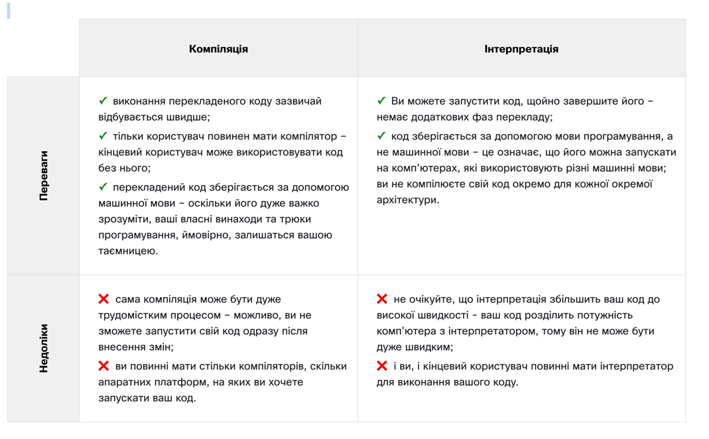

Що все це означає для вас?

Python є інтерпретованою мовою . Це означає, що він успадковує всі описані переваги та недоліки. Звичайно, це додає деякі свої унікальні функції до обох наборів.
Якщо ви хочете програмувати на Python, вам знадобиться інтерпретатор Python . Ви не зможете запустити свій код без нього. На щастя, Python безкоштовний . Це одна з найважливіших його переваг.
Через історичні причини мови, призначені для використання в інтерпретації, часто називають мовами сценаріїв , тоді як вихідні програми, закодовані з їх допомогою, називаються сценаріями . Гаразд, давайте познайомимося з Python.

1.2. Розділ 2 – Вступ до Python
Що таке Python?
Python — це широко використовувана, інтерпретована, об’єктно-орієнтована мова програмування високого рівня з динамічною семантикою, яка використовується для програмування загального призначення.

І хоча ви можете знати пітона як велику змію, назва мови програмування Python походить від старого комедійного серіалу ВВС під назвою « Летючий цирк Монті Пайтона» .

На піку свого успіху команда Monty Python виконувала свої скетчі перед глядачами по всьому світу, включно з Hollywood Bowl.

Оскільки Monty Python вважається однією з двох основних поживних речовин для програміста (інша — піца), творець Python назвав мову на честь телешоу.
1.2.2 Хто створив Python?

Однією з дивовижних особливостей Python є той факт, що це фактично робота однієї людини. Зазвичай нові мови програмування розробляють і публікують великі компанії, в яких працює багато професіоналів, і через правила авторського права дуже важко назвати когось із людей, які беруть участь у проекті. Python є винятком.

Не так багато мов, автори яких відомі поіменно. Python був створений Гвідо ван Россумом , який народився в 1956 році в Гарлемі, Нідерланди. Звичайно, Гвідо ван Россум не розробляв і не розвивав усі компоненти Python сам...

Швидкість, з якою Python поширився по всьому світу, є результатом безперервної роботи тисяч (дуже часто анонімних) програмістів, тестувальників, користувачів (багато з них не ІТ-фахівці) та ентузіастів, але слід сказати, що саме Перша ідея (зерно, з якого пророс Python) прийшла до однієї голови – Гвідо.

1.2.3 Проект програмування для хобі
Обставини, в яких був створений Python, трохи дивують. За словами Гвідо ван Россума:

У грудні 1989 року я шукав «хобі» програмування, яке б мене зайняло протягом тижня навколо Різдва. Мій офіс (...) був би закритий, але я мав домашній комп’ютер, і нічого іншого в мене не було. Я вирішив написати інтерпретатор для нової мови сценаріїв, про яку думав останнім часом: нащадок ABC, який сподобався б хакерам Unix/C. Я вибрав Python як робочу назву для проекту, перебуваючи в дещо нешанобливому настрої (і великий шанувальник «Летючого цирку» Монті Пайтона). Гвідо ван Россум
Цілі Python
У 1999 році Гвідо ван Россум визначив свої цілі щодо Python:

легка та інтуїтивно зрозуміла мова, така ж потужна, як і в основних конкурентів;
відкритий вихідний код , тому будь-хто може зробити свій внесок у його розвиток;
код, зрозумілий як проста англійська;
підходить для повсякденних завдань , що забезпечує короткий час розробки.
Приблизно через 20 років стало зрозуміло, що всі ці наміри здійснилися. Деякі джерела стверджують, що Python є найпопулярнішою мовою програмування у світі, а інші стверджують, що це друга чи третя.

У будь-якому випадку, він все ще займає високе місце в першій десятці PYPL Popularity of Programming Language і TIOBE Programming Community Index .

Python вже не молода мова. Це зрілий і надійний . Це не одноразове диво. Це яскрава зірка на небосхилі програмування, і час, витрачений на вивчення Python, є дуже гарною інвестицією.

1.2.4 Що робить Python таким особливим?
Чому саме Python?
Як сталося, що програмісти, молоді й старі, досвідчені й новачки, хочуть ним користуватися? Як сталося, що великі компанії перейняли Python і реалізували свої флагманські продукти на ньому?

Є багато причин – ми вже перерахували деякі з них, але давайте перерахуємо їх ще раз у більш практичній формі:

його легко вивчити - час, необхідний для вивчення Python, менший, ніж для багатьох інших мов; це означає, що можна швидше розпочати фактичне програмування;
легко викладати - навчальне навантаження менше, ніж потрібно для інших мов; це означає, що вчитель може робити більше уваги на загальних (незалежних від мови) методах програмування, не витрачаючи енергію на екзотичні трюки, дивні винятки та незрозумілі правила;
його легко використовувати для написання нового програмного забезпечення - часто можливо писати код швидше, використовуючи Python;
це легко зрозуміти - також часто легше зрозуміти чужий код швидше, якщо він написаний на Python;
його легко отримати, встановити та розгорнути - Python є безкоштовним, відкритим і багатоплатформним; не всі мови можуть цим похвалитися.

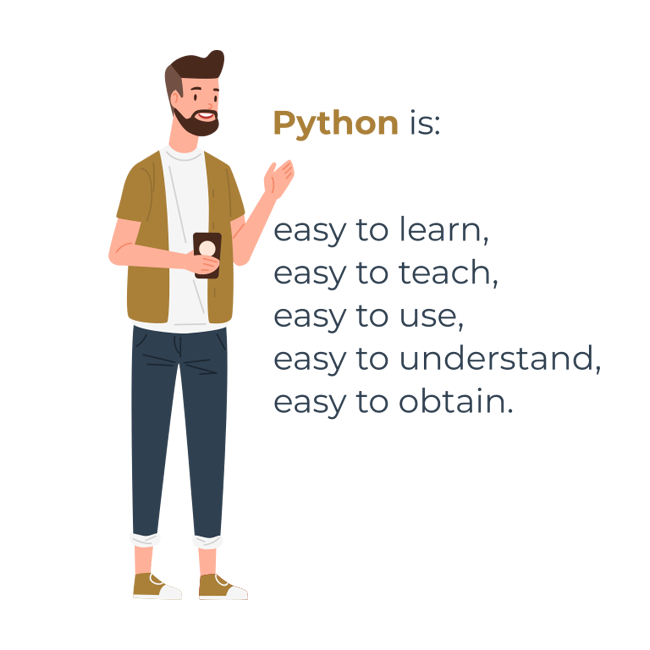
1.2.5 Конкуренти Python?
Python має двох прямих конкурентів із порівнянними властивостями та схильностями. Це:

Perl – мова сценаріїв, автором якої був Ларрі Уолл;
Ruby – мова сценаріїв, автором якої був Юкіхіро Мацумото.
Перший є більш традиційним і більш консервативним, ніж Python, і нагадує деякі старі мови, похідні від класичної мови програмування C.

Навпаки, останній є більш інноваційним і більш повним свіжих ідей, ніж Python. Сам Python знаходиться десь між цими двома творіннями.

Інтернет повний форумів з нескінченними дискусіями про перевагу одного з цих трьох над іншими, якщо ви хочете дізнатися більше про кожного з них.

1.2.6 Де можна побачити Python у дії?
Ми бачимо це щодня і майже всюди. Він широко використовується для впровадження складних інтернет-сервісів, таких як пошукові системи, хмарні сховища та інструменти, соціальні мережі тощо. Щоразу, коли ви користуєтеся будь-якою з цих служб, ви насправді дуже близькі до Python, хоча ви цього не підозрюєте.

Багато інструментів розробки реалізовано на Python. Все більше програм для повсякденного використання пишуться на Python. Багато вчених відмовилися від дорогих пропрієтарних інструментів і перейшли на Python. Багато тестувальників ІТ-проектів почали використовувати Python для виконання повторюваних процедур тестування. Список довгий

1.2.7 Чому не Python?
Незважаючи на зростання популярності Python, все ще є деякі ніші, де Python відсутній або рідко зустрічається:

низькорівневе програмування (іноді його називають «близьким до металевого» програмуванням): якщо ви хочете реалізувати надзвичайно ефективний драйвер або графічний механізм, ви не будете використовувати Python;
програми для мобільних пристроїв : хоча ця територія все ще чекає на завоювання Python, найімовірніше, колись це станеться.

1.2.8 Існує більше одного Python
Python 2 проти Python 3
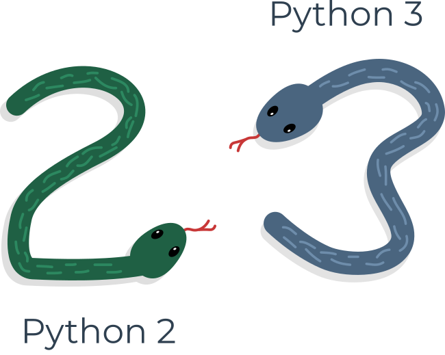
Існує два основних види Python, які називаються Python 2 і Python 3.

Python 2 є старішою версією оригінального Python. З тих пір його розробка була навмисно призупинена, хоча це не означає, що для нього немає оновлень. Навпаки, оновлення випускаються регулярно, але вони не мають на меті суттєвої зміни мови. Вони швидше виправляють будь-які щойно виявлені помилки та діри в безпеці. Шлях розвитку Python 2 уже зайшов у глухий кут, але сам Python 2 все ще живий.

Python 3 — це нова (точніше, поточна) версія мови. Воно проходить власний шлях еволюції, створюючи власні стандарти та звички.

Ці дві версії Python несумісні одна з одною. Сценарії Python 2 не працюватимуть у середовищі Python 3 і навпаки, тому якщо ви хочете, щоб старий код Python 2 запускався інтерпретатором Python 3, єдине можливе рішення — переписати його, звичайно, не з нуля, оскільки великі частини коду можуть залишитися недоторканими, але ви повинні переглянути весь код, щоб знайти всі можливі несумісності. На жаль, цей процес неможливо повністю автоматизувати.

Перенести стару програму Python 2 на нову платформу надто важко, довго, дорого та ризиковано, і навіть можливо, що переписування коду призведе до появи нових помилок. Простіше та розумніше залишити ці системи в спокої та вдосконалити існуючий інтерпретатор, замість того, щоб намагатися працювати всередині вже функціонуючого вихідного коду.

Python 2 проти Python 3
Python 3 — це не просто краща версія Python 2 — це зовсім інша мова, хоча й дуже схожа на свою попередницю. Коли дивишся на них здалеку, вони здаються однаковими, але придивившись уважніше, можна помітити багато відмінностей.

Якщо ви змінюєте старе існуюче рішення Python, то дуже ймовірно, що воно було закодовано в Python 2. Це причина, чому Python 2 досі використовується. Є занадто багато існуючих програм Python 2, щоб відкинути його взагалі.

  Примітка  
Якщо ви збираєтеся почати новий проект на Python, вам слід використовувати Python 3, і це версія Python, яка буде використовуватися під час цього курсу.

Важливо пам’ятати, що між наступними випусками Python 3 можуть бути менші або більші відмінності (наприклад, Python 3.6 за замовчуванням представив упорядковані ключі словника в рамках реалізації CPython) – однак хороша новина полягає в тому, що всі новіші версії Python 3 зворотно сумісні з попередніми версіями Python 3. Якщо це буде доцільно та важливо, ми завжди намагатимемося підкреслити ці відмінності в курсі.

Усі зразки коду, які ви знайдете під час курсу, були перевірені на Python 3.4, Python 3.6, Python 3.7, Python 3.8 і Python 3.9.

1.2.9 Реалізації Python
Крім Python 2 і Python 3, існує більше однієї версії кожного.

Після вікі-сторінки Python реалізація Python відноситься до «програми або середовища, які забезпечують підтримку для виконання програм , написаних мовою Python, як це представлено еталонною реалізацією CPython».

Традиційна реалізація Python, яка називається CPython , є еталонною версією обчислювальної мови Python від Гвідо ван Россума, і її найчастіше називають просто «Python» . Коли ви чуєте назву CPython , швидше за все, вона використовується для того, щоб відрізнити її від інших, нетрадиційних, альтернативних реалізацій.

Але все по порядку. Існують Pythons, які підтримуються людьми, зібраними навколо PSF ( Python Software Foundation ), спільноти, яка прагне розвивати, покращувати, розширювати та популяризувати Python та його середовище. Президентом PSF є сам Гвідо фон Россум, і з цієї причини ці Pythons називають канонічними . Вони також вважаються еталонними Python , оскільки будь-яка інша реалізація мови має відповідати всім стандартам, встановленим PSF.

Гвідо ван Россум використовував мову програмування «С» для реалізації найпершої версії своєї мови, і це рішення досі в силі. Усі Python, які надходять із PSF, написані мовою «C». Для такого підходу є багато причин. Один із них (імовірно, найважливіший) полягає в тому, що завдяки йому Python можна легко перенести та перенести на всі платформи з можливістю компілювати та запускати програми мовою "C" (практично всі платформи мають цю функцію, яка відкриває багато розширень можливості для Python).

Ось чому реалізацію PSF часто називають CPython . Це найвпливовіший Python серед усіх Python у світі.

Клацніть зображення, щоб дізнатися більше про членів сімейства Python і деякі з найпопулярніших альтернативних реалізацій Python.

1.3. Розділ 3 – Завантаження та встановлення Python

1.3.1 Почніть свою подорож Python
Як отримати Python і як його використовувати
Є кілька способів отримати власну копію Python 3, залежно від операційної системи, яку ви використовуєте.

Користувачі Linux, швидше за все, вже встановили Python - це найбільш імовірний сценарій, оскільки інфраструктура Python інтенсивно використовується багатьма компонентами ОС Linux.

Наприклад, деякі розповсюджувачі можуть поєднувати свої спеціальні інструменти разом із системою, і багато з цих інструментів, як-от менеджери пакетів, часто написані на Python. Деякі частини графічних середовищ, доступних у світі Linux, також можуть використовувати Python.

Якщо ви користувач Linux, відкрийте термінал/консоль і введіть:

python3
 
у підказці оболонки натисніть Enter і зачекайте. Якщо ви бачите щось подібне:

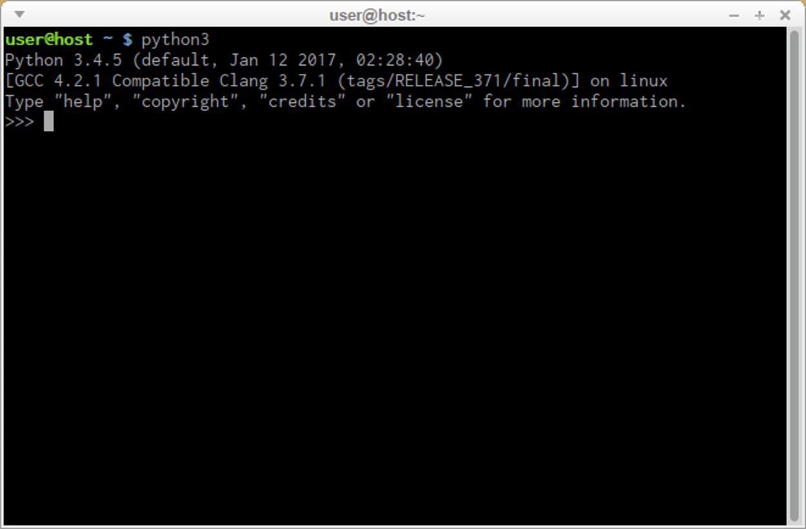
тоді вам більше нічого не потрібно робити.

Якщо Python 3 відсутній, зверніться до документації Linux, щоб дізнатися, як використовувати менеджер пакунків для завантаження та встановлення нового пакета – той, який вам потрібен, називається python3 або його назва починається з цього.

Усі користувачі, які не користуються Linux, можуть завантажити копію за адресою https://www.python.org/downloads/ .

1.3.2 Як завантажити, встановити та налаштувати Python
Оскільки браузер повідомляє сайту, який ви ввели ОС, яку ви використовуєте, єдиний крок, який вам потрібно зробити, це вибрати відповідну версію Python, яку ви бажаєте.

У цьому випадку виберіть Python 3. Сайт завжди пропонує вам останню його версію.

Якщо ви користувач Windows , запустіть завантажений файл .exe та виконайте всі кроки.

Наразі залиште параметри за замовчуванням, запропоновані інсталятором, за одним винятком – подивіться на прапорець « Додати Python 3.x до PATH» і поставте прапорець.

Це полегшить роботу.

Якщо ви користуєтеся macOS , можливо, на вашому комп’ютері вже попередньо встановлено версію Python 2, але оскільки ми працюватимемо з Python 3, вам все одно потрібно буде завантажити та встановити відповідний файл .pkg із сайту Python.

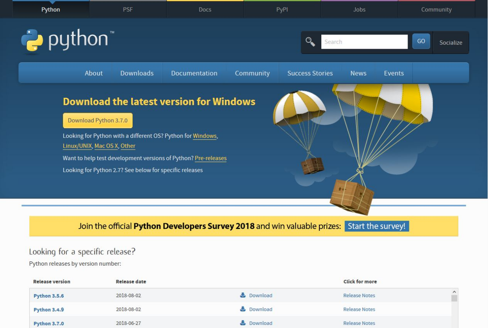
1.3.3 Початок роботи з Python
Тепер, коли ви встановили Python 3, настав час перевірити, чи він працює, і вперше використати його.

Це буде дуже проста процедура, але її має бути достатньо, щоб переконати вас, що середовище Python повне та функціональне.

Існує багато способів використання Python, особливо якщо ви збираєтеся бути розробником Python.

Для початку роботи вам знадобляться наступні інструменти:

редактор , який допоможе вам у написанні коду (він повинен мати деякі особливі функції, недоступні в простих інструментах); цей спеціальний редактор надасть вам більше, ніж стандартне обладнання ОС;
консоль , у якій ви можете запускати свій нещодавно написаний код і примусово зупиняти його, коли він вийде з-під контролю;
інструмент під назвою debugger , здатний запускати ваш код крок за кроком, що дозволить вам перевіряти його в кожен момент виконання.
Окрім багатьох корисних компонентів, стандартна інсталяція Python 3 містить дуже просту, але надзвичайно корисну програму під назвою IDLE.

IDLE - це абревіатура: Integrated Development and Learning Environment.

Перейдіть у меню вашої ОС, знайдіть IDLE десь під Python 3.x і запустіть його. Ось що ви повинні побачити:

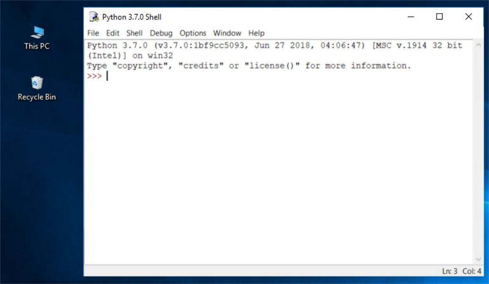
1.3.4 Ваша перша програма перед першою програмою...
Настав час написати та запустити вашу першу програму на Python 3. Поки що це буде дуже просто.

Першим кроком є створення нового вихідного файлу та заповнення його кодом. Клацніть «Файл» у меню IDLE та виберіть «Новий файл» .
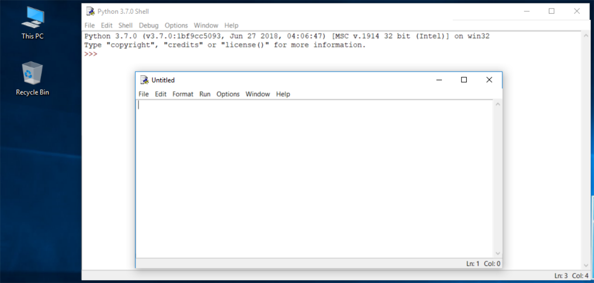
Як бачите, IDLE відкриває для вас нове вікно. Ви можете використовувати його для написання та зміни коду.

Це вікно редактора . Його єдине призначення — бути робочим місцем, де обробляється ваш вихідний код. Не плутайте вікно редактора з вікном оболонки. Вони виконують різні функції.

Вікно редактора наразі не має назви, але добре починати роботу з назви вихідного файлу.

Клацніть «Файл» (у новому вікні), потім клацніть « Зберегти як...» , виберіть папку для нового файлу (робочий стіл — гарне місце для ваших перших спроб програмування) і виберіть назву для нового файлу.

Примітка: не встановлюйте розширення для імені файлу, який ви збираєтеся використовувати. Python потребує, щоб його файли мали розширення .py , тому вам слід покладатися на значення за замовчуванням діалогового вікна. Використання стандартного розширення .py дозволяє ОС правильно відкривати ці файли.

Тепер додайте лише один рядок у щойно відкрите та назване вікно редактора.

Рядок виглядає так:
print("Hisssssss...")
Ви можете використовувати буфер обміну, щоб скопіювати текст у файл.

Ми не будемо зараз пояснювати значення програми. Ви знайдете детальне обговорення в наступному розділі.

Подивіться уважніше на лапки. Це найпростіша форма лапок (нейтральні, прямі, тупі тощо), які зазвичай використовуються у вихідних файлах. Не намагайтеся використовувати друкарські лапки (вигнуті, фігурні, розумні тощо), які використовуються вдосконаленими текстовими процесорами, оскільки Python їх не приймає.

Збережіть файл ( File -> Save ) і запустіть програму ( Run -> Run Module ).

Якщо все гаразд і в коді немає помилок, вікно консолі покаже вам наслідки, спричинені запуском програми.

У цьому випадку програма шипить .

Спробуйте запустити його ще раз. І ще раз.

Тепер закрийте обидва вікна та поверніться на робочий стіл.

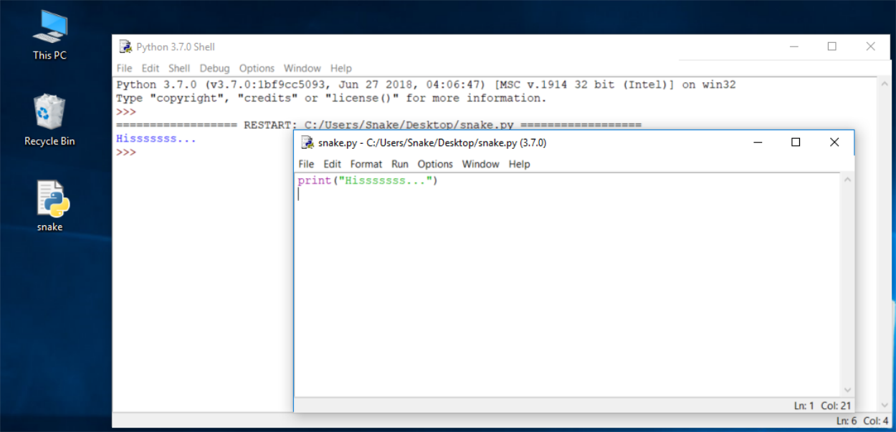

1.3.5 Як зіпсувати та виправити код
Тепер знову запустіть IDLE.

Натисніть «Файл» , «Відкрити» , наведіть вказівник миші на файл, який ви зберегли раніше, і дозвольте IDLE прочитати його.
Спробуйте запустити його знову, натиснувши F5 , коли вікно редактора активне.
Як бачите, IDLE може зберегти ваш код і отримати його, коли він вам знадобиться знову.

IDLE містить одну додаткову та корисну функцію.

Спочатку видаліть закриваючу дужку.
Потім знову введіть круглі дужки.
Ваш код має виглядати як наведений нижче:
Hisssssss...
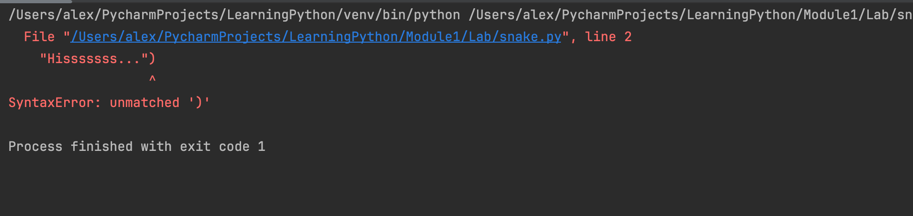
Щоразу, коли ви ставите закриваючу дужку у програму, IDLE показуватиме частину тексту, обмежену парою відповідних дужок. Це допоможе вам не забути розмістити їх парами .
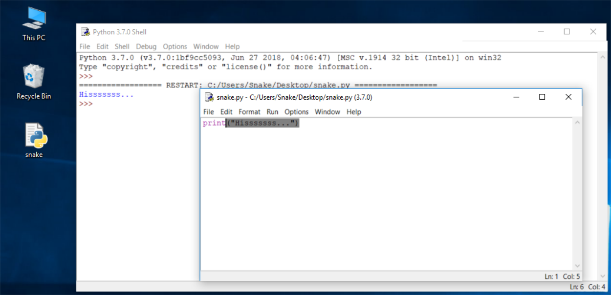
Знову зніміть закриваючу дужку. Код стає помилковим. Тепер він містить синтаксичну помилку. IDLE не повинен дозволяти вам запускати його.

Спробуйте запустити програму ще раз. IDLE нагадає вам зберегти змінений файл. Дотримуйтесь інструкцій.

Уважно огляньте всі вікна.

З’являється нове вікно – воно повідомляє, що інтерпретатор натрапив на EOF ( кінець файлу ), хоча (на його думку) код повинен містити ще трохи тексту.

У вікні редактора чітко показано, де це сталося.

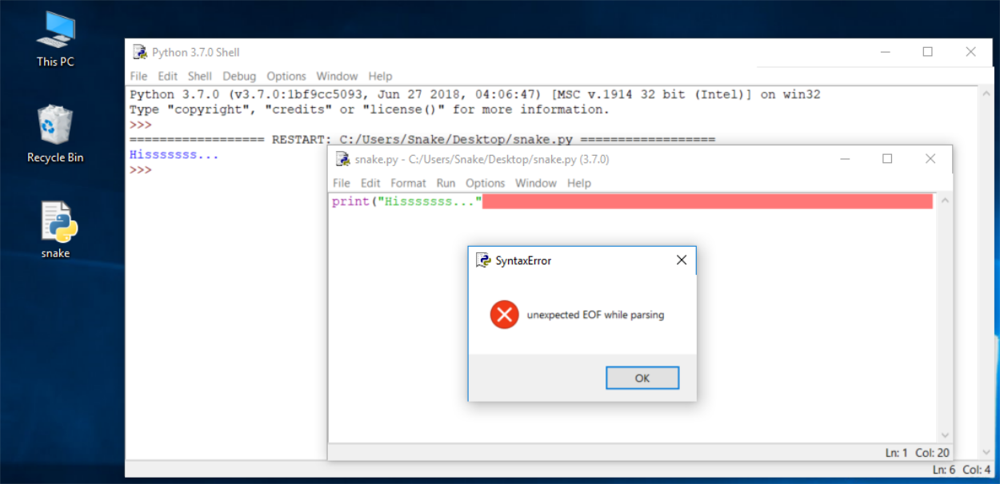
Виправте код зараз. Це має виглядати так:

print("Hisssssss...")
 
Запустіть його, щоб побачити, чи він знову «шипить».

Давайте ще раз зіпсуємо код. Видаліть одну букву зі слова друку . Запустіть код, натиснувши F5 . Що тепер відбувається? Як бачите, Python не може розпізнати інструкцію.

Можливо, ви помітили, що повідомлення про помилку, створене для попередньої помилки, значно відрізняється від першого.
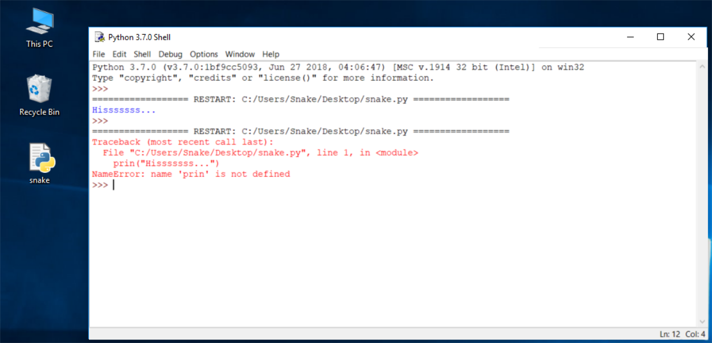
Це тому, що природа помилки інша , і помилка виявляється на іншому етапі інтерпретації.

Вікно редактора не надасть жодної корисної інформації щодо помилки, але вікна консолі можуть.

Повідомлення ( червоним кольором ) показує (у наступних рядках):

traceback (це шлях , який код проходить через різні частини програми – ви можете поки що його ігнорувати, оскільки він порожній у такому простому коді);
розташування помилки (назва файлу, що містить помилку, номер рядка та назва модуля); примітка: число може ввести в оману, оскільки Python зазвичай показує місце, де вперше помічає наслідки помилки, не обов’язково саму помилку;
зміст помилкового рядка ; примітка: вікно редактора IDLE не показує номери рядків, але відображає поточне розташування курсору в нижньому правому куті; використовуйте його, щоб знайти помилковий рядок у довгому вихідному коді;
назву помилки та коротке пояснення.
Експериментуйте зі створенням нових файлів і виконанням коду. Спробуйте вивести на екран інше повідомлення, наприклад,рев!,нявкати, або навіть, можливохрю!. Спробуйте зіпсувати та виправити свій код – побачите, що вийде.
