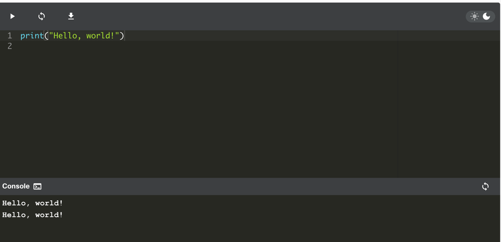
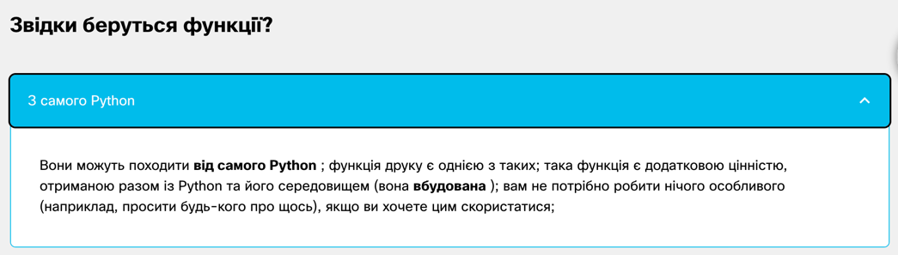
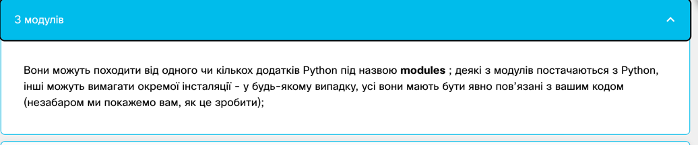
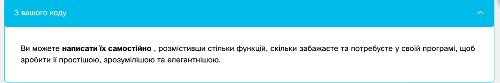
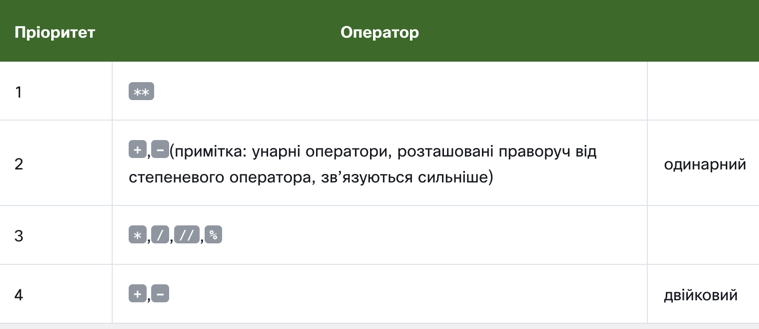
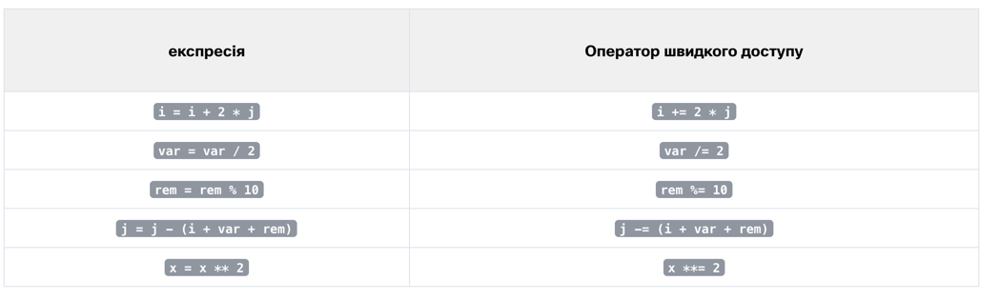
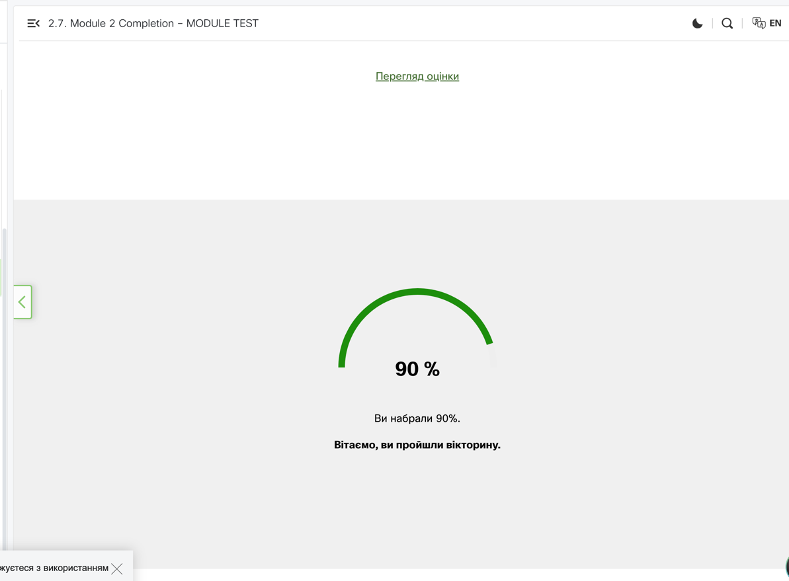

2.1. Розділ 1 – "Hello, World!" програма
2.1.1 Ваша перша програма
Настав час почати писати справжній робочий код Python . Поки що це буде дуже просто.

Оскільки ми збираємося показати вам деякі фундаментальні концепції та терміни, ці фрагменти коду не будуть такими серйозними чи складними.

Запустіть код у вікні редактора. Якщо тут все буде добре, ви побачите рядок тексту у вікні консолі.

Крім того, запустіть IDLE, створіть новий вихідний файл Python, заповніть його цим кодом, назвіть файл і збережіть його. Тепер запустіть його. Якщо все піде добре, ви побачите текст у лапках у вікні консолі IDLE. Код, який ви запустили, має виглядати знайомим. Ви побачили щось дуже схоже, коли ми проводили вас через налаштування середовища IDLE.


Зараз ми витратимо деякий час на те, щоб показати і пояснити вам, що ви насправді бачите і чому це виглядає саме так.

Як бачите, перша програма складається з наступних частин:

слово print;
відкриваюча дужка;
лапка;
рядок тексту: Hello, World!;
інша лапка;
закриваюча дужка.
Кожне з перерахованого вище відіграє дуже важливу роль у коді.

2.1.2 Функція print().
Подивіться на рядок коду нижче:

```print("Hello, World!")```

Слово print , яке ви можете побачити тут, є назвою функції . Це не означає, що де б не з’явилося слово, це завжди назва функції. Значення слова походить від контексту, у якому це слово було використано.

Ви, мабуть, неодноразово зустрічали термін функція на уроках математики. Ймовірно, ви також можете перелічити кілька назв математичних функцій, наприклад синус або логарифм.

Проте функції Python є більш гнучкими та можуть містити більше вмісту, ніж їхні математичні побратими.

Функція (у цьому контексті) — це окрема частина комп’ютерного коду, здатна:

викликати певний ефект (наприклад, надіслати текст на термінал, створити файл, намалювати зображення, відтворити звук тощо); це щось зовсім нечуване у світі математики;
обчислювати значення (наприклад, квадратний корінь із значення або довжину заданого тексту) і повертати його як результат функції ; це те, що робить функції Python родичами математичних понять.
Крім того, багато функцій Python можуть виконувати дві вищевказані речі разом.




Ім'я функції має бути значущим (ім'я функції друку зрозуміле саме собою).

Звичайно, якщо ви збираєтеся використовувати будь-яку вже існуючу функцію, ви не маєте впливу на її назву, але коли ви починаєте писати свої власні функції, вам слід уважно поставитися до вибору імен.

2.1.3 Аргументи функції
Як ми вже говорили раніше, функція може мати:

ефект ;

результат .

Є ще третя, дуже важлива, функціональна складова – аргумент (и).

Математичні функції зазвичай приймають один аргумент. Наприклад, sin(x) приймає x, який є мірою кута.

Функції Python, з іншого боку, більш універсальні. Залежно від індивідуальних потреб, вони можуть прийняти будь-яку кількість аргументів – стільки, скільки необхідно для виконання своїх завдань. Примітка. Коли ми говоримо будь-яке число , яке включає нуль, деякі функції Python не потребують аргументів.

```print("Hello, World!")```

Незважаючи на кількість необхідних/наданих аргументів, функції Python настійно вимагають наявності пари круглих дужок – відкриваючої та закриваючої, відповідно.

Якщо ви хочете передати функції один або кілька аргументів, ви розміщуєте їх у круглих дужках . Якщо ви збираєтеся використовувати функцію, яка не приймає жодних аргументів, вам все одно потрібно мати дужки.

Примітка: щоб відрізнити звичайні слова від імен функцій, помістіть пару порожніх дужок після їхніх імен, навіть якщо відповідна функція потребує одного або кількох аргументів. Це стандартна домовленість.

Функція, про яку ми тут говоримо, це print().

Чи print()має функція в нашому прикладі аргументи?

Звичайно, так, але які вони?
Рядок як аргумент функції print().
Єдиним аргументом, що надається функції print()в цьому прикладі, є рядок :

print("Hello, World!")

Як бачите, рядок розділено лапками – насправді лапки утворюють рядок – вони вирізають частину коду та присвоюють йому інше значення.

Ви можете собі уявити, що цитати говорять щось на зразок: текст між нами не є кодом. Він не призначений для виконання, і ви повинні сприймати його як є.

Майже все, що ви поміщаєте в лапки, сприйматиметься буквально, не як код, а як дані . Спробуйте пограти з цим конкретним рядком – змініть його, введіть новий вміст, видаліть частину наявного вмісту.

Існує більше одного способу вказати рядок у коді Python, але наразі цього достатньо.

Наразі ви дізналися про дві важливі частини коду: функцію та рядок. Ми говорили про них з точки зору синтаксису, але тепер настав час обговорити їх з точки зору семантики.
2.1.4 Виклик функції
Ім’я функції ( у цьому випадку друкується ) разом із дужками й аргументом(ами) формує виклик функції .


```print("Hello, World!")```
 
Незабаром ми обговоримо це докладніше, але давайте просто проллємо трохи світла прямо зараз.

Що відбувається, коли Python стикається з таким викликом, як наведений нижче?
```function_name(argument)```
Давайте подивимося:

Спочатку Python перевіряє, чи вказана назва є законною (він переглядає свої внутрішні дані, щоб знайти існуючу функцію імені; якщо цей пошук не вдається, Python перериває код)
по-друге, Python перевіряє, чи вимоги функції щодо кількості аргументів дозволяють вам викликати функцію таким чином (наприклад, якщо певна функція вимагає рівно два аргументи, будь-який виклик, який надає лише один аргумент, вважатиметься помилковим і призведе до переривання коду виконання)
по-третє, Python на мить залишає ваш код і переходить до функції, яку ви хочете викликати; звичайно, він також приймає ваш аргумент(и) і передає його/їх у функцію;
по-четверте, функція виконує свій код , викликає бажаний ефект (якщо такий є), оцінює бажаний результат(и) (якщо такий є) і завершує своє завдання;
нарешті, Python повертається до вашого коду (на місце одразу після виклику) і відновлює його виконання.


2.1.6 Функція print() та її ефект, аргументи та значення, що повертаються
Треба якнайшвидше відповісти на три важливі питання:

1. Який ефект робить print() причина функції?

Ефект дуже корисний і дуже ефектний. Функція:

- приймає свої аргументи (він може приймати більше ніж один аргумент, а також може приймати менше одного аргументу)
- перетворює їх у зрозумілу людині форму, якщо це необхідно (як ви можете підозрювати, рядки не потребують цієї дії, оскільки рядок уже читається)
і відправляє отримані дані на пристрій виведення (зазвичай на консоль); іншими словами, все, що ви вкладаєте вдрукувати()на екрані з’явиться функція.
Тож не дивно, що відтепер ви будете використовувати print() дуже інтенсивно, щоб побачити результати ваших операцій і оцінок.

2. Які аргументи робить print() очікувати?

Будь-який. Ми скоро вам це покажемо print() може працювати практично з усіма типами даних, які пропонує Python. Рядки, числа, символи, логічні значення, об’єкти ‒ будь-який із них можна успішно передатидрукувати().

3. Яке значення має друкувати() повернення функції?

Жодного. Його ефекту достатньо.

2.1.7 Інструкції
Ви вже бачили комп’ютерну програму, яка містить один виклик функції. Виклик функції є одним із багатьох можливих типів інструкцій Python .

Звичайно, будь-яка складна програма зазвичай містить набагато більше інструкцій, ніж одну. Виникає питання: як поєднати більше ніж одну інструкцію в код Python?

Синтаксис Python досить специфічний у цій галузі. На відміну від більшості мов програмування, Python вимагає, щоб у рядку було не більше однієї інструкції .

Рядок може бути порожнім (тобто він може взагалі не містити інструкцій), але він не повинен містити дві, три або більше інструкцій. Це суворо заборонено.

Примітка: Python робить один виняток із цього правила – він дозволяє одній інструкції розповсюджуватися на кілька рядків (що може бути корисним, якщо ваш код містить складні конструкції).

Давайте трохи розширимо код. Ви можете побачити це в редакторі нижче. Запустіть його та зверніть увагу на те, що ви бачите на консолі.

Тепер ваша консоль Python має виглядати так:

The itsy bitsy spider climbed up the waterspout.
Down came the rain and washed the spider out.
Вихід
Це гарна нагода зробити деякі спостереження:

програма викликаєдрукувати()функціонувати двічі , і ви можете побачити два окремих рядки в консолі ‒ це означає, щодрукувати()починає виведення з нового рядка кожного разу, коли починає виконання; ви можете змінити цю поведінку, але ви також можете використовувати її на свою користь;
кожендрукувати()виклик містить інший рядок як аргумент, і вміст консолі відображає це – це означає, що інструкції в коді виконуються в тому ж порядку, в якому вони були розміщені у вихідному файлі; жодна наступна інструкція не виконується, доки не буде виконана попередня (є деякі винятки з цього правила, але ви можете їх поки що ігнорувати.)
Ми дещо змінили приклад – додали один порожній print() виклик функції. Ми називаємо його порожнім, тому що ми не передали функції жодних аргументів.

Ви можете побачити це у вікні редактора. Запустіть код.

Що сталося?

Якщо все йде правильно, ви повинні побачити щось на зразок цього:

The itsy bitsy spider climbed up the waterspout.
 
Down came the rain and washed the spider out.
Вихід
Як бачите, порожньодрукувати()виклик не такий порожній, як ви, можливо, очікували – він виводить порожній рядок або (така інтерпретація також правильна) він виводить новий рядок.

Це не єдиний спосіб створити новий рядок у консолі виводу. Зараз ми покажемо вам інший спосіб.

2.1.8 Символи Escape та нового рядка Python
Ми знову змінили код. Подивіться уважно.

Є дві дуже тонкі зміни – ми вставили в риму дивну пару символів. Вони виглядають так:\n.

Цікаво, що хоча ви бачите два символи, Python бачить один.

Зворотний слеш ( \) має особливе значення, коли він використовується всередині рядків – це називається екрануючим символом .

Слово escape слід розуміти конкретно – це означає, що ряд символів у рядку на мить (дуже короткий момент) виходить, щоб ввести особливе включення.

Іншими словами, зворотна скісна риска сама по собі нічого не означає, а є лише свого роду повідомленням про те, що наступний символ після зворотної скісної риски також має інше значення.

Літера nпісля зворотної скісної риски походить від слова новий рядок .

І зворотна скісна риска, і n утворюють спеціальний символ під назвою символ нового рядка , який спонукає консоль почати новий рядок виводу .
Запустіть код. Тепер ваша консоль має виглядати так:

Запустіть код. Тепер ваша консоль має виглядати так:

The itsy bitsy spider
climbed up the waterspout.
 
Down came the rain
and washed the spider out.
Вихід
Як бачите, у дитячому віршику з’являються два нові рядки в тих місцях, де є\nбули використані.

Ця конвенція має два важливі наслідки:

1. Якщо ви хочете поставити лише одну зворотну скісну риску всередині рядка, не забувайте про її екранування – її потрібно подвоїти. Наприклад, такий виклик спричинить помилку:

print("\")

тоді як цей не буде:


print("\\")

2. Не всі escape-пари (зворотна коса риска в поєднанні з іншим символом) щось означають.

Поекспериментуйте зі своїм кодом у редакторі, запустіть його та подивіться, що вийде.

2.1.9 Використання кількох аргументів
Поки що ми тестували print()поведінку функції без аргументів і з одним аргументом. Також варто спробувати підгодуватидрукувати()функція з більш ніж одним аргументом.

Подивіться на вікно редактора. Ось що ми зараз перевіримо:

Є одиндрукувати()виклик функції, але вона містить три аргументи . Усі вони струни.

Аргументи розділяються комами . Ми оточили їх пробілами, щоб зробити їх більш видимими, але насправді це не обов’язково, і ми більше не будемо цього робити.

У цьому випадку коми, що розділяють аргументи, відіграють зовсім іншу роль, ніж кома всередині рядка. Перший є частиною синтаксису Python, тоді як другий призначений для показу в консолі.

Якщо ви подивіться на код ще раз, ви побачите, що всередині рядків немає пробілів.

Запустіть код і подивіться, що станеться.

На консолі має відображатися такий текст:

The itsy bitsy spider climbed up the waterspout.
Вихід
Пробіли, видалені з рядків, з'явилися знову. Ви можете пояснити чому?

З цього прикладу можна зробити два висновки:

aдрукувати()функція, викликана з більш ніж одним аргументом, виводить їх усі в один рядок ;
вдрукувати()функція ставить пробіл між виведеними аргументами за власною ініціативою.

2.1.10 Позиційні аргументи
Тепер, коли ви трохи знаєте про print()налаштування функцій, ми покажемо вам, як їх змінити.

Ви повинні мати можливість передбачити результат, не запускаючи код у редакторі.

play_arrow
синхронізація
завантажити
light_mode
темний_режим
Консоль 
термінал
синхронізація
My name is Python.
Monty Python.
Спосіб, яким ми передаємо аргументи у print()функцію, є найпоширенішим у Python і називається позиційним способом . Ця назва походить від того факту, що значення аргументу продиктовано його позицією (наприклад, другий аргумент буде виведено після першого, а не навпаки).

Запустіть код і перевірте, чи результат відповідає вашим прогнозам.

Спосіб, яким ми передаємо аргументи у print()функцію, є найпоширенішим у Python і називається позиційним способом . Ця назва походить від того факту, що значення аргументу продиктовано його позицією (наприклад, другий аргумент буде виведено після першого, а не навпаки).

Запустіть код і перевірте, чи результат відповідає вашим прогнозам.

2.1.11 Аргументи ключових слів
Python пропонує інший механізм для передачі аргументів, який може бути корисним, коли ви хочете переконатидрукувати()функцію, щоб дещо змінити свою поведінку.

Ми не збираємося зараз детально пояснювати це. Ми плануємо це зробити, коли говоримо про функції. Наразі ми просто хочемо показати вам, як це працює. Не соромтеся використовувати його у своїх програмах.

Цей механізм називається аргументами ключового слова . Назва походить від того факту, що значення цих аргументів береться не з їх розташування (позиції), а зі спеціального слова (ключового слова), яке використовується для їх ідентифікації.

Theдрукувати()функція має два ключових аргументи, які ви можете використовувати для своїх цілей. Перший називаєтьсякінець.

У вікні редактора ви можете побачити дуже простий приклад використання аргументу ключового слова.

play_arrow
синхронізація
завантажити
light_mode
темний_режим
Консоль 
термінал
синхронізація
Мене звати Python. Монті Пайтон.
Для його використання необхідно знати деякі правила:

аргумент ключового слова складається з трьох елементів: ключове слово , що ідентифікує аргумент (кінецьтут); знак рівності (=); і значення , присвоєне цьому аргументу;
будь-які аргументи ключового слова мають бути розміщені після останнього позиційного аргументу (це дуже важливо)
У нашому прикладі ми використаликінецьаргумент ключового слова та встановіть його як рядок, що містить один пробіл.

Запустіть код, щоб побачити, як він працює.

На консолі має відображатися такий текст:

My name is Python. Monty Python.
Вихід
Як бачите,кінецьаргумент ключового слова визначає символи theдрукувати()функція надсилає на вихід, коли досягає кінця своїх позиційних аргументів.

Поведінка за замовчуванням відображає ситуацію, коликінецьАргумент ключового слова неявно використовується таким чином:end="\n".

А тепер настав час спробувати щось складніше.

Якщо ви уважно подивитесь, то побачите, що ми використаликінецьаргумент, але призначений йому рядок порожній (він взагалі не містить символів).

Що тепер буде? Запустіть програму в редакторі, щоб дізнатися.

play_arrow
синхронізація
завантажити
light_mode
темний_режим
Консоль 
термінал
синхронізація
Мене звати Монті Пайтон.
Яккінецьаргумент було встановлено нанівець, theдрукувати()функція також нічого не виводить, коли її позиційні аргументи вичерпано.

На консолі має відображатися такий текст:

My name is Monty Python.
Вихід
Примітка: жодного нового рядка не було надіслано до виводу .

Рядок, призначений длякінецьаргумент ключового слова може мати будь-яку довжину. Експериментуйте з цим, якщо хочете.

Раніше ми говорили, щодрукувати()функція відокремлює свої вихідні аргументи пробілами. Цю поведінку також можна змінити.

Аргумент ключового слова , який може це зробити, називаєтьсявер(як у розділювачі ).

Перегляньте код у редакторі та запустіть його.

play_arrow
синхронізація
завантажити
light_mode
темний_режим
Консоль 
термінал
синхронізація
Theвераргумент дає такі результати:

My-name-is-Monty-Python.
Вихід
Theдрукувати()функція тепер використовує тире замість пробілу для розділення виведених аргументів.

Примітка:верзначення аргументу також може бути порожнім рядком. Спробуйте самі.

Обидва аргументи ключового слова можуть бути змішані під час одного виклику , як тут у вікні редактора.

play_arrow
синхронізація
завантажити
light_mode
темний_режим
Консоль 
термінал
синхронізація
Приклад не має особливого сенсу, але він наочно представляє взаємодію міжкінецьівер.

Чи можете ви передбачити результат?

Запустіть код і перевірте, чи відповідає він вашим прогнозам.

Тепер, коли ви розумієтедрукувати()ви готові розглянути, як зберігати та обробляти дані в Python.

бездрукувати(), ви не зможете побачити жодних результатів.


1. print()Функція є вбудованою . Він друкує/виводить вказане повідомлення на екран/вікно консолі.

2. Вбудовані функції, на відміну від призначених для користувача функцій, завжди доступні, і їх не потрібно імпортувати. Python 3.8 містить 69 вбудованих функцій. Ви можете знайти їхній повний список в алфавітному порядку в стандартній бібліотеці Python .

3. Щоб викликати функцію (цей процес відомий як виклик функції або виклик функції ), вам потрібно використати назву функції, за якою слідують дужки. Ви можете передати аргументи у функцію, помістивши їх у круглі дужки. Ви повинні розділяти аргументи комою, наприклад, print("Hello,", "world!"). Функція "пустий" print()виводить на екран порожній рядок.

4. Рядки Python розділяються лапками , наприклад, "I am a string"(подвійні лапки) або 'I am a string, too'(одинарні лапки).

5. Комп’ютерні програми – це збірки інструкцій . Інструкція — це команда для виконання певного завдання, наприклад, для виведення певного повідомлення на екран.

Давайте подивимося, чого ви сьогодні навчилися.
6. У рядках Python зворотна коса риска ( \) є спеціальним символом, який сповіщає, що наступний символ має інше значення, наприклад, \n( символ нового рядка ) починає новий вихідний рядок.

7. Позиційні аргументи – це ті, значення яких продиктовано їхньою позицією, наприклад, другий аргумент виводиться після першого, третій – після другого тощо.

8. Аргументи ключових слів - це ті, значення яких визначається не їх розташуванням, а спеціальним словом (ключовим словом), яке використовується для їх ідентифікації.

9. Параметри endта sepможна використовувати для форматування виводу функції print(). Параметр sepвизначає роздільник між виведеними аргументами, наприклад, print("H", "E", "L", "L", "O", sep="-"), тоді як endпараметр визначає, що друкувати в кінці оператора друку.

2.1.15 РОЗДІЛ ВІКТОРИНА
Запитання 1 : Який результат роботи наступної програми?


print("My\nname\nis\nBond.", end=" ")
print("James Bond.")
 
Перевірте
Мене 
звати 
Бонд 
. Джеймс Бонд.
Запитання 2 : Який результат роботи наступної програми?


print(sep="&", "fish", "chips")
 
Перевірте
  Файл "main.py", рядок 1 
    print(sep="&", "fish", "chips") 
                  ^ 
SyntaxError: позиційний аргумент слідує за аргументом ключового слова
Пам’ятайте : аргументи ключового слова слід передавати після будь-яких необхідних позиційних аргументів.

Запитання 3 : Який із наведених нижче викликів функції print() спричинить SyntaxError ?

print('Greg\'s book.')
print("'Greg's book.'")
print('"Greg\'s book."')
print("Greg\'s book.")
print('"Greg's book."')
 
Перевірте
Рядок 5 підніметьсяСинтаксична помилка, тому що'символ вКнига Грега.для рядка потрібен символ екранування.


2.2. Розділ 2 – Літерали Python
2.2.1 Літерали – дані самі по собі

Тепер, коли ви маєте трохи знань про деякі потужні функції, які пропонуєдрукувати()функція, настав час дізнатися про деякі нові проблеми та один важливий новий термін ‒ буквальне .

Літерал — це дані, значення яких визначаються самим літералом .

Оскільки цю концепцію важко зрозуміти, хороший приклад може бути корисним.

Подивіться на наступний набір цифр:

123
Чи можете ви здогадатися, яку цінність він представляє? Звичайно, можна – сто двадцять три .

Але як щодо цього:

c
Чи представляє це якусь цінність? Може бути. Це може бути, наприклад, символ швидкості світла. Це також може бути константа інтегрування. Або навіть довжина гіпотенузи в сенсі теореми Піфагора. Є багато можливостей.

Без додаткових знань ви не зможете вибрати правильний.

І це підказка:123є буквальним, івне.

Ви використовуєте літерали для кодування даних і розміщення їх у своєму коді . Зараз ми покажемо вам деякі умовності, яких ви повинні дотримуватися під час використання Python.

Почнемо з простого експерименту – подивіться на фрагмент у редакторі.

play_arrow
синхронізація
завантажити
light_mode
темний_режим
Консоль 
термінал
синхронізація
2
2
Перший рядок виглядає знайомим. Друге видається помилковим через видиму відсутність лапок.

Спробуйте запустити його.

Якщо все піде добре, ви побачите дві однакові лінії.

Що сталося? Що це означає?

У цьому прикладі ви зіткнетеся з двома різними типами літералів:

рядок , який ви вже знаєте,
і ціле число, щось абсолютно нове.
Функція print()представляє їх точно так само – цей приклад очевидний, оскільки їхнє зрозуміле для людини представлення також однакове. Внутрішньо, у пам’яті комп’ютера, ці два значення зберігаються абсолютно різними способами – рядок існує як просто рядок – ряд літер.

Число перетворюється в машинне представлення (набір бітів). Функція print()здатна показати їх обидва у формі, зрозумілій для людей.

Зараз ми приділимо деякий час обговоренню числових літералів та їх внутрішнього життя.

Літерали в програмуванні — це конкретні значення, які безпосередньо включаються в код. Вони визначаються самим значенням, яке записано в коді, і не змінюються під час виконання програми. Літерали відносяться до різних типів даних, і вони дозволяють програмістам явно вказувати значення цих типів у коді. Нижче наведено основні типи літералів у Python:

Цілочисельні літерали:

python
Копіювати код
10  # Ціле число
-5  # Від'ємне ціле число
0b1010  # Двійковий літерал (10 у десятковій системі)
0o12  # Восьмеричний літерал (10 у десятковій системі)
0xA  # Шістнадцятковий літерал (10 у десятковій системі)
Реальні числа (літерали з плаваючою точкою):

python
Копіювати код
10.5  # Дійсне число
-0.1  # Від'ємне дійсне число
1.5e2  # Дійсне число у науковій нотації (1.5 * 10^2)
Рядкові літерали:

python
Копіювати код
"Hello, world!"  # Рядок у подвійних лапках
'Python'  # Рядок в одинарних лапках
"""This is a multi-line string."""  # Багаторядковий рядок у потрійних лапках
Булеві літерали:

python
Копіювати код
True  # Булеве значення істини
False  # Булеве значення хибності
Літерал None:

python
Копіювати код
None  # Спеціальне значення, що вказує на відсутність значення
Літерали відрізняються від змінних тим, що їхнє значення є фіксованим у коді. Наприклад, у наступному прикладі:

python
Копіювати код
x = 10  # x - змінна, а 10 - цілочисельний літерал
Тут 10 — це літерал, який представляє цілочисельне значення, і він присвоюється змінній x.

Отже, літерали — це конкретні значення, що представляють дані у коді, і вони належать до різних типів даних, таких як цілі числа, дійсні числа, рядки, булеві значення і спеціальні значення, як-от None.

2.2.2 Цілі числа
Можливо, ви вже трохи знаєте про те, як комп’ютери виконують обчислення чисел. Можливо, ви чули про двійкову систему і знаєте, що це система, яку комп’ютери використовують для зберігання чисел, і що ці комп’ютери можуть виконувати над ними будь-які операції.

Ми не будемо досліджувати тут тонкощі позиційних систем числення, але скажемо, що числа, які обробляють сучасні комп’ютери, бувають двох типів:

цілі числа , тобто ті, які позбавлені дробової частини;
і числа з плаваючою комою (або просто floats ), які містять (або можуть містити) дробову частину.
Це визначення не зовсім точне, але поки що цілком достатньо. Різниця дуже важлива, і межа між цими двома типами чисел дуже сувора. Обидва ці типи чисел суттєво відрізняються способом зберігання в пам’яті комп’ютера та діапазоном допустимих значень.

Характеристика числового значення, яка визначає його вид, діапазон і застосування, називається типом .

Якщо ви кодуєте літерал і розміщуєте його в коді Python, форма літералу визначає представлення (тип), яке Python використовуватиме для його зберігання в пам’яті .

Наразі залишимо числа з плаваючою комою осторонь (незабаром ми повернемося до них) і розглянемо питання про те, як Python розпізнає цілі числа.

Процес майже схожий на те, як ви записуєте їх олівцем на папері - це просто рядок цифр, які складають число. Але є застереження – не можна вставляти в число символи, які не є цифрами.

Візьмемо, наприклад, число одинадцять мільйонів сто одинадцять тисяч сто одинадцять . Якби ви зараз узяли в руки олівець, ви б написали число так: 11,111,111, або так: 11.111.111, або навіть так: 11 111 111.

Зрозуміло, що це положення полегшує читання, особливо коли число складається з багатьох цифр. Однак Python не приймає подібних речей. Це заборонено . Що Python дозволяє, так це використання підкреслень у числових літералах.*

Тому ви можете записати це число або так: 11111111, або так: 11_111_111.

Примітка  *Python 3.6 представив підкреслення в числових літералах, дозволяючи розміщувати одне підкреслення між цифрами та після базових специфікаторів для покращення читабельності. Ця функція недоступна в старіших версіях Python.

І як ми кодуємо від’ємні числа в Python? Як завжди – додавши мінус . Ви можете написати: -11111111, або -11_111_111.

Перед додатними числами не обов’язково ставити знак плюс, але це дозволено, якщо ви бажаєте це зробити. Наступні рядки описують те саме число: +11111111і 11111111.

Вісімкові та шістнадцяткові числа
У Python є дві додаткові угоди, які невідомі світові математики. Перший дозволяє нам використовувати числа у вісімковому представленні.

Якщо перед цілим числом стоїть an0Oабо0oпрефікс (нуль-о), він буде розглядатися як вісімкове значення. Це означає, що число має містити лише цифри з діапазону [0..7].

0o123це вісімкове число з (десятковим) значенням, рівним83.

Theдрукувати()функція виконує перетворення автоматично. Спробуйте це:


print(0o123)
 
Друга конвенція дозволяє нам використовувати шістнадцяткові числа. Таким числам повинен передувати префікс0xабо0X(нуль-х).

0x123це шістнадцяткове число з (десятковим) значенням, рівним291. Theдрукувати()функція також може керувати цими значеннями. Спробуйте це:

play_arrow
синхронізація
завантажити
light_mode
темний_режим
Консоль 
термінал
синхронізація


2.2.3 Поплавці
Тепер настав час поговорити про інший тип, який призначений для представлення та зберігання чисел, які (як сказав би математик) мають непорожній десятковий дріб .

Це числа, які мають (або можуть мати) дробову частину після десяткової коми, і хоча таке визначення дуже погане, воно, безумовно, достатньо для того, що ми хочемо обговорити.

Кожного разу, коли ми використовуємо такий термін, як два з половиною або мінус нуль кома чотири , ми думаємо про числа, які комп’ютер вважає числами з плаваючою комою :

2.5
-0.4
Примітка: два з половиною виглядає нормально, коли ви пишете його в програмі, хоча, якщо ваша рідна мова надає перевагу використанню коми замість крапки в числі, ви повинні переконатися, що ваше число взагалі не містить ком .

Python не прийме цього або (у дуже рідкісних, але можливих випадках) може неправильно зрозуміти ваші наміри, оскільки сама кома має власне зарезервоване значення в Python.

Якщо ви хочете використовувати лише значення два з половиною, ви повинні записати його, як показано вище. Зверніть увагу ще раз: між 2 і 5 стоїть крапка , а не кома.

Як ви, напевно, можете собі уявити, значення нуль кома чотири можна записати на Python так:

0,4
Але не забувайте про це просте правило: ви можете опускати нуль, якщо він є єдиною цифрою перед або після коми.

По суті, ви можете написати значення0,4як:

.4

Наприклад: значення4.0можна записати так:

4.

Це не змінить ні його тип, ні значення.

Ints проти float
Десяткова кома необхідна для розпізнавання чисел з плаваючою комою в Python.

Подивіться на ці дві цифри:

4
4.0
Ви можете подумати, що вони абсолютно однакові, але Python бачить їх зовсім по-іншому.

4є цілим числом, тоді як4.0це число з плаваючою комою .

Справа в тому, що робить поплавок.

З іншого боку, не тільки бали роблять поплавок. Ви також можете використовувати лист e.

Якщо ви хочете використовувати будь-які дуже великі чи дуже малі числа, ви можете використовувати наукову нотацію .

Візьмемо, наприклад, швидкість світла, виражену в метрах за секунду . У прямому вигляді це виглядатиме так: 300000000.

Щоб не виписувати стільки нулів, у підручниках з фізики використовують скорочену форму, яку ви, мабуть, уже бачили: .3 x 108

Там написано: три рази на десять у восьмому ступені.

У Python той самий ефект досягається дещо іншим способом ‒ подивіться:

3E8

Буква E(можна використовувати й малу e‒ вона походить від слова експонента ) — це стислий запис фрази, помноженої на десять у степені .

Примітка:

експонента ( значення після E ) має бути цілим числом;
основа (значення перед E ) може бути або цілим числом, або числом з плаваючою точкою .
Кодування поплавців
Давайте подивимося, як ця конвенція використовується для запису дуже малих чисел (у сенсі їхнього абсолютного значення, яке близьке до нуля).

Фізична стала, яка називається сталою Планка (і позначається як h ), згідно з підручниками, має значення: 6,62607 x 10 -34 .

Якщо ви хочете використовувати його в програмі, ви повинні написати це так:

6.62607E-34

Примітка: той факт, що ви вибрали одну з можливих форм кодування значень з плаваючою точкою, не означає, що Python представлятиме її таким же чином.

Python іноді може вибрати іншу нотацію, ніж ви.

Наприклад, скажімо, ви вирішили використати наступний літерал з плаваючою точкою:

0,0000000000000000000001

Коли ви запускаєте цей літерал через Python:

print(0.0000000000000000000001)
 
Вихід
ось результат:
1e-22
Вихід
Python завжди обирає більш економічну форму представлення числа , і вам слід враховувати це під час створення літералів.


>>> b=0,4
>>> print(b)
(0, 4)
>>> b=0.4
>>> print(b)
0.4
>>> 

>>> print(0.0000000000000000000001)
1e-22
>>> print(0.001)
0.001
>>> print(0.0001)
0.0001
>>> print(0.00001)
1e-05
>>> 


2.2.4 Рядки
Рядки використовуються, коли вам потрібно обробити текст (наприклад, імена всіх видів, адреси, романи тощо), а не числа.

Ви вже дещо знаєте про них, наприклад, що рядки потребують лапок так само, як плаваючі числа потребують точок.

Це дуже типовий рядок:"I am a string."

Однак тут є заковика. Заковика полягає в тому, як закодувати цитату всередині рядка, який уже розділений лапками.

Припустімо, що ми хочемо надрукувати дуже просте повідомлення:

Мені подобається "Монті Пайтон"
Як це зробити, не створюючи помилки? Є два можливих рішення.

Перший базується на концепції, яку ми вже знаємо про escape-символ , який, як вам слід пам'ятати, відтворюється зворотною скісною рискою . Зворотний слеш також може виключати лапки. Лапка, перед якою ставиться зворотна коса риска, змінює своє значення – це не роздільник, а просто лапка. Це працюватиме за призначенням:


print("I like \"Monty Python\"")
 
Примітка: у рядку є дві екрановані лапки – ви бачите їх обидві?

Друге рішення може бути трохи дивним. Python може використовувати апостроф замість лапки . Будь-який із цих символів може розмежовувати рядки, але ви повинні бути послідовними .

Якщо ви відкриваєте рядок лапками, ви повинні закрити його лапками.

Якщо ви починаєте рядок з апострофу, ви повинні завершувати його апострофом.

Цей приклад також буде працювати:


print('I like "Monty Python"')
 
Примітка: вам не потрібно робити жодних екранувань.

Рядки кодування
Тепер виникає наступне запитання: як вставити апостроф у рядок, розміщений між апострофами?

Ви вже повинні знати відповідь, а якщо бути точним, дві можливі відповіді.

Спробуйте роздрукувати рядок із таким повідомленням:

I'm Monty Python.
play_arrow
синхронізація
завантажити
light_mode
темний_режим
Консоль 
термінал
синхронізація
Ви знаєте, як це зробити? Натисніть Перевірити нижче, щоб переконатися, що ви мали рацію:

Перевірка (Зразок рішення №1)
print('I\'m Monty Python.')

Перевірка (Зразок рішення №2)
print("I'm Monty Python.")

Як бачите, зворотна скісна риска є дуже потужним інструментом – вона може вилучати не лише лапки, але й апостроф.

Ми вже показали це, але хочемо ще раз підкреслити це явище: рядок може бути порожнім – він може взагалі не містити символів.

Порожній рядок все ще залишається рядком:

''
""


2.2.5 Логічні значення
Щоб завершити літерали Python, є два додаткових.

Вони не такі очевидні, як усі попередні, оскільки використовуються для представлення дуже абстрактної цінності – правдивості .

Щоразу, коли ви запитуєте Python, чи одне число більше за інше, це запитання призводить до створення певних даних – логічного значення.

Назва походить від імені Джорджа Буля (1815-1864), автора фундаментальної праці « Закони мислення» , яка містить визначення булевої алгебри – частини алгебри, яка використовує лише два різні значення: Trueі False, що позначається як 1і 0.

Програміст пише програму, а програма задає запитання. Python виконує програму та надає відповіді. Програма повинна вміти реагувати відповідно до отриманих відповідей.

На щастя, комп’ютери знають лише два типи відповідей:

Так, це правда;
Ні, це неправда.
Ви ніколи не отримаєте відповіді на кшталт: я не знаю або, мабуть, так, але я не знаю точно .

Таким чином, Python є бінарною рептилією.

Ці два логічні значення мають суворі позначення в Python:

True
False

Ви не можете нічого змінити – ви повинні сприймати ці символи як вони є, включаючи чутливість до регістру .

Завдання : що буде результатом наступного фрагмента коду?


print(True > False)
print(True < False)
 
Запустіть код у редакторі, щоб перевірити. Чи можете ви пояснити результат?


play_arrow
синхронізація
завантажити
light_mode
темний_режим
Консоль 
термінал
синхронізація


Давайте розглянемо ваш фрагмент коду:

python
Копіювати код
print(True > False)
print(True < False)
Результат виконання цього коду буде:

graphql
Копіювати код
True
False
Пояснення:
У Python булеві значення True і False мають числові еквіваленти. True еквівалентно 1, а False еквівалентно 0. Тому порівняння булевих значень фактично зводиться до порівняння їх числових еквівалентів.

True > False:

True еквівалентно 1.
False еквівалентно 0.
Оскільки 1 > 0, результат буде True.
True < False:

Знову ж, True еквівалентно 1, а False еквівалентно 0.
Оскільки 1 < 0 є хибним твердженням, результат буде False.
Отже, результат виконання вашого фрагмента коду буде True для першого виразу і False для другого.


2.2.7 РЕЗЮМЕ РОЗДІЛУ
1. Літерали — це позначення для представлення деяких фіксованих значень у коді. Python має різні типи літералів - наприклад, літерал може бути числом (числові літерали, наприклад, 123) або рядком (рядкові літерали, наприклад, "Я є літералом.").

2. Двійкова система – це система числення, яка використовує 2 як основу. Таким чином, двійкове число складається лише з 0 і 1, наприклад, 1010це 10 у десятковій системі.

Вісімкова та шістнадцяткова системи числення аналогічно використовують 8 і 16 як основи відповідно. Шістнадцяткова система використовує десяткові числа та шість додаткових літер.
3. Цілі числа (або просто int s) є одним із числових типів, які підтримуються Python. Це числа, записані без дробової складової, наприклад 256, або -1(цілі від’ємні числа).

4. Числа з плаваючою комою (або просто float s) є ще одним із числових типів, які підтримує Python. Це числа, які містять (або можуть містити) дробовий компонент, наприклад, 1.27.

5. Щоб закодувати апостроф або лапку всередині рядка, ви можете використати escape-символ, наприклад, 'I\'m happy.'або відкрити та закрити рядок, використовуючи протилежний набір символів до тих, які ви бажаєте закодувати, наприклад, "I'm happy."щоб закодувати апостроф і 'He said "Python", not "typhoon"'для кодування (подвійних) лапок.

6. Логічні значення є двома постійними об’єктами True, які Falseвикористовуються для представлення істинних значень (у числовому контексті 1це True, а 0це False.


Екстра  

Існує ще один спеціальний літерал, який використовується в Python: Noneлітерал. Цей літерал є NoneTypeоб’єктом і використовується для представлення відсутності значення . Незабаром ми розповімо вам про це більше.


2.2.8 РОЗДІЛ ВІКТОРИНА
Запитання 1 : які типи літералів є наведеними нижче прикладами?

"Hello ", "007"
Перевірте
Вони обидва є рядками/рядковими літералами.

Запитання 2 : До яких типів літералів відносяться наступні чотири приклади?

"1.5", 2.0, 528, False
Перевірте
Перший — це рядок, другий — числовий літерал (з плаваючою точкою), третій — числовий літерал (ціле число), а четвертий — булевий літерал.

Запитання 3 : Яке десяткове значення наступного двійкового числа?

1011
Перевірте
Його11, оскільки (2**0) + (2**1) + (2**3) = 11

Відповів вірно скрізь

2.3. Section 3 – Operators - data manipulation tools

2.3.1 Python як калькулятор

Тепер ми покажемо вам абсолютно нову сторону функції print(). Ви вже знаєте, що функція може показувати вам значення літералів, переданих їй за допомогою аргументів.

Насправді він може зробити щось більше. Подивіться на фрагмент:


print(2+2)
 
Повторно введіть код у редакторі та запустіть його. Чи можете ви вгадати результат?

play_arrow
синхронізація
завантажити
light_mode
темний_режим
Консоль 
термінал
синхронізація

Ви повинні побачити цифру чотири. Не соромтеся експериментувати з іншими операторами.

Не сприймаючи це надто серйозно, ви щойно виявили, що Python можна використовувати як калькулятор. Не дуже зручний і точно не кишеньковий, але все ж калькулятор.

Якщо поставитися до цього більш серйозно, то зараз ми входимо в область операторів і виразів .


2.3.2 Основні оператори
Оператор - це символ мови програмування, який може оперувати значеннями.

Наприклад, як і в арифметиці,+Знак (плюс) - це оператор, який може складати два числа, видаючи результат додавання.

Однак не всі оператори Python такі очевидні, як знак плюса, тому давайте переглянемо деякі з операторів, доступних у Python, і ми пояснимо, які правила регулюють їх використання та як інтерпретувати операції, які вони виконують.

Ми почнемо з операторів, які пов’язані з найбільш широко впізнаваними арифметичними операціями:

+
-
*
/
//
%
**
Порядок їх появи не випадковий. Ми поговоримо про це більше, коли пройдемо їх усі.

Пам'ятайте : дані й оператори, з'єднані разом, утворюють вирази . Найпростішим виразом є сам літерал.


Піднесення до степеня
Подивіться на наступний приклад у редакторі:

play_arrow
синхронізація
завантажити
light_mode
темний_режим
Консоль 
термінал
синхронізація

Примітка: ми оточили подвійні зірочки пробілами в наших прикладах. Це не є обов’язковим, але покращує читабельність коду.

Приклади демонструють дуже важливу особливість практично всіх числових операторів Python .

Запустіть код і уважно подивіться на результати, які він видає. Ви бачите тут якусь закономірність?

Пам’ятайте : на основі цього результату можна сформулювати такі правила:

коли обидва ** аргументи є цілими числами, результат також є цілим;
коли хоча б один ** аргумент є числом з плаваючою речовиною, результат також є числом з плаваючою точкою.
Це важлива відмінність, про яку слід пам’ятати.

Множення
Знак *(зірочка) — це оператор множення .

Запустіть наведений нижче код і перевірте, чи все ще працює наше правило цілого числа проти числа з плаваючою точкою .

play_arrow
синхронізація
завантажити
light_mode
темний_режим
Консоль 
термінал
синхронізація
Поділ
Знак /(коса риска) є оператором ділення .

Значення перед похилою рискою — це ділене , значення за похилою рискою — дільник .

Запустіть наведений нижче код і проаналізуйте результати.

play_arrow
синхронізація
завантажити
light_mode
темний_режим
Консоль 
термінал
синхронізація
Ви повинні бачити, що є виключення з правил.

Результат, отриманий оператором ділення, завжди є числом з плаваючою точкою , незалежно від того, чи здається результат на перший погляд числом з плаваючою точкою: 1 / 2чи виглядає він як чисте ціле число: 2 / 1.

Це проблема? Так. Іноді трапляється, що вам справді потрібен ділення, яке надає ціле число, а не число з плаваючою точкою.

На щастя, Python може вам у цьому допомогти.

Цілочисельне ділення (поверхове ділення)
Знак //(подвійна коса риска) — це оператор цілочисельного ділення . Він відрізняється від стандартного /оператора двома деталями:

у його результаті відсутня дробова частина – вона відсутня (для цілих чисел) або завжди дорівнює нулю (для чисел з плаваючою точкою); це означає, що результати завжди округляються ;
воно відповідає правилу цілого проти числа з плаваючою точкою .
Виконайте наведений нижче приклад і подивіться на результати:

play_arrow
синхронізація
завантажити
light_mode
темний_режим
Консоль 
термінал
синхронізація
Як бачите, ділення ціле на ціле дає цілочисельний результат . Усі інші випадки створюють поплавці.

Давайте виконаємо додаткові тести.

Подивіться на наступний фрагмент:

play_arrow
синхронізація
завантажити
light_mode
темний_режим
Консоль 
термінал
синхронізація

Уявіть, що ми використали /замість //‒ чи могли б ви передбачити результати?

Так, це буде 1.5в обох випадках. Це зрозуміло.

Але яких результатів слід очікувати від //поділу?

Запустіть код і переконайтеся самі.

Ми отримуємо дві одиниці: одне ціле і одне число з плаваючою точкою.

Результат цілочисельного ділення завжди округлюється до найближчого цілого значення, яке менше дійсного (не округленого) результату.

Це дуже важливо: округлення завжди йде до меншого цілого числа .

Подивіться на код нижче та спробуйте передбачити результати ще раз:

play_arrow
синхронізація
завантажити
light_mode
темний_режим
Консоль 
термінал
синхронізація

Примітка: деякі значення є від’ємними. Це явно вплине на результат. Але як?

Результат — дві негативні двійки. Справжній (не округлений) результат -1.5в обох випадках. Однак результати підлягають округленню. Округлення відбувається в бік меншого цілого значення , а менше ціле значення дорівнює -2, отже: -2і -2.0.

  Примітка  
Цілочисельне ділення також можна назвати поверховим діленням . Ви точно зустрінете цей термін у майбутньому.

Залишок (по модулю)
Оператор next є досить своєрідним, оскільки він не має еквівалента серед традиційних арифметичних операторів.

Його графічним представленням у Python є %знак (відсотка), що може виглядати дещо заплутаним.

Спробуйте уявити це як косу риску (оператор ділення), що супроводжується двома кумедними кружечками.

Результатом дії оператора є залишок, що залишився після цілочисельного ділення .

Іншими словами, це значення, що залишилося після ділення одного значення на інше для отримання цілої частки.

Примітка: в інших мовах програмування оператор іноді називають модулем .

Подивіться на фрагмент — спробуйте передбачити його результат, а потім запустіть його:

play_arrow
синхронізація
завантажити
light_mode
темний_режим
Консоль 
термінал
синхронізація
Як бачите, результат два. Ось чому:

14 // 4 дає 3→ це ціла частка ;
3 * 4 дає 12→ в результаті множення частки і дільника ;
14 - 12 дає 2→ це залишок .
Цей приклад дещо складніший:


print(12 % 4.5)
 
Який результат?
У Python оператор ** використовується для піднесення числа до степеня. Коли степінь (експонента) є дійсним числом (float), результат також буде дійсним числом.

Пояснення
Коли ви виконуєте вираз 2**3.1, ви підносите число 2 до степеня 3.1. Оскільки 3.1 — це не ціле число, обчислення виконується з використанням плаваючої коми, і результат також буде дійсним числом (float).

Ось як це працює:

python
Копіювати код
print(2**3.1)
Математичне пояснення
Математично, піднесення числа до дійсного степеня означає, що ми використовуємо функції, такі як експонента та логарифм, для обчислення результату:

2
3.1
=
𝑒
3.1
⋅
ln
⁡
(
2
)
2 
3.1
 =e 
3.1⋅ln(2)
 

Де 
𝑒
e — основа натурального логарифму (приблизно дорівнює 2.71828), а 
ln
⁡
(
2
)
ln(2) — натуральний логарифм від 2.

Результат
Коли ви виконуєте цей код, результатом буде:

python
Копіювати код
print(2**3.1)
Вивід:

Копіювати код
8.574187700290345
Чому це працює
Python може обробляти піднесення до степеня з дійсними числами завдяки своїй вбудованій математичній бібліотеці, яка використовує функції з плаваючою комою для обчислення таких виразів. Це дозволяє отримувати точні результати навіть для нецілих степенів.


У Python оператор ділення / завжди повертає результат як число з плаваючою точкою (float), навіть якщо на перший погляд результат здається цілим числом. Це поведінка була введена в Python 3 для усунення неоднозначностей та покращення консистентності мови. Давайте розглянемо це детальніше.

Пояснення
Ділення завжди повертає float: У Python 3 оператор / завжди виконує "істинне ділення" (true division), тобто повертає результат як float. Це стосується навіть тих випадків, коли результат є цілим числом. Наприклад:

python
Копіювати код
print(1 / 2)  # 0.5
print(2 / 1)  # 2.0
Консистентність результатів: Це робиться для забезпечення консистентності результатів ділення. Незалежно від вхідних даних, результат завжди буде з плаваючою точкою, що полегшує роботу з дробовими числами та запобігає несподіваним помилкам.

Ціле ділення (//): Якщо вам потрібно виконати ділення з отриманням цілого числа (integer division), використовуйте оператор //. Він повертає лише цілу частину від ділення:

python
Копіювати код
print(1 // 2)  # 0
print(2 // 1)  # 2
Приклади
Ділення цілих чисел:

python
Копіювати код
print(4 / 2)  # 2.0
print(9 / 3)  # 3.0
Ділення, яке явно повертає дробове число:

python
Копіювати код
print(5 / 2)  # 2.5
Чому це важливо
Використання оператора / для ділення з завжди поверненням float має кілька переваг:

Уникнення неоднозначностей: Користувачам не потрібно запам'ятовувати, чи повернеться результат як int або float в залежності від вхідних значень.
Більш інтуїтивне ділення: Ділення завжди повертає точний математичний результат, що відповідає реальному розрахунку.
Полегшення роботи з дробовими числами: Взаємодія з плаваючими точками стає простішою і більш передбачуваною.
Таким чином, у Python ділення завжди повертає float для забезпечення однозначності та покращення зручності використання.

У Python оператор ділення / завжди повертає результат як число з плаваючою точкою (float), навіть якщо на перший погляд результат здається цілим числом. Це поведінка була введена в Python 3 для усунення неоднозначностей та покращення консистентності мови. Давайте розглянемо це детальніше.

Пояснення
Ділення завжди повертає float: У Python 3 оператор / завжди виконує "істинне ділення" (true division), тобто повертає результат як float. Це стосується навіть тих випадків, коли результат є цілим числом. Наприклад:

python
Копіювати код
print(1 / 2)  # 0.5
print(2 / 1)  # 2.0
Консистентність результатів: Це робиться для забезпечення консистентності результатів ділення. Незалежно від вхідних даних, результат завжди буде з плаваючою точкою, що полегшує роботу з дробовими числами та запобігає несподіваним помилкам.

Ціле ділення (//): Якщо вам потрібно виконати ділення з отриманням цілого числа (integer division), використовуйте оператор //. Він повертає лише цілу частину від ділення:

python
Копіювати код
print(1 // 2)  # 0
print(2 // 1)  # 2
Приклади
Ділення цілих чисел:

python
Копіювати код
print(4 / 2)  # 2.0
print(9 / 3)  # 3.0
Ділення, яке явно повертає дробове число:

python
Копіювати код
print(5 / 2)  # 2.5
Чому це важливо
Використання оператора / для ділення з завжди поверненням float має кілька переваг:

Уникнення неоднозначностей: Користувачам не потрібно запам'ятовувати, чи повернеться результат як int або float в залежності від вхідних значень.
Більш інтуїтивне ділення: Ділення завжди повертає точний математичний результат, що відповідає реальному розрахунку.
Полегшення роботи з дробовими числами: Взаємодія з плаваючими точками стає простішою і більш передбачуваною.
Таким чином, у Python ділення завжди повертає float для забезпечення однозначності та покращення зручності використання.


Залишок (по модулю)
Оператор next є досить своєрідним, оскільки він не має еквівалента серед традиційних арифметичних операторів.

Його графічним представленням у Python є %знак (відсотка), що може виглядати дещо заплутаним.

Спробуйте уявити це як косу риску (оператор ділення), що супроводжується двома кумедними кружечками.

Результатом дії оператора є залишок, що залишився після цілочисельного ділення .

Іншими словами, це значення, що залишилося після ділення одного значення на інше для отримання цілої частки.

Примітка: в інших мовах програмування оператор іноді називають модулем .

Подивіться на фрагмент — спробуйте передбачити його результат, а потім запустіть його:

play_arrow
синхронізація
завантажити
light_mode
темний_режим
Консоль 
термінал
синхронізація
Як бачите, результат два. Ось чому:

14 // 4 дає 3→ це ціла частка ;
3 * 4 дає 12→ в результаті множення частки і дільника ;
14 - 12 дає 2→ це залишок .
Цей приклад дещо складніший:


print(12 % 4.5)
 
Який результат?

Перевірте
3.0– ні3але3.0. Правило все ще працює:

12 // 4.5дає2.0,
2,0 * 4,5дає9.0,
12 - 9,0дає3.0.

Як не ділити
Як ви, мабуть, знаєте, ділення на нуль не працює .

Не намагайтеся :

виконати ділення на нуль;
виконувати цілочисельне ділення на нуль;
знайти остачу від ділення на нуль.
Доповнення
Оператором додавання є знак +(плюс), що повністю відповідає математичним нормам.

Знову подивіться на фрагмент програми нижче:

play_arrow
синхронізація
завантажити
light_mode
темний_режим
Консоль 
термінал
синхронізація

Результат не повинен бути нічим дивним. Запустіть код, щоб перевірити його.
Оператор віднімання, унарні та двійкові оператори
Оператор віднімання, очевидно, є -знаком (мінус), хоча слід зауважити, що цей оператор також має інше значення – він може змінювати знак числа .

Це чудова можливість представити дуже важливу різницю між унарними та бінарними операторами.

У програмах віднімання оператор мінус очікує два аргументи : лівий ( від’ємне в арифметичних термінах) і правий ( від’ємне ).

З цієї причини оператор віднімання вважається одним із двійкових операторів, як і оператори додавання, множення та ділення.

Але оператор мінус можна використовувати іншим (унарним) способом – подивіться на останній рядок фрагмента нижче:

play_arrow
синхронізація
завантажити
light_mode
темний_режим
Консоль 
термінал
синхронізація

До речі: є і унарник+оператор. Ви можете використовувати це так:


print(+2)
 
Оператор зберігає знак свого єдиного аргументу – правого.

Хоча така конструкція є синтаксично правильною, її використання не має особливого сенсу, і було б важко знайти гарне обґрунтування для цього.

Подивіться на фрагмент вище – чи можете ви вгадати його результат?


2.3.3 Оператори та їх пріоритети
Досі ми розглядали кожного оператора так, ніби він не мав зв’язку з іншими. Очевидно, що така ідеальна і проста ситуація є рідкістю в реальному програмуванні.

Крім того, ви дуже часто знайдете більше одного оператора в одному виразі, і тоді все вже не так просто.

Розглянемо такий вираз:

2 + 3 * 5
 
Ви, мабуть, пам'ятаєте зі школи, що множення передує додаванню .

Ви, напевно, пам'ятаєте, що спочатку потрібно помножити 3 на 5 і, залишивши в пам'яті 15, додати його до 2, отримуючи результат 17.

Феномен, який змушує одні оператори діяти раніше за інших, відомий як ієрархія пріоритетів .

Python точно визначає пріоритети всіх операторів і передбачає, що оператори з вищим пріоритетом виконують свої операції перед операторами з нижчим пріоритетом.

Отже, якщо ви це знаєте*має вищий пріоритет, ніж+, обчислення кінцевого результату має бути очевидним.

Оператори та їх прив'язки
Прив'язка оператора визначає порядок обчислень , які виконуються деякими операторами з однаковим пріоритетом, розміщеними поруч в одному виразі.

Більшість операторів Python мають лівостороннє зв’язування, що означає, що обчислення виразу ведеться зліва направо.

Цей простий приклад покаже вам, як це працює. Поглянь:


print(9 % 6 % 2)
 
Існує два можливих способи обчислення цього виразу:

зліва направо: перший9 % 6дає3, і потім3 % 2дає1;
справа наліво: перший6 % 2дає0, і потім9 % 0викликає фатальну помилку .
Запустіть приклад і подивіться, що ви отримаєте.

play_arrow
синхронізація
завантажити
light_mode
темний_режим
Консоль 
термінал
синхронізація
Результат повинен бути1. Цей оператор має лівосторонню прив’язку . Але є один цікавий виняток.

Повторіть дослід, але тепер з піднесенням до степеня.

Використовуйте цей фрагмент коду:

play_arrow
синхронізація
завантажити
light_mode
темний_режим
Консоль 
термінал
синхронізація

Два можливі результати:

2 ** 2→4;4 ** 3→64
2 ** 3→8;2 ** 8→256

Запустіть код. Що ти бачиш?

Результат чітко показує, що оператор піднесення до степеня використовує правостороннє зв’язування .

Це має цікавий ефект. Якщо оператор піднесення до степеня використовує правостороннє зв’язування, чи можете ви вгадати результат наступного фрагмента?


print(-3 ** 2)
print(-2 ** 3)
print(-(3 ** 2))
 

Список пріоритетів
Оскільки ви новачок у роботі з операторами Python, ми не хочемо зараз наводити повний список пріоритетів операторів.

Замість цього ми покажемо вам скорочену форму, і ми будемо її послідовно розширювати, коли представлятимемо нові оператори.

Подивіться на таблицю нижче:



Примітка: ми перерахували оператори в порядку від найвищого (1) до найнижчого (4) пріоритетів .


Спробуйте попрацювати над таким виразом:
Примітка: ми перерахували оператори в порядку від найвищого (1) до найнижчого (4) пріоритетів .


Спробуйте попрацювати над таким виразом:

print(2 * 3 % 5)
    
                        

Обидва оператори (*і%) мають однаковий пріоритет, тому результат можна вгадати, лише якщо ви знаєте напрямок зв’язування. Що ти думаєш? Який результат?

Перевірте
1
Оператори та круглі дужки
Звичайно, вам завжди дозволено використовувати круглі дужки , які можуть змінити природний порядок обчислення.

Відповідно до арифметичних правил, підвирази в круглих дужках завжди обчислюються першими .

Ви можете використовувати скільки завгодно дужок, і вони часто використовуються для покращення читабельності виразу, навіть якщо вони не змінюють порядок операцій.

Ось приклад виразу з декількома дужками:

print((5 * ((25 % 13) + 100) / (2 * 13)) // 2)
    
                        

Спробуйте обчислити значення, яке друкується на консолі. Який результатдрукувати()функція?

Перевірте
10,0
Неповний 
2.3.4 РЕЗЮМЕ РОЗДІЛУ
2.3.4 РЕЗЮМЕ РОЗДІЛУ
Ключові висновки
1. Вираз – це комбінація значень (або змінних, операторів, викликів функцій – ви дізнаєтеся про них незабаром), яка надає певне значення, наприклад,1 + 2.

2. Оператори — це спеціальні символи або ключові слова, які можуть оперувати значеннями та виконувати (математичні) операції, наприклад,*оператор множить два значення:x * y.

3. Арифметичні оператори в Python:+(доповнення),-(віднімання),*(множення),/(класичне ділення ‒ завжди повертає число з плаваючою точкою),%(модуль ‒ ділить лівий операнд на правий операнд і повертає залишок операції, наприклад,5 % 2 = 1),**(піднесення до степеня – лівий операнд, зведений до степеня правого операнда, наприклад,2 ** 3 = 2 * 2 * 2 = 8),//(поверх/ціле ділення ‒ повертає число, отримане в результаті ділення, але округлене до найближчого цілого числа, наприклад,3 // 2,0 = 1,0)

4. Унарний оператор – це оператор лише з одним операндом, наприклад,-1, або+3.

5. Бінарний оператор — це оператор із двома операндами, наприклад,4 + 5, або12 % 5.

6. Деякі оператори діють раніше за інших - ієрархія пріоритетів :

в**оператор (піднесення до степеня) має найвищий пріоритет;
потім унарний+і-(примітка: унарний оператор праворуч від оператора піднесення до степеня зв’язується сильніше, наприклад4 ** -1дорівнює0,25)
потім:*,/, і%,
і, нарешті, найнижчий пріоритет: двійковий+і-.
7. Підвирази в круглих дужках завжди обчислюються першими, наприклад,15 - 1 * (5 * (1 + 2)) = 0.

8. Оператор піднесення до степеня використовує правостороннє зв’язування , наприклад,2 ** 2 ** 3 = 256.


Ось скорочена таблиця пріоритетів операторів у Python, яка може бути корисна для новачків. Ця таблиця включає основні оператори, з якими ви, ймовірно, зіткнетесь на початкових етапах вивчення Python.

Пріоритет	Оператори	Опис
1	()	Круглі дужки для викликів функцій і групування виразів
2	**	Піднесення до степеня
3	+, -	Унарний плюс і мінус
4	*, /, //, %	Множення, ділення, цілочисельне ділення, остача від ділення
5	+, -	Додавання та віднімання
6	<, <=, >, >=	Оператори порівняння
7	==, !=	Оператори рівності
8	not	Логічне заперечення
9	and	Логічне "і"
10	or	Логічне "або"
Пояснення пріоритетів операторів:
() (Круглі дужки): Використовуються для групування виразів і викликів функцій. Вони мають найвищий пріоритет, тому вирази в дужках виконуються першими.

python
Копіювати код
result = (2 + 3) * 4  # Спочатку виконується додавання в дужках, потім множення
** (Піднесення до степеня): Оператор піднесення до степеня має високий пріоритет.

python
Копіювати код
result = 2 ** 3  # Результат буде 8
Унарні + і - (Унарний плюс і мінус): Використовуються для позначення позитивних і негативних чисел.

python
Копіювати код
result = -3  # Результат буде -3
*, /, //, % (Множення, ділення, цілочисельне ділення, остача від ділення): Ці оператори мають вищий пріоритет, ніж додавання і віднімання.

python
Копіювати код
result = 10 / 2  # Результат буде 5.0
result = 10 // 3  # Результат буде 3
result = 10 % 3  # Результат буде 1
+, - (Додавання та віднімання): Ці оператори мають нижчий пріоритет, ніж множення і ділення.

python
Копіювати код
result = 5 + 3 - 2  # Результат буде 6
<, <=, >, >= (Оператори порівняння): Використовуються для порівняння значень.

python
Копіювати код
result = 5 > 3  # Результат буде True
==, != (Оператори рівності): Використовуються для перевірки рівності та нерівності значень.

python
Копіювати код
result = 5 == 5  # Результат буде True
result = 5 != 3  # Результат буде True
not (Логічне заперечення): Використовується для інвертування логічного значення.

python
Копіювати код
result = not True  # Результат буде False
and (Логічне "і"): Використовується для логічного "і" і має нижчий пріоритет, ніж not.

python
Копіювати код
result = True and False  # Результат буде False
or (Логічне "або"): Використовується для логічного "або" і має найнижчий пріоритет серед логічних операторів.

python
Копіювати код
result = True or False  # Результат буде True
Ця таблиця допоможе вам зрозуміти, які операції виконуються першими і як правильно групувати вирази для отримання очікуваного результату. З часом ви вивчите більше операторів і їхні пріоритети.


Давайте розглянемо порядок опрацювання виразу в функції print:

python
Копіювати код
print((5 * ((25 % 13) + 100) / (2 * 13)) // 2)
Для цього ми будемо дотримуватися правил пріоритетів операторів, щоб визначити порядок виконання операцій.

Порядок виконання:
Дужки:

Вираз у найглибших дужках обчислюється першим.
25 % 13 — залишок від ділення 25 на 13.
Залишок від ділення:

25 % 13 = 12 (бо 25 = 13 * 1 + 12).
Додавання:

12 + 100 = 112.
Множення у внутрішніх дужках:

2 * 13 = 26.
Множення та ділення:

5 * 112 = 560.
560 / 26 ≈ 21.53846153846154.
Цілочисельне ділення:

21.53846153846154 // 2 = 10.0.
Детальний розбір:
Вираз у найглибших дужках: 25 % 13

python
Копіювати код
25 % 13 = 12
Додавання результату до 100: 12 + 100

python
Копіювати код
12 + 100 = 112
Множення у внутрішніх дужках: 2 * 13

python
Копіювати код
2 * 13 = 26
Множення та ділення: 5 * 112 / 26

python
Копіювати код
5 * 112 = 560
560 / 26 ≈ 21.53846153846154
Цілочисельне ділення: 21.53846153846154 // 2

python
Копіювати код
21.53846153846154 // 2 = 10.0
Висновок
Таким чином, результат виконання виразу:

python
Копіювати код
print((5 * ((25 % 13) + 100) / (2 * 13)) // 2)
буде:

python
Копіювати код
10.0
Це пояснюється тим, що ми виконали всі операції в правильному порядку відповідно до правил пріоритетів операторів у Python.


Запитання 1 : Який очікуваний результат наступного фрагмента?


print((2 ** 4), (2 * 4.), (2 * 4))
 
Перевірте
16 8,0 8

Запитання 2 : Який очікуваний результат наступного фрагмента?


print((-2 / 4), (2 / 4), (2 // 4), (-2 // 4))
 
Перевірте
-0,5 0,5 0 -1

Запитання 3 : Який очікуваний результат наступного фрагмента?


print((2 % -4), (2 % 4), (2 ** 3 ** 2))
 
Перевірте
-2 2 512


2.4. Section 4 – Variables


2.4.1 Змінні – блоки у формі даних
Здається досить очевидним, що Python повинен дозволяти вам кодувати літерали, що містять числові та текстові значення.

Ви вже знаєте, що з цими числами можна виконувати деякі арифметичні дії: додавати, віднімати тощо. Ви будете робити це багато разів.

Але цілком нормальним є питання про те, як зберігати результати цих операцій, щоб використовувати їх в інших операціях і так далі.

Як зберегти проміжні результати та використати їх знову для створення наступних?

Python допоможе вам у цьому. Він пропонує спеціальні «ящики» (або «контейнери», як ми їх називаємо) для цієї мети, і ці коробки називаються змінними – сама назва говорить про те, що вміст цих контейнерів можна змінювати (майже) будь-яким способом.

Що має кожна змінна Python?

ім'я;
значення (вміст контейнера)
Почнемо з питань, пов’язаних з іменем змінної.

Змінні не з’являються в програмі автоматично. Як розробник, ви повинні вирішити, скільки та які змінні використовувати у своїх програмах.

Ви також повинні назвати їх.

Змінні як ящики

2.4.2 Імена змінних
Якщо ви хочете дати ім’я змінній , ви повинні дотримуватися деяких суворих правил:

Ім'я змінної має складатися з великих або малих літер, цифр і символу_(підкреслення)
ім'я змінної повинно починатися з літери;
символ підкреслення — буква;
великі та малі літери розглядаються як різні (трохи інакше, ніж у реальному світі – Аліса та АЛІСА – це однакові імена, але в Python це дві різні назви змінних, а отже, дві різні змінні);
ім’я змінної не має бути жодним із зарезервованих слів Python (ключові слова – ми пояснимо про це найближчим часом).
Зауважте, що ті самі обмеження застосовуються до імен функцій.

Python не накладає обмежень на довжину імен змінних, але це не означає, що довге ім’я змінної завжди краще, ніж коротке.

Ось деякі правильні , але не завжди зручні назви змінних:

MyVariable
i
l
t34
Exchange_Rate
counter
days_to_christmas
TheNameIsTooLongAndHardlyReadable
_
Ці назви змінних також правильні :

Adiós_Señora
sûr_la_mer
Einbahnstraße
переменная.
Python дозволяє використовувати не лише латинські літери, а й символи, характерні для мов, які використовують інші алфавіти.

А тепер про деякі неправильні назви:

10t(не починається на букву)
!important(не починається на букву)
exchange rate(містить пробіл).
  Примітка  
PEP 8 -- Посібник зі стилю для коду Python рекомендує наступну угоду про іменування змінних і функцій у Python:

імена змінних повинні бути написані малими літерами, а слова розділені підкресленням для кращої читабельності (наприклад,вар,моя_змінна)
назви функцій відповідають тій самій угоді, що й назви змінних (наприклад,веселощі,моя_функція)
також можна використовувати змішаний регістр (наприклад,myVariable), але лише в контекстах, де це вже переважаючий стиль, щоб зберегти зворотну сумісність із прийнятою конвенцією.
Ключові слова
Подивіться на список слів, які відіграють особливу роль у кожній програмі Python.

['False', 'None', 'True', 'and', 'as', 'assert', 'break', 'class', 'continue', 'def', 'del', 'elif', 'else', 'except', 'finally', 'for', 'from', 'global', 'if', 'import', 'in', 'is', 'lambda', 'nonlocal', 'not', 'or', 'pass', 'raise', 'return', 'try', 'while', 'with', 'yield']

Їх називають ключовими словами або (точніше) зарезервованими ключовими словами . Вони зарезервовані, оскільки ви не повинні використовувати їх як імена : ні для своїх змінних, ні для функцій, ні для будь-яких інших іменованих сутностей, які ви хочете створити.

Значення зарезервованого слова є попередньо визначеним і не має бути жодним чином змінено.

На щастя, завдяки тому, що Python чутливий до регістру, ви можете змінити будь-яке з цих слів, змінивши регістр будь-якої літери, таким чином створивши нове слово, яке більше не зарезервовано.

Наприклад, ви не можете назвати свою змінну так:

import

Ви не повинні мати змінну з таким іменем – це заборонено. Але ви можете зробити це замість цього:

Import

Зараз ці слова можуть бути для вас загадкою, але незабаром ви дізнаєтеся їх значення.


У Python змінні можна називати будь-якими іменами, які відповідають правилам ідентифікаторів, і Python підтримує використання Unicode символів для імен змінних. Це означає, що ви можете використовувати символи з будь-якої мови, включаючи українську, для назв змінних. Розглянемо це більш детально.

Правила ідентифікаторів у Python
Ідентифікатори (імена змінних) можуть складатися з літер (a-z, A-Z), цифр (0-9) та символа підкреслення (_).
Ідентифікатори не можуть починатися з цифри.
Python чутливий до регістру, тобто змінна і Змінна — це різні змінні.
Ідентифікатори можуть містити символи Unicode, що дозволяє використовувати символи з різних мов.
Приклад
Розглянемо ваш приклад:

python
Копіювати код
змінна = 7
print(змінна)
У цьому випадку:

змінна — це валідний ідентифікатор: Він відповідає всім правилам ідентифікаторів у Python. Він складається з літер (українських), не починається з цифри і не містить жодних недопустимих символів.
Присвоєння значення: Ви присвоюєте значення 7 змінній з ім'ям змінна.
Вивід значення: Використовуючи функцію print, ви виводите значення змінної змінна, яке дорівнює 7.
Переваги підтримки Unicode в іменах змінних
Локалізація: Можливість використовувати рідну мову для імен змінних може бути корисною для новачків або тих, хто працює в локалізованих командах.
Читабельність: Імена змінних рідною мовою можуть бути більш зрозумілими для тих, хто використовує цей код.
Приклад з іншою мовою
Ви також можете використовувати імена змінних на інших мовах, наприклад:

python
Копіювати код
变量 = 7  # Китайська
print(变量)  # 7

переменная = 7  # Російська
print(переменная)  # 7

varijabla = 7  # Хорватська
print(varijabla)  # 7
Висновок
Python дозволяє використовувати Unicode символи для імен змінних, що робить мову більш гнучкою та доступною для користувачів з різних країн. Це може бути особливо корисно для навчання та локалізованих проектів, де використання рідної мови для імен змінних покращує зрозумілість і читабельність коду.
2.4.3 Як створити змінну
Що можна помістити в змінну?

Що завгодно.

Ви можете використовувати змінну для зберігання будь-якого значення будь-якого з уже представлених видів, а також багатьох інших, які ми вам ще не показали.

Значення змінної – це те, що ви в неї вклали. Він може змінюватися так часто, як вам потрібно або хочеться. Одну мить це може бути цілим числом, а через мить – числом з плаваючою речовиною, зрештою перетворюючись на рядок.

Давайте зараз поговоримо про дві важливі речі – як створюються змінні та як поміщати в них значення (точніше – як надавати чи передавати їм значення ).

Ви можете помістити будь-що всередину змінної
  Пам'ятайте  
Змінна виникає в результаті присвоєння їй значення . На відміну від інших мов, вам не потрібно оголошувати це якимось особливим способом.

Якщо ви присвоїте будь-яке значення неіснуючій змінній, змінна буде створена автоматично . Більше нічого робити не потрібно.

Створення (іншими словами, її синтаксис) надзвичайно просте: просто використовуйте назву потрібної змінної, потім знак рівності (=) і значення, яке ви хочете вставити в змінну.

Подивіться на фрагмент у редакторі:

play_arrow
синхронізація
завантажити
light_mode
темний_режим
Консоль 
термінал
синхронізація
Він складається з двох простих інструкцій:

Перший з них створює змінну з іменем varі присвоює літералу ціле значення, що дорівнює 1.
Другий виводить на консоль значення новоствореної змінної.
Як бачите, print()у нього є ще одна сторона – він також може працювати зі змінними. Ви знаєте, яким буде вихід фрагмента? Запустіть код для перевірки.


2.4.4 Як використовувати змінну
Вам дозволено використовувати стільки оголошень змінних, скільки потрібно для досягнення вашої мети, наприклад:

play_arrow
синхронізація
завантажити
light_mode
темний_режим
Консоль 
термінал
синхронізація
Однак вам не дозволяється використовувати змінну, якої не існує (іншими словами, змінну, якій не було присвоєно значення).

Цей приклад спричинить помилку :

play_arrow
синхронізація
завантажити
light_mode
темний_режим
Консоль 
термінал
синхронізація
Ти знаєш чому? Ми спробували використати змінну з назвою Var, яка не має жодного значення (примітка: varі Varє різними сутностями, і не мають нічого спільного з точки зору Python).

  Пам'ятайте  
Ви можете використовувати print()функцію та комбінувати текст і змінні за допомогою +оператора для виведення рядків і змінних. Наприклад:


var = "3.8.5"
print("Python version: " + var)
 
Чи можете ви вгадати вихід фрагмента вище?

Перевірте
Версія Python: 3.8.5

2.4.5 Як призначити нове значення вже існуючій змінній
Як присвоїти нове значення змінній, яка вже існує? Таким же чином. Вам просто потрібно використовувати знак рівності.

Фактично знак рівності є оператором присвоювання . Хоча це може здатися дивним, оператор має простий синтаксис і однозначне тлумачення.

Він присвоює значення свого правого аргументу лівому, тоді як правий аргумент може бути будь-яким складним виразом, що включає літерали, оператори та вже визначені змінні.

Подивіться на код нижче:

play_arrow
синхронізація
завантажити
light_mode
темний_режим
Консоль 
термінал
синхронізація
Код надсилає на консоль два рядки:

1
2
Вихід
Перший рядок фрагмента створює нову змінну з іменем varі присвоює 1їй значення.

Інструкція звучить так: присвоїти значення 1змінній з іменем var.

Можна сказати коротше: 1призначити var.

Деякі вважають за краще читати таке твердження як: varстає 1.

Третій рядок присвоює ту саму змінну з новим значенням, взятим із самої змінної, сумованим за допомогою 1. Побачивши такий запис, математик, мабуть, запротестував би – жодне значення не може дорівнювати собі плюс один. Це протиріччя. Але Python сприймає знак =не як рівний , а як присвоєння значення .

Тож як прочитати такий запис у програмі?

Візьміть поточне значення змінної var, додайте 1його та збережіть результат у змінній var.

По суті, значення змінної varбуло збільшено на одиницю, що не має нічого спільного з порівнянням змінної з будь-яким значенням.

Чи знаєте ви, яким буде результат наступного фрагмента?


var = 100
var = 200 + 300
print(var)
 
Перевірте

2.4.6 Розв’язування простих математичних задач
Тепер ви зможете побудувати коротку програму, що розв’язує прості математичні задачі, такі як теорема Піфагора:

Квадрат гіпотенузи дорівнює сумі квадратів двох інших сторін.

Наступний код обчислює довжину гіпотенузи (тобто найдовшу сторону прямокутного трикутника, протилежну прямому куту) за допомогою теореми Піфагора:


a = 3.0
b = 4.0
c = (a ** 2 + b ** 2) ** 0.5
print("c =", c)
 
Примітка: нам потрібно скористатися**оператор для обчислення квадратного кореня як:

√  (x)  = x (½)

і

c = √  a 2 + b 2 

Чи можете ви вгадати результат коду?
2.4.8 Оператори швидкого доступу
Настав час для наступного набору операторів, які полегшують життя розробника. Дуже часто ми хочемо використовувати одну й ту саму змінну як праворуч, так і ліворуч від оператора =.

Наприклад, якщо нам потрібно обчислити ряд послідовних значень степенів 2, ми можемо використати таку частину:


x = x * 2
 
Ви можете використовувати такий вислів, якщо ви не можете заснути і намагаєтеся впоратися з цим за допомогою добрих, старомодних методів:


sheep = sheep + 1
 
Python пропонує вам скорочений спосіб написання таких операцій, які можна закодувати таким чином:


x *= 2
sheep += 1
 
Спробуємо дати загальний опис цих операцій. Якщоорє оператором із двома аргументами (це дуже важлива умова), і оператор використовується в такому контексті...:

variable = variable op expression

...тоді це можна спростити та показати так:

variable op= expression

Подивіться на наведені нижче приклади. Переконайтеся, що ви їх усі розумієте.




2.4.11 РЕЗЮМЕ РОЗДІЛУ
Змінна — це місце з назвою , зарезервоване для зберігання значень у пам’яті. Змінна створюється або ініціалізується автоматично, коли ви присвоюєте їй значення вперше. (2.1.4.1)

Кожна змінна повинна мати унікальне ім'я ‒ ідентифікатор . Назва правового ідентифікатора має бути непорожньою послідовністю символів, має починатися з підкреслення ( _) або літери, і не може бути ключовим словом Python. Після першого символу можуть йти підкреслення, літери та цифри. Ідентифікатори в Python чутливі до регістру.

Python є динамічно типізованою мовою, що означає, що вам не потрібно оголошувати в ній змінні. (2.1.4.3) Щоб присвоїти значення змінним, ви можете використати простий оператор присвоєння у формі =знака рівності ( ), тобто .var = 1

Ви також можете використовувати складені оператори присвоювання (оператори швидкого доступу), щоб змінювати значення, призначені змінним, наприклад: , або .var += 1var /= 5 * 2

Ви можете призначити нові значення вже існуючим змінним за допомогою оператора присвоєння або одного зі складених операторів, наприклад:

var = 2
print(var)
 
var = 3
print(var)
 
var += 1
print(var)
 
Ви можете комбінувати текст і змінні за допомогою+і використовуйтедрукувати()функція для виведення рядків і змінних, наприклад:

var = "007"
print("Agent " + var)
 


2.5. Розділ 5 – Коментарі

2.5.1 Коментарі – чому, коли і як?

Ви можете ввести кілька слів, адресованих не Python, а людям, як правило, щоб пояснити іншим читачам коду, як працюють хитрощі, використані в коді, або значення змінних, і, зрештою, щоб зберегти інформація про те, хто автор і коли була написана програма.

Зауваження, вставлене в програму, яке пропущено під час виконання , називається коментарем .

Як залишити такий коментар у вихідному коді? Це має бути зроблено таким чином, щоб Python не інтерпретував це як частину коду.

Кожного разу, коли Python стикається з коментарем у вашій програмі, коментар повністю прозорий для нього – з точки зору Python, це лише один пробіл (незалежно від того, наскільки довгим є справжній коментар).

У Python коментар — це фрагмент тексту, який починається зі #знака (решетка) і продовжується до кінця рядка.

Якщо вам потрібен коментар, який охоплює кілька рядків, ви повинні поставити хеш перед усіма. Так само як тут:


# This program evaluates the hypotenuse c.
# a and b are the lengths of the legs.
a = 3.0
b = 4.0
c = (a ** 2 + b ** 2) ** 0.5  # We use ** instead of a square root.
print("c =", c)
 
Хороші відповідальні розробники описують кожну важливу частину коду , наприклад, пояснюючи роль змінних. Хоча слід зазначити, що найкращий спосіб коментувати змінні – це однозначно називати їх.

Наприклад, якщо конкретна змінна призначена для зберігання області якогось унікального квадрата, ім'яквадратна_площаочевидно буде краще ніжтітка_джейн.

Ми говоримо, що перша назва є самокоментуванням .


2.5.4 РЕЗЮМЕ РОЗДІЛУ
Коментарі можна використовувати, щоб залишити додаткову інформацію в коді. Вони пропускаються під час виконання. Інформація, залишена у вихідному коді, адресована людям-читачам. У Python коментар — це фрагмент тексту, який починається з#. Коментар доходить до кінця рядка.

Якщо ви хочете розмістити коментар, який займає кілька рядків, вам потрібно розмістити#перед ними всіма. Крім того, ви можете використати коментар, щоб позначити фрагмент коду, який на даний момент не потрібен (дивіться останній рядок фрагмента нижче), наприклад:

# This program prints
# an introduction to the screen.
print("Hello!")  # Invoking the print() function
# print("I'm Python.")
 
Завжди, коли це можливо та виправдано, ви повинні давати самокоментуючі імена змінним, наприклад, якщо ви використовуєте дві змінні для зберігання довжини та ширини чогось, імена зміннихдовжинаіширинаможе бути кращим вибором, ніжmyvar1іmyvar2.

Важливо використовувати коментарі, щоб полегшити розуміння програм, а також використовувати зрозумілі та зрозумілі назви змінних у коді. Однак не менш важливо не використовувати назви змінних, які можуть заплутати, і не залишати коментарі, які містять неправильну чи невірну інформацію!

Коментарі можуть бути важливими, коли ви читаєте свій власний код через деякий час (повірте нам, розробники дійсно забувають, що робить їхній власний код), і коли інші читають ваш код (вони можуть допомогти їм зрозуміти, що ваші програми роблять і як вони це роблять швидше).


2.6. Розділ 6 – Взаємодія з користувачем

2.6.1 Функція input().

Зараз ми познайомимо вас із абсолютно новою функцією, яка ніби є дзеркальним відображенням старої доброїдрукувати()функція.

чому Добре,друкувати()надсилає дані на консоль.

Нова функція отримує дані з нього.

друкувати()не має корисного результату. Сенс нової функції полягає в тому, щоб повернути дуже зручний результат .

Функція названавхід(). Назва функції говорить про все.

Theвведення()функція здатна зчитувати дані, введені користувачем, і повертати ці дані до запущеної програми.

Програма може маніпулювати даними, роблячи код справді інтерактивним.

Практично всі програми читають і обробляють дані . Програма, яка не отримує введення від користувача, є глухою програмою .

Подивіться на наш приклад:


print("Tell me anything...")
anything = input()
print("Hmm...", anything, "... Really?")
 
Це показує дуже простий випадок використаннявведення()функція.

Примітка:

Програма пропонує користувачеві ввести деякі дані з консолі (швидше за все за допомогою клавіатури, хоча також можна ввести дані за допомогою голосу або зображення);
ввведення()функція викликається без аргументів (це найпростіший спосіб використання функції); функція переведе консоль у режим введення ; ви побачите блимаючий курсор, і ви зможете ввести декілька натискань клавіш, завершуючи натисканням клавіші Enter ; всі введені дані будуть надіслані вашій програмі через результат функції;
примітка: результат потрібно присвоїти змінній; це важливо – пропуск цього кроку призведе до втрати введених даних;
тоді ми використовуємодрукувати()функція для виведення даних, які ми отримуємо, з деякими додатковими зауваженнями.
Запустіть код і дозвольте функції показати, що вона може для вас зробити.

play_arrow
синхронізація
завантажити
light_mode
темний_режим
Консоль 
термінал
синхронізація


2.6.2 Функція input() з аргументом
Theвведення()функція може робити щось інше: вона може підказувати користувачеві без сторонньої допомогидрукувати().

Ми трохи змінили наш приклад, подивіться на код:


anything = input("Tell me anything...")
print("Hmm...", anything, "...Really?")
 
Примітка:

ввведення()функція викликається з одним аргументом ‒ це рядок, що містить повідомлення;
повідомлення буде показано на консолі до того, як користувачеві буде надана можливість ввести будь-що;
введення()потім виконуватиме свою роботу.
Цей варіантвведення()виклик спрощує код і робить його зрозумілішим.

2.6.3 Результат функції input().
Ми вже сказали, але треба ще раз однозначно сказати: результат ввведення()функція є рядком .

Рядок, що містить усі символи, які користувач вводить з клавіатури. Це не ціле число чи число з плаваючою речовиною.

Це означає, що ви не можете використовувати його як аргумент будь-якої арифметичної операції , наприклад, ви не можете використовувати ці дані, щоб звести їх у квадрат, поділити на будь-що або поділити щось на це.


anything = input("Enter a number: ")
something = anything ** 2.0
print(anything, "to the power of 2 is", something)
 


2.6.4 Функція input() – заборонені операції
Подивіться на код у редакторі. Запустіть його, введіть будь-яке число та натисніть Enter .

play_arrow
синхронізація
завантажити
light_mode
темний_режим
Консоль 
термінал
синхронізація

Що сталося? Python повинен був надати вам такий результат:

Traceback (most recent call last):
File ".main.py", line 4, in <module>
something = anything ** 2.0
TypeError: unsupported operand type(s) for ** or pow(): 'str' and 'float'
Вихід
Останній рядок речення пояснює все ‒ ви намагалися застосувати**оператор до'str'(рядок) у супроводі с"плавати".

Це заборонено.

Це має бути очевидним - чи можете ви передбачити значення"бути чи не бути"піднесено до потужності2?

ми не можемо Python також не може.

Ми зайшли в глухий кут? Чи є вирішення цієї проблеми? Звичайно є.

2.6.4 Функція input() – заборонені операції
Подивіться на код у редакторі. Запустіть його, введіть будь-яке число та натисніть Enter .

play_arrow
sync
download
light_mode
dark_mode


Console 
terminal
sync
Enter a number: 22
Traceback (most recent call last):
  File "main.py", line 4, in 
    something = anything ** 2.0
TypeError: unsupported operand type(s) for ** or pow(): 'str' and 'float'

Що сталося? Python повинен був надати вам такий результат:

Traceback (most recent call last):
File ".main.py", line 4, in <module>
something = anything ** 2.0
TypeError: unsupported operand type(s) for ** or pow(): 'str' and 'float'
Вихід
Останній рядок речення пояснює все ‒ ви намагалися застосувати**оператор до'str'(рядок) у супроводі с"плавати".

Це заборонено.

Це має бути очевидним - чи можете ви передбачити значення"бути чи не бути"піднесено до потужності2?

ми не можемо Python також не може.

Ми зайшли в глухий кут? Чи є вирішення цієї проблеми? Звичайно є.

2.6.5 Приведення типів (перетворення типів)
Python пропонує дві прості функції для визначення типу даних і вирішення цієї проблеми ‒ ось вони:int()іfloat().

Їх імена коментуються самостійно:

вint()функція приймає один аргумент (наприклад, рядок:int(рядок)) і намагається перетворити його на ціле число; якщо це не вдається, вся програма теж не працюватиме (є обхідний шлях для цієї ситуації, але ми покажемо вам це трохи пізніше);
вfloat()функція приймає один аргумент (наприклад, рядок:float(рядок)) і намагається перетворити його на float (решта те саме).
Це дуже просто і дуже ефективно. Крім того, ви можете викликати будь-яку функцію, передавшивведення()результати безпосередньо до них. Немає необхідності використовувати будь-яку змінну як проміжне сховище.

Ми реалізували ідею в редакторі – подивіться на код.

Уявляєте, як витікає рядок, введений користувачемвведення()вдрукувати()?

Спробуйте запустити змінений код. Не забудьте ввести дійсний номер .

Перевірте кілька різних значень, малих і великих, негативних і позитивних. Нуль також є хорошим введенням.

play_arrow
синхронізація
завантажити
light_mode
темний_режим
Консоль 
термінал
синхронізація


2.6.6 Докладніше про input() і приведення типів
Наявність команди, що складається з тріовведення()-int()-float()відкриває багато нових можливостей.

Згодом ви зможете писати повні програми, приймаючи дані у формі чисел, обробляючи їх і відображаючи результати.

Звичайно, ці програми будуть дуже примітивними і не дуже зручними, оскільки вони не можуть приймати рішення, а отже, не здатні по-різному реагувати на різні ситуації.

Однак насправді це не проблема; незабаром ми покажемо вам, як це подолати.

Наш наступний приклад стосується попередньої програми визначення довжини гіпотенузи. Давайте запустимо його і зробимо його здатним читати довжини катетів з консолі.

Подивіться на вікно редактора – ось як воно зараз виглядає:

play_arrow
синхронізація
завантажити
light_mode
темний_режим
Консоль 
термінал
синхронізація
Програма запитує у користувача довжину обох катетів, обчислює гіпотенузу та друкує результат. Запустіть його та спробуйте ввести від’ємні значення.

Програма, на жаль, не реагує на цю очевидну помилку. Давайте поки що проігноруємо цю слабкість. Ми скоро повернемося до цього.

Зверніть увагу, що в програмі, яку ви бачите в редакторі,гіпозмінна використовується лише з однією метою – для збереження обчисленого значення між виконанням сусіднього рядка коду.

Якдрукувати()функція приймає вираз як аргумент, ви можете видалити змінну з коду.

Ось так:

play_arrow
синхронізація
завантажити
light_mode
темний_режим
Консоль 
термінал
синхронізація


2.6.7 Рядкові оператори
Настав час повернутися до цих двох арифметичних операторів:+і*.

Ми хочемо показати вам, що вони мають ще одну функцію. Вони здатні робити щось більше, ніж просто складати і множити .

Ми бачили їх у дії, де їхніми аргументами були числа (з плаваючою точкою чи цілі числа, не має значення).

Зараз ми покажемо вам, що вони також можуть працювати з рядками, хоча й дуже специфічним способом.

The+Знак (плюс), застосований до двох рядків, стає оператором конкатенації :


string + string
 
Він просто конкатенує (склеює) два рядки в один. Звичайно, як і його арифметичний брат, його можна використовувати більше одного разу в одному виразі, і в такому контексті він поводиться відповідно до лівостороннього зв’язування.

На відміну від свого арифметичного брата, оператор конкатенації не є комутативним , тобто"ab" + "ba"не те саме, що"ba" + "ab".

Не забувайте ‒ якщо хочете+щоб знак був конкатенатором , а не суматором, ви повинні переконатися, що обидва його аргументи є рядками .

Тут не можна змішувати типи.

Ця проста програма показує+увійдіть у своє друге використання:

play_arrow
синхронізація
завантажити
light_mode
темний_режим
Консоль 
термінал
синхронізація
Примітка: використовуючи+об'єднання рядків дозволяє точніше побудувати вивід, ніж за допомогою чистогодрукувати()функцію, навіть якщо збагаченийкінець=івересень=аргументи ключових слів.

Запустіть код і подивіться, чи результат відповідає вашим прогнозам.

тиражування
The*Знак (зірочка), застосований до рядка та числа (або числа та рядка, оскільки він залишається комутативним у цій позиції), стає оператором реплікації :


string * number
number * string
 
Він повторює рядок таку саму кількість разів, яку вказує номер.

Наприклад:

«Джеймс» * 3дає"ДжеймсДжеймсДжеймс"
3 * "ан"дає"ананан"
5 * "2"(або"2" * 5) дає"22222"(ні10!)
  Пам'ятайте  
Число менше або дорівнює нулю створює порожній рядок .

Ця проста програма «малює» прямокутник, використовуючи старий оператор (+) в новій ролі:

play_arrow
синхронізація
завантажити
light_mode
темний_режим
Консоль 
термінал
синхронізація
Зверніть увагу на те, як ми використали дужки у другому рядку коду.

Спробуйте попрактикуватися у створенні інших форм або власного твору мистецтва!

2.6.8 Ще раз перетворення типів
str()
Ви вже знаєте, як використовуватиint()іfloat()функції для перетворення рядка в число.

Цей тип перетворення не є вулицею з одностороннім рухом. Ви також можете перетворити число на рядок , що набагато простіше та безпечніше – така операція можлива завжди.

Викликається функція, здатна це зробитиstr():


str(number)
 
Чесно кажучи, він може робити набагато більше, ніж просто перетворювати числа в рядки, але це може почекати пізніше.


Знову прямокутний трикутник
Ось знову наша програма «прямокутний трикутник»:

play_arrow
синхронізація
завантажити
light_mode
темний_режим
print("Hypotenuse length is " + str((leg_a**2 + leg_b**2) ** .5))


Консоль 
термінал
синхронізація
Ми дещо змінили його, щоб показати вам, якstr()функція працює. Завдяки цьому ми можемо передати весь результатдрукувати()функціонувати як один рядок , забувши про коми.

Ви зробили серйозні кроки на шляху до програмування на Python.

Ви вже знаєте основні типи даних і набір основних операторів. Ви знаєте, як організувати вихід і як отримати дані від користувача. Це дуже міцна основа для модуля 3. Але перш ніж ми перейдемо до наступного модуля, давайте виконаємо кілька лабораторних робіт і повторимо все, що ви дізналися в цьому розділі.

2.6.12 РЕЗЮМЕ РОЗДІЛУ
1. Theдрукувати()функція надсилає дані на консоль , тоді яквведення()функція отримує дані з консолі .

2. Theвведення()функція постачається з додатковим параметром: рядок запиту . Це дозволяє вам написати повідомлення перед введенням користувача, наприклад:


name = input("Enter your name: ")
print("Hello, " + name + ". Nice to meet you!")
 
3. Коливведення()викликається функція, потік програми зупиняється, символ підказки продовжує блимати (він спонукає користувача виконати дію, коли консоль перемикається в режим введення), доки користувач не введе введення та/або не натисне клавішу Enter .

  Примітка  
Ви можете перевірити працездатністьвведення()функціонувати в повному обсязі локально на вашій машині. З міркувань оптимізації ресурсів ми обмежили максимальний час виконання програми в Edube кількома секундами. Перейдіть до пісочниці, скопіюйте та вставте наведений вище фрагмент, запустіть програму та нічого не робіть – просто зачекайте кілька секунд, щоб побачити, що станеться. Ваша програма має бути зупинена автоматично через короткий час. Тепер відкрийте IDLE і запустіть там ту саму програму – бачите різницю?

Порада: згадана вище функціявведення()Функція може бути використана, щоб запропонувати користувачеві завершити програму. Подивіться на код нижче:


name = input("Enter your name: ")
print("Hello, " + name + ". Nice to meet you!")
 
print("\nPress Enter to end the program.")
input()
print("THE END.")
 
4. Результат роботивведення()функція є рядком. Ви можете додавати рядки один до одного за допомогою конкатенації (+) оператор. Перегляньте цей код:


num_1 = input("Enter the first number: ") # Enter 12
num_2 = input("Enter the second number: ") # Enter 21
 
print(num_1 + num_2) # the program returns 1221
 
5. Можна також помножити (*‒ реплікація) рядки, наприклад:


my_input = input("Enter something: ") # Example input: hello
print(my_input * 3) # Expected output: hellohellohello
 


2.6.13 РОЗДІЛ ВІКТОРИНА
Запитання 1 : що є результатом наступного фрагмента?


x = int(input("Enter a number: ")) # The user enters 2
print(x * "5")
 
Перевірте
55
Запитання 2 : Який очікуваний результат наступного фрагмента?


x = input("Enter a number: ") # The user enters 2
print(type(x))
 
Перевірте
<клас 'str'>


ПОмилився в питанні
Правильна відповідь:

ім'я аргументу, указане разом із його значенням
Пояснення
Ключові параметри (або іменовані параметри) — це параметри, значення яких визначаються за іменем аргументу, зазначеним разом з його значенням. Це означає, що при виклику функції ви вказуєте ім'я параметра, якому хочете присвоїти значення, і значення через знак рівності.

Приклад
Розглянемо приклад функції з ключовими параметрами:

python
Копіювати код
def my_function(x=1, y=2):
    print(f"x = {x}, y = {y}")

# Виклик з використанням ключових параметрів
my_function(x=10, y=20)
# Виклик без вказання параметрів (будуть використані значення за замовчуванням)
my_function()
# Виклик з одним ключовим параметром (другий параметр буде використаний за замовчуванням)
my_function(x=5)
Результати виконання:
my_function(x=10, y=20):
python
Копіювати код
x = 10, y = 20
my_function():
python
Копіювати код
x = 1, y = 2
my_function(x=5):
python
Копіювати код
x = 5, y = 2
Чому відповідь правильна?
При виклику функції з ключовими параметрами Python використовує ім'я аргументу для визначення, якому параметру присвоїти значення. Це забезпечує гнучкість і читабельність коду, оскільки ви можете передавати аргументи в будь-якому порядку, не покладаючись на їхнє положення в списку параметрів функції.

Інші варіанти відповідей:
його значення: це не є повним визначенням, оскільки значення визначається саме ім'ям аргументу, а не просто його значенням.
його положення в списку аргументів: це відноситься до позиційних аргументів, а не до ключових.
його зв'язок з існуючими змінними: це не має відношення до механізму визначення значень ключових параметрів.
Отже, правильна відповідь — ім'я аргументу, указане разом із його значенням, тому що ключові параметри визначаються саме через вказання імені аргументу разом з його значенням у виклику функції.
