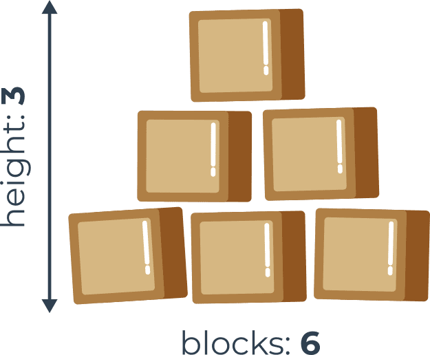

3.2.14   LAB   Основи циклу while
Сценарій
Послухайте цю історію: хлопчик і його батько, програміст, граються дерев'яними кубиками. Вони будують піраміду.

Їхня піраміда трохи дивна, адже насправді це стіна у формі піраміди – вона плоска. Піраміда складається за одним простим принципом: кожен нижній шар містить на один блок більше, ніж верхній.

На малюнку показано правило, яким користуються будівельники:

Ваше завдання — написати програму, яка читає кількість блоків, які є у будівельників, і виводить висоту піраміди, яку можна побудувати з цих блоків.

Примітка: висота вимірюється кількістю повністю завершених шарів – якщо будівельники не мають достатньої кількості блоків і не можуть завершити наступний шар, вони негайно закінчують роботу.

Перевірте свій код, використовуючи надані нами дані.

Тестові дані:
Зразок введення:

6
Очікуваний результат:

The height of the pyramid: 3
Вихід
Зразок введення:

20
Очікуваний результат:

The height of the pyramid: 5
Вихід
Зразок введення:

1000
Очікуваний результат:

The height of the pyramid: 44
Вихід
Зразок введення:

2
Очікуваний результат:

The height of the pyramid: 1