1.0.1 Про курс
Цей курс розроблено та розроблено Інститутом OpenEDG Python у партнерстві з Мережевою академією Cisco .

Курс створений для всіх і кожного , хто хоче вивчити Python і сучасні методи програмування. Це особливо сподобається:

програмісти-початківці та учні, які цікавляться вивченням програмування для розваг і завдань, пов’язаних із роботою;
учні, які хочуть отримати фундаментальні навички та знання для посади початкового рівня розробника програмного забезпечення, аналітика даних або тестувальника;
професіонали галузі , які бажають досліджувати технології, пов’язані з Python, або які використовують його як основу;
керівники команд, менеджери продуктів і менеджери проектів, які хочуть зрозуміти термінологію та процеси в циклі розробки програмного забезпечення, щоб ефективніше керувати та спілкуватися з командами виробництва та розробки.
Під час курсу ви матимете доступ до практичних практичних матеріалів, лабораторних робіт, тестів, оцінювань і тестів, щоб навчитися використовувати навички та знання, отримані під час вивчення ресурсів і виконання завдань програмування, а також взаємодіяти з деякими реальними проблемами програмування і ситуації.
1.0.2 Програма
У цьому курсі ви дізнаєтеся:

як застосувати загальні методи кодування та найкращі практики у своїх проектах;
як обробляти рядки;
як використовувати об’єктно-орієнтоване програмування на Python;
як імпортувати та використовувати модулі Python, зокрема модулі math , random , platform , os , time , datetime та calendar ;
як створювати та використовувати власні модулі та пакети Python;
як використовувати механізм винятків у Python;
як використовувати генератори, ітератори та закриття в Python;
як обробляти файли.
Курс розділений на чотири модулі:

Модуль 1
Модулі, пакети та PIP;
Модуль 2
Рядки, рядкові та спискові методи та винятки;
Модуль 3
Об'єктно-орієнтоване програмування;
Модуль 4
Різне (генератори, ітератори, закриття, файлові потоки, обробка текстових і бінарних файлів, ОС, час, дата, час і модуль календаря).

1.0.3 Підготуйтеся до іспиту PCAP-31-0x
Пориньте в програмування, вивчіть Python з нуля та підготуйтеся до сертифікації PCAP – Certified Associate in Python Programming
Python Essentials 2 узгоджується з сертифікатом PCAP – Certified Associate in Python Programming , професійним сертифікатом, який демонструє розуміння власником синтаксису та семантики мови Python, а також його вміння використовувати найважливіші елементи мови, інструменти та ресурси для проектування, розробки та рефакторингу простих програм Python.

Сертифікація дає вам змогу підтримувати свої навички в актуальному стані та демонструвати їх іншим. Це дає вам можливість перевірити, підтвердити та підтвердити свої здібності програмування на Python. Найважливіше те, що це може відкрити двері до кращої роботи та кращої зарплати, а також є чудовим мотиватором для самовдосконалення та саморозвитку.

Сертифікація PCAP – Certified Associate in Python Programming є проміжним кроком до сертифікації PCPP1 – Certified Professional in Python Programming 1 і відправною точкою для початку кар’єри в розробці програмного забезпечення, програмуванні на Python і пов’язаних технологіях.

Сертифікація PCAP допоможе вам виділитися з-поміж інших кандидатів і потрапити у двері , а після завершення цього курсу ви матимете право на 50% знижку на сертифікаційний іспит !

Для отримання додаткової інформації про сертифікацію PCAP – Certified Associate in Python Programming відвідайте www.pythoninstitute.org .

Отже, ви готові почати свою подорож Python? Натисніть «Далі» , щоб перейти до розділу 1 і почати навчання. Побачимось там!

1.1.1 Що таке модуль?
Комп'ютерний код має тенденцію до зростання. Ми можемо сказати, що код, який не росте, ймовірно, повністю непридатний для використання або покинутий. Справжній, потрібний і широко використовуваний код постійно розвивається, оскільки вимоги та очікування користувачів розвиваються у власному ритмі.

Код, який не відповідає потребам користувачів, буде швидко забутий і миттєво замінений новим, кращим і більш гнучким кодом. Будьте готові до цього і ніколи не думайте, що будь-яка з ваших програм зрештою буде завершена. Завершення є перехідним станом і зазвичай проходить швидко, після першого повідомлення про помилку. Сам Python є хорошим прикладом того, як діє правило.

Зростаючий код насправді є зростаючою проблемою. Більший код завжди означає складніше обслуговування. Шукати помилки завжди легше там, де код менший (подібно до того, як знайти механічну поломку легше, коли механізм простіший і менший).

Крім того, коли очікується, що створюваний код буде дійсно великим (ви можете використовувати загальну кількість вихідних рядків як корисну, але не дуже точну міру розміру коду), ви можете захотіти (точніше, ви будете змушені) розділити його на багато частин, реалізованих паралельно кількома, десятками, кількома десятками або навіть кількома сотнями окремих розробників.

Звичайно, це неможливо зробити за допомогою одного великого вихідного файлу, який редагується всіма програмістами одночасно. Це неодмінно призведе до вражаючої катастрофи.

Якщо ви хочете, щоб такий програмний проект був успішно завершений, ви повинні мати засоби, які дозволять вам:

розподілити всі завдання між розробниками;
з'єднати всі створені частини в одне робоче ціле.
Наприклад, певний проект можна розділити на дві основні частини:

інтерфейс користувача (частина, яка спілкується з користувачем за допомогою віджетів і графічного екрана)
логіка (частина, яка обробляє дані та створює результати)
Кожну з цих частин можна (швидше за все) розділити на менші і так далі. Такий процес часто називають декомпозицією .

Наприклад, якби вас попросили організувати весілля, ви б не зробили все самі – ви б знайшли кілька професіоналів і розділили завдання між ними.

Як розділити частину програмного забезпечення на окремі, але взаємодіючі частини? Ось у чому питання. Модулі - це відповідь.

1.1.2 Як використовувати модуль?
Отже, що таке модуль? Підручник з Python визначає його як файл, що містить визначення та оператори Python , які пізніше можна імпортувати та використовувати за потреби.

Обробка модулів складається з двох різних питань:

перший (мабуть, найпоширеніший) трапляється, коли ви хочете використати вже існуючий модуль, написаний кимось іншим або створений вами під час вашої роботи над якимось складним проектом - у цьому випадку ви є користувачем модуля ;
другий виникає, коли ви хочете створити абсолютно новий модуль або для власного використання, або для полегшення життя інших програмістів - ви є постачальником модуля .
Давайте обговоримо їх окремо.

Перш за все, модуль ідентифікується за його назвою . Якщо ви хочете використовувати будь-який модуль, вам потрібно знати назву. Разом із самим Python поставляється (досить велика) кількість модулів. Ви можете думати про них як про "додаткове обладнання Python".

Усі ці модулі разом із вбудованими функціями утворюють стандартну бібліотеку Python — особливий вид бібліотеки, де модулі виконують роль книг (можна навіть сказати, що папки виконують роль полиць). Якщо ви хочете переглянути повний список усіх «томів», зібраних у цій бібліотеці, ви можете знайти його тут: https://docs.python.org/3/library/index.html .

Кожен модуль складається з сутностей (як книга складається з розділів). Ці сутності можуть бути функціями, змінними, константами, класами та об’єктами. Якщо ви знаєте, як отримати доступ до певного модуля, ви можете використовувати будь-які сутності, які він зберігає.

1.1.3 Імпортування модуля
Щоб зробити модуль придатним для використання, ви повинні його імпортувати (подумайте про це як про те, щоб взяти книгу з полиці). Імпортування модуля виконується інструкцією під назвоюімпорт. Примітка:імпорттакож є ключовим словом (з усіма наслідками цього факту).

Припустімо, що ви хочете використовувати дві сутності, надані вматематикамодуль:

символ (константа), що представляє точне (якомога точніше, використовуючи подвійну арифметику з плаваючою комою) значення π (хоча використання грецької літери для назви змінної цілком можливо в Python, символ називається pi - це зручніше рішення , особливо для тієї частини світу, яка не має та не збирається використовувати грецьку клавіатуру)
функція з назвоюгріх()(комп’ютерний еквівалент математичної функції синус )

Обидві ці сутності доступні черезматематикамодуль, але спосіб, у який ви можете використовувати їх, сильно залежить від того, як було виконано імпорт.

Найпростіший спосіб імпортувати окремий модуль — це використати наступну інструкцію імпорту:

import math
 
Пункт містить:

вімпортключове слово;
назва модуля , який підлягає імпорту.
Інструкцію можна розташувати будь-де у вашому коді, але її потрібно розмістити перед першим використанням будь-якої сутності модуля .

Якщо ви хочете (або повинні) імпортувати більше одного модуля, ви можете зробити це, повторившиімпортпункт (бажано):

import math
import sys
або перерахувавши модулі післяімпортключове слово, як тут:

import math, sys
Інструкція імпортує два модулі, перший з яких називаєтьсяматематикаа потім другий імсистема.

Список модулів може бути як завгодно довгим.

1.1.4 Простір імен
Щоб продовжити, вам потрібно ознайомитися з важливим терміном: простір імен . Не хвилюйтеся, ми не будемо вдаватися в подробиці - це пояснення буде максимально коротким.

Простір імен — це простір (розуміється в нефізичному контексті), у якому існують деякі імена, які не конфліктують між собою (тобто немає двох різних об’єктів з однаковою назвою). Ми можемо сказати, що кожна соціальна група є простором імен - група прагне називати кожного свого члена унікальним способом (наприклад, батьки не дадуть своїм дітям однакові імена).

Цієї унікальності можна досягти багатьма способами, наприклад, використовуючи псевдоніми разом з іменами (це буде працювати всередині невеликої групи, як клас у школі) або шляхом призначення спеціальних ідентифікаторів усім членам групи (Соціальне забезпечення США Хорошим прикладом такої практики є Number).

У певному просторі імен кожне ім’я має залишатися унікальним . Це може означати, що деякі імена можуть зникнути, коли будь-яка інша сутність із уже відомою назвою входить у простір імен. Ми покажемо вам, як це працює та як ним керувати, але спочатку повернемося до імпорту.

Якщо модуль із вказаною назвою існує та є доступним (модуль насправді є вихідним файлом Python ), Python імпортує його вміст, тобто всі імена, визначені в модулі, стають відомими , але вони не входять у простір імен вашого коду.

Це означає, що ви можете мати власні назви сутностейгріхабопіі імпорт жодним чином не вплине на них.

На цьому етапі вам може бути цікаво, як отримати доступ допіщо походить відматематикамодуль.

Щоб зробити це, ви повинні пройти кваліфікаціюпіз назвою вихідного модуля.
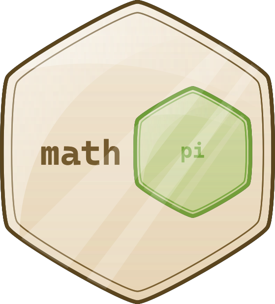
1.1.5 Імпортування модуля: продовження
Цей перший приклад не буде дуже складним – ми просто хочемо надрукувати значення sin(½π) .

Подивіться на код у редакторі. Ось як ми це перевіряємо.

play_arrow
синхронізація
завантажити
light_mode
темний_режим
Консоль 
термінал
синхронізація
Код виводить очікуване значення:1.0.

Подивіться на фрагмент нижче, це спосіб, у який ви кваліфікуєте іменапіігріхз назвою вихідного модуля:

math.pi
math.sin
Це просто, ви ставите:

назву модуля (наприклад,математика)
крапка ( тобто.)
назву організації (наприклад,пі)
Така форма чітко вказує простір імен, у якому існує назва.

Примітка: використання цієї кваліфікації є обов’язковим , якщо модуль було імпортованоімпортмодульна інструкція. Немає значення, конфліктують чи ні будь-які імена з вашого коду та з простору імен модуля.

Примітка: видалення будь-якої з двох кваліфікацій зробить код помилковим. Немає іншого способу ввести простір імен math, якщо ви зробили наступне:

import math
Тепер ми покажемо вам, як можуть співіснувати два простори імен (ваш і модульного).

Подивіться на приклад у вікні редактора.

Ми визначили наші власні пі ігріхтут.

play_arrow
синхронізація
завантажити
light_mode
темний_режим
Консоль 
термінал
синхронізація
Запустіть програму. Код має вивести наступний результат:

0.99999999
1.0
Вихід
Як бачите, сутності не впливають одна на одну.

У другому способіімпортСинтаксис точно вказує, яка сутність модуля (або сутності) прийнятна в коді:

from math import pi
Інструкція складається з наступних елементів:

ввідключове слово;
ім'я модуля, який (вибірково) імпортується;
вімпортключове слово;
ім'я або список імен сутності/сутностей , які імпортуються в простір імен.
Інструкція має такий ефект:

перераховані сутності (і тільки ті) імпортуються з указаного модуля ;
назви імпортованих об'єктів доступні без застережень .
Примітка: інші сутності не імпортуються. Більше того, ви не можете імпортувати додаткові сутності за допомогою кваліфікації — такого рядка:

print(math.e)
викличе помилку (дце число Ейлера: 2,71828...)

Давайте перепишемо попередній сценарій, щоб включити нову техніку.

Ось:

play_arrow
синхронізація
завантажити
light_mode
темний_режим
Консоль 
термінал
синхронізація
Результат має бути таким самим, як і раніше, оскільки фактично ми використовували ті самі сутності, що й раніше:1.0. Скопіюйте код, вставте його в редактор і запустіть програму.

Код виглядає простішим? Можливо, але зовнішній вигляд – не єдиний ефект такого імпорту. Давайте покажемо вам це.

Подивіться на код у редакторі. Уважно проаналізуйте:

рядок 1: здійснити вибірковий імпорт;
рядок 3: скористайтеся імпортованими сутностями та отримайте очікуваний результат (1.0)
рядки з 5 по 12: перевизначте значенняпіігріх- по суті, вони замінюють оригінальні (імпортовані) визначення в просторі імен коду;
рядок 15: отримати0,99999999, що підтверджує наші висновки.
play_arrow
синхронізація
завантажити
light_mode
темний_режим
Консоль 
термінал
синхронізація
Зробимо ще один тест. Подивіться на код нижче:

play_arrow
синхронізація
завантажити
light_mode
темний_режим
Консоль 
термінал
синхронізація
Тут ми змінили послідовність операцій коду на протилежну:

рядки з 1 по 8: визначимо наші власніпіігріх;
рядок 11: використовуйте їх (0,99999999з’являється на екрані)
рядок 13: виконати імпорт — імпортовані символи замінюють свої попередні визначення в просторі імен ;
рядок 15: отримати1.0в результаті.
1.1.6 Імпортування модуля: *
У третьому способіімпортсинтаксис є більш агресивною формою представленого раніше:

from module import *
 
Як ви бачите, ім'я сутності (або список імен сутностей) замінюється однією зірочкою (*).

Така інструкція імпортує всі сутності з указаного модуля .

Це зручно? Так, це звільняє вас від обов’язку перераховувати всі потрібні імена.

Це небезпечно? Так, це так - якщо ви не знаєте всіх назв, наданих модулем, ви не зможете уникнути конфліктів імен . Розглядайте це як тимчасове рішення та намагайтеся не використовувати його в звичайному коді.
1.1.7 Ключове слово as
Якщо ви використовуєте варіант модуля імпорту і вам не подобається ім’я певного модуля (наприклад, воно збігається з однією з ваших уже визначених сутностей, тому кваліфікація стає складною), ви можете дати йому будь-яке ім’я, яке вам подобається – це називається псевдонімом .

Псевдоніми призводять до того, що модуль ідентифікується під назвою, відмінною від оригінальної. Це також може скоротити кваліфіковані імена.

Створення псевдоніма виконується разом з імпортом модуля та вимагає такої форми інструкції імпорту:

import module as alias
 
«Модуль» визначає ім’я вихідного модуля, а «псевдонім» — це ім’я, яке ви бажаєте використовувати замість оригіналу.

Примітка:якє ключовим словом.
1.1.8 Псевдоніми
Якщо потрібно змінити словоматематика, ви можете ввести власне ім’я, як у прикладі:

import math as m
    
print(m.sin(m.pi/2))
 
Примітка: після успішного виконання псевдонімного імпорту оригінальне ім’я модуля стає недоступним і його не можна використовувати.

У свою чергу, коли ви використовуєтез імені імпорту модуляваріант, і вам потрібно змінити назву сутності, ви створюєте псевдонім для сутності. Це призведе до того, що ім’я буде замінено вибраним вами псевдонімом.

Ось як це можна зробити:

from module import name as alias
 
Як і раніше, вихідне (без псевдонімів) ім’я стає недоступним.

Фразаім'я як псевдонімможна повторювати - використовуйте коми, щоб розділити помножені фрази, наприклад:

from module import n as a, m as b, o as c
  
Приклад може виглядати трохи дивно, але він працює:

from math import pi as PI, sin as sine
  
print(sine(PI/2))
  
Тепер ви знайомі з основами використання модулів. Давайте покажемо вам деякі модулі та деякі їхні корисні сутності.

1.1.9 РЕЗЮМЕ РОЗДІЛУ
1. Якщо ви хочете імпортувати модуль як ціле, ви можете зробити це за допомогоюІмпорт модуля_назвазаява. Ви можете імпортувати більше одного модуля одночасно, використовуючи список, розділений комами. Наприклад:

import mod1
import mod2, mod3, mod4
   
хоча остання форма не рекомендована через стилістичні міркування, і краще й красивіше виражати той самий намір у більш багатослівній та явній формі, наприклад:

import mod2
import mod3
import mod4
  
2. Якщо модуль імпортовано вищевказаним способом і ви бажаєте отримати доступ до будь-якої з його сутностей, вам потрібно додати префікс до назви сутності за допомогою крапкової нотації. Наприклад:

import my_module
   
result = my_module.my_function(my_module.my_data)
 
Фрагмент використовує дві сутності, що надходять ізмій_модульмодуль: функція з іменеммоя_функція()і змінна з іменеммої_дані. Обидві назви повинні мати префікс мій_модуль. Жодне з імпортованих імен об’єктів не конфліктує з ідентичними іменами, наявними в просторі імен вашого коду.

3. Ви можете імпортувати не тільки модуль в цілому, але й окремі його сутності. У цьому випадку імпортовані сутності не повинні мати префікс під час використання. Наприклад:

from module import my_function, my_data
  
result = my_function(my_data)
 
Наведений вище спосіб, незважаючи на його привабливість, не рекомендується через небезпеку виникнення конфліктів з іменами, отриманими в результаті імпорту простору імен коду.

4. Найзагальніша форма наведеного вище оператора дозволяє імпортувати всі сутності , запропоновані модулем:

from my_module import *
  
result = my_function(my_data)
 
Примітка: цей варіант імпорту не рекомендований через ті ж причини, що й попередні (тут загроза конфлікту імен ще небезпечніша).

5. Ви можете змінити назву імпортованої сутності «на льоту», використовуючиякфраза вімпорт. Наприклад:

from module import my_function as fun, my_data as dat
  
result = fun(dat)

1.2.1 Робота зі стандартними модулями
Перш ніж ми почнемо розглядати деякі стандартні модулі Python, ми хочемо представитиdir()функція для вас. Це не має нічого спільного зрежкоманда, яку ви знаєте з консолей Windows і Unix, якdir()не показує вміст каталогу/папки на диску, але не можна заперечувати, що він робить щось подібне – він здатний розкривати всі імена, надані через певний модуль.

Є одна умова: модуль має бути попередньо імпортований цілком (тобто за допомогоюмодуль імпортуінструкція -з модулянедостатньо).

Функція повертає впорядкований за алфавітом список, що містить усі імена об’єктів, доступні в модулі, визначені іменем, переданим функції як аргумент:

dir(module)
  
Примітка: якщо назву модуля було псевдонімом, ви повинні використовувати псевдонім, а не оригінальну назву.

Використання функції у звичайному сценарії не має особливого сенсу, але все ж можливо.

Наприклад, ви можете запустити такий код, щоб надрукувати імена всіх сутностей у математичному модулі:

import math
  
for name in dir(math):
  print(name, end="∖t")
Приклад коду має вивести наступний результат:

__doc__ __loader__ __name__ __package__ __spec__ acos acosh asin asinh atan atan2
atan2 atanh ceil copysign cos cosh degrees e erf erfc exp expm1 fabs factorial floor
fmod frexp fsum gamma hypot isfinite isinf isnan ldexp lgamma log log10 log1p
log2 modf pi pow radians sin sinh sqrt tan tanh trunc
Вихід
Ви помітили ці дивні імена, що починаються з__у верхній частині списку? Ми розповімо вам більше про них, коли будемо говорити про проблеми, пов’язані з написанням власних модулів.

Деякі назви можуть викликати спогади з уроків математики, і, ймовірно, у вас не виникне проблем з здогадуванням їх значення.

Використовуючиdir()Функція всередині коду може здатися не дуже корисною - зазвичай ви хочете знати вміст конкретного модуля, перш ніж писати та запускати код.

На щастя, ви можете виконати функцію безпосередньо в консолі Python (IDLE), без необхідності писати та запускати окремий сценарій.

Ось як це можна зробити:

import math
dir(math)
Ви повинні побачити щось подібне до цього:

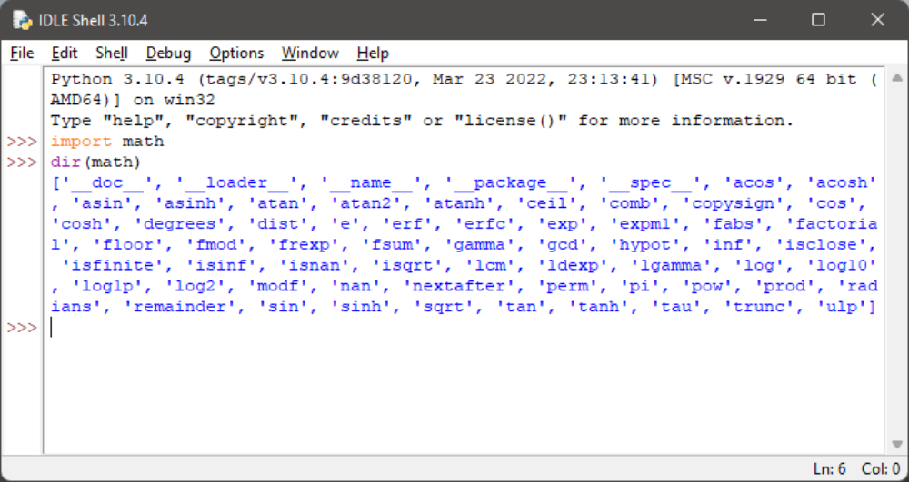

 1.2.2 Вибрані функції з математичного модуля
Почнемо з короткого попереднього перегляду деяких функцій, які надаєматематикамодуль.

Ми вибрали їх довільно, але це не означає, що функції, про які ми тут не згадали, менш важливі. Пориньте в глибини модулів самостійно - у нас немає ні місця, ні часу, щоб говорити про все докладно тут.

Перша група вматематикафункції пов'язані з тригонометрією :

sin(x)→ синус x;
cos(x)→ косинус x;
загар(x)→ тангенс x.
Усі ці функції приймають один аргумент (вимірювання кута, виражене в радіанах) і повертають відповідний результат (будьте обережні ззагар()- не всі аргументи приймаються).

Звичайно, існують і їх зворотні версії:

asin(x)→ арксинусу x;
acos(x)→ аркосинус x;
atan(x)→ арктангенс x.
Ці функції приймають один аргумент (зверніть увагу на домени) і повертають міру кута в радіанах.

Щоб ефективно виконувати вимірювання кутів,математикамодуль надає вам такі сутності:

пі→ константа зі значенням, яке є наближенням π;
радіани (x)→ функція, яка перетворює x із градусів у радіани;
градуси (x)→ діючи в іншому напрямку (від радіан до градусів)
Тепер подивіться на код у редакторі. Приклад програми не дуже складний, але чи можете ви передбачити її результати?

play_arrow
синхронізація
завантажити
light_mode
темний_режим
Консоль 
термінал
синхронізація
Крім циклічних функцій (перелічених вище),математикамодуль також містить набір їх гіперболічних аналогів :

sinh(x)→ гіперболічний синус;
cosh(x)→ гіперболічний косинус;
tanh(x)→ гіперболічний тангенс;
asinh(x)→ гіперболічний арксинус;
acosh(x)→ гіперболічний арккосинус;
atanh(x)→ гіперболічний арктангенс.
Інша група зматематикафункції утворюють функції, які пов'язані з піднесенням до степеня :

д→ константа зі значенням, яке є наближенням числа Ейлера (e)
exp(x)→ знаходження значення e x ;
log(x)→ натуральний логарифм x
log(x, b)→ логарифм x за основою b
log10(x)→ десятковий логарифм x (точніше ніжlog(x, 10))
log2(x)→ двійковий логарифм x (точніше ніжlog(x, 2))
Примітка:pow()функція:

pow(x, y)→ знаходження значення x y (зверніть увагу на домени)
Це вбудована функція, яку не потрібно імпортувати.

Подивіться на код у редакторі. Чи можете ви передбачити його вихід?

play_arrow
синхронізація
завантажити
light_mode
темний_режим
Консоль 
термінал
синхронізація
Остання група складається з деяких функцій загального призначення, наприклад:

стеля (x)→ стеля x (найменше ціле число, більше або рівне x)
поверх (x)→ підлога x (найбільше ціле число, менше або дорівнює x)
trunc(x)→ значення x скорочено до цілого числа (будьте обережні - це не еквівалент ceil чи floor)
факториал(x)→ повертає x! (x має бути інтегралом, а не від’ємним)
гіпот(х, у)→ повертає довжину гіпотенузи прямокутного трикутника з довжинами катетів, що дорівнюють x і y (те саме, щоsqrt(pow(x, 2) + pow(y, 2))але точніше)
Подивіться на код у редакторі. Уважно проаналізуйте програму.

Він демонструє принципові відмінності міжстеля(),поверх()іtrunc().

play_arrow
синхронізація
завантажити
light_mode
темний_режим
Консоль 
термінал
синхронізація
Запустіть програму та перевірте її вихід.

1.2.3 Чи існує справжня випадковість у комп’ютерах?
Ще один модуль, який варто згадати, це названийвипадковий.

Він надає деякі механізми, що дозволяють вам працювати з псевдовипадковими числами .

Зверніть увагу на префікс псевдо — числа, згенеровані модулями, можуть виглядати випадковими в тому сенсі, що ви не можете передбачити їхні подальші значення, але не забувайте, що всі вони обчислюються за допомогою дуже вдосконалених алгоритмів.

Алгоритми не є випадковими – вони детерміновані та передбачувані. Лише ті фізичні процеси, які повністю виходять з-під нашого контролю (наприклад, інтенсивність космічного випромінювання), можуть бути використані як джерело фактичних випадкових даних. Дані, створені детермінованими комп’ютерами, жодним чином не можуть бути випадковими.

Генератор випадкових чисел приймає значення, яке називається початковим значенням , розглядає його як вхідне значення, обчислює на його основі «випадкове» число (метод залежить від вибраного алгоритму) і створює нове початкове значення .

Тривалість циклу, в якому всі вихідні значення унікальні, може бути дуже довгою, але вона не нескінченна – рано чи пізно вихідні значення почнуть повторюватися, і генеруючі значення також повторюватимуться. Це нормально. Це функція, а не помилка чи баг.

Початкове початкове значення, встановлене під час запуску програми, визначає порядок, у якому відображатимуться згенеровані значення.

Фактор випадковості процесу можна збільшити, встановивши початкове число з числом, узятим із поточного часу - це може гарантувати, що кожен запуск програми починатиметься з іншого початкового значення (отже, використовуватимуться різні випадкові числа).

На щастя, така ініціалізація виконується Python під час імпорту модуля.

1.2.4 Вибрані функції з випадкового модуля
Theвипадковийфункція
Найзагальніша функція назвипадковий()(не плутати з назвою модуля) створює число з плаваючою речовиноюxщо надходить з діапазону (0,0, 1,0)- іншими словами: (0,0 <= x < 1,0).

Наведений нижче приклад програми створить п’ять псевдовипадкових значень – оскільки їхні значення визначаються поточним (досить непередбачуваним) початковим значенням, ви не можете їх вгадати:

play_arrow
синхронізація
завантажити
light_mode
темний_режим
Консоль 
термінал
синхронізація
Запустіть програму. Ось що ми маємо:

0.9535768927411208
0.5312710096244534
0.8737691983477731
0.5896799172452125
0.02116716297022092
Вихід
Theнасінняфункція
Theнасіння()функція здатна безпосередньо встановлювати початкове значення генератора . Ми покажемо вам два його варіанти:

насіння()- встановлює зерно з поточним часом;
насіння (ціле_значення)- встановлює зерно з цілим значенням int_value.
Ми змінили попередню програму – по суті, ми видалили будь-які сліди випадковості з коду:

play_arrow
синхронізація
завантажити
light_mode
темний_режим
Консоль 
термінал
синхронізація
Через те, що початкове значення завжди встановлюється з однаковим значенням, послідовність згенерованих значень завжди виглядає однаково.

Запустіть програму. Ось що ми маємо:

0.844421851525
0.75795440294
0.420571580831
0.258916750293
0.511274721369
Вихід
І ти?

Примітка: ваші значення можуть дещо відрізнятися від наших, якщо ваша система використовує точнішу або менш точну арифметику з плаваючою комою, але різницю буде помітно далеко від десяткової коми.

Theранддіапазонірандітфункції
Якщо вам потрібні цілі випадкові значення, краще підійде одна з наступних функцій:

діапазон (кінець)
randrange(початок, кінець)
randrange(початок, кінець, крок)
randint (ліворуч, праворуч)
Перші три виклики згенерують ціле число, взяте (псевдовипадково) з діапазону (відповідно):

діапазон (кінець)
діапазон (початок, кінець)
діапазон (початок, кінець, крок)
Зверніть увагу на неявне правостороннє виключення !

Остання функція є еквівалентомранддіапазон (ліворуч, праворуч+1)- генерує ціле значенняi, який потрапляє в діапазон [ліворуч, праворуч] (без виключення з правого боку).

Подивіться на код у редакторі. Цей зразок програми, як наслідок, виведе рядок, що складається з трьох нулів і нуля або одиниці на четвертому місці.

play_arrow
синхронізація
завантажити
light_mode
темний_режим
Консоль 
термінал
синхронізація
Попередні функції мають один важливий недолік - вони можуть створювати повторювані значення, навіть якщо кількість наступних викликів не перевищує ширину зазначеного діапазону.

Подивіться на наведений нижче код - програма, швидше за все, виведе набір чисел, деякі елементи в якому не є унікальними:

play_arrow
синхронізація
завантажити
light_mode
темний_режим
Консоль 
термінал
синхронізація
Ось що ми отримали в одному із запусків:

9,4,5,4,5,8,9,4,8,4,
Вихід
Theвибірізразокфункції
Як бачите, це не дуже хороший інструмент для генерування чисел у лотерею. На щастя, є кращий вихід, ніж написання власного коду для перевірки унікальності «намальованих» чисел.

Це функція, названа дуже навіювано -вибір:

вибір (послідовність)
зразок(послідовність, елементи_на_вибір)
Перший варіант вибирає «випадковий» елемент із вхідної послідовності та повертає його.

Другий створює список (вибірку), що складається зелементи_на_вибірелемент, "витягнутий" із вхідної послідовності.

Іншими словами, функція вибирає деякі з вхідних елементів, повертаючи список із вибором. Елементи у вибірці розміщуються у довільному порядку. Примітка:елементи_на_вибірне має перевищувати довжину вхідної послідовності.

Подивіться на код нижче:

play_arrow
синхронізація
завантажити
light_mode
темний_режим
Консоль 
термінал
синхронізація
Знову ж таки, результати програми непередбачувані. Наші результати виглядали так:

4
[3, 1, 8, 9, 10]
[10, 8, 5, 1, 6, 4, 3, 9, 7, 2]

1.2.5 Як дізнатися, де ви знаходитесь?
Іноді може знадобитися дізнатися інформацію, не пов’язану з Python. Наприклад, вам може знадобитися розташування вашої програми в загальному середовищі комп’ютера.

Уявіть середовище вашої програми як піраміду, що складається з кількох рівнів або платформ.

Шари:
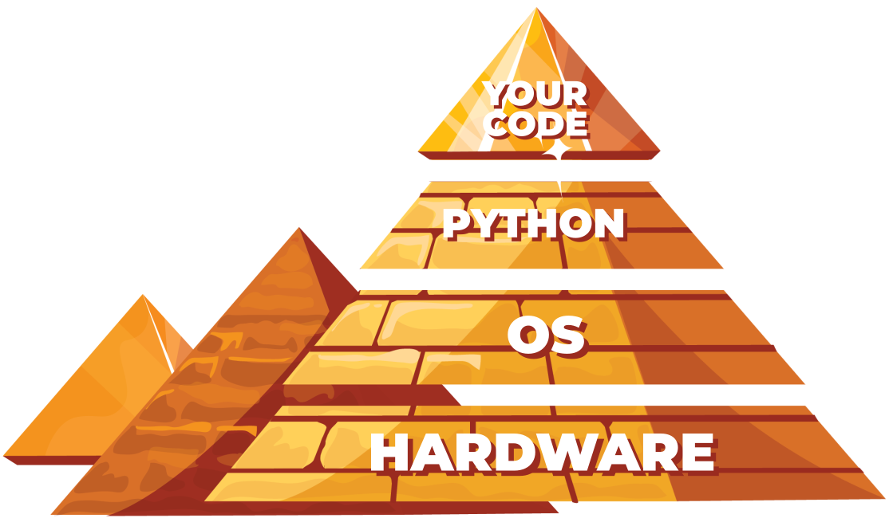

ваш (запущений) код розташований у верхній частині;
Python (точніше - його середовище виконання) лежить безпосередньо під ним;
наступний рівень піраміди заповнює ОС (операційна система) – середовище Python надає деякі свої функції за допомогою служб операційної системи; Хоча Python дуже потужний, він не всемогутній — він змушений використовувати багато помічників, якщо він збирається обробляти файли або спілкуватися з фізичними пристроями;
самий нижній рівень — апаратне забезпечення — процесор (або процесори), мережеві інтерфейси, пристрої людського інтерфейсу (миші, клавіатури тощо) та всі інші механізми, необхідні для роботи комп’ютера; ОС знає, як керувати цим, і використовує багато хитрощів, щоб вести всі частини в узгодженому ритмі.

Це означає, що деякі ваші дії (точніше вашої програми) повинні пройти довгий шлях, щоб бути успішно виконаними - уявіть, що:

Ваш код хоче створити файл, тому він викликає одну з функцій Python;
Python приймає порядок, змінює його відповідно до вимог локальної ОС (це як поставити штамп «схвалено» на вашому запиті) і надсилає його вниз (це може нагадувати вам ланцюжок команд)
ОС перевіряє , чи запит обґрунтований і дійсний (наприклад, чи відповідає ім'я файлу деяким правилам синтаксису) і намагається створити файл; така операція, яка здається дуже простою, не є атомарною - вона складається з багатьох незначних кроків, які виконує...
Апаратне забезпечення , яке відповідає за активацію пристроїв зберігання (жорсткий диск, твердотільні пристрої тощо) для задоволення потреб ОС.
Зазвичай ви не усвідомлюєте всієї цієї метушні – ви хочете, щоб файл був створений, і все.

Але іноді ви хочете знати більше, наприклад, назву ОС, на якій розміщено Python, і деякі характеристики, що описують апаратне забезпечення, на якому розміщено ОС.

Є модуль, який надає певні засоби, які дозволяють вам знати, де ви знаходитесь і які компоненти вам підходять. Модуль називається платформа . Ми покажемо вам деякі функції, які він вам надає.

1.2.6 Вибрані функції з модуля платформи
Theплатформафункція
TheплатформаМодуль дозволяє отримати доступ до даних базової платформи, тобто до інформації про обладнання, операційну систему та версію інтерпретатора.

Існує функція, яка може відразу показати всі нижчі шари з назвоюплатформатеж. Він просто повертає рядок, що описує середовище; таким чином, його результат адресований радше людям, ніж автоматизованій обробці (незабаром ви це побачите).

Ось як ви можете викликати його:

platform(aliased = False, terse = False)
 
І зараз:

псевдонім→ коли встановленоПравда(або будь-яке ненульове значення) це може призвести до того, що функція представить альтернативні назви нижнього шару замість звичайних;
лаконічний→ коли встановленоПравда(або будь-яке ненульове значення) це може переконати функцію представити більш стислу форму результату (якщо можливо)
Ми запустили нашу прикладну програму:

from platform import platform
 
print(platform())
print(platform(1))
print(platform(0, 1))
 
використовуючи три різні платформи - ось що ми отримали:

Intel x86 + Windows ® Vista (32 біт):
Windows-Vista-6.0.6002-SP2
Windows-Vista-6.0.6002-SP2
Windows-Vista
Вихід
Intel x86 + Gentoo Linux (64 біт):
Linux-3.18.62-g6-x86_64-Intel-R-_Core-TM-_i3-2330M_CPU_@_2.20GHz-with-gentoo-2.3
Linux-3.18.62-g6-x86_64-Intel-R-_Core-TM-_i3-2330M_CPU_@_2.20GHz-with-gentoo-2.3
Linux-3.18.62-g6-x86_64-Intel-R-_Core-TM-_i3-2330M_CPU_@_2.20GHz-with-glibc2.3.4
Вихід
Raspberry PI2 + Raspbian Linux (32 біт)
Linux-4.4.0-1-rpi2-armv7l-with-debian-9.0
Linux-4.4.0-1-rpi2-armv7l-with-debian-9.0
Linux-4.4.0-1-rpi2-armv7l-with-glibc2.9
Вихід
Ви також можете запустити зразок програми в IDLE на вашій локальній машині, щоб перевірити, який результат ви отримаєте.

Theмашинафункція
Іноді ви можете просто захотіти знати загальну назву процесора, який запускає вашу ОС разом із Python і ваш код - функція під назвоюмашина()скажу вам це. Як і раніше, функція повертає рядок.

Знову ми запустили приклад програми:

from platform import machine
 
print(machine())
на трьох різних платформах:

Intel x86 + Windows ® Vista (32 біт):
x86
Вихід
Intel x86 + Gentoo Linux (64 біт):
x86_64
Вихід
Raspberry PI2 + Raspbian Linux (32 біт):
armv7l
Вихід
Theпроцесорфункція
Theпроцесор()функція повертає рядок, заповнений справжньою назвою процесора (якщо можливо).

Ще раз ми запустили приклад програми:

from platform import processor
 
print(processor())
на трьох різних платформах:

Intel x86 + Windows ® Vista (32 біт):
x86
Вихід
Intel x86 + Gentoo Linux (64 біт):
Intel(R) Core(TM) i3-2330M CPU @ 2.20GHz
Вихід
Raspberry PI2 + Raspbian Linux (32 біт):
armv7l
Вихід
Перевірте це на своїй локальній машині.

Theсистемафункція
Функція з назвоюсистема()повертає загальну назву ОС у вигляді рядка.

from platform import system
 
print(system())
 
Наші приклади платформ представили себе так:

Intel x86 + Windows ® Vista (32 біт):
Windows
Вихід
Intel x86 + Gentoo Linux (64 біт):
Linux
Вихід
Raspberry PI2 + Raspbian Linux (32 біт):
Linux
Вихід
Theверсіяфункція
Версія ОС надається у вигляді рядкаверсія()функція.

from platform import version
 
print(version())
 
Запустіть код і перевірте його вихід. Ось що ми отримали:

Intel x86 + Windows ® Vista (32 біт):
6.0.6002
Вихід
Intel x86 + Gentoo Linux (64 біт):
#1 SMP PREEMPT Fri Jul 21 22:44:37 CEST 2017
Вихід
Raspberry PI2 + Raspbian Linux (32 біт):
#1 SMP Debian 4.4.6-1+rpi14 (2016-05-05)
Вихід
Thepython_implementationіpython_version_tupleфункції
Якщо вам потрібно знати, яка версія Python використовує ваш код, ви можете перевірити це за допомогою кількох спеціальних функцій - ось дві з них:

python_implementation()→ повертає рядок, що позначає реалізацію Python (очікуєтьсяCPythonтут, якщо ви не вирішите використовувати будь-яку неканонічну гілку Python)
python_version_tuple()→ повертає триелементний кортеж, заповнений:
основна частина версії Python;
другорядна частина ;
номер рівня патча .
play_arrow
синхронізація
завантажити
light_mode
темний_режим
Консоль 
термінал
синхронізація
Наш приклад програми створив такий результат:

CPython
3
7
7
Вихід
Дуже ймовірно, що ваша версія Python буде іншою.
1.2.7 Індекс модуля Python
Тут ми розглянули лише основи модулів Python. Модулі Python складають свій власний всесвіт, у якому сам Python є лише галактикою, і ми ризикнемо сказати, що вивчення глибин цих модулів може зайняти значно більше часу, ніж знайомство з «чистим» Python.

Більше того, спільнота Python у всьому світі створює та підтримує сотні додаткових модулів, які використовуються в дуже нішевих програмах, таких як генетика, психологія чи навіть астрологія.

Ці модулі не поширюються (і не будуть) розповсюджуватися разом із Python або через офіційні канали, що робить всесвіт Python ширшим — майже нескінченним.

Ви можете прочитати про всі стандартні модулі Python тут: https://docs.python.org/3/py-modindex.html .

Не хвилюйтеся – усі ці модулі вам не знадобляться. Багато з них дуже специфічні.

Все, що вам потрібно зробити, це знайти потрібні модулі та навчитися ними користуватися. Це легко.

У наступному розділі ми розглянемо щось інше. Ми покажемо вам, як написати власний модуль.

1.2.8 РЕЗЮМЕ РОЗДІЛУ
1. Функція з іменемdir()може показати вам список сутностей, що містяться всередині імпортованого модуля. Наприклад:

import os
dir(os)
роздруковує список усіхосможливості модуля, які можна використовувати у своєму коді.

2. Theматематикамодуль поєднує понад 50 символів (функцій і констант), які виконують математичні операції (наприклад,синус(),pow(),факториал()) або надання важливих значень (наприклад, π і символ Ейлера e ).

3. Theвипадковий модульгрупує понад 60 сутностей, розроблених, щоб допомогти вам використовувати псевдовипадкові числа. Не забувайте про префікс «випадковий», оскільки не існує такого поняття, як справжнє випадкове число, коли справа доходить до їх генерації за допомогою комп’ютерних алгоритмів.

4. TheплатформаМодуль містить близько 70 функцій, які дозволяють зануритися в базові рівні ОС і апаратного забезпечення. Їх використання дає змогу більше дізнатися про середовище, у якому виконується ваш код.

5. Індекс модулів Python ( https://docs.python.org/3/py-modindex.html – це керований спільнотою каталог модулів, доступних у всесвіті Python. Якщо ви хочете знайти модуль, який відповідає вашим потребам, почніть свій пошукайте там.

1.3.1 Що таке пакет?
Написання власних модулів мало чим відрізняється від написання звичайних скриптів.

Є деякі особливі аспекти, про які ви повинні знати, але це точно не ракетобудування. Ви скоро це побачите.

Давайте підсумуємо деякі важливі питання:

модуль - це свого роду контейнер, наповнений функціями - ви можете упакувати скільки завгодно функцій в один модуль і розповсюдити його по всьому світу;
звичайно, як правило, це гарна ідея не змішувати функції з різними сферами застосування в одному модулі (так само, як у бібліотеці - ніхто не очікує, що наукові роботи будуть розміщені серед коміксів), тому ретельно групуйте свої функції та називайте модуль, який їх містить, у чітким та інтуїтивно зрозумілим способом (наприклад, не вказуйте назвуarcade_gamesдо модуля, що містить функції, призначені для розділення та форматування жорстких дисків)
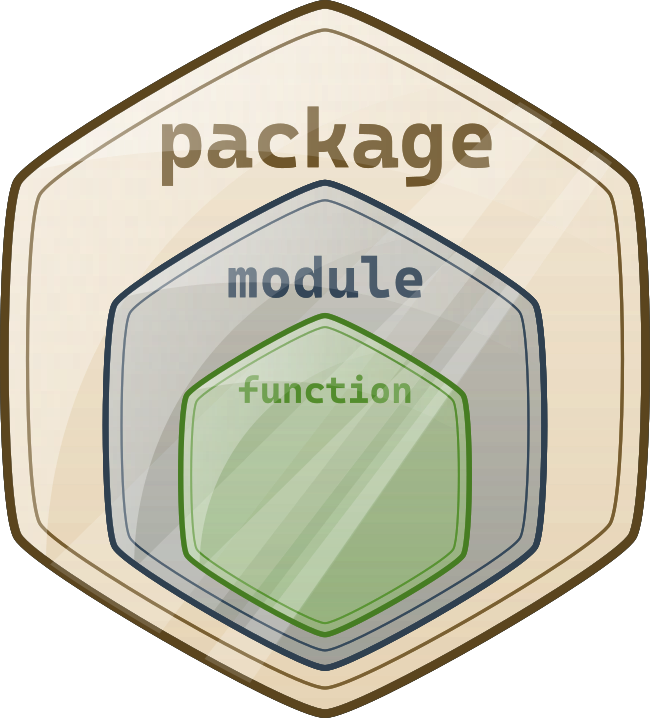

створення багатьох модулів може спричинити невеликий безлад - рано чи пізно ви захочете згрупувати свої модулі точно так само, як ви раніше групували функції - чи існує більш загальний контейнер, ніж модуль?
так, є - це пакет ; у світі модулів пакет відіграє подібну роль до папки/каталогу у світі файлів.

1.3.2 Ваш перший модуль
Крок 1
У цьому розділі ви працюватимете локально на своїй машині. Почнемо з нуля. Створіть порожній файл, ось так:

 
 
module.py
Для повторення цих експериментів вам знадобляться два файли. Першим з них буде сам модуль. Зараз порожньо. Не хвилюйтеся, незабаром ви заповните його фактичним кодом.

Ми назвали файлmodule.py. Не дуже креативно, але просто і зрозуміло.

Крок 2
Другий файл містить код використання нового модуля. Його назва main.py. Його зміст поки дуже короткий:

import module
 
main.py
Примітка: обидва файли мають бути в одній папці. Ми настійно рекомендуємо вам створити порожню нову папку для обох файлів. Тоді деякі речі будуть легшими.

Запустіть IDLE (або будь-яку іншу IDE, яку ви віддаєте перевагу) і запустіть файл main.py. Що ти бачиш?

Ви не повинні нічого бачити. Це означає, що Python успішно імпортував вміст файлу module.py .

Неважливо, що модуль поки порожній. Перший крок зроблено, але перш ніж зробити наступний крок, ми хочемо, щоб ви заглянули в папку, в якій знаходяться обидва файли.

Помітили щось цікаве?

З’явилася нова вкладена папка – ви її бачите? Його назва __pycache__ . Зазирніть всередину. Що ти бачиш?

Існує файл із назвою (більш-менш) module.cpython-xy.pyc , де x і y є цифрами, отриманими з вашої версії Python (наприклад, вони будуть 3 і 8, якщо ви використовуєте Python 3.8).

Назва файлу збігається з назвою вашого модуля (модуль тут). Частина після першої крапки вказує, яка реалізація Python створила файл ( тут CPython ) і номер його версії. Остання частина ( pyc ) походить від слів Python і скомпільований .

Ви можете зазирнути всередину файлу – вміст абсолютно нерозбірливий для людини. Це має бути так, оскільки файл призначений лише для використання Python.

Коли Python імпортує модуль вперше, він перетворює його вміст у дещо скомпільовану форму .

Файл не містить машинного коду – це внутрішній напівскомпільований код Python , готовий до виконання інтерпретатором Python. Таким чином, файл не вимагає багато перевірок, необхідних для чистого вихідного файлу, виконання починається швидше, і він також працює швидше.

Завдяки цьому кожен наступний імпорт відбуватиметься швидше, ніж інтерпретація вихідного тексту з нуля.

Python може перевірити, чи було змінено вихідний файл модуля (у цьому випадку файл pyc буде перебудовано) чи ні (у цьому випадку файл pyc можна запустити одразу). Оскільки цей процес є повністю автоматичним і прозорим, вам не потрібно пам’ятати про це.

Крок 3
Тепер ми додали дещо у файл модуля:

print("I like to be a module.")
 
module.py
Чи можете ви помітити відмінності між модулем і звичайним скриптом? Поки що їх немає.

Цей файл можна запустити як будь-який інший сценарій. Спробуйте самі.

Що сталося? Ви повинні побачити наступний рядок у вашій консолі:

I like to be a module.
 
Вихід
Крок 4
Повернемося доmain.pyфайл:

import module
 
main.py
Запустіть його. Що ти бачиш? Сподіваємося, ви побачите щось подібне:

I like to be a module.
 
Вихід
Що це насправді означає?

Коли модуль імпортується, його вміст неявно виконується Python . Це дає модулю можливість ініціалізувати деякі його внутрішні аспекти (наприклад, він може призначити деяким змінним корисні значення).

Примітка: ініціалізація відбувається лише один раз , коли відбувається перший імпорт, тому призначення, виконані модулем, не повторюються без потреби.

Уявіть такий контекст:

є модуль з назвою mod1 ;
є модуль під назвою mod2 , який міститьімпорт mod1інструкція;
є головний файл, що міститьімпорт mod1іімпорт mod2інструкції.
На перший погляд ви можете подумати, що mod1 буде імпортовано двічі - на щастя, відбувається лише перший імпорт . Python запам’ятовує імпортовані модулі та мовчки пропускає всі наступні імпорти.

Крок 5
Але Python робить набагато більше, ніж просто імпортує модуль. Він також створює змінну під назвою__ім'я__.

Крім того, кожен вихідний файл використовує власну, окрему версію змінної – вона не використовується спільно для модулів.

Ми покажемо вам, як ним користуватися. Трохи змініть модуль:

print("I like to be a module.")
print(__name__)
module.py
Тепер запустітьmodule.pyфайл. Ви повинні побачити такі рядки:

I like to be a module
__main__
Вихід
Тепер запустіть файл main.py. і? Ви бачите те саме, що й ми?

I like to be a module
module
Вихід
Ми можемо сказати, що:

коли ви запускаєте файл безпосередньо, його__ім'я__змінна має значення__основний__;
коли файл імпортується як модуль, його__ім'я__змінна встановлюється на ім’я файлу (за винятком .py )
Крок 6
Ось як ви можете використовувати__основний__змінна, щоб визначити контекст, у якому було активовано ваш код:

if __name__ == "__main__":
   print("I prefer to be a module.")
else:
   print("I like to be a module.")
 
module.py
Однак існує більш розумний спосіб використовувати змінну. Якщо ви пишете модуль, наповнений кількома складними функціями, ви можете використовувати його для розміщення серії тестів, щоб перевірити, чи функції працюють належним чином.

Кожного разу, коли ви змінюєте будь-яку з цих функцій, ви можете просто запустити модуль, щоб переконатися, що ваші поправки не зіпсували код. Ці тести будуть пропущені, коли код буде імпортовано як модуль.

Крок 7
Цей модуль міститиме дві прості функції, і якщо ви хочете знати, скільки разів функції були викликані, вам потрібен лічильник, ініціалізований нулем під час імпорту модуля.

Ви можете зробити це таким чином:

counter = 0
   
if __name__ == "__main__":
   print("I prefer to be a module.")
else:
   print("I like to be a module.")
 
module.py
Крок 8
Введення такої змінної є абсолютно правильним, але може спричинити важливі побічні ефекти, про які ви повинні знати.

Подивіться на модифікованийmain.pyфайл:

import module
print(module.counter)
  
main.py
Як бачите, головний файл намагається отримати доступ до змінної лічильника модуля. Це законно? Так. Чи можна його використовувати? Це може бути дуже корисним. це безпечно?

Це залежить від того – якщо ви довіряєте користувачам свого модуля, проблем не буде; однак ви можете не захотіти, щоб решта світу бачив вашу особисту/приватну змінну .

На відміну від багатьох інших мов програмування, Python не має засобів, які дозволяють приховати такі змінні від очей користувачів модуля.

Ви можете лише повідомити своїх користувачів, що це ваша змінна, що вони можуть її читати, але не повинні змінювати її за жодних обставин.

Це робиться, якщо перед назвою змінної ставиться_(одне підкреслення) або__(два підкреслення), але пам’ятайте, що це лише домовленість . Користувачі вашого модуля можуть підкорятися йому, а можуть і ні.

Звичайно, ми будемо дотримуватися конвенції. Тепер давайте розмістимо дві функції в модулі – вони будуть обчислювати суму та добуток чисел, зібраних у списку.

Крім того, додамо туди якісь прикраси і приберемо зайве.

Крок 9
Гаразд. Давайте напишемо новий код у нашомуmodule.pyфайл. Оновлений модуль готовий тут:

#!/usr/bin/env python3
 
"" module.py - an example of a Python module ""
 
__counter = 0
 
 
def suml(the_list):
  global __counter
  __counter += 1
  the_sum = 0
  for element in the_list:
   the_sum += element
  return the_sum
 
 
def prodl(the_list):
  global __counter
  __counter += 1
  prod = 1
  for element in the_list:
   prod *= element
  return prod
 
 
if __name__ == "__main__":
  print("I prefer to be a module, but I can do some tests for you.")
  my_list = [i+1 for i in range(5)]
  print(suml(my_list) == 15)
  print(prodl(my_list) == 120)
  
module.py
На нашу думку, деякі елементи потребують пояснення:

рядок, що починається з#!має багато назв - його можна назвати shabang , shebang , hashbang , poundbang або навіть hashpling (не питайте нас чому). Сама назва тут нічого не означає - важливіша її роль. З точки зору Python, це лише коментар , з якого він починається#. Для Unix і Unix-подібних ОС (включаючи MacOS) такий рядок вказує ОС, як виконати вміст файлу (іншими словами, яку програму потрібно запустити для інтерпретації тексту). У деяких середовищах (особливо тих, які пов’язані з веб-серверами) відсутність цього рядка спричинить проблеми;
рядок (можливо, багаторядковий), розміщений перед будь-якими інструкціями модуля (включно з імпортом), називається doc-string і має коротко пояснювати призначення та вміст модуля;
функції, визначені всередині модуля (suml()іprodl()) доступні для імпорту;
ми використовували__ім'я__змінна, щоб визначити, коли файл запускається автономно, і скористався цією можливістю, щоб виконати кілька простих тестів.
Крок 10
Тепер можна використовувати оновлений модуль - це один із способів:

from module import suml, prodl
 
zeroes = [0 for i in range(5)]
ones = [1 for i in range(5)]
print(suml(zeroes))
print(prodl(ones))
 
main.py
Крок 11
Настав час ускладнити наш приклад - поки що ми припускали, що основний файл Python знаходиться в тій же папці/каталозі, що й модуль, який потрібно імпортувати.

Давайте відмовимося від цього припущення та проведемо такий уявний експеримент:

ми використовуємо ОС Windows® (це припущення важливе, оскільки від нього залежить форма імені файлу)
основний скрипт Python знаходиться в C:\Users\user\py\progs і називається main.py
модуль для імпорту знаходиться в C:\Users\user\py\modules
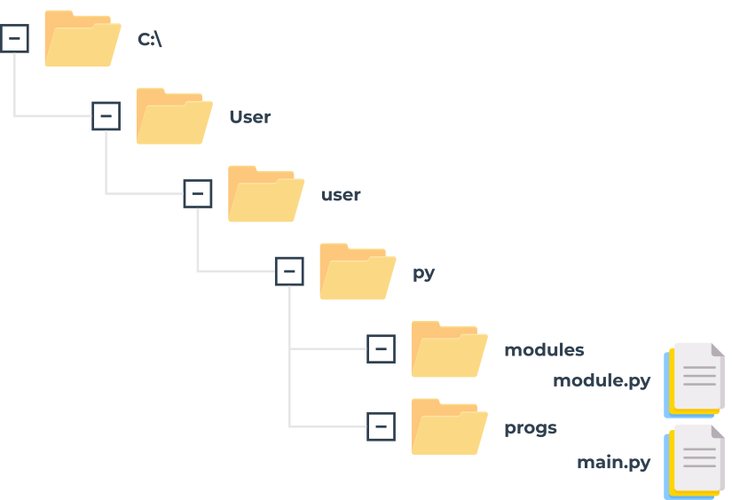
Як ми з цим справляємося?

Щоб відповісти на це запитання, ми повинні поговорити про те, як Python шукає модулі . Існує спеціальна змінна (насправді список), у якій зберігаються всі розташування (папки/каталоги), у яких виконується пошук, щоб знайти модуль, який запитується інструкцією імпорту.

Python переглядає ці папки в тому порядку, у якому вони перераховані у списку – якщо модуль не знайдено в жодному з цих каталогів, імпорт не вдасться.

В іншому випадку буде взято до уваги першу папку, що містить модуль із потрібною назвою (якщо будь-яка з решти папок містить модуль із такою назвою, вона буде проігнорована).

Змінна названашлях, і він доступний через модуль під назвоюсистема. Ось як ви можете перевірити його звичайне значення:

import sys
 
for p in sys.path:
  print(p)
 
Ми запустили код у папці C:\User\user і отримали ось що:

C:∖Users∖user
C:∖Users∖user∖AppData∖Local∖Programs∖Python∖Python36-32∖python36.zip
C:∖Users∖user∖AppData∖Local∖Programs∖Python∖Python36-32∖lib
C:∖Users∖user∖AppData∖Local∖Programs∖Python∖Python36-32
C:∖Users∖user∖AppData∖Local∖Programs∖Python∖Python36-32∖lib∖site-packages
Вихід
Примітка: папка, у якій починається виконання, указана в першому елементі шляху .

Зверніть увагу ще раз: як один із елементів шляху вказано zip-файл — це не помилка. Python може розглядати zip-файли як звичайні папки - це може заощадити багато місця.

Чи можете ви зрозуміти, як ми можемо вирішити нашу проблему зараз? Ми можемо додати папку, що містить модуль, до змінної path (її можна повністю змінювати).

Крок 12
Одне з кількох можливих рішень виглядає так:

from sys import path
 
path.append('..∖∖modules')
 
import module
 
zeroes = [0 for i in range(5)]
ones = [1 for i in range(5)]
print(module.suml(zeroes))
print(module.prodl(ones))
 
main.py
Примітка

ми подвоїли\внутрішня назва папки - знаєте чому?
Перевірте
ми використали відносну назву папки — це спрацює, якщо ви запускаєте файл main.py безпосередньо з його домашньої папки, і не працюватиме, якщо поточний каталог не відповідає відносному шляху; ви завжди можете використовувати абсолютний шлях, наприклад:
path.append('C:\\Users\\user\\py\\modules')
ми використовувалидодати()метод - по суті, новий шлях займе останній елемент у списку шляхів; якщо вам не подобається ідея, ви можете використовувативставити()замість цього.

1.3.3 Ваш перший пакет
Крок 1
Уявіть, що в недалекому майбутньому ви і ваші колеги напишете велику кількість функцій Python.

Ваша команда вирішує згрупувати функції в окремі модулі, і це остаточний результат упорядкування:

#! /usr/bin/env python3
 
""" module: alpha """"
 
def funA():
  return "Alpha"
 
if __name__ == "__main__":
  print("I prefer to be a module.")
 
alpha.py
Примітка: ми представили весь вміст лише для модуля alpha.py - припустимо, що всі модулі виглядають подібно (вони містять одну функцію під назвоюfunX, де X – перша літера назви модуля).

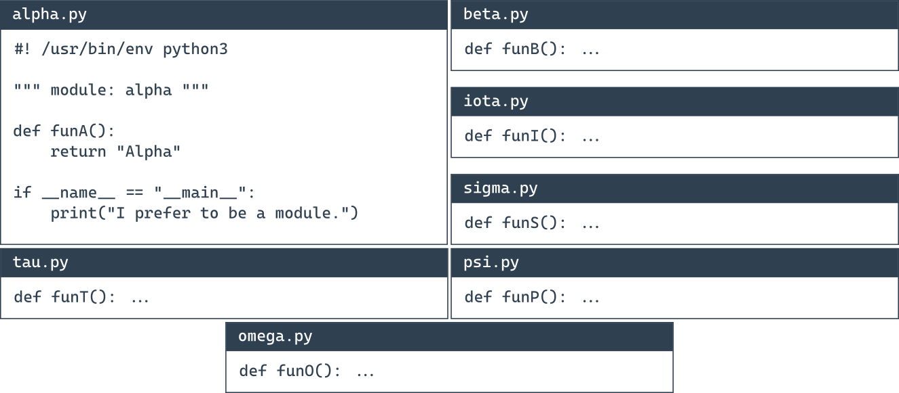
Крок 2
Раптом хтось помічає, що ці модулі утворюють власну ієрархію, тому помістити їх у плоску структуру буде не гарною ідеєю.

Після деякого обговорення команда приходить до висновку, що модулі потрібно згрупувати. Усі учасники погоджуються, що наведена нижче структура дерева ідеально відображає взаємні зв’язки між модулями:
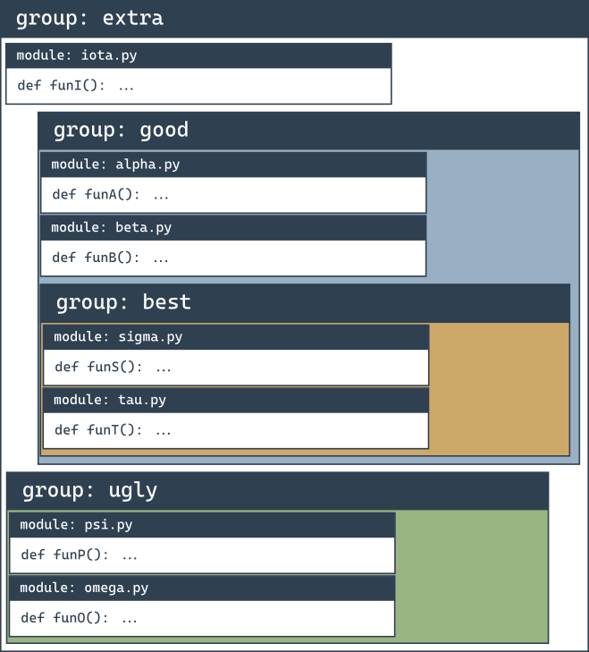

Давайте розглянемо це знизу вгору:

група ugly містить два модулі: psi і omega ;
найкраща група містить два модулі: сигма і тау ;
хороша група містить два модулі ( альфа і бета ) і одну підгрупу ( найкращі )
додаткова група містить дві підгрупи ( добре і погано ) і один модуль ( йота )
Виглядає погано? Зовсім ні – уважно проаналізуйте структуру. Щось нагадує, чи не так?

Це виглядає як структура каталогу .

Давайте побудуємо дерево, що відображає спроектовані залежності між модулями.

Крок 3
Ось так ялинка виглядає зараз:

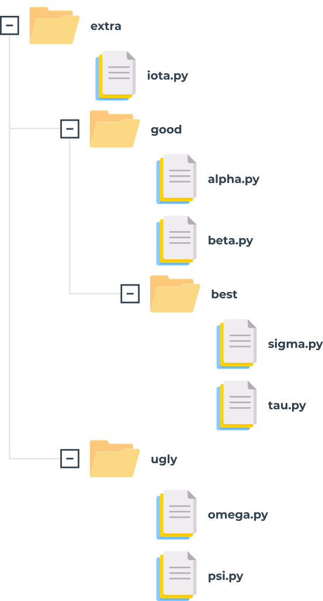
Така структура є майже пакетом (у розумінні Python). Йому не вистачає тонких деталей, щоб бути одночасно функціональним і оперативним. Ми завершимо це за мить.

Якщо ви припустите, що extra — це ім’я щойно створеного пакета (вважайте це коренем пакета ), це накладе правило іменування, яке дозволить вам чітко назвати кожну сутність у дереві.

Наприклад:

розташування функції з назвоюfunT()з пакету tau можна описати як:
extra.good.best.tau.funT()
    
функція, позначена як:
extra.ugly.psi.funP()
    
походить від псі- модуля, який зберігається в потворному підпакеті додаткового пакета.
Крок 4
Тепер потрібно відповісти на два запитання:

як перетворити таке дерево (насправді піддерево) у справжній пакет Python (іншими словами, як переконати Python, що це дерево — не просто купа непотрібних файлів, а набір модулів)?
де ви розміщуєте піддерево, щоб зробити його доступним для Python?
Перше запитання має дивовижну відповідь: пакети, як і модулі, можуть потребувати ініціалізації .

Ініціалізація модуля здійснюється за допомогою незв’язаного коду (не є частиною жодної функції), розташованого у файлі модуля. Оскільки пакунок не є файлом, цей прийом марний для ініціалізації пакунків.

Натомість вам потрібно використати інший трюк – Python очікує, що в папці пакета буде файл із дуже унікальною назвою: __init__.py .

Вміст файлу виконується, коли імпортується будь-який із модулів пакета . Якщо ви не бажаєте ніяких спеціальних ініціалізацій, ви можете залишити файл порожнім, але ви не можете його опустити.

Крок 5
Пам’ятайте: наявність файлу __init.py__ остаточно складає пакет .
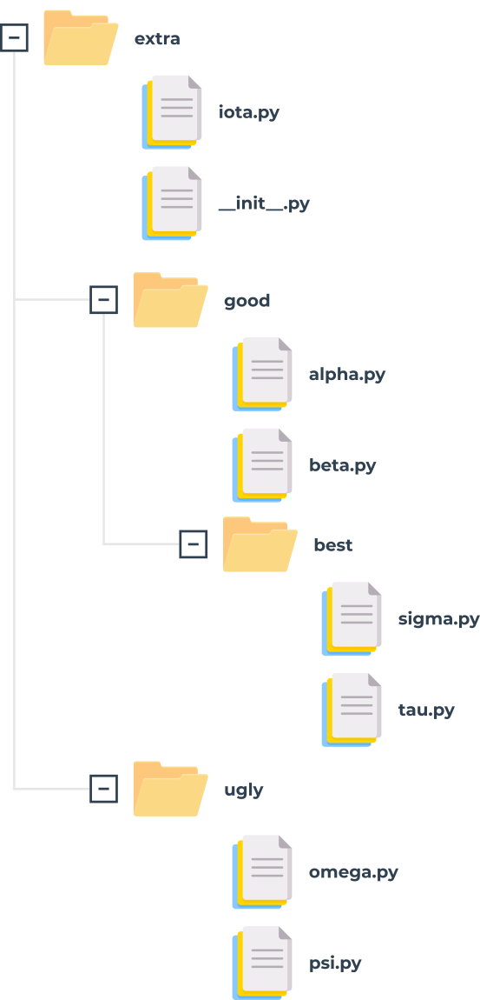

Примітка: не лише коренева папка може містити файл __init.py__ – ви також можете помістити його в будь-яку з його вкладених папок (підпакетів). Зробити це може бути корисно, якщо деякі з підпакетів потребують індивідуальної обробки та спеціальних видів ініціалізації.

Тепер настав час відповісти на друге запитання – куди помістити піддерево, щоб зробити його доступним для Python? Відповідь проста: будь-де . Вам потрібно лише переконатися, що Python знає про розташування пакета, ви вже знаєте, як це зробити.

Ви готові скористатися своїм першим пакетом.

Крок 6
Припустимо, що робоче середовище виглядає наступним чином:

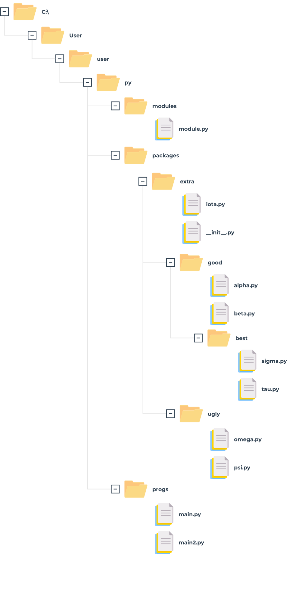
Ми підготували zip-файл, що містить усі файли з гілки пакетів. Ви можете завантажити його та використовувати для власних експериментів, але не забудьте розпакувати його в папку, представлену на схемі , інакше він буде недоступний для коду з основного файлу.

  ЗАВАНТАЖИТИ      ZIP-файл модулів і пакетів

Ви продовжите свої експерименти, використовуючи файл main2.py .

Крок 7
Ми збираємося отримати доступ довесело()функція з модуля iota у верхній частині додаткового пакета. Це змушує нас використовувати кваліфіковані назви пакетів (пов’яжіть це з іменуванням папок і вкладених папок – угоди дуже схожі).

Ось як це зробити:

from sys import path
path.append('..∖∖packages')
 
import extra.iota
print(extra.iota.funI())
 
main2.py
Примітка:

ми змінилишляхзмінна, щоб зробити її доступною для Python;
вімпортне вказує безпосередньо на модуль, а вказує повний шлях у верхній частині пакета;
замінаімпорт extra.iotaзімпорт йотавикличе помилку.

Допустимий також такий варіант:

from sys import path
path.append('..∖∖packages')
 
from extra.iota import funI
print(funI())
 
main.2.py
Зверніть увагу на кваліфіковану назву модуля йота .

Крок 8
Тепер давайте дістанемося до нижньої частини дерева – ось як отримати доступ до модулів sigma і tau :

from sys import path
 
path.append('..∖∖packages')
 
import extra.good.best.sigma
from extra.good.best.tau import funT
 
print(extra.good.best.sigma.funS())
print(funT())
 
main2.py
Ви можете полегшити собі життя за допомогою псевдонімів:

from sys import path
 
path.append('..∖∖packages')
 
 
import extra.good.best.sigma as sig
import extra.good.alpha as alp
 
print(sig.funS())
print(alp.funA())
 
main2.py
Крок 9
Припустімо, що ми заархівували весь підкаталог, починаючи з додаткової папки (включаючи її), і давайте отримаємо файл із назвою extrapack.zip . Далі ми поміщаємо файл у папку пакетів .

Тепер ми можемо використовувати файл zip в ролі пакетів:

from sys import path
 
path.append('..∖∖packages∖∖extrapack.zip')
 
import extra.good.best.sigma as sig
import extra.good.alpha as alp
from extra.iota import funI
from extra.good.beta import funB
 
print(sig.funS())
print(alp.funA())
print(funI())
print(funB())
 
main2.py
Якщо ви хочете провести власні експерименти з пакетом, який ми створили, ви можете завантажити його нижче. Ми закликаємо вас це зробити.

  ЗАВАНТАЖИТИ      файл Extrapack ZIP

Тепер ви можете створювати модулі та об’єднувати їх у пакети. Настав час почати зовсім іншу дискусію – про помилки, збої, збої.

1.3.4 РЕЗЮМЕ РОЗДІЛУ
1. У той час як модуль призначений для об’єднання деяких пов’язаних сутностей, таких як функції, змінні або константи, пакет є контейнером, який дозволяє об’єднувати кілька пов’язаних модулів під одним спільним ім’ям. Такий контейнер можна поширювати як є (як пакет файлів, розгорнутих у піддереві каталогів), або його можна запакувати в zip-файл.

2. Під час першого імпорту фактичного модуля Python перекладає його вихідний код у напівкомпільований формат, що зберігається у файлах pyc , і розгортає ці файли в__pycache__каталог, розташований у домашньому каталозі модуля.

3. Якщо ви хочете повідомити користувачеві вашого модуля, що певну сутність слід розглядати як приватну (тобто не використовувати явно поза модулем), ви можете позначити її ім’я або_або__префікс. Не забувайте, що це лише рекомендація, а не наказ.

4. Назви shabang , shebang , hasbang , poundbang і hashpling описують диграф, написаний як#!, який використовується для вказівок Unix-подібним ОС, як слід запускати вихідний файл Python. Ця умова не діє під MS Windows.

5. Якщо ви хочете переконати Python, що він повинен враховувати каталог нестандартного пакета, його ім’я потрібно вставити/додати до/до списку каталогів імпорту, що зберігається вшляхзмінна, що міститься всистемамодуль.

6. Файл Python під назвою__init__.pyнеявно запускається, коли пакет, що його містить, підлягає імпорту, і використовується для ініціалізації пакета та/або його підпакетів (якщо такі є). Файл може бути порожнім, але не повинен бути відсутнім.
1.4.1 Екосистема пакування Python і як нею користуватися
Python є дуже потужним інструментом – ми сподіваємося, що ви вже переконалися в цьому на собі. Багато людей з усього світу відчувають це, і вони регулярно використовують Python, щоб розвивати те, що вони можуть робити в багатьох абсолютно різних сферах діяльності. Це означає, що Python став міждисциплінарним інструментом, який використовується в незліченних програмах. Ми не можемо перерахувати всі сфери, в яких Python блискуче демонструє свої здібності, тому розповімо лише про найбільш вражаючі.

Перш за все, Python став лідером досліджень штучного інтелекту . Інтелектуальний аналіз даних, одна з найперспективніших сучасних наукових дисциплін, також використовує Python. Математики, психологи, генетики, метеорологи, лінгвісти – усі ці люди вже використовують Python, або, якщо ще не використовують, то ми впевнені, що дуже скоро. Від цієї тенденції нікуди не дітися.

Звичайно, немає сенсу змушувати всіх користувачів Python писати свій код з нуля, тримаючи їх у повній ізоляції від зовнішнього світу та досягнень інших програмістів. Це було б і неприродно, і контрпродуктивно.

Найбільш бажаним і ефективним є надання всім членам спільноти Python вільного обміну кодами та досвідом. У цій моделі ніхто не змушений починати роботу з нуля, оскільки існує висока ймовірність того, що хтось інший працював над тією ж (або дуже схожою) проблемою.

Як ви знаєте, Python було створено як програмне забезпечення з відкритим кодом, і це також працює як запрошення для всіх програмістів підтримувати всю екосистему Python як відкрите, дружнє та вільне середовище. Щоб модель працювала та розвивалася, слід надати деякі додаткові інструменти, інструменти, які допомагають творцям публікувати, підтримувати та піклуватися про свій код.

Ці самі інструменти мають допомогти користувачам використовувати код, як уже існуючий код, так і новий код, який з’являється щодня. Завдяки цьому написання нового коду для нових викликів не схоже на будівництво нового будинку, починаючи з фундаменту.

Крім того, програміст має право модифікувати чужий код, щоб адаптувати його до власних потреб, і фактично створити абсолютно новий продукт, який може використовувати інший розробник. Процесу, здається, немає кінця. На щастя.

Щоб цей світ крутився, необхідно створити та підтримувати в русі дві основні сутності: централізоване сховище всіх доступних програмних пакетів; і інструмент, що дозволяє користувачам отримувати доступ до репозиторію . Обидві ці сутності вже існують і можуть бути використані в будь-який час.

Репозиторій (або скорочено репо ), який ми згадували раніше, називається PyPI (це скорочення від Python Package Index), і його підтримує робоча група під назвою Packaging Working Group, яка є частиною Python Software Foundation, головним завданням якої є підтримка розробників Python. в ефективному поширенні коду.

Ви можете знайти їхній веб-сайт тут: https://wiki.python.org/psf/PackagingWG .

Веб-сайт PyPI (адмініструється PWG) знаходиться за адресою:
https://pypi.org/ .

Коли ми заглянули туди на деякий час на початку липня 2021 року, ми виявили, що PyPI містить 315 000 проектів, які складаються з понад 4 500 000 файлів, якими керують 520 000 користувачів.

Лише ці три цифри чітко демонструють потужність спільноти Python і важливість співпраці розробників.

Слід зазначити, що PyPI — не єдине існуюче сховище Python. Навпаки, їх багато, створених для проектів і керованих багатьма більшими та меншими спільнотами Python. Цілком імовірно, що колись ви та ваші колеги захочете створити власні репозиториї .

У будь-якому випадку, PyPI є найважливішим репо Python у світі. Якщо ми трохи змінимо класичний вислів, ми можемо сказати, що «всі шляхи Python ведуть до PyPl», і це зовсім не перебільшення.
1.4.2 Репо PyPI: сирний магазин
Репо PyPI іноді називають Cheese Shop . Дійсно.

Вам це звучить трохи дивно? Не хвилюйтеся, це все абсолютно невинно.

Ми називаємо репо магазином, тому що ви заходите туди з тих самих причин, з яких ходите в інші магазини: щоб задовольнити свої потреби. Якщо ви хочете трохи сиру, ви йдете в сироварню. Якщо вам потрібна частина програмного забезпечення, ви йдете в магазин програмного забезпечення. На щастя, на цьому аналогія закінчується – вам не потрібні гроші, щоб взяти програмне забезпечення з магазину репо.

PyPI абсолютно безкоштовний, і ви можете просто вибрати код і використовувати його – ви не зіткнетеся ні з касиром, ні з охоронцем. Звичайно, це не звільняє вас від ввічливості та чесності. Ви повинні дотримуватися всіх умов ліцензування, тому не забудьте їх прочитати.

«Добре», - скажете ви, «тепер все зрозуміло, але яке відношення сир має до Python?»

The Cheese Shop – один із найвідоміших скетчів Монті Пайтона. Він зображує сюрреалістичну пригоду англійця, який намагається купити сир. На жаль, у магазині, який він відвідує (з нескромною назвою Ye National Cheese Emporium), сиру немає в наявності.

Звичайно, це має на меті іронію. Як ви вже знаєте, PyPI має багато програмного забезпечення в наявності, і воно доступне 24/7. Він має повне право ідентифікувати себе як Ye International Python Software Emporium .

PyPI — це дуже специфічний магазин не лише тому, що він пропонує всі свої продукти безкоштовно. Для його використання також потрібен спеціальний інструмент.

На щастя, цей інструмент також безкоштовний, тож якщо ви хочете зробити свій власний цифровий чізбургер, використовуючи товари, які пропонує PyPI Shop, вам знадобиться безкоштовний інструмент під назвою pip .

Ні, ви не помилилися. Просто піп . Звичайно, це інша абревіатура, але її природа складніша, ніж раніше згаданий PyPI, оскільки це приклад рекурсивної абревіатури, що означає, що абревіатура посилається на саму себе, а це означає, що її пояснення є нескінченним процесом.

чому Оскільки pip означає «pip встановлює пакунки» , а pip всередині «pip встановлює пакунки» означає «pip встановлює пакунки» і...

Зупинимося на цьому. Дякую за співпрацю.

До речі, є ще кілька дуже відомих рекурсивних абревіатур. Одним із них є Linux , що можна інтерпретувати як «Linux — це не Unix» .
1.4.3 Як встановити pip
Питання, яке слід поставити зараз: як отримати правильний ніж для сиру? Іншими словами, як переконатися, що pip встановлений і готовий до роботи?

Найточніша відповідь – «залежить». Дійсно.

Деякі інсталяції Python постачаються з pip , а деякі ні. Більше того, це залежить не лише від ОС, яку ви використовуєте, хоча це дуже важливий фактор.

Почнемо з MS Windows.

pip на MS Windows
Інсталятор MS Windows Python уже містить pip , тому для його встановлення не потрібно виконувати жодних інших кроків. На жаль, якщо змінну PATH налаштовано неправильно, pip може бути недоступним.

Щоб переконатися, що ми не ввели вас в оману, спробуйте зробити це:

відкрийте консоль Windows ( CMD або PowerShell , як вам більше подобається)
виконайте таку команду:
pip --версія

у найоптимістичнішому сценарії (і ми дуже хочемо, щоб це сталося) ви побачите щось на зразок цього:

відсутність цього повідомлення може означати, що змінна PATH або неправильно вказує на розташування двійкових файлів Python, або не вказує на нього взагалі; наприклад, наша змінна PATH містить такий підрядок:
C:\Program Files\Python3\Scripts\;C:\Program Files\Python3\;

найпростіший спосіб переналаштувати змінну PATH — перевстановити Python , надавши вказівку інсталятору встановити її за вас.
pip на Linux
Різні дистрибутиви Linux можуть поводитися по-різному, коли йдеться про використання pip . Деякі з них (наприклад, Gentoo ), які тісно пов’язані з Python і використовують його внутрішньо, можуть мати попередньо встановлений pip і миттєво готові до роботи.

Не забувайте, що деякі Linuces можуть одночасно використовувати більше ніж одну версію Python, наприклад, один Python 2 і один Python 3, які співіснують поруч. Такі системи можуть запускати Python 2 як версію за замовчуванням, і може знадобитися явно вказати назву програми як python3. У цьому випадку може бути два різних pip , ідентифікованих як pip (або pip2 ) і pip3 . Уважно перевірте.

Відкрийте вікно терміналу та введіть таку команду:

pip --версія

Відповідь, подібна до тієї, що показана на попередньому малюнку, визначає, що ви запустили pip з Python 2, тому наступна спроба має виглядати так:

pip3 --версія

Як бачите, тепер ми впевнені, що використовуємо правильну версію pip .

На жаль, деякі дистрибутиви Linux не мають попередньо встановленого pip , навіть якщо сам Python встановлено за замовчуванням (деякі версії Ubuntu можуть поводитися таким чином). У цьому випадку у вас є дві можливості:

встановити pip як системний пакет за допомогою спеціального менеджера пакетів (наприклад, apt у системах, подібних до Debian)
встановити pip за допомогою внутрішніх механізмів Python.
Перше однозначно краще. Хоча є деякі інтелектуальні скрипти, які можуть завантажувати та встановлювати pip , ігноруючи ОС, ми не рекомендуємо вам їх використовувати. Цей метод може призвести до неприємностей.

Подивіться – ми намагалися запустити pip3 і нам це не вдалося. Наша ОС (цього разу ми використовували Ubuntu Budgie ) запропонувала використовувати apt для встановлення пакета під назвою python3-pip :

Це хороша порада, і ми збираємося її дотримуватися, але слід зазначити, що для цього нам знадобляться права адміністратора. Не забувайте, що різні Linuce можуть використовувати різні менеджери пакунків (наприклад, це може бути pacman, якщо ви використовуєте Arch Linux, або yum , який використовується дистрибутивами, отриманими від Red Hat).

У будь-якому випадку, усі ці методи мають встановити та працювати з pip (або pip3 ).

Подивіться, що сталося, коли ми дотримувалися пропозиції ОС:

Як бачите, ОС вирішила встановити не тільки сам pip , а й пару додаткових компонентів, необхідних pip . Це нормально – не лякайтеся.

Коли apt завершує свою роботу, ми нарешті можемо використовувати pip3 :

Якщо ви користуєтеся Mac і встановили Python 3 за допомогою інсталятора brew , pip уже присутній у вашій системі та готовий до роботи. Перевірте це, виконавши згадану раніше команду:

pip3 --version
 
і чекати відповіді.

Ось що ми побачили:

1.4.4 Залежності
Тепер, коли ми впевнені, що pip готовий за нашою командою, ми обмежимо нашу увагу лише MS Windows, оскільки його поведінка (має бути) однаковою в усіх ОС, але перш ніж почати, нам потрібно пояснити важливе питання та розповість вам про залежності .

Уявіть, що ви створили чудову програму на Python під назвою redsuspenders , здатну передбачати курси бірж із точністю 99% (до речі, якщо ви справді це зробите, негайно зв’яжіться з нами).

Звичайно, ви використали деякий існуючий код для досягнення цієї мети – наприклад, ваша програма імпортує пакет під назвою nyse, що містить деякі важливі функції та класи. Крім того, пакунок nyse імпортує ще один пакунок під назвою wallstreet , тоді як пакунок wallstreet імпортує інші два важливі пакунки під назвою bull і bear .

Як ви, напевно, вже здогадалися, зв’язки між цими пакетами є вирішальними, і якщо хтось вирішить використати ваш код (але пам’ятайте, ми вже вказали на нього), вони також повинні переконатися, що всі необхідні пакети є на місці .

Коротше кажучи, можна сказати, що залежність — це явище, яке з’являється кожного разу, коли ви збираєтеся використовувати частину програмного забезпечення, яке покладається на інше програмне забезпечення . Зауважте, що залежність може включати (і зазвичай включає) більше одного рівня розробки програмного забезпечення.

Чи означає це, що потенційний користувач пакета nyse зобов’язаний відстежити всі залежності та вручну встановити всі необхідні пакети? Це було б жахливо, чи не так?

Так, це безумовно жахливо, тому не варто дивуватися, що процес складного виконання всіх наступних вимог має свою назву, і називається він пекло залежностей .

Як ми з цим справляємося? Чи кожен користувач приречений побувати в пеклі, щоб запустити код вперше?

На щастя, ні – pip може зробити все це за вас. Він може виявити, визначити та вирішити всі залежності. Крім того, він може зробити це найрозумнішим способом, уникаючи будь-яких непотрібних завантажень і повторних інсталяцій.

1.4.5 Як використовувати pip
Тепер ми готові запитати pip, що він може зробити для нас. Давайте зробимо це – виконайте таку команду:

pip help
 
і дочекайтеся відповіді pip . Ось як це виглядає:

Не забувайте, що вам може знадобитися замінити pip на pip3, якщо цього вимагає ваше середовище.

Список, створений pip, підсумовує всі доступні операції, і остання з нихдопомогти, який ми щойно вже використали.

Якщо ви хочете дізнатися більше про будь-яку з перелічених операцій, ви можете використовувати наступну форму виклику pip :

pip help operation
 
Наприклад, рядок:

pip help install
покаже вам детальну інформацію про використання та налаштування параметріввстановитикоманда.

Якщо ви хочете знати, які пакети Python були встановлені на даний момент, ви можете скористатисясписокоперація – так:

pip list
 
Результат, який ви побачите, досить непередбачуваний. Не дивуйтеся, якщо вміст вашого екрана виявиться зовсім іншим. Наші виглядають так:

Як ви бачите, у списку є два стовпці, в одному вказано назву встановленого пакета, а в іншому – версія пакета. Ми не можемо передбачити стан вашого встановлення Python.

Єдине, що ми знаємо напевно, це те, що ваш список містить два рядки, які ми бачимо в нашому списку: pip і setuptools . Це відбувається тому, що ОС переконана, що користувачеві, який бажає піп, дуже ймовірно, незабаром знадобляться setuptools . Це не так.

Піп - лист не надто інформативний, і може статися, що він не задовольнить вашу цікавість. На щастя, є команда, яка може розповісти вам більше про будь-який із встановлених пакетів (зверніть увагу на слово встановлений ). Синтаксис команди виглядає наступним чином:

pip show package_name
 
Ми збираємося використовувати це в дещо оманливий спосіб – ми хочемо переконати піпа зізнатися у чомусь про себе. Ось як ми це робимо:

pip show pip
 
Це виглядає трохи дивно, чи не так? Незважаючи на це, він працює нормально, а самопрезентація pip виглядає послідовною та поточною :

Ви можете запитати, звідки ці дані? Невже піп справді такий проникливий? Зовсім ні – інформація, що з’являється на екрані, взята з упаковки, що відображається. Іншими словами, творець пакету зобов'язаний забезпечити його всіма необхідними даними (або, точніше кажучи, метаданими).

Подивіться на два рядки внизу вихідних даних. Вони показують:

які пакети потрібні для успішного використання пакета (Вимагає:)
які пакети потребують пакета для успішного використання (Потрібний:)
Як бачите, обидва властивості порожні. Не соромтеся спробувати скористатисяшоупо відношенню до будь-якого іншого встановленого пакета.

Потужність pip полягає в тому, що він насправді є шлюзом до всесвіту програмного забезпечення Python. Завдяки цьому ви можете переглядати та інсталювати будь-який із сотень готових до використання пакетів, зібраних у сховищах PyPI. Не забувайте, що pip не може зберігати весь вміст PyPI локально (це непотрібно та неекономно).

По суті, pip використовує Інтернет для запиту PyPI та завантаження необхідних даних. Це означає, що у вас повинно бути мережеве з’єднання щоразу, коли ви збираєтеся просити pip про будь-що, що може включати пряму взаємодію з інфраструктурою PyPI.

Один із таких випадків виникає, коли ви хочете виконати пошук через PyPI, щоб знайти потрібний пакет. Цей вид пошуку ініціюється такою командою:

pip search anystring
 
Theбудь-який рядоквами буде здійснюватися пошук у:

назви всіх пакетів;
підсумкові рядки всіх пакетів.
Майте на увазі, що деякі пошукові запити можуть генерувати справжню лавину даних, тому намагайтеся бути якомога точнішими. Наприклад, безневинний на вигляд запит, як цей:

pip search pip
 
створює більше 100 рядків результатів (спробуйте самі – не вірте нам на слово). До речі, пошук не враховує регістр.

Якщо ви не любитель консольного читання, ви можете скористатися альтернативним способом перегляду вмісту PyPI, який пропонує пошукова система, доступним за адресою https://pypi.org/search .

Якщо припустити, що ваш пошук увінчався успіхом (або ви вирішили встановити певний пакет із уже відомою назвою), ви можете використовувати pip для встановлення пакета на ваш комп’ютер.

Зараз можуть бути реалізовані два можливі сценарії:

ви хочете встановити новий пакет лише для вас – він не буде доступний для жодного іншого користувача (облікового запису), наявного на вашому комп’ютері; ця процедура є єдиною доступною, якщо ви не можете підвищити свої дозволи та діяти як системний адміністратор;
ви вирішили встановити новий пакет для всієї системи – у вас є права адміністратора, і ви не боїтеся ними користуватися.
Щоб розрізнити ці дві дії, pip використовує спеціальний параметр під назвою--користувач(зверніть увагу на подвійне тире). Наявність цього параметра наказує pip діяти локально від імені вашого користувача (не адміністратора).

Якщо ви не додасте цього, pip припускає, що ви системний адміністратор, і нічого не виправлятиме, якщо ви не є.

У нашому випадку ми збираємося встановити пакет під назвою pygame – це розширена та складна бібліотека, яка дозволяє програмістам розробляти комп’ютерні ігри за допомогою Python.

Проект розроблявся з 2000 року, тому це зрілий і надійний фрагмент коду. Якщо ви хочете дізнатися більше про проект і про спільноту, яка його очолює, відвідайте https://www.pygame.org .

Якщо ви системний адміністратор, ви можете встановити pygame за допомогою такої команди:

pip install pygame
 
Якщо ви не адміністратор або не хочете нарощувати свою ОС, установлюючи pygame для всієї системи, ви можете встановити його лише для себе:

pip install --user pygame
 
Ви самі вирішуєте, яку з перерахованих вище процедур ви хочете провести.

Піп має звичку відображати химерну текстову анімацію, яка вказує на хід інсталяції, тож уважно стежте за екраном – не пропустіть шоу! Якщо процес пройшов успішно, ви побачите щось на зразок цього:

Ми рекомендуємо вам використовувати:

pip show pygame
 
і

pip list
 
щоб отримати більше інформації про те, що насправді сталося.

1.4.6 Проста тестова програма
Тепер, коли pygame нарешті доступний, ми можемо спробувати використати його в дуже простій тестовій програмі:

import pygame
 
run = True
width = 400
height = 100
pygame.init()
screen = pygame.display.set_mode((width, height))
font = pygame.font.SysFont(None, 48)
text = font.render("Welcome to pygame", True, (255, 255, 255))
screen.blit(text, ((width - text.get_width()) // 2, (height - text.get_height()) // 2))
pygame.display.flip()
while run:
  for event in pygame.event.get():
   if event.type == pygame.QUIT\
   or event.type == pygame.MOUSEBUTTONUP\
   or event.type == pygame.KEYUP:
    run = False
 
Прокоментуємо це коротко.

рядок 1: імпортувати pygame і дозволити йому служити нам;
рядок 3: програма працюватиме докибігатизмінна єправда;
рядки 4 і 5: визначити розмір вікна;
рядок 6: ініціалізація середовища pygame ;
рядок 7: підготувати вікно програми та встановити його розмір;
рядок 8: створити об’єкт, що представляє шрифт за замовчуванням розміром 48 пунктів;
рядок 9: створити об’єкт, що представляє даний текст – текст буде згладжено (правда) і білий (255,255,255)
рядок 10: вставити текст у (наразі невидимий) екранний буфер;
рядок 11: перевернути екранні буфери, щоб зробити текст видимим;
рядок 12: основний цикл pygame починається тут;
рядок 13: отримати список усіх незавершених подій pygame ;
рядки з 14 по 16: перевірити, чи користувач закрив вікно, клацнув десь у ньому чи натиснув будь-яку клавішу;
рядок 15: якщо так, припиніть виконання коду.
Ось чого ми очікуємо від нашого вражаючого коду:

Theвстановлення pipмає дві важливі додаткові можливості:

він може оновлювати локально встановлений пакет – наприклад, якщо ви хочете переконатися, що ви використовуєте останню версію певного пакета, ви можете запустити таку команду:

pip install -U назва_пакета

де-Уозначає оновлення. Примітка: ця форма команди використовує--користувачваріант для тієї ж мети, що й представлений раніше;

він може встановлювати вибрану користувачем версію пакета ( pip за замовчуванням встановлює найновішу доступну версію); для досягнення цієї мети ви повинні використовувати такий синтаксис:
pip install package_name==package_version

(зверніть увагу на подвійний знак рівності), наприклад,
pip встановити pygame==1.9.2

Якщо будь-який із встановлених на даний момент пакунків більше не потрібний і ви хочете його позбутися, pip також буде корисним. Йоговидалитикоманда виконає всі необхідні дії.

Необхідний синтаксис зрозумілий і простий:

pip видалити назву_пакета

тож якщо вам більше не потрібна pygame , ви можете виконати таку команду:

pip видалити pygame

Піп захоче знати, чи впевнені ви у виборі – будьте готові дати правильну відповідь.

Процес виглядає так:

1.4.7 Використовуйте pip !
На цьому можливості Pip не закінчуються, але набору команд, який ми вам представили, достатньо, щоб почати успішно керувати пакетами, які не є частиною звичайної інсталяції Python.

Сподіваємось, ми заохотили вас провести власні експерименти з pip і всесвітом пакетів Python. PyPI запрошує вас зануритися в його великі ресурси.

Деякі кажуть, що одна з найважливіших програмістських чеснот — лінь . Не зрозумійте нас неправильно – ми не хочемо, щоб ви весь день дрімали на дивані та мріяли про код Python.

Ледачий програміст - це програміст, який шукає існуючі рішення та аналізує доступний код, перш ніж почати розробляти власне програмне забезпечення з нуля.

Ось чому існують PyPI та pip – використовуйте їх!

1.4.8 РЕЗЮМЕ РОЗДІЛУ
1. Репозиторій (або скорочено репо ), призначений для збору та обміну безкоштовним кодом Python, існує та працює під назвою Python Package Index ( PyPI ), хоча також імовірно, що ви натрапите на дуже нішеву назву The Cheese Shop . Веб-сайт магазину доступний за адресою https://pypi.org/ .

2. Щоб скористатися The Cheese Shop, було створено спеціальний інструмент під назвою pip ( p ip встановлює пакети , тоді як pip означає... добре , нічого). Оскільки pip не може бути розгорнуто як частину стандартної інсталяції Python, можливо, вам доведеться інсталювати його вручну. Pip — консольний інструмент.

3. Щоб перевірити версію pip, слід виконати наступні команди:

pip --version
 
або

pip3 --version
 
Перевірте самі, що з цього працює для вас у середовищі вашої ОС.

4. Перелік основних піп- діяльностей виглядає наступним чином:

операція pip help– показує короткий опис pip ;
список пунктів– показує список встановлених пакетів;
pip показати назву_пакета– показує інформацію про назву пакета , включаючи залежності пакета;
pip пошук будь-якого рядка– шукає в каталогах PyPI, щоб знайти пакети, імена яких містять будь-який рядок ;
назва установки pip– встановлює назву для всієї системи (очікуйте проблеми, якщо у вас немає прав адміністратора);
pip install --ім'я користувача– встановлює назву лише для вас; жоден інший користувач платформи не зможе ним скористатися;
pip install -U ім'я– оновлює раніше встановлений пакет;
назва деінсталяції pip– видаляє попередньо встановлений пакет.

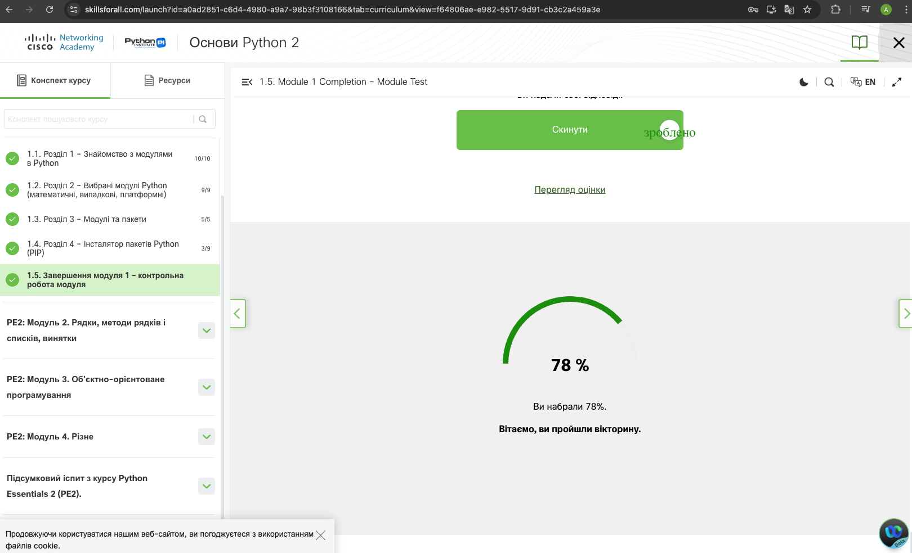

