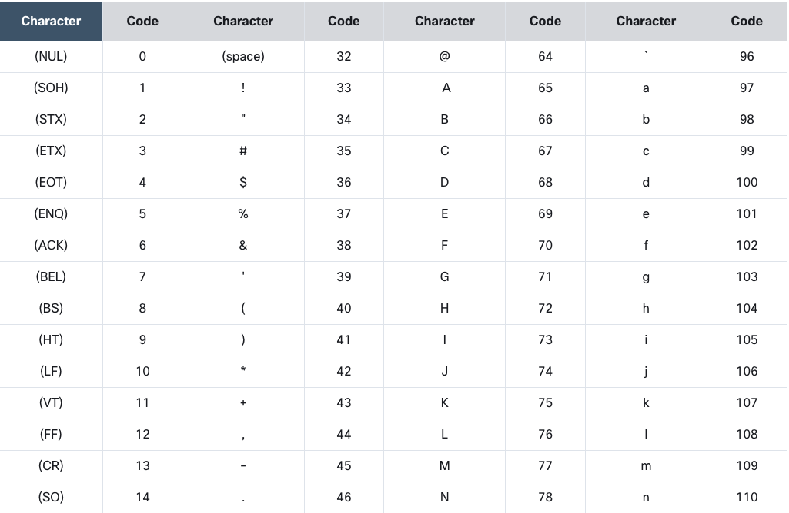
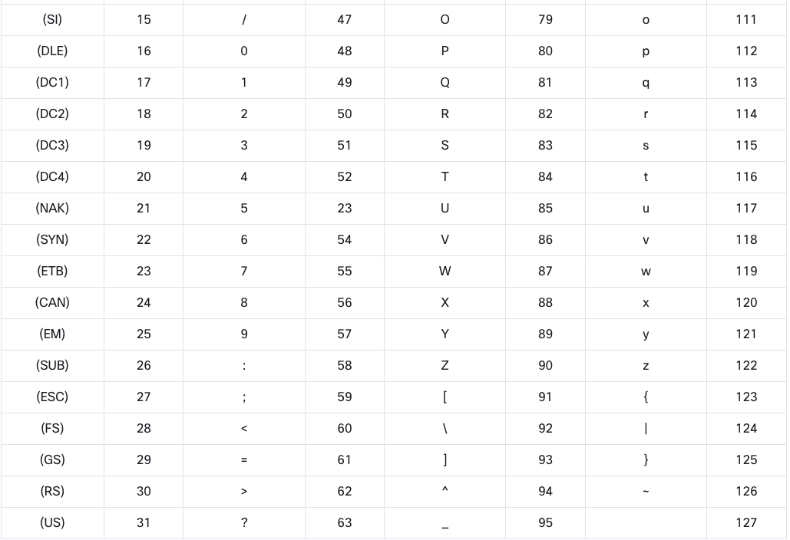

2.1.1 Як комп’ютери розуміють окремі символи
Ви написали кілька цікавих програм відтоді, як розпочали цей курс, але всі вони обробляли лише один вид даних – числа. Як ви знаєте (ви можете бачити це всюди навколо себе), багато комп’ютерних даних не є числами: імена, прізвища, адреси, назви, вірші, наукові статті, електронні листи, судові рішення, визнання в коханні та багато, багато іншого.

Всі ці дані повинні зберігатися, вводитися, виводитися, шукатися і перетворюватися сучасними комп'ютерами так само, як і будь-які інші дані, незалежно від того, чи це одиничні символи, чи багатотомні енциклопедії.

Як це можливо?

Як це зробити на Python? Ось про що ми зараз і поговоримо. Почнемо з того, як комп’ютери розуміють окремі символи.

Комп'ютери зберігають символи як числа . Кожен символ, який використовує комп’ютер, відповідає унікальному номеру, і навпаки. Це завдання має містити більше символів, ніж ви могли очікувати. Багато з них невидимі для людини, але необхідні комп’ютерам.

Деякі з цих символів називаються пробілами , тоді як інші називаються контрольними символами , оскільки вони призначені для керування пристроями введення/виведення.

Прикладом пробілу, абсолютно невидимого неозброєним оком, є спеціальний код або пара кодів (у різних операційних системах ця проблема може розглядатися по-різному), які використовуються для позначення кінців рядків у текстових файлах.

Люди не бачать цей знак (або ці знаки), але можуть спостерігати ефект їх нанесення там, де лінії розірвані.

Ми можемо створити практично будь-яку кількість символів-номерів, але життя у світі, де кожен тип комп’ютера використовує різне кодування символів, було б не дуже зручним. Ця система призвела до необхідності запровадження універсального та загальноприйнятого стандарту, реалізованого (майже) усіма комп’ютерами та операційними системами в усьому світі.

Код під назвою ASCII (скорочення від American Standard Code for Information Interchange ) є найпоширенішим, і ви можете припустити, що майже всі сучасні пристрої (наприклад, комп’ютери, принтери, мобільні телефони, планшети тощо) використовують цей код.

У коді передбачено простір для 256 різних символів , але нас цікавлять лише перші 128. Якщо ви хочете побачити, як побудований код, подивіться на таблицю нижче. Натисніть таблицю, щоб збільшити її. Подивіться уважно – там є цікаві факти. Подивіться на код найпоширенішого символу – пробілу . Це 32 .

Тепер перевірте код малої літери a . Це 97 . А тепер знайдіть велику букву A . Його код 65 . Тепер з’ясуйте різницю між кодом a і A . Воно дорівнює 32 . Це код пробілу . Цікаво, чи не так?

Також зауважте, що літери розташовані в тому ж порядку, що й у латинському алфавіті.
2.1.2 I18N
Звичайно, латинського алфавіту недостатньо для всього людства. Користувачі цього алфавіту в меншості. Треба було придумати щось більш гнучке і містке, ніж ASCII, щось таке, що могло б зробити все програмне забезпечення в світі піддатливим до інтернаціоналізації , тому що різні мови використовують абсолютно різні алфавіти, і часом ці алфавіти не такі прості, як латинський.

Слово інтернаціоналізація зазвичай скорочується до I18N .

чому Подивіться уважно – на початку слова стоїть І , далі 18 різних літер, а в кінці – Н.

Незважаючи на трохи жартівливе походження, термін офіційно використовується в багатьох документах і стандартах.

Програмне забезпечення I18N є стандартом в даний час. Кожна програма має бути написана таким чином, щоб її можна було використовувати в усьому світі, серед різних культур, мов та алфавітів.

Класична форма коду ASCII використовує вісім бітів для кожного знака . Вісім бітів означають 256 різних символів. Перші 128 використовуються для стандартного латинського алфавіту (як великі, так і малі символи). Чи можливо перенести всі інші національні символи, які використовуються в усьому світі, до решти 128 місць?

Ні. Це не так.

2.1.3 Кодові точки та кодові сторінки
Зараз нам потрібен новий термін: кодова точка .

Кодова точка — це число, яке створює символ . Наприклад, 32 — це кодова точка, яка робить пробіл у кодуванні ASCII. Можна сказати, що стандартний код ASCII складається з 128 кодових точок.

Оскільки стандартний ASCII займає 128 із 256 можливих кодових точок, ви можете використовувати лише решту 128.

Цього недостатньо для всіх можливих мов, але може бути достатньо для однієї мови або для невеликої групи схожих мов.

Чи можете ви по-різному встановити верхню половину кодових точок для різних мов ? Так, ти можеш. Така концепція називається кодовою сторінкою .

Кодова сторінка є стандартом для використання верхніх 128 кодових точок для зберігання певних національних символів . Наприклад, існують різні кодові сторінки для Західної та Східної Європи, кириличний і грецький алфавіти, арабська та іврит мови тощо.

Це означає, що одна й та сама кодова точка може створювати різні символи при використанні на різних кодових сторінках.

Наприклад, кодова точка 200 перетворює Č (літера, яка використовується в деяких слов’янських мовах), коли використовується кодова сторінка ISO/IEC 8859-2, і перетворюється на Ш (літера кирилиці), коли використовується код ISO/IEC 8859-5. сторінки.

Як наслідок, щоб визначити значення конкретної кодової точки, ви повинні знати цільову кодову сторінку.

Іншими словами, кодові точки, отримані з концепції кодової сторінки, неоднозначні.

Unicode
Кодові сторінки деякий час допомогли комп’ютерній індустрії вирішити проблеми I18N, але незабаром виявилося, що вони не будуть постійним рішенням.

Концепцією, яка вирішила проблему в довгостроковій перспективі, був Unicode .

Юнікод призначає унікальні (однозначні) символи (літери, дефіси, ідеограми тощо) більш ніж мільйону кодових точок .

Перші 128 кодових точок Unicode ідентичні ASCII, а перші 256 кодових точок Unicode ідентичні кодовій сторінці ISO/IEC 8859-1 (кодова сторінка, розроблена для західноєвропейських мов).

UCS-4
Стандарт Unicode нічого не говорить про те, як кодувати та зберігати символи в пам’яті та файлах. Він лише називає всі доступні символи та призначає їх площинам (групі символів подібного походження, застосування чи природи).

Існує більше ніж один стандарт, що описує методи, які використовуються для реалізації Unicode в реальних комп’ютерах і комп’ютерних системах зберігання. Найзагальнішим з них є UCS-4 .

Назва походить від універсального набору символів .

UCS-4 використовує 32 біти (чотири байти) для зберігання кожного символу , а код — це лише унікальний номер кодових точок Unicode. Файл, що містить текст у кодуванні UCS-4, може починатися з позначки порядку байтів (BOM), непридатної для друку комбінації бітів, яка повідомляє про природу вмісту файлу. Це може знадобитися деяким утилітам.

Як бачите, UCS-4 є досить марнотратним стандартом - він збільшує розмір тексту в чотири рази порівняно зі стандартним ASCII. На щастя, існують розумніші форми кодування текстів Unicode.

UTF-8
Одним із найпоширеніших є UTF-8 .

Назва походить від формату перетворення Юнікоду .

Концепція дуже розумна. UTF-8 використовує стільки бітів для кожної точки коду, скільки дійсно потрібно для їх представлення .

Наприклад:

усі латинські символи (і всі стандартні символи ASCII) займають вісім біт;
нелатинські символи займають 16 біт;
Ідеографи CJK (Китай-Японія-Корея) займають 24 біти.

Через особливості методу, який використовується UTF-8 для зберігання кодових точок, немає необхідності використовувати специфікацію, але деякі інструменти шукають її під час читання файлу, і багато редакторів налаштовують її під час збереження.

Python 3 повністю підтримує Unicode та UTF-8:

ви можете використовувати символи в кодуванні Unicode/UTF-8 для іменування змінних та інших об’єктів;
ви можете використовувати їх протягом усього введення та виведення.
Це означає, що Python3 є повністю I18Ned.

Неповний 

2.1.4 РЕЗЮМЕ РОЗДІЛУ
1. Комп’ютери зберігають символи як числа. Існує більше ніж один можливий спосіб кодування символів, але лише деякі з них набули всесвітньої популярності та широко використовуються в ІТ: це ASCII (використовується в основному для кодування латинського алфавіту та деяких його похідних) і UNICODE (може кодувати віртуально всі алфавіти, якими користуються люди).

2. Число, що відповідає певному символу, називається кодовою точкою .

3. UNICODE використовує різні способи кодування, коли йдеться про зберігання символів у файлах або пам’яті комп’ютера: два з них – UCS-4 та UTF-8 (останній є найпоширенішим, оскільки він витрачає менше пам’яті).
Це твердження означає, що Python3 повністю підтримує інтернаціоналізацію (I18N).

Що таке інтернаціоналізація (I18N)?
Інтернаціоналізація (I18N) — це процес розробки програмного забезпечення таким чином, щоб воно могло легко підтримувати різні мови і регіональні налаштування без необхідності вносити зміни в код програми. Назва "I18N" походить від скорочення слова "Internationalization", де "I" — перша літера, "N" — остання, а між ними 18 літер.

Що означає, що Python3 є повністю I18Ned?
Це означає, що Python3 має вбудовану підтримку для роботи з різними мовами та регіональними налаштуваннями. Зокрема, Python3:

Підтримка Unicode: Python3 використовує Unicode для представлення рядків тексту, що дозволяє легко працювати з текстом на будь-якій мові.

Модулі для роботи з локалізацією: Python3 має вбудовані модулі, такі як locale, gettext та інші, які допомагають у роботі з локалізацією програм (переклад тексту, форматування чисел, дат тощо).

Форматування рядків: Python3 підтримує різні способи форматування рядків, що полегшує їх локалізацію. Наприклад, методи format() та F-рядки (f-strings).

Бібліотеки: Існує багато бібліотек сторонніх розробників, які допомагають у процесі інтернаціоналізації та локалізації, наприклад, babel.

Приклад використання інтернаціоналізації в Python3
Ось простий приклад використання модуля gettext для локалізації тексту:

python
Копіювати код
import gettext
import locale

# Встановлюємо локаль
locale.setlocale(locale.LC_ALL, '')

# Встановлюємо каталог з перекладами
localedir = 'locale'
lang = gettext.translation('myapp', localedir, languages=['es'])
lang.install()

# Використовуємо функцію _() для перекладу
print(_('Hello, World!'))
Цей приклад передбачає, що у вас є каталог з перекладами locale, де знаходяться файли перекладів для вашої програми.

Таким чином, коли ми говоримо, що Python3 є повністю I18Ned, це означає, що мова надає всі необхідні інструменти та можливості для розробки програм, які легко адаптуються до різних мов та культур.

2.2.1 Рядки - короткий огляд
Давайте коротко розглянемо природу рядків Python.

Перш за все, рядки Python (або просто рядки, оскільки ми не збираємося обговорювати рядки інших мов) є незмінними послідовностями .

Це дуже важливо звернути увагу, оскільки це означає, що ви повинні очікувати від них деякої знайомої поведінки.

Давайте розберемо код у редакторі, щоб зрозуміти, про що ми говоримо:

Подивіться на приклад 1 . Thelen()функція, яка використовується для рядків, повертає кількість символів, що містяться в аргументах. Вихідні фрагменти2.
Будь-який рядок може бути порожнім. Його довжина становить0потім – як у прикладі 2 .
Не забувайте, що зворотна коса риска (\), який використовується як контрольний символ, не входить до загальної довжини рядка. Таким чином, код у прикладі 3 виводить3.
Запустіть три приклади кодів і перевірте.

